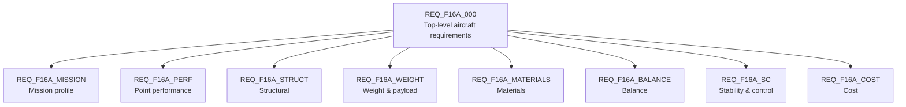

# R Layer — Requirements

> Artifact: `requirements/f16a.slreqx` · Generator: `requirements/generate_f16a_requirements.m`

The Requirements layer captures **what the F-16A must achieve**, independent of any design
solution. It is authored as a Requirements Toolbox requirement set (`.slreqx`) so that
later layers can link to it and prove coverage.

## Provenance

The requirements are derived from the **Brandt F-16A reference sizing model**
(`sizing/VnV/BrandtF16A`) and cross-referenced against the source spreadsheet
`Brandt-F16-A.xls` (Main tab: mission block `J32:Y39` and constraints block `R1:X13`).

A deliberate rule keeps the set honest:

> **Only Excel _input_ cells become requirements.** Computed/formula cells (e.g. a liftoff
> Mach that the spreadsheet calculates) are noted in the requirement's Description for
> traceability, but are never stated as requirement values.

This teaches an important distinction: a *requirement* is something you demand of the
design, not something the analysis happens to produce. The `f16a.slreqx` file is kept
**pristine** to this provenance — functionally derived requirements discovered later live
in a separate set (see [`03_traceability.md`](03_traceability.md)).

## Structure

The set is organized into containers by concern:

### Mission profile (`REQ_F16A_001`–`010`)

One requirement per mission-profile segment, stating the flight condition (altitude, Mach,
afterburner setting, distance/duration) for each leg. The segment names match the Excel
tabs.

| ID | Segment | Key input condition |
|----|---------|---------------------|
| 001 | Takeoff | Sea level, 100% afterburner |
| 002 | Accel | 10,000 ft → Mach 0.87, dry power |
| 003 | Climb | → 40,000 ft, dry power |
| 004 | Cruise | Dry-power cruise to combat area |
| 005 | Dash | 50% afterburner, 50 nm |
| 006 | Combat | 25,000 ft, 2 min, releases expendable payload |
| 007 | Egress | Dry power, 50 nm, 40,000 ft |
| 008 | Cruise2 | Dry-power return cruise |
| 009 | Loiter | 10,000 ft, Mach 0.30, 20 min |
| 010 | Landing | Sea level |

### Point performance (`REQ_F16A_011`–`018`)

One requirement per constraint-diagram design point — the speed/altitude/load-factor
conditions the aircraft must sustain (`Ps = 0`) or the field lengths it must meet.

| ID | Design point |
|----|--------------|
| 011 | Max-Mach (Mach 1.6 @ 36,000 ft) |
| 012 | Cruise (Mach 0.87 @ 36,000 ft) |
| 013 | Max-altitude (50,000 ft) |
| 014 | Subsonic combat turn (n ≥ 4.5 @ Mach 0.87) |
| 015 | Supersonic combat turn (n ≥ 1.4 @ Mach 1.4) |
| 016 | Specific excess power (Ps ≥ 500 ft/s) |
| 017 | Takeoff field length (≤ 4,000 ft) |
| 018 | Landing field length (≤ 4,000 ft) |

### Other concerns (`REQ_F16A_019`–`026`)

| ID | Container | Requirement |
|----|-----------|-------------|
| 019 | Structural | Ultimate load factor `n_ult` = 9 g |
| 020 | Weight | Permanent payload 700 lb |
| 021 | Weight | Expendable payload 4,400 lb (released in Combat) |
| 022 | Materials | Composite fraction ≤ 20% (Al 65 / CF 20 / Ti 10 / Steel 5 / FG 0) |
| 023 | Balance | Tipback angle — **deliberately blank; student exercise** (D-046) |
| 024 | Balance | Rollover angle — **deliberately blank; student exercise** (D-046) |
| 025 | Stability & Control | Static margin `SM = (x_np − x_cg)/MAC` shall be **negative**, and not below −6 %MAC — relaxed static stability. **The reference model violates it at landing** (D-051) |
| 026 | Cost | Unit flyaway cost — **Measure of Merit (minimize)**, homed at the Physical layer |

**26 requirements total** across 8 concern containers.

#### `025`

**D-051 replaces D-046's two-sided band, and the requirement now fails.** The criterion is

> **−6 %MAC ≤ `SM` < 0** across the operational CG range — negative at takeoff **and** at landing.

Upper bound **strict**, lower bound **inclusive**. The strict zero is not a threshold anyone chose:
a negative static margin — CG aft of the neutral point — is what relaxed static stability *is*. That
is why D-046's `+1 %MAC` allowance had to go, because it let a conventionally stable aeroplane satisfy
a requirement written to exclude one. The `−6 %MAC` floor stays, capping instability at what the
flight control system is assumed able to stabilize; without a floor an arbitrarily unstable design
would pass, and `REQ_F16A_L02`'s fly-by-wire justification quietly assumes the instability is
*bounded*.

**The reference model meets it at takeoff and violates it at landing** —
`verification/F16AStaticMarginVerificationTest.m` runs **2 pass, 1 fail**, by design and permanently:

| Condition | Weight (lb) | `x_cg` (ft) | End of CG range | `SM` (%MAC) | `REQ_F16A_025` |
|---|---|---|---|---|---|
| Takeoff | 31,377 (the sizing point) | 26.1979 | **aft** | **−0.2602** | met |
| Landing | 20,677.61 (derived by `run`) | 26.1451 | **forward** | **+0.2065** | **VIOLATED** |

`x_np` = 26.1684 ft falls between the two endpoints, so the CG **crosses the neutral point** during the
mission and the two margins straddle zero. Burning fuel and releasing stores moves the CG *forward*,
so landing is the forward, most-stable end — the end where this requirement bites.

**This is the example's third verification state, and it was built on purpose.** `REQ_F16A_022` is
met. `REQ_F16A_P01` is red because nothing has been computed (D-042) — *unevaluated*. `REQ_F16A_025`
is red because something **was** computed and the design does not meet it — *violated*. Those are
different facts wearing the same colour, and the distinction is the lesson; see
[`README.md`](README.md#three-requirements-three-verification-states). Two earlier decisions had a run
at this: D-044 wanted `REQ_F16A_024` to be *"the example's first requirement the reference aircraft does
not meet"*, and D-046 set that aside — correctly, since the gear-angle conventions are ambiguous —
but widened `025` until the reference figure fitted inside it, and the lesson went with it. D-051
takes the criterion the physics implies and accepts the red.

**The two ends of the requirement do not have the same standing.**

| End | Criterion | Provenance |
|---|---|---|
| Upper, `< 0` | the sign of the margin | **definition** — relaxed static stability *is* negative static margin. Not a figure, nothing to tag |
| Lower, `−6 %MAC` | how unstable is too unstable | **`Estimate`** — uncited, inventoried in **D-030**, and the price of the requirement meaning anything at the unstable end |

**At what weight.** `SM_TO` is evaluated at the sizing point `W_TO` = 31,377 lb. `SM_land` is **not** —
`BrandtBalanceStabControl.run` builds the landing case itself, by zeroing the expendable payload and
all three fuel thirds.

Landing weight derives two independent ways: `W_empty` 19,977.61 + `perm_payload` 700, and `W_TO`
31,377 − `exp_payload` 4,400 − `W_fuel` 6,299.39. Substituting the *validation-target* fuel figure
6,296.30 gives 20,680.70 instead — a 3 lb gap of the `.m`-vs-`.xls` kind D-036 records for mass, so
do not "correct" this derivation from the target column.

The ordering is counter-intuitive and easy to get backwards — it *was* backwards in the verification
test until Stage 1. Landing CG is 0.0528 ft **forward** of takeoff, so **takeoff is the aft end** of
the operational range: expendable payload and fuel sit at ~26.3 ft, aft of the CG, so releasing and
burning them moves it forward. Getting this backwards inverts which end fails.

> **⚠ The landing violation is a property of the reference model, not of the F-16A.** Brandt's neutral
> point is a simplified approximation (`readme_bsc.md`: *"a simplified neutral point"*, *"the fuselage
> destabilizing correction is simplified to a width-scaled offset"*), so the model lands near neutral
> and drifts *stable* as fuel burns off. It does **not** reproduce
> the strongly relaxed static stability the F-16A is generally described as having.
> The −6 %MAC figure is an illustrative teaching value, not sourced data (D-030).
> So the red at landing is evidence that the requirement and its verification work — **not** a finding
> about the aeroplane, and not something to quote as one.
>
> *(Both sentences above are D-048's canonical wording, kept unwrapped so they stay greppable. Improve
> the prose around them, not them — see TODO **A14**.)*
>
> The `−6 %MAC` floor itself carries no citation: `/sizing/` has no static-margin criterion, no
> specification is quoted, and nothing computes it. It has no stereotype and therefore no
> `DataProvenance` slot, so it is inventoried in **D-030**'s table of invented numbers instead
> (**D-048**) — the first *requirement threshold* in that table rather than a component property.
> D-051 narrowed that row: the `+1 %MAC` end left the model, the `−6 %MAC` end did not.

**The Verify link was hand-made, and it holds.** `REQ_F16A_025` → `F16AStaticMarginVerificationTest`
had to be added **by hand** in the Requirements Editor (done 2026-08-03), because in R2026a a MATLAB
test file cannot be a link *source* — the same tool limitation that produced the hand-made links on
`REQ_F16A_022` and `REQ_F16A_P01` (see [`README.md`](README.md), *"Verification links are added
manually"*). All three verified requirements are now linked.

What is durable is that limitation, **not** a risk of losing the links you make. Measured after the
full seven-generator rebuild of all four requirement sets: `REQ_F16A_022` and `REQ_F16A_P01` both
still report `Implement, Verify`. `slreq.new` builds a fresh set, but with the requirement ids and
their order unchanged the hand-made links still resolve, so regeneration does not orphan them — which
is why rewording `025` under D-051 does not cost it the link it just gained.

**And note what the link now records.** `REQ_F16A_025` is *verified by* a test it **fails**. That is
not a contradiction: a Verify link records that the requirement is checked and by what, never that the
check passed. A requirement with no link and a requirement with a red link are very different states,
and only one of them is a gap.

#### `026` and `022` — an objective and a real constraint

`REQ_F16A_026` (cost) is stated as a **Measure of Merit**, not a "shall not exceed" threshold: a
hard cost ceiling is the wrong construct in conceptual design — cost is an objective you
*minimize* and trade against weight and materials. The ~$68.4M DAPCA IV figure is kept only as
the reference-aircraft value for context. The [Physical layer](05_physical.md) carries it as a MoM.

`REQ_F16A_022` (materials) *is* a genuine ≤ 20% constraint; the [Physical layer](05_physical.md)
**verifies** it with a test that rolls up the airframe composite fraction — the first
requirement-to-test "verified by" relationship in the model.

## Next

The Functions layer ([`02_functions.md`](02_functions.md)) defines what the aircraft must
*do* to satisfy these requirements, and links each function back to the requirement it
implements ([`03_traceability.md`](03_traceability.md)).
