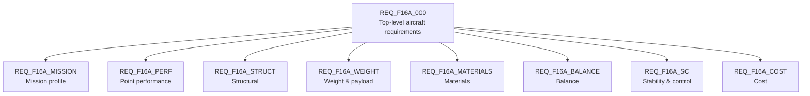

# R Layer — Requirements

> Artifact: `requirements/f16a.slreqx` · Generator: `requirements/generate_f16a_requirements.m`

The Requirements layer captures **what the F-16A must achieve**, independent of any design
solution. It is authored as a Requirements Toolbox requirement set (`.slreqx`) so that
later layers can link to it and prove coverage.

## Provenance

The requirements are derived from the **Brandt F-16A reference sizing model**
(`sizing/VnV/BrandtF16A`) and cross-referenced against the source spreadsheet
`Brandt-F16-A.xls` (Main tab: mission block `J32:Y39` and constraints block `R1:X13`).

A deliberate rule keeps the set honest:

> **Only Excel _input_ cells become requirements.** Computed/formula cells (e.g. a liftoff
> Mach that the spreadsheet calculates) are noted in the requirement's Description for
> traceability, but are never stated as requirement values.

This teaches an important distinction: a *requirement* is something you demand of the
design, not something the analysis happens to produce. The `f16a.slreqx` file is kept
**pristine** to this provenance — functionally derived requirements discovered later live
in a separate set (see [`03_traceability.md`](03_traceability.md)).

## Structure

The set is organized into containers by concern:

### Mission profile (`REQ_F16A_001`–`010`)

One requirement per mission-profile segment, stating the flight condition (altitude, Mach,
afterburner setting, distance/duration) for each leg. The segment names match the Excel
tabs.

| ID | Segment | Key input condition |
|----|---------|---------------------|
| 001 | Takeoff | Sea level, 100% afterburner |
| 002 | Accel | 10,000 ft → Mach 0.87, dry power |
| 003 | Climb | → 40,000 ft, dry power |
| 004 | Cruise | Dry-power cruise to combat area |
| 005 | Dash | 50% afterburner, 50 nm |
| 006 | Combat | 25,000 ft, 2 min, releases expendable payload |
| 007 | Egress | Dry power, 50 nm, 40,000 ft |
| 008 | Cruise2 | Dry-power return cruise |
| 009 | Loiter | 10,000 ft, Mach 0.30, 20 min |
| 010 | Landing | Sea level |

### Point performance (`REQ_F16A_011`–`018`)

One requirement per constraint-diagram design point — the speed/altitude/load-factor
conditions the aircraft must sustain (`Ps = 0`) or the field lengths it must meet.

| ID | Design point |
|----|--------------|
| 011 | Max-Mach (Mach 1.6 @ 36,000 ft) |
| 012 | Cruise (Mach 0.87 @ 36,000 ft) |
| 013 | Max-altitude (50,000 ft) |
| 014 | Subsonic combat turn (n ≥ 4.5 @ Mach 0.87) |
| 015 | Supersonic combat turn (n ≥ 1.4 @ Mach 1.4) |
| 016 | Specific excess power (Ps ≥ 500 ft/s) |
| 017 | Takeoff field length (≤ 4,000 ft) |
| 018 | Landing field length (≤ 4,000 ft) |

### Other concerns (`REQ_F16A_019`–`026`)

| ID | Container | Requirement |
|----|-----------|-------------|
| 019 | Structural | Ultimate load factor `n_ult` = 9 g |
| 020 | Weight | Permanent payload 700 lb |
| 021 | Weight | Expendable payload 4,400 lb (released in Combat) |
| 022 | Materials | Composite fraction ≤ 20% (Al 65 / CF 20 / Ti 10 / Steel 5 / FG 0) |
| 023 | Balance | Tipback angle — **TODO**, no program minimum yet |
| 024 | Balance | Rollover angle — **TODO**, no program minimum yet |
| 025 | Stability & Control | Static margin — **TODO**, no program bounds yet |
| 026 | Cost | Unit flyaway cost ≤ ~$68.4M |

**26 requirements total** across 8 concern containers. Requirements 023–025 are honest
`TODO` placeholders: the Brandt model computes these as *outputs*, but no design *minimum*
has been specified, so they carry no requirement value yet.

## Next

The Functions layer ([`02_functions.md`](02_functions.md)) defines what the aircraft must
*do* to satisfy these requirements, and links each function back to the requirement it
implements ([`03_traceability.md`](03_traceability.md)).
