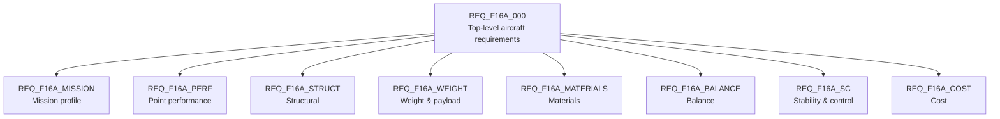

# R Layer — Requirements

> Artifact: `requirements/f16a.slreqx` · Generator: `requirements/generate_f16a_requirements.m`

The Requirements layer captures **what the F-16A must achieve**, independent of any design
solution. It is authored as a Requirements Toolbox requirement set (`.slreqx`) so that
later layers can link to it and prove coverage.

## Provenance

The requirements are derived from the **Brandt F-16A reference sizing model**
(`sizing/VnV/BrandtF16A`) and cross-referenced against the source spreadsheet
`Brandt-F16-A.xls` (Main tab: mission block `J32:Y39` and constraints block `R1:X13`).

A deliberate rule keeps the set honest:

> **Only Excel _input_ cells become requirements.** Computed/formula cells (e.g. a liftoff
> Mach that the spreadsheet calculates) are noted in the requirement's Description for
> traceability, but are never stated as requirement values.

This teaches an important distinction: a *requirement* is something you demand of the
design, not something the analysis happens to produce. The `f16a.slreqx` file is kept
**pristine** to this provenance — functionally derived requirements discovered later live
in a separate set (see [`03_traceability.md`](03_traceability.md)).

## Structure

The set is organized into containers by concern:

### Mission profile (`REQ_F16A_001`–`010`)

One requirement per mission-profile segment, stating the flight condition (altitude, Mach,
afterburner setting, distance/duration) for each leg. The segment names match the Excel
tabs.

| ID | Segment | Key input condition |
|----|---------|---------------------|
| 001 | Takeoff | Sea level, 100% afterburner |
| 002 | Accel | 10,000 ft → Mach 0.87, dry power |
| 003 | Climb | → 40,000 ft, dry power |
| 004 | Cruise | Dry-power cruise to combat area |
| 005 | Dash | 50% afterburner, 50 nm |
| 006 | Combat | 25,000 ft, 2 min, releases expendable payload |
| 007 | Egress | Dry power, 50 nm, 40,000 ft |
| 008 | Cruise2 | Dry-power return cruise |
| 009 | Loiter | 10,000 ft, Mach 0.30, 20 min |
| 010 | Landing | Sea level |

### Point performance (`REQ_F16A_011`–`018`)

One requirement per constraint-diagram design point — the speed/altitude/load-factor
conditions the aircraft must sustain (`Ps = 0`) or the field lengths it must meet.

| ID | Design point |
|----|--------------|
| 011 | Max-Mach (Mach 1.6 @ 36,000 ft) |
| 012 | Cruise (Mach 0.87 @ 36,000 ft) |
| 013 | Max-altitude (50,000 ft) |
| 014 | Subsonic combat turn (n ≥ 4.5 @ Mach 0.87) |
| 015 | Supersonic combat turn (n ≥ 1.4 @ Mach 1.4) |
| 016 | Specific excess power (Ps ≥ 500 ft/s) |
| 017 | Takeoff field length (≤ 4,000 ft) |
| 018 | Landing field length (≤ 4,000 ft) |

### Other concerns (`REQ_F16A_019`–`026`)

| ID | Container | Requirement |
|----|-----------|-------------|
| 019 | Structural | Ultimate load factor `n_ult` = 9 g |
| 020 | Weight | Permanent payload 700 lb |
| 021 | Weight | Expendable payload 4,400 lb (released in Combat) |
| 022 | Materials | Composite fraction ≤ 20% (Al 65 / CF 20 / Ti 10 / Steel 5 / FG 0) |
| 023 | Balance | Tipback angle — **deliberately blank; student exercise** (D-046) |
| 024 | Balance | Rollover angle — **deliberately blank; student exercise** (D-046) |
| 025 | Stability & Control | Static margin `SM = (x_np − x_cg)/MAC` within **−6 … +1 %MAC** — relaxed static stability |
| 026 | Cost | Unit flyaway cost — **Measure of Merit (minimize)**, homed at the Physical layer |

**26 requirements total** across 8 concern containers.

#### `023` and `024` — the blanks *are* the assignment

They are not an omission waiting to be closed. Brandt's model computes a tipback angle and a
rollover angle, but it states them in conventions that do not obviously match the USAF/USN limits
they would be checked against — and working out whether they do, then naming and bounding the
quantity correctly, **is the exercise** (**D-046**). Writing values in would take it away. Both keep
their `todo` keyword and their `TBD` text on purpose, and the `rollover` → `overturn` rename is
deferred with them, because calling Brandt's quantity "the overturn angle" would assert the very
identification that is in doubt. The nine derived functional requirements `REQ_F16A_D01`–`D09` are
blank for the same reason (**D-045**; see [`03_traceability.md`](03_traceability.md)).

#### `025` — no longer a placeholder

D-046 gave it a real, two-sided, checkable band:

> The static margin `SM = (x_np − x_cg)/MAC` shall lie between **−6 %MAC** and **+1 %MAC** across
> the operational CG range (takeoff through landing weight).

The band is asymmetric on purpose. The negative lower bound is the design intent — a near-neutral to
slightly unstable configuration cuts trim drag and buys instantaneous turn rate, and is flyable only
because the flight control system supplies artificial stability, which is the same fact
`REQ_F16A_L02`'s fly-by-wire decision turns on. The `+1 %MAC` upper bound caps how *stable* the
aircraft may become; without it a conventionally stable aeroplane would satisfy a requirement whose
whole purpose is to exclude one. `verification/F16AStaticMarginVerificationTest.m` checks both
CG-range endpoints against the band and passes 3/3 (**D-047**).

**At what weight, and which end of the CG range.** `SM_TO` is evaluated at the sizing point
`W_TO` = 31,377 lb. `SM_land` is **not** — `BrandtBalanceStabControl.run` builds the landing case
itself, by zeroing the expendable payload and all three fuel thirds.

| Condition | Weight (lb) | `x_cg` (ft) | End of CG range |
|---|---|---|---|
| Takeoff | 31,377 (the sizing point) | 26.1979 | **aft** |
| Landing | 20,677.61 (derived by `run`) | 26.1451 | **forward** |

Landing weight derives two independent ways: `W_empty` 19,977.61 + `perm_payload` 700, and `W_TO`
31,377 − `exp_payload` 4,400 − `W_fuel` 6,299.39. Substituting the *validation-target* fuel figure
6,296.30 gives 20,680.70 instead — a 3 lb gap of the `.m`-vs-`.xls` kind D-036 records for mass, so
do not "correct" this derivation from the target column.

The ordering is counter-intuitive and easy to get backwards — it *was* backwards in the verification
test until Stage 1. Landing CG is 0.0528 ft **forward** of takeoff, so **takeoff is the aft end** of
the operational range: expendable payload and fuel sit at ~26.3 ft, aft of the CG, so releasing and
burning them moves it forward. `x_np` = 26.1684 ft falls between the two endpoints, which is why the
two margins straddle zero.

> **The band is design intent tagged `Estimate`, not sourced data.** −6 %MAC carries no citation:
> `/sizing/` has no static-margin criterion, no specification is quoted, and nothing computes it. It
> has no stereotype and therefore no `DataProvenance` slot, so it is inventoried in **D-030**'s table
> of invented numbers instead (**D-048**) — the first *requirement threshold* in that table rather
> than a component property. The reference model meets the band from the **stable** end
> (`SM_TO` = −0.2602 %MAC, `SM_land` = +0.2065 %MAC): it does **not** reproduce the strongly relaxed
> static stability the F-16A is generally described as having. The −6 %MAC figure is an illustrative
> teaching value, not sourced data (D-030). A pass here is not evidence to the contrary.

**What the shipped artifact currently holds** — ⚠ *delete this paragraph when the requirement set is
regenerated; it describes a state that regeneration ends.* The band lives in the **generator**, and
the `requirements/f16a.slreqx` committed to this repository still carries the pre-D-046 text: *"a
static margin between TBD %MAC and TBD %MAC"*, keyword `todo`. Regenerating it is not a one-file
re-run — `slreq.new` builds a fresh set, so every Implement link from F, L and P has to be rebuilt
with it, i.e. the whole chain in the README's *Regenerate the artifacts*. Outstanding work, tracked as
TODO **B3** step 1.

**The Verify link is a separate gap, and it is durable.** `REQ_F16A_025` →
`F16AStaticMarginVerificationTest` has to be added **by hand** in the Requirements Editor, because in
R2026a a MATLAB test file cannot be a link *source* — the same tool limitation that already applies to
`REQ_F16A_022` and `REQ_F16A_P01` (see [`README.md`](README.md), *"Verification links are added
manually"*). Regenerating the requirement set does **not** create it, so this sentence outlives the
paragraph above.

#### `026` and `022` — an objective and a real constraint

`REQ_F16A_026` (cost) is stated as a **Measure of Merit**, not a "shall not exceed" threshold: a
hard cost ceiling is the wrong construct in conceptual design — cost is an objective you
*minimize* and trade against weight and materials. The ~$68.4M DAPCA IV figure is kept only as
the reference-aircraft value for context. The [Physical layer](05_physical.md) carries it as a MoM.

`REQ_F16A_022` (materials) *is* a genuine ≤ 20% constraint; the [Physical layer](05_physical.md)
**verifies** it with a test that rolls up the airframe composite fraction — the first
requirement-to-test "verified by" relationship in the model.

## Next

The Functions layer ([`02_functions.md`](02_functions.md)) defines what the aircraft must
*do* to satisfy these requirements, and links each function back to the requirement it
implements ([`03_traceability.md`](03_traceability.md)).
