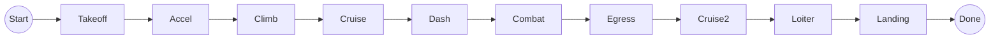
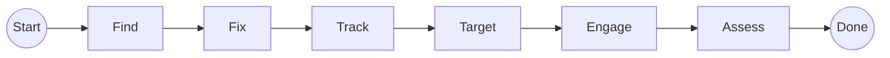
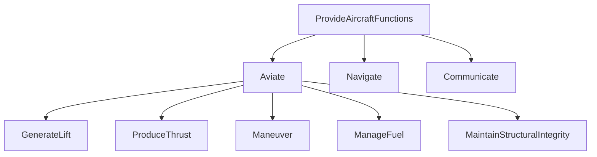

# F Layer — Functions

> Artifacts: `functions/F16A_Functional.slx` (capabilities) · `functions/F16A_MissionActivity.slx`
> (the mission) · Dictionary: `functions/F16A_Functional.sldd`
> · Generators: `functions/generate_f16a_functional.m`, `functions/generate_f16a_mission_activity.m`

The Functions layer answers **what the aircraft must do** — as verb-phrase functions,
independent of *how* they are implemented.

## Key idea: functions are not flight phases, and the metaclass says so

A natural first instinct is to model the ten mission phases (Takeoff, Climb, …) as "the
functions." But phases are a **temporal thread** — *when* things happen — while functions are
**capabilities** — *what the aircraft does*, reused across many phases.

This example used to keep both as component hierarchies in one model and explain the difference
in prose. **It now keeps them in two different metaclasses, which makes the argument instead of
asserting it** (D-059):

| | Artifact | Metaclass | Because |
|---|---|---|---|
| The mission | `F16A_MissionActivity.slx` | activity diagram — **actions** on an object flow | a phase consumes an aircraft state and produces a lighter one; it is a behaviour |
| The capabilities | `F16A_Functional.slx` | architecture — **components**, no ports | a capability is something the aircraft *can* do, at any moment |

The old arrangement had a concrete cost, not just an aesthetic one. As components, the phases
**could not be allocated to anything** — the allocation set refused them, and the model recorded
that refusal as though it were a decision. As actions they allocate normally. See
[`03_traceability.md`](03_traceability.md).

## The mission — an activity diagram

Ten actions carrying a typed **`FlightState`** object flow from an initial node to an activity
final node:



Phase names match the Brandt Excel tabs (`Cruise`, `Cruise2`) so the model lines up 1:1
with the requirements and the sizing spreadsheet.

### Each action carries its own behaviour

This is the part worth pausing on. Every phase action's `BehaviorDefinition` is
`F16AMissionSegment('<its name>')`, so **the model records how its fuel is computed rather than
storing a copy of the answer.** Re-run the analysis and the model follows it.

Nothing in `mbse/` restates a segment equation. `F16AMissionReference` calls
`sizing/VnV/BrandtF16A/BrandtMission.m` behind a path guard and caches the single result all ten
actions read. `Action.Duration` is set from the same analysis — it is native to the metaclass, so
it needs no stereotype to live in.

Run `F16AMissionAnalysis` to watch the whole walk print itself:

```
Takeoff   1540.1 lb   0.22 min        Mission fuel : 5959.80 lb  (Miss!O9 ref 6000.43, -0.68%)
Cruise     993.8 lb  22.96 min        Mission time :   94.00 min (Miss!O8 ref 94.06,  -0.07%)
...
```

**Ten phases, fourteen reference segments.** The model omits three zero-duration `Patrol`
waypoints and the degenerate `Climb2` re-entry node. Omitting a segment is honest only while it is
free, so the analysis **checks** all four cost zero fuel and zero time and stops the run if that
ever changes — otherwise the model would be flying a cheaper mission than the one it claims.

### Combat → the F2T2EA kill chain

`Combat`'s behaviour is a **child activity** — the classic F2T2EA targeting cycle on a typed
`EngagementData` flow:



| Step | Function |
|------|----------|
| **F**ind | Detect potential targets in the combat area |
| Fi**x** | Determine target location/identity to a fix |
| **T**rack | Maintain track on identified targets |
| **T**arget | Prioritize/designate targets, assign weapons |
| **E**ngage | Employ weapons (releases the expendable payload) |
| **A**ssess | Battle damage assessment |

Combat is the **one action without a MATLAB binding**, and deliberately: an action has exactly one
behaviour, and Combat's is the kill chain. Its fuel still comes from the same analysis, because
the walk asks `F16AMissionSegment` for all ten phases regardless of what any action is bound to.

## The capabilities — a decomposition

The functions every phase relies on, organized by the aviator's mantra **Aviate ·
Navigate · Communicate**:



| Group | Functions |
|-------|-----------|
| **Aviate** | GenerateLift, ProduceThrust, Maneuver, ManageFuel, MaintainStructuralIntegrity |
| **Navigate** | (leaf) determine position and follow the route |
| **Communicate** | (leaf) voice/data comms and identify friend-or-foe |

**9 components, and no ports anywhere** — not even at the root. That is intentional: the flow
belongs to the mission, and a capability has no "input" and "output" of its own.

Which capabilities each phase needs is recorded by the allocation set
`F16A_MissionUsesCapability` — 59 edges. The mechanism is System Composer's allocation editor
because it is the only many-to-many relationship on offer, but **the semantic is *use***:
`Cruise → GenerateLift` does not mean "Cruise is performed by GenerateLift" — Climb and Dash need
lift too. Cruise *requires* the capability. The set is named for what it means.

The F2T2EA overlap (sensing, engagement) is deliberately kept *inside* Combat rather than
duplicated as separate Sense/Survive capabilities, to keep the model from becoming
over-complicated.

## Interfaces

Typed information flows are defined in the dictionary `F16A_Functional.sldd`. The capability tree
has no ports, so **the activity is the only consumer** — it links the same dictionary rather than
declaring a second copy.

| Interface | Elements (all `double`) | Used on |
|-----------|-------------------------|---------|
| `FlightState` | `Time_s`, `Altitude_ft`, `Mach`, `WeightFraction` | the mission-phase object flow |
| `EngagementData` | `TargetDetected`, `TargetIdentified`, `WeaponReleased` | the F2T2EA kill chain |

## Verification

Two machinery suites, split by what they ask:

- `F16AFunctionalArchitectureTest` — the capability tree: **9 components** at their expected
  paths, **no ports at all**, and the capability requirements' Implement links.
- `F16AMissionActivityTest` — the mission is **wired**: ten actions in flow order on typed pins,
  each bound to `F16AMissionSegment`, Combat nesting the kill chain, 18 Implement links, and every
  phase using at least one capability.
- `F16AMissionAnalysisTest` — the mission is **right**: totals within 1% of `Miss!O9` and `Miss!O8`,
  the four omitted segments still free, and the action binding agreeing with the printed walk.

Project health is confirmed by `runChecks(currentProject)` (12/12 passing).

## Next

The [traceability document](03_traceability.md) shows how each function links back to the
requirement it implements. The **Logical layer** ([`04_logical.md`](04_logical.md)) realizes each
function with a solution-role component — `GenerateLift` → `Airframe`, `ProduceThrust` →
`PropulsionSystem`, `Maneuver` → `FlightControlSystem`, and so on — connected to this layer by an
allocation set (in fact **two**, since the kill-chain functions now start in the activity and a set
binds to one source model). It also shows that a role can be realized more than one way: three
roles carry competing **kinds** (single- vs twin-engine, fly-by-wire vs hydro-mechanical, delta vs
conventional wing). L **presents** those kinds and ships them unresolved; the **Physical layer
decides** between them, because a role has no mass, cost or maturity to trade on — only a *part*
does (**D-001**).
