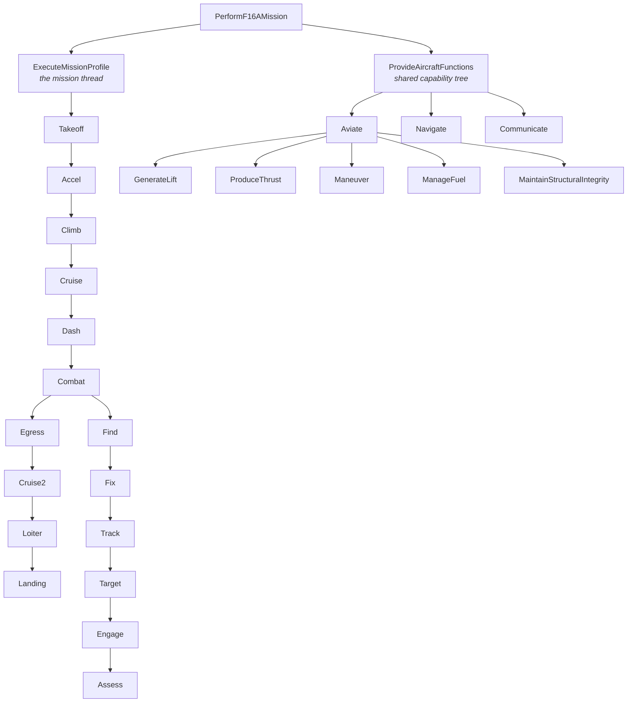
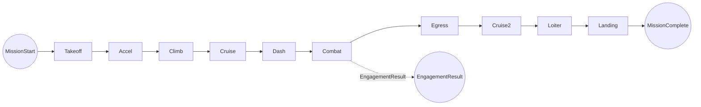
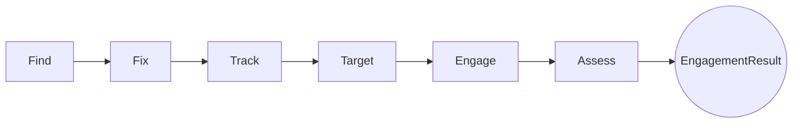

# F Layer — Functions

> Artifact: `architecture/F16A_Functional.slx` · Dictionary: `architecture/F16A_Functional.sldd`
> · Generator: `generate_f16a_functional.m`

The Functions layer answers **what the aircraft must do** — as verb-phrase functions,
independent of *how* they are implemented. It is a System Composer architecture model.

## Key idea: functions are not flight phases

A natural first instinct is to model the ten mission phases (Takeoff, Climb, …) as "the
functions." But phases are a **temporal thread** — *when* things happen — while functions
are **capabilities** — *what the aircraft does*, reused across many phases. This model
keeps both, in two branches:

**26 functions total.** The `Combat` phase is not atomic — it decomposes into the F2T2EA
kill chain. The capability tree (Aviate / Navigate / Communicate) is shared by every phase.

## Branch 1 — ExecuteMissionProfile (the mission thread)

The ten mission phases are chained in sequence, carrying a typed **`FlightState`**
information flow from `MissionStart` to `MissionComplete`:

Phase names match the Brandt Excel tabs (`Cruise`, `Cruise2`) so the model lines up 1:1
with the requirements and the sizing spreadsheet.

### Combat → the F2T2EA kill chain

`Combat` is a composite. While the aircraft keeps flying (a `FlightState` pass-through from
its input to its output), it also runs the classic **F2T2EA** targeting cycle, carrying a
typed **`EngagementData`** flow:

| Step | Function |
|------|----------|
| **F**ind | Detect potential targets in the combat area |
| Fi**x** | Determine target location/identity to a fix |
| **T**rack | Maintain track on identified targets |
| **T**arget | Prioritize/designate targets, assign weapons |
| **E**ngage | Employ weapons (releases the expendable payload) |
| **A**ssess | Battle damage assessment |

`Find` is the chain origin (an output-only function — its stimulus is the environment).
`Assess` terminates the chain, surfacing an `EngagementResult` up to the model boundary.

## Branch 2 — ProvideAircraftFunctions (capability tree)

The functions every phase relies on, organized by the aviator's mantra **Aviate ·
Navigate · Communicate**:

| Group | Functions |
|-------|-----------|
| **Aviate** | GenerateLift, ProduceThrust, Maneuver, ManageFuel, MaintainStructuralIntegrity |
| **Navigate** | (leaf) determine position and follow the route |
| **Communicate** | (leaf) voice/data comms and identify friend-or-foe |

This branch is a **pure functional decomposition** — the components carry no ports. That is
intentional and instructive: a functional architecture can be expressed two complementary
ways, and this example shows both side by side —

- a **flow** view (the mission thread, with typed information flowing between phases), and
- a **decomposition** view (the capability tree, showing *what* the aircraft does without
  committing to a data flow).

The F2T2EA overlap (sensing, engagement) is deliberately kept *inside* Combat rather than
duplicated as separate Sense/Survive capabilities, to keep the model from becoming
over-complicated.

## Interfaces

Typed information flows are defined in the dictionary `F16A_Functional.sldd` and reused
across all ports of their kind:

| Interface | Elements (all `double`) | Used on |
|-----------|-------------------------|---------|
| `FlightState` | `Time_s`, `Altitude_ft`, `Mach`, `WeightFraction` | the mission-phase thread |
| `EngagementData` | `TargetDetected`, `TargetIdentified`, `WeaponReleased` | the F2T2EA kill chain |

## Verification

The functional model is checked by `F16AFunctionalArchitectureTest.m` (6 tests, all
passing):

- all **26 components** exist at their expected paths;
- **no unconnected ports** anywhere in the tree;
- every requirement the F layer is responsible for has **at least one Implement link**
  (with the expected link counts — see [`03_traceability.md`](03_traceability.md)).

Project health is confirmed by `runChecks(currentProject)` (12/12 passing).

## Next

The [traceability document](03_traceability.md) shows how each function links back to the
requirement it implements. The **Logical layer** ([`04_logical.md`](04_logical.md)) realizes each
function with a solution-role component — `GenerateLift` → `Airframe`, `ProduceThrust` →
`PropulsionSystem`, `Maneuver` → `FlightControlSystem`, and so on — connected to this layer by an
**allocation set**. It also shows that a role can be realized more than one way: three roles carry
competing **options** (single- vs twin-engine, fly-by-wire vs hydro-mechanical, delta vs
conventional wing), and a **trade study** selects among them.
