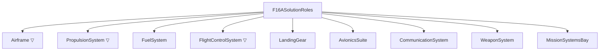
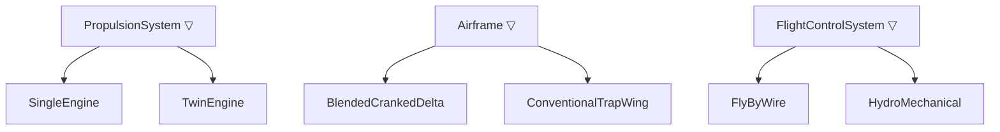

# L Layer — Logical

> Artifact: `logical/F16A_Logical.slx` · Dictionary: `logical/F16A_Logical.sldd`
> · Profile: `logical/F16A_LogicalOptions.xml` · Allocation: `logical/F16A_FunctionToLogical.mldatx`
> · Generators: `logical/generate_f16a_logical.m`, `requirements/generate_f16a_logical_derived_requirements.m`
> · Test: `logical/F16ALogicalArchitectureTest.m`
> · The decision that resolves this layer is made one layer down, at P.

The Functions layer said **what** the aircraft must do. The Logical layer says **how** — in
**solution roles** — and it teaches two ideas the earlier layers could not:

1. **Allocation.** A *new* traceability relationship, distinct from the `Implement` links of R↔F:
   each function is **allocated** to the logical role that realizes it. Allocation lives in its own
   queryable artifact (an *allocation set*), separate from either model.
2. **Options, plural — presented, not decided.** A role can usually be realized more than one way.
   The Logical layer is where you lay the **candidate kinds** side by side and keep every one of
   them in the model. It is *not* where you pick. Three roles here carry competing kinds as
   **variant components**, and `generate_f16a_logical` leaves all three **unresolved** — the
   answers arrive later, from P, and never from anything in this layer.

That second idea is the one this layer got wrong in an earlier version of the example, and
[`06_methodology.md`](06_methodology.md) exists to explain why. Read it if you want the reasoning
before the mechanics.

## The solution roles

Nine roles, a flat decomposition under the root `F16ASolutionRoles`. Noun phrases: a role is a
*thing that fills a job*, where a function was a verb phrase.



`▽` marks a **variant** role (competing kinds — see below).

| Role | What it *is* (not how built) |
|------|------------------------------|
| `Airframe` | Load-bearing structure + aeroshape/CG (wing, fuselage, empennage) |
| `PropulsionSystem` | Thrust: engine + inlet + afterburner |
| `FuelSystem` | Fuel storage, transfer, CG management, fuel-state accounting |
| `FlightControlSystem` | Attitude/trajectory control: surfaces + actuation + control laws |
| `LandingGear` | Ground support, takeoff-rotation clearance, ground stability, braking |
| `AvionicsSuite` | Navigation, mission computing, sensors/radar, IFF |
| `CommunicationSystem` | Voice/data links |
| `WeaponSystem` | Store carriage, fire-control integration, expendable-payload release |
| `MissionSystemsBay` | Permanent (non-expended) payload: gun, fixed equipment |

## Allocation — the new relationship

`Implement` links (R↔F) said *which requirement a function satisfies*. **Allocation** says *which
role realizes a function*. It is a model-to-model relationship, stored in
`F16A_FunctionToLogical.mldatx` and viewable as a matrix (`systemcomposer.allocation.editor`).

**13 leaf functions, 14 edges.** Point of interest: `Target` fans out to two roles (the sensors
designate, the weapon system employs) — the same 1→many teaching moment the F layer had with
point-performance requirements mapping to both lift and thrust.

| Function (F) | Allocated role (L) |
|--------------|--------------------|
| GenerateLift | Airframe |
| ProduceThrust | PropulsionSystem |
| Maneuver | FlightControlSystem |
| ManageFuel | FuelSystem |
| MaintainStructuralIntegrity | Airframe |
| Navigate | AvionicsSuite |
| Communicate | CommunicationSystem |
| Find, Fix, Track, Assess | AvionicsSuite |
| Target | AvionicsSuite **and** WeaponSystem |
| Engage | WeaponSystem |

### The ten mission phases are *not* allocated

The F layer already taught that phases (Takeoff, Climb, …) are a **temporal thread**, not
capabilities. That lesson pays off again here: a phase is *orchestration* realized **by** the
capabilities acting in a particular regime — it has no solution role of its own. Allocating
`Cruise → PropulsionSystem + Airframe` would only re-derive, less precisely, what
`ProduceThrust → PropulsionSystem` and `GenerateLift → Airframe` already state. So **only the
capability and F2T2EA leaves are allocated**; the phases trace to logical roles only transitively.
`testMissionPhasesNotAllocated` enforces this as an executable assertion.

### Not every role comes from a function

`LandingGear` and `MissionSystemsBay` receive **no** allocation. They are **constraint-driven** —
they exist to satisfy non-functional requirements, not to realize a behavior. That is a real
systems-engineering lesson: some components are born from a *constraint*, not a *function*. They are
also deliberately **port-free** in the logical backbone (below), a visible marker of that status.

## Requirements the Logical layer now owns

Six requirements were held back from F as non-functional (see
[`03_traceability.md`](03_traceability.md)). Four of them find a home here — the four that a
**solution role or its geometry** can satisfy:

| Requirement | Concern | Realizing role |
|-------------|---------|----------------|
| REQ_F16A_020 | Permanent payload capacity | `MissionSystemsBay` |
| REQ_F16A_023 | Balance — tipback angle | `LandingGear` |
| REQ_F16A_024 | Balance — rollover angle | `LandingGear` |
| REQ_F16A_025 | Stability & control — static margin | `Airframe` |

The remaining two are handled at the **Physical** layer, because only *materialized parts* can
carry them: `REQ_F16A_022` (composite material fraction) and `REQ_F16A_026` (unit flyaway cost). No
logical role *is* a material choice, and cost is a whole-aircraft figure. At P, cost (026) becomes a
**Measure of Merit** to minimize, and materials (022) becomes a real design constraint —
Implement-linked from the airframe and **verified by** a roll-up test — see
[`05_physical.md`](05_physical.md). Note 023/024/025 are still `todo` placeholders — the Implement
link records *where* they will be satisfied even before the numbers are filled in. Allocation of
responsibility precedes quantification.

## Light logical backbone

The teaching focus of L is allocation and options, not internal data flow, so the model is mostly a
role decomposition with a **small, curated set of typed connections** — enough to show that logical
interfaces exist, echoing the F layer's own mix of a flow view and a pure-decomposition view.

| Interface (`double` elements) | Connection |
|-------------------------------|-----------|
| `FuelFlow` (FuelRate_pph, TankState_frac) | FuelSystem → PropulsionSystem |
| `ThrustVector` (Thrust_lbf) | PropulsionSystem → Airframe |
| `ControlCommand` (SurfaceDeflect_deg) | FlightControlSystem → Airframe |
| `TargetTrack` (Bearing_deg, Range_nm) | AvionicsSuite → WeaponSystem |

Six roles carry ports; `LandingGear`, `CommunicationSystem`, and `MissionSystemsBay` stay port-free.

## Design options — presented, not decided

Here is the headline lesson of the Logical layer. The Functions layer described *what* must be done
without committing to *how*; there is usually **more than one credible way**. L's job is to
**enumerate** those ways and hold them open. We model this with System Composer **variant
components**: a variant role holds several **kinds**, all kept in the model.

A **kind** is an architectural *topology* — a configuration commitment that is free of technology,
vendor and numbers. Three roles are modelled this way:



| Variant role | Kinds | The question the pair asks |
|--------------|-------|----------------------------|
| `PropulsionSystem` | `SingleEngine` · `TwinEngine` | one thrust unit, or two? |
| `Airframe` | `BlendedCrankedDelta` · `ConventionalTrapWing` | blended wing-body with LERX, or a discrete trapezoidal wing on a fuselage? |
| `FlightControlSystem` | `FlyByWire` · `HydroMechanical` | an electrical command path, or mechanical linkages? |

Note that no box above is ticked. **When this layer is built, that is the point** — nothing in L is
entitled to tick one. (The model you have on disk *does* carry a tick per role, because the physical
trade study has since run and written it back; see [Current status](#current-status--what-the-shipped-l-model-carries) below.)

### Why the kind names changed

These were once called `SingleEngine_F100`, `TwinEngine_LWF` and `AnalogFBW`. The rename is not
cosmetic — it *is* the lesson. Apply the third of the three-question tests in
[`06_methodology.md`](06_methodology.md): **swap the technology underneath the box; does its name
still make sense?** `SingleEngine` outlives the F100. `SingleEngine_F100` does not — it is a
product, and products live at P (D-017, D-020).

`testKindsAreTechnologyNeutral` makes that an executable rule. It reads the six names **out of the
model** (not out of a constant, so renaming a kind in the generator is caught) and fails on any
digit or any of `F100 F110 PW GE LWF Analog`. The token match is deliberately **case-sensitive**:
`ConventionalTrapWing` contains the substring `pW`, so a case-insensitive check would reject a
perfectly good kind name.

### Why L cannot answer "which one?"

Because a logical role has no mass. Only a *part* has a mass — and a part exists only at P. To score
these six kinds here you would have to invent a mass, a cost, a TRL and a benefit for each of them,
including for configurations that were never built. Every one of those numbers would be a fiction
manufactured solely to make a script return a winner, and the model would then carry a decision it
had no evidence for.

So L commits to nothing. The decision needs **concrete parameterized candidates** — real
alternatives with sourced data and a provenance tag — and those live at the Physical layer
([`05_physical.md`](05_physical.md)). Keeping every kind alive until the parameterized trade can
decide is the set-based discipline described in [`06_methodology.md`](06_methodology.md).

### What a kind carries

The profile `logical/F16A_LogicalOptions.xml` declares exactly one stereotype, `SolutionOption`,
applied to all six kinds. It goes on the **choices**, never on the variant role itself —
`applyStereotype` errors on a `VariantComponent` in R2026a, and a role is not an option, so it has
nothing to select.

| Property | Type | Profile default (what the L generator leaves) | After the physical trade study |
|----------|------|---------------------|-----------|
| `Selected` | boolean | `false` on all six kinds | `true` on one kind per role |
| `DecisionRef` | string | `'TBD'` on all six kinds | the decision requirement id, on **every** kind of the role — winner *and* loser (D-027) |

Both columns describe the same two properties; which one you are looking at depends only on whether
`F16APhysicalTradeStudy` has run. The **profile defaults never change** — they are still `false` and
`'TBD'` in `F16A_LogicalOptions.xml` — so regenerating L alone always returns the model to the left
column.

That is the whole stereotype: **whether** a kind was selected, and **where** the decision is written
down. There is no `Mass_lb`, no `UnitCost_USD`, no `TRL` and no `Benefit` anywhere at L — not on a
kind, and not declared in the profile. `testKindsCarryNoTradeNumerics` enforces both halves, and the
profile half is the load-bearing one: it fails if somebody re-adds `Mass_lb` to the L profile *even
before any component applies it*.

**The active choice the generator sets is a placeholder, not a decision.** A variant needs exactly
one active choice to be a valid model, so `generate_f16a_logical` sets one — literally
`setActiveChoice(vc, choiceNames(1))`, the first name in the list. It means "first in the list",
nothing more. The trade study later re-asserts the active choice **from the score**, which is the
difference between a decision and a default. `testExactlyOneActiveChoice` asserts that each role has
exactly one active kind and that it is one of its own; it deliberately does **not** assert which —
that is the physical trade's call.

The generator says so on every run:

```
Options are UNRESOLVED: every kind has Selected=false, DecisionRef='TBD', and the active
choice is a placeholder.
Run F16APhysicalTradeStudy to decide.
```

### How the decision comes back

`physical/F16APhysicalTradeStudy.m` parameterizes the concrete candidates behind each kind (a
physical candidate names the kind it realizes through a `RealizesKind` property), scores them, and
then writes the outcome **back into this model**. It is a deliberate, documented cross-layer write —
the one exception to layer independence, and it touches only this model's own link set and
stereotype values:

1. sets the **active variant choice** to the winning kind;
2. sets `SolutionOption.Selected = true` on that kind and `false` on its sibling;
3. writes `SolutionOption.DecisionRef` with the id of the decision requirement — on **every kind of
   the role**, not only the winner (D-027);
4. **Implement-links** the winning kind to `REQ_F16A_L01`–`L03` in
   `requirements/f16a_logical_derived.slreqx`.

It keys step 1 on the winner's `RealizesKind`, never on the candidate's name: the mapping is
many-to-one — `F100_PW_200` and `F110_GE_100` both realize `SingleEngine` — so a callback keyed on
the candidate would fail to find its option the moment the *other* single-engine candidate won, which
is exactly when you would want it to work (D-027).

**The decision requirement is the authoritative record.** Its `Rationale` states the value
functions, the weights, and the reason that candidate won. The active variant flag and the
`Selected` boolean are **derived artifacts** — queryable and convenient, but reconstructible from
the requirement. If the two ever disagree, the requirement is right and the model needs
regenerating. This is the RFLP story in miniature: analysis *feeds back* into requirements.

The alternatives are **not** deleted. They stay in the model as the options that were traded.

### Current status — what the shipped L model carries

**The trade study has run, and the model in this repository is resolved.** `F16A_Logical.slx` on
disk carries:

| Role | Kinds, as shipped | `DecisionRef` |
|------|-------------------|---------------|
| `PropulsionSystem` | **`SingleEngine`** `Selected=true` · `TwinEngine` `Selected=false` | `REQ_F16A_L01` on both |
| `FlightControlSystem` | **`FlyByWire`** `Selected=true` · `HydroMechanical` `Selected=false` | `REQ_F16A_L02` on both |
| `Airframe` | **`BlendedCrankedDelta`** `Selected=true` · `ConventionalTrapWing` `Selected=false` | `REQ_F16A_L03` on both |

The active variant choice of each role is that role's selected kind, and the L model's link set
holds **7 Implement links** — the 4 this layer's own generator makes (`REQ_F16A_020/023/024/025`)
plus **3 created by the physical trade study**, from each winning kind into
`f16a_logical_derived.slreqx`. So `REQ_F16A_L01`–`L03` now show as *implemented* in the Requirements
Editor, sourced from the L model.

Note the third column: `DecisionRef` is written on the **rejected** kind too. That is deliberate
(D-027) — a reader who clicks `TwinEngine` should land on the requirement that explains why it lost,
not on a `TBD`.

> **If you regenerate only the L layer, you will get the unresolved model back — and that is
> correct, not a defect.** `generate_f16a_logical` alone leaves every kind at `Selected=false` /
> `DecisionRef='TBD'` with a placeholder active choice, and `REQ_F16A_L01`–`L03` with **no incoming
> Implement links**. It prints exactly that on every run. Run `generate_f16a_physical` (or
> `F16APhysicalTradeStudy` on its own, once the P model exists) to resolve it again. The L layer
> genuinely cannot answer these questions — see [Why L cannot answer "which one?"](#why-l-cannot-answer-which-one)
> — so its generator ending in an undecided state is the design working, not a step someone forgot
> (D-019).

Because the *resolution* arrives from outside this layer, the L test suite is written to pass in
**both** states — see [Verification](#verification) below.

### Why these are the credible options

Each pair is a real, documentable F-16 decision, and each is dominated by a **different** concern —
which is why they are worth three separate trades rather than one:

| Pair | Where the real program argued it out | What dominates the argument |
|------|--------------------------------------|-----------------------------|
| single vs twin engine | the **Lightweight Fighter flyoff** (YF-16 vs YF-17) | maturity and installed weight, against the engine-out survivability a single installation gives up |
| fly-by-wire vs hydro-mechanical | the F-16 was the **first production fighter to fly a fly-by-wire flight control system** — which is what makes relaxed static stability usable | agility, against the maturity of a proven mechanical path |
| blended cranked delta vs conventional trapezoidal wing | the F-16's distinctive **blended cranked-delta planform with LERX** | high-alpha and sustained-turn performance plus structural efficiency, against aero-development risk |

Read that table as *why these two options are the ones worth putting in the model* — **not** as why
one of them won. The outcome is read off `REQ_F16A_L01`–`L03`, and the numbers behind it off the
physical candidates; neither is read off this table, which would still be worth writing if the trade
had gone the other way.

### Allocation targets the role, not the choice

Functions allocate to the **variant role** (e.g. `ProduceThrust → PropulsionSystem`), never to a
specific kind. Allocation states *which role owns the function*; the kind states *which candidate
topology fills the role*. Keeping those two decisions decoupled is the whole point.

This restructure is the proof. All three pairs of kinds were renamed — `SingleEngine_F100` →
`SingleEngine`, `TwinEngine_LWF` → `TwinEngine`, `AnalogFBW` → `FlyByWire` — and **not one of the 14
allocation edges changed**, because not one of them ever named a kind. Re-run the trade, flip the
active choice, or swap the technology underneath it entirely: the allocation set is untouched.

## Verification

`F16ALogicalArchitectureTest.m` — **15 tests**. It is a **machinery** suite: it asks "is the L model
built correctly?", never "is this the right design?".

| Group | What is checked |
|-------|-----------------|
| Structure | the 9 roles exist and the root has exactly 9 components; the 4 interfaces and their elements; the 6 wired roles have every port connected and the 3 constraint roles are port-free |
| Allocation | the set and its scenario exist; 13 distinct source functions, 14 edges, `Target` the only fan-out; no phase or composite is ever a source; sampled endpoints resolve in both models |
| Requirements | 020/023/024/025 each carry an Implement link from L |
| Options | each variant role exposes exactly its two named kinds, with exactly one active; every kind carries `SolutionOption` with both properties present and readable; the six kind names are free of digits and vendor/program tokens; neither the kinds nor the profile declares `Mass_lb`, `UnitCost_USD`, `TRL` or `Benefit` |
| Decision consistency | the decision, *if* one has been written back, is internally coherent — see below |

### The test that passes in both states

`testSelectedKindIsConsistentWithItsDecisionRef` is the fifteenth test, and it is the one that
encodes this layer's relationship with P. **It is written so that both an undecided L model and a
decided one pass** — and that conditional structure *is* the assertion. It says "no kind selected and
every `DecisionRef` still `'TBD'`" is a **correct** L model, not a broken one, which is exactly why
this suite can still be run on a freshly generated L model with no physical layer in existence at all
(D-010, D-019).

What it forbids is the state **in between**, where a decision was started and not finished:

| Rejected state | Why it is wrong |
|---|---|
| two kinds of one role both `Selected` | a re-run recorded a new winner without clearing the old one |
| a `Selected` kind that is not the **active** choice | the model is configured as one thing while claiming it decided another |
| a `Selected` kind whose `DecisionRef` is still `'TBD'` | a decision with no decision record behind it |
| an **undecided** role whose kinds already cite a requirement | the mirror image — a record with no decision, which is worse, because it reads as settled |
| two roles citing the **same** decision requirement | one requirement standing in for two independent decisions (D-016 keeps the three variation points separate) |

It deliberately does **not** check the `REQ_F16A_L01`–`L03` Implement links. Those are written by P.

### What the suite deliberately does *not* check

The pre-restructure suite also had 15 tests, but four of them were about the retired Logical-layer
trade: that every choice carried a `TradeCandidate` stereotype, that the trade study ran and ranked,
that `Selected` matched the top score, and that each decision requirement was linked from its winner.
Three of those went away with the script they tested. The fourth **moved**:

- **Which kind wins** is not asserted. L presents options; the trade runs at P.
- **The `REQ_F16A_L01`–`L03` Implement links** are not asserted here. They are created by the
  physical trade study, so checking them at L would make the L suite pass or fail depending on
  whether P had been run — exactly the layer coupling this restructure removes. That assertion
  belongs to `F16APhysicalArchitectureTest` (**D-010**), which now carries it.
- **Which kind is `Selected`** is not asserted, and neither is whether *any* is. Both the undecided
  and the decided model are legitimate states of a correctly built L model. What *is* asserted, by
  `testSelectedKindIsConsistentWithItsDecisionRef`, is that whichever state the model is in, it is
  in it **consistently** — see the table above.

The count is a coincidence worth spelling out, since 15 → 15 hides the churn: four trade tests left
(three deleted, one moved to P), and four were added in their place —
`testKindsCarryNoTradeNumerics`, `testKindsAreTechnologyNeutral`, `testEveryKindCarriesSolutionOption`
and `testSelectedKindIsConsistentWithItsDecisionRef`. The suite now fails the moment a number or a
half-written decision creeps back into L.

## Next

The **Physical layer (P)** ([`05_physical.md`](05_physical.md)) realizes each logical role with
concrete parts — refining the selected airframe candidate into wing/fuselage/empennage — rolls those
parts' masses up to the aircraft's Operating Empty Weight, and records OEW and unit cost as
**Measures of Merit** to minimize (homing the cost requirement `REQ_F16A_026`). It is also where this
layer's three open questions **were answered**: P parameterizes the concrete candidates behind each
kind, scores them with declared value functions, and writes the decision back here — the
`Selected` / `DecisionRef` values and the Implement links tabulated above are its output. For *why*
the trade lives there and not here, see [`06_methodology.md`](06_methodology.md); for the candidates,
the scoring and the results, see [`05_physical.md`](05_physical.md).
