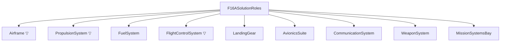
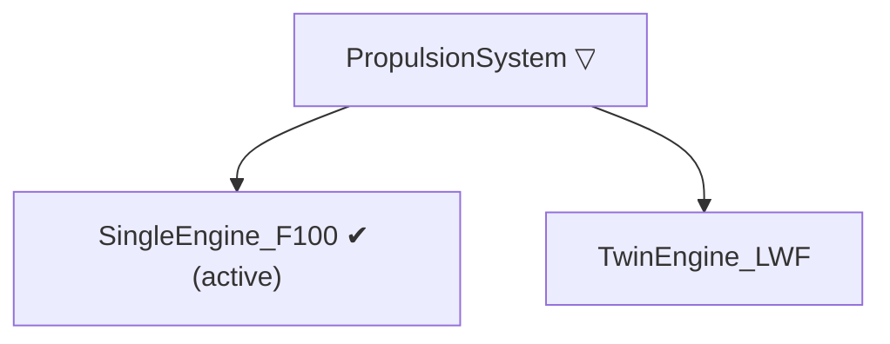

# L Layer — Logical

> Artifact: `logical/F16A_Logical.slx` · Dictionary: `logical/F16A_Logical.sldd`
> · Profile: `logical/F16A_LogicalTrades.xml` · Allocation: `logical/F16A_FunctionToLogical.mldatx`
> · Generators: `generate_f16a_logical.m`, `generate_f16a_logical_derived_requirements.m`
> · Trade study: `F16ALogicalTradeStudy.m`

The Functions layer said **what** the aircraft must do. The Logical layer says **how** — in
**solution roles** — and it teaches two ideas the earlier layers could not:

1. **Allocation.** A *new* traceability relationship, distinct from the `Implement` links of R↔F:
   each function is **allocated** to the logical role that realizes it. Allocation lives in its own
   queryable artifact (an *allocation set*), separate from either model.
2. **Options, plural.** A role can usually be realized more than one way. The Logical layer is where
   you lay the **candidate solutions** side by side, run a **trade study**, and **select** one — and
   where you keep a record of *why*. Three roles here carry competing options as **variant components**.

## The solution roles

Nine roles, a flat decomposition under the root `F16ASolutionRoles`. Noun phrases: a role is a
*thing that fills a job*, where a function was a verb phrase.

`▽` marks a **variant** role (competing options — see below).

| Role | What it *is* (not how built) |
|------|------------------------------|
| `Airframe` | Load-bearing structure + aeroshape/CG (wing, fuselage, empennage) |
| `PropulsionSystem` | Thrust: engine + inlet + afterburner |
| `FuelSystem` | Fuel storage, transfer, CG management, fuel-state accounting |
| `FlightControlSystem` | Attitude/trajectory control: surfaces + actuation + control laws |
| `LandingGear` | Ground support, takeoff-rotation clearance, ground stability, braking |
| `AvionicsSuite` | Navigation, mission computing, sensors/radar, IFF |
| `CommunicationSystem` | Voice/data links |
| `WeaponSystem` | Store carriage, fire-control integration, expendable-payload release |
| `MissionSystemsBay` | Permanent (non-expended) payload: gun, fixed equipment |

## Allocation — the new relationship

`Implement` links (R↔F) said *which requirement a function satisfies*. **Allocation** says *which
role realizes a function*. It is a model-to-model relationship, stored in
`F16A_FunctionToLogical.mldatx` and viewable as a matrix (`systemcomposer.allocation.editor`).

**13 leaf functions, 14 edges.** Point of interest: `Target` fans out to two roles (the sensors
designate, the weapon system employs) — the same 1→many teaching moment the F layer had with
point-performance requirements mapping to both lift and thrust.

| Function (F) | Allocated role (L) |
|--------------|--------------------|
| GenerateLift | Airframe |
| ProduceThrust | PropulsionSystem |
| Maneuver | FlightControlSystem |
| ManageFuel | FuelSystem |
| MaintainStructuralIntegrity | Airframe |
| Navigate | AvionicsSuite |
| Communicate | CommunicationSystem |
| Find, Fix, Track, Assess | AvionicsSuite |
| Target | AvionicsSuite **and** WeaponSystem |
| Engage | WeaponSystem |

### The ten mission phases are *not* allocated

The F layer already taught that phases (Takeoff, Climb, …) are a **temporal thread**, not
capabilities. That lesson pays off again here: a phase is *orchestration* realized **by** the
capabilities acting in a particular regime — it has no solution role of its own. Allocating
`Cruise → PropulsionSystem + Airframe` would only re-derive, less precisely, what
`ProduceThrust → PropulsionSystem` and `GenerateLift → Airframe` already state. So **only the
capability and F2T2EA leaves are allocated**; the phases trace to logical roles only transitively.
`testMissionPhasesNotAllocated` enforces this as an executable assertion.

### Not every role comes from a function

`LandingGear` and `MissionSystemsBay` receive **no** allocation. They are **constraint-driven** —
they exist to satisfy non-functional requirements, not to realize a behavior. That is a real
systems-engineering lesson: some components are born from a *constraint*, not a *function*. They are
also deliberately **port-free** in the logical backbone (below), a visible marker of that status.

## Requirements the Logical layer now owns

Six requirements were held back from F as non-functional (see
[`03_traceability.md`](03_traceability.md)). Four of them find a home here — the four that a
**solution role or its geometry** can satisfy:

| Requirement | Concern | Realizing role |
|-------------|---------|----------------|
| REQ_F16A_020 | Permanent payload capacity | `MissionSystemsBay` |
| REQ_F16A_023 | Balance — tipback angle | `LandingGear` |
| REQ_F16A_024 | Balance — rollover angle | `LandingGear` |
| REQ_F16A_025 | Stability & control — static margin | `Airframe` |

The remaining two stay deferred to the **Physical** layer, because only *materialized parts* can
carry them: `REQ_F16A_022` (composite material fraction) and `REQ_F16A_026` (unit flyaway cost). No
logical role *is* a material choice, and cost aggregates over concrete parts. Note 023/024/025 are
still `todo` placeholders — the Implement link records *where* they will be satisfied even before
the numbers are filled in. Allocation of responsibility precedes quantification.

## Light logical backbone

The teaching focus of L is allocation and trades, not internal data flow, so the model is mostly a
role decomposition with a **small, curated set of typed connections** — enough to show that logical
interfaces exist, echoing the F layer's own mix of a flow view and a pure-decomposition view.

| Interface (`double` elements) | Connection |
|-------------------------------|-----------|
| `FuelFlow` (FuelRate_pph, TankState_frac) | FuelSystem → PropulsionSystem |
| `ThrustVector` (Thrust_lbf) | PropulsionSystem → Airframe |
| `ControlCommand` (SurfaceDeflect_deg) | FlightControlSystem → Airframe |
| `TargetTrack` (Bearing_deg, Range_nm) | AvionicsSuite → WeaponSystem |

Six roles carry ports; `LandingGear`, `CommunicationSystem`, and `MissionSystemsBay` stay port-free.

## Design alternatives, trade & selection

Here is the headline lesson of the Logical layer. The Functions layer described *what* must be done
without committing to *how*; there is usually **more than one credible way**, and choosing is part
of the design. We model this with System Composer **variant components**: a variant role holds
several **choices**, all kept in the model, with exactly **one active**.

Three roles are modelled this way — each a real, documentable F-16 decision, and each dominated by a
**different** driver, so the trades resolve for different reasons:

| Variant role | Choice A (production F-16A) | Choice B (alternative) | Dominant driver |
|--------------|------------------------------|-------------------------|-----------------|
| `PropulsionSystem` | `SingleEngine_F100` — one P&W F100 | `TwinEngine_LWF` — twin engine | cost / weight / maturity |
| `FlightControlSystem` | `AnalogFBW` — analog fly-by-wire, relaxed static stability | `HydroMechanical` — conventional linkages | agility (benefit) |
| `Airframe` | `BlendedCrankedDelta` — cropped delta + LERX | `ConventionalTrapWing` — trapezoidal wing | performance + structural efficiency |

These recall the real F-16 program: the single- vs twin-engine **Lightweight Fighter flyoff**
(YF-16 vs YF-17); the F-16 being the **first production fly-by-wire fighter**; and its distinctive
**blended cranked-delta** planform.

### The trade study

`F16ALogicalTradeStudy.m` reads each choice's `TradeCandidate` stereotype properties, min-max
normalizes each criterion (`Benefit`, `TRL` more-is-better; `Mass_lb`, `UnitCost_USD`
less-is-better), and computes a weighted score (weights `Benefit 0.40`, `TRL 0.20`, `Mass_lb 0.20`,
`UnitCost_USD 0.20`). The property values are **illustrative teaching numbers**, tuned so the
production choice wins — but each for a different reason:

**PropulsionSystem** — single engine wins on cost, weight, and maturity (loses only raw benefit):

| Choice | Mass_lb | UnitCost_USD | TRL | Benefit | Score |
|--------|--------:|-------------:|----:|--------:|------:|
| SingleEngine_F100 ✔ | 3800 | 4.5M | 8 | 8.0 | **0.60** |
| TwinEngine_LWF | 5200 | 6.8M | 7 | 8.5 | 0.40 |

**FlightControlSystem** — fly-by-wire wins on agility benefit and control weight, outweighing its
lower maturity and higher cost:

| Choice | Mass_lb | UnitCost_USD | TRL | Benefit | Score |
|--------|--------:|-------------:|----:|--------:|------:|
| AnalogFBW ✔ | 1200 | 1.5M | 6 | 9.0 | **0.60** |
| HydroMechanical | 1800 | 1.0M | 9 | 6.0 | 0.40 |

**Airframe** — the blended delta wins on maneuver benefit and structural efficiency, outweighing
lower maturity and higher aero-development cost:

| Choice | Mass_lb | UnitCost_USD | TRL | Benefit | Score |
|--------|--------:|-------------:|----:|--------:|------:|
| BlendedCrankedDelta ✔ | 5400 | 7.0M | 7 | 9.5 | **0.60** |
| ConventionalTrapWing | 5900 | 6.2M | 8 | 6.5 | 0.40 |

### How the decision is recorded

The pick is captured **three reinforcing ways** so it is both machine-usable and auditable:

1. **Active variant choice** — the model itself now shows the selected option active.
2. **`Selected` stereotype flag** — a queryable boolean on the winning choice.
3. **Decision requirement** — `REQ_F16A_L01`–`L03` (in `f16a_logical_derived.slreqx`) state the
   choice, with the weighted-score reasoning in the `Rationale`; the winning choice is
   Implement-linked to it. This is the RFLP story in miniature: functional analysis and trade
   studies *feed back* into requirements.

The alternatives are **not** deleted — they remain in the model as the options that were traded.

### Allocation targets the role, not the choice

Functions allocate to the **variant role** (e.g. `ProduceThrust → PropulsionSystem`), never to a
specific choice. Allocation states *which role owns the function*; the variant choice states *which
candidate currently fills the role*. Re-run the trade, flip the active choice — and not a single
allocation link changes. Keeping those two decisions decoupled is the whole point.

## Verification

`F16ALogicalArchitectureTest.m` (15 tests) checks: the 9 roles exist; the 4 interfaces are defined;
the six wired roles are fully connected and the three constraint roles are port-free; the allocation
set exists with 14 edges from 13 leaves (Target fans out to 2); **no phase is allocated**; 020/023/
024/025 are implemented from L while 022/026 are not; the three variant roles each have two choices
and exactly one active; every choice carries the `TradeCandidate` stereotype; the trade study ranks
and returns a unique winner per role; the `Selected` flag and active choice match the top score; and
each decision requirement `L01`–`L03` is linked from its winner.

## Next

The **Physical layer (P)** will realize each logical role — and the *active* choice of each variant
role — with concrete parts, refine the airframe into wing/fuselage/empennage, and finally give
`REQ_F16A_022` (materials) and `REQ_F16A_026` (cost) a home, closing out the RFLP model.
