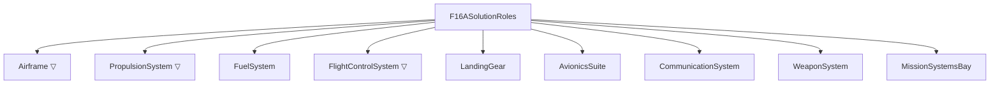

# L Layer — Logical

> Model: `logical/F16A_Logical.slx` · Profile: `F16A_LogicalOptions.xml` · Allocation:
> `F16A_FunctionToLogical.mldatx` · Generator: `generate_f16a_logical.m` · Test:
> `tests_for_ai_coding/F16ALogicalArchitectureTest.m`
> · **The decision that resolves this layer is made one layer down, at P.**

The Functions layer said **what** the aircraft must do. The Logical layer says **how** — in
**solution roles** — and teaches two ideas the earlier layers could not:

1. **Allocation.** A *new* traceability relationship, distinct from the `Implement` links of R↔F:
   each function is **allocated** to the role that realizes it, in its own queryable artifact.
2. **Options, plural — presented, not decided.** A role can usually be realized more than one way.
   L is where you lay the **candidate kinds** side by side and keep every one in the model. It is
   *not* where you pick.

That second idea is the one this layer got wrong in an earlier version of the example, and
[`06_methodology.md`](06_methodology.md) exists to explain why.

## The solution roles

Nine roles, a flat decomposition under `F16ASolutionRoles`. Noun phrases: a role is a *thing that
fills a job*, where a function was a verb phrase.

| Role | What it *is* (not how built) |
|------|------------------------------|
| `Airframe` ▽ | Load-bearing structure + aeroshape/CG |
| `PropulsionSystem` ▽ | Thrust: engine + inlet + afterburner |
| `FuelSystem` | Fuel storage, transfer, CG management, fuel-state accounting |
| `FlightControlSystem` ▽ | Attitude/trajectory control: surfaces + actuation + control laws |
| `LandingGear` | Ground support, rotation clearance, ground stability, braking |
| `AvionicsSuite` | Navigation, mission computing, sensors/radar, IFF |
| `CommunicationSystem` | Voice/data links |
| `WeaponSystem` | Store carriage, fire-control integration, expendable-payload release |
| `MissionSystemsBay` | Permanent (non-expended) payload: gun, fixed equipment |

## Allocation — the new relationship

`Implement` links said *which requirement a function satisfies*. **Allocation** says *which role
realizes a function* — a model-to-model relationship, viewable as a matrix
(`systemcomposer.allocation.editor`).

**13 leaf functions, 14 edges.** `GenerateLift` and `MaintainStructuralIntegrity` → `Airframe` ·
`ProduceThrust` → `PropulsionSystem` · `Maneuver` → `FlightControlSystem` · `ManageFuel` →
`FuelSystem` · `Navigate`, `Find`, `Fix`, `Track`, `Assess` → `AvionicsSuite` · `Communicate` →
`CommunicationSystem` · `Engage` → `WeaponSystem` · and **`Target` → `AvionicsSuite` *and*
`WeaponSystem`**, the one 1→many fan-out (the sensors designate, the weapon system employs).

**The ten mission phases are *not* allocated.** A phase is *orchestration* realized **by** the
capabilities acting in a regime — it has no solution role of its own. Allocating `Cruise →
PropulsionSystem + Airframe` would only re-derive, less precisely, what `ProduceThrust` and
`GenerateLift` already state. `testMissionPhasesNotAllocated` enforces it.

**Not every role comes from a function.** `LandingGear` and `MissionSystemsBay` receive no
allocation — they are **constraint-driven**, existing to satisfy non-functional requirements rather
than to realize a behaviour. Some components are born from a *constraint*, not a *function*. They
are also deliberately port-free, a visible marker of that status.

## Requirements the Logical layer owns

Four of the six requirements held back from F find a home here — the four a **solution role or its
geometry** can satisfy:

| Requirement | Concern | Realizing role |
|-------------|---------|----------------|
| REQ_F16A_020 | Permanent payload capacity | `MissionSystemsBay` |
| REQ_F16A_023 | Balance — tipback angle | `LandingGear` |
| REQ_F16A_024 | Balance — rollover angle | `LandingGear` |
| REQ_F16A_025 | Stability & control — static margin | `Airframe` |

The other two go to P, because only *materialized parts* can carry them: `REQ_F16A_022` (composite
fraction) and `REQ_F16A_026` (cost). No logical role *is* a material choice, and cost is a
whole-aircraft figure.

Note 023 and 024 are still deliberately blank — the Implement link records *where* they will be
satisfied even before the numbers exist. **Allocation of responsibility precedes quantification.**

## Light logical backbone

The teaching focus is allocation and options, not internal data flow, so the model is mostly a role
decomposition with a small curated set of typed connections:

| Interface | Connection |
|-----------|-----------|
| `FuelFlow` (FuelRate_pph, TankState_frac) | FuelSystem → PropulsionSystem |
| `ThrustVector` (Thrust_lbf) | PropulsionSystem → Airframe |
| `ControlCommand` (SurfaceDeflect_deg) | FlightControlSystem → Airframe |
| `TargetTrack` (Bearing_deg, Range_nm) | AvionicsSuite → WeaponSystem |

## Design options — presented, not decided

A **kind** is an architectural *topology* — a configuration commitment free of technology, vendor and
numbers. Three roles are modelled as variant components holding competing kinds:

| Variant role | Kinds | The question the pair asks |
|--------------|-------|----------------------------|
| `PropulsionSystem` | `SingleEngine` · `TwinEngine` | one thrust unit, or two? |
| `Airframe` | `BlendedCrankedDelta` · `ConventionalTrapWing` | blended wing-body with LERX, or a discrete trapezoidal wing on a fuselage? |
| `FlightControlSystem` | `FlyByWire` · `HydroMechanical` | an electrical command path, or mechanical linkages? |

### Why the kind names changed

These were once `SingleEngine_F100`, `TwinEngine_LWF` and `AnalogFBW`. The rename is not cosmetic —
it *is* the lesson. Apply the third of the three-question tests in
[`06_methodology.md`](06_methodology.md): **swap the technology underneath the box; does its name
still make sense?** `SingleEngine` outlives the F100. `SingleEngine_F100` does not — it is a product,
and products live at P (D-017, D-020).

`testKindsAreTechnologyNeutral` makes that executable. It reads the six names **out of the model**
(not out of a constant, so renaming a kind in the generator is caught) and fails on any digit or any
of `F100 F110 PW GE LWF Analog`. The match is deliberately **case-sensitive**:
`ConventionalTrapWing` contains `pW`.

### Why L cannot answer "which one?"

Because a logical role has no mass. Only a *part* has a mass, and a part exists only at P. To score
these six kinds here you would have to invent a mass, a cost, a TRL and a benefit for each —
including for configurations never built. Every one would be a fiction manufactured solely to make a
script return a winner, and the model would carry a decision it had no evidence for.

So L commits to nothing. Keeping every kind alive until a parameterized trade can decide is the
set-based discipline described in [`06_methodology.md`](06_methodology.md).

### What a kind carries

`F16A_LogicalOptions.xml` declares exactly one stereotype, `SolutionOption`, applied to the six
**choices** — never to the variant role, which is not an option and has nothing to select.

| Property | Profile default (what L leaves) | After the physical trade study |
|----------|---------------------|-----------|
| `Selected` | `false` on all six kinds | `true` on one kind per role |
| `DecisionRef` | `'TBD'` on all six | the decision requirement id, on **every** kind of the role — winner *and* loser (D-027) |

That is the whole stereotype: **whether** a kind was selected, and **where** the decision is written
down. There is no `Mass_lb`, `UnitCost_USD`, `TRL` or `Benefit` anywhere at L — not on a kind and not
declared in the profile. `testKindsCarryNoTradeNumerics` enforces both halves, and the profile half
is load-bearing: it fails if somebody re-adds `Mass_lb` to the L profile *even before any component
applies it*.

**The active choice the generator sets is a placeholder, not a decision.** A variant needs exactly
one active choice to be valid, so the generator sets one — literally the first name in the list. The
trade study later re-asserts it **from the score**, which is the difference between a decision and a
default. `testExactlyOneActiveChoice` asserts each role has exactly one active kind and that it is
one of its own; it deliberately does not assert *which*.

### How the decision comes back

`F16APhysicalTradeStudy` parameterizes the concrete candidates behind each kind, scores them, and
writes the outcome **back into this model** — a deliberate, documented cross-layer write, the one
exception to layer independence, touching only this model's own link set and stereotype values:

1. sets the **active variant choice** to the winning kind;
2. sets `Selected` true on that kind, false on its sibling;
3. writes `DecisionRef` on **every kind of the role**, not only the winner (D-027);
4. **Implement-links** the winning kind to `REQ_F16A_L01`–`L03`.

Step 1 keys on the winner's `RealizesKind`, never on the candidate's name: the mapping is
many-to-one, so a callback keyed on the candidate would fail the moment the *other* single-engine
candidate won — exactly when you would want it to work.

**The requirement is where the decision is posed; the verdict lives where it was computed.**
`REQ_F16A_L01`–`L03` state the question and name the artifacts that answer it. They carry no winner,
no weights and no scores, because nothing in the R layer computes any of those (D-037, D-040). The
verdict is written in exactly two places, both by the trade study: the winning candidate's
`Rationale.Justification` at P, and the **Implement link** from the winning kind.

The active flag and the `Selected` boolean are therefore **derived artifacts** — queryable and
convenient, reconstructible from the **trade**, not from the requirement. If a flag and the trade's
output ever disagree, the trade is right and the model needs regenerating.

**None of that touches the feedback loop, which is why the trade writes back at all.** The Implement
link on `REQ_F16A_L01`–`L03` is created by a scoring script two layers down, not authored by hand at
R: an open question in a requirement set, closed by an analysis. That is the RFLP story in miniature.

The alternatives are **not** deleted. They stay in the model as the options that were traded.

### Current status — what the shipped L model carries

**The trade study has run, and the model in this repository is resolved:** `SingleEngine`,
`FlyByWire` and `BlendedCrankedDelta` carry `Selected=true`, their siblings `false`, and
`DecisionRef` cites `REQ_F16A_L01`/`L02`/`L03` **on both kinds of each role**. The L model's link set
holds **7 Implement links** — the 4 this layer's generator makes, plus **3 created by the physical
trade study** from each winning kind.

`DecisionRef` on the rejected kind is deliberate (D-027): a reader who clicks `TwinEngine` reaches
the requirement that posed the choice instead of a `'TBD'` dead end. That requirement does not itself
say why `TwinEngine` lost — under D-040 no requirement says why anything lost. It names where the
answer is, and the answer is one hop further: the P candidate `TwinEngine_Surrogate`, whose
`Rationale` states its deficit and the criterion it lost most on (D-049).

> **If you regenerate only the L layer you get the unresolved model back — and that is correct, not a
> defect.** `generate_f16a_logical` alone leaves every kind at `Selected=false` / `DecisionRef='TBD'`
> with a placeholder active choice, and prints exactly that on every run. Run
> `generate_f16a_physical` to resolve it again. The L layer genuinely cannot answer these questions,
> so its generator ending undecided is the design working, not a step someone forgot (D-019).

### Why these are the credible options

Each pair is a real, documentable F-16 decision, and each is dominated by a **different** concern —
which is why they are worth three separate trades rather than one:

| Pair | Where the real programme argued it out | What dominates the argument |
|------|--------------------------------------|-----------------------------|
| single vs twin engine | the **Lightweight Fighter flyoff** (YF-16 vs YF-17) | maturity and installed weight, against the engine-out survivability a single installation gives up |
| fly-by-wire vs hydro-mechanical | the F-16 was the **first production fighter to fly a fly-by-wire flight control system** — which is what makes relaxed static stability usable | agility, against the maturity of a proven mechanical path |
| blended cranked delta vs conventional trapezoidal wing | the F-16's distinctive **blended cranked-delta planform with LERX** | high-alpha and sustained-turn performance plus structural efficiency, against aero-development risk |

**This framing used to live in the requirement text, and deliberately no longer does.** A requirement
that already contains its answer is a decision **claim**, not a decision record (D-037, D-040).
D-020's technology-neutrality ban is executable against the **model artifacts** and was never a ban
on knowing the history. Prose is the right home for it, and this section is the home.

#### History, not rationale

The three kinds that win **are** the production F-16A configuration. Those are checkable facts about
an aircraft that exists, and `testProductionConfigurationWins` pins them — the three winner
*identities*, deliberately **not** their scores. Neither claim is a number entering the model, so
neither carries a `DataProvenance` tag.

**It is not why the model chooses what it chooses, and nothing in the model can see it.** No
criterion, value function or weight reads a *name* — even the ratio baselines key on the role's
`DataProvenance = Reference` candidate, not on anything being called `F100_PW_200`. Rename all seven
candidates and the same rows win. A reader who takes "that is what really happened" as the model's
reason has put back the premise the requirement rewrite removed.

**The converse trap is the more tempting one.** That independence does *not* make the result evidence
about aeroplanes. The `Estimate` masses and the `Benefit`/`TRL` judgements were chosen by someone who
knew the answer, so the exercise is **retrodictive**: it demonstrates the machinery, the arithmetic
and the audit trail, and establishes nothing about the F-16A.
[`06_methodology.md`](06_methodology.md) gives the full accounting, including the uncomfortable one —
0.75 of every score is declared opinion.

### Allocation targets the role, not the choice

Functions allocate to the **variant role**, never to a specific kind. Allocation states *which role
owns the function*; the kind states *which candidate topology fills the role*.

This restructure is the proof. All three pairs of kinds were renamed and **not one of the 14
allocation edges changed**, because not one ever named a kind. Re-run the trade, flip the active
choice, or swap the technology underneath entirely: the allocation set is untouched.

## Verification

`tests_for_ai_coding/F16ALogicalArchitectureTest.m` — **15 tests**, a **machinery** suite: is the
L model built correctly, never is this the right design.

| Group | What is checked |
|-------|-----------------|
| Structure | the 9 roles and the root's component count; the 4 interfaces and their elements; the 6 wired roles fully connected and the 3 constraint roles port-free |
| Allocation | set and scenario exist; 13 distinct source functions, 14 edges, `Target` the only fan-out; no phase or composite is ever a source; endpoints resolve in both models |
| Requirements | 020/023/024/025 each carry an Implement link from L |
| Options | each variant role exposes exactly its two named kinds with exactly one active; every kind carries `SolutionOption`; the names are free of digits and vendor tokens; neither the kinds nor the profile declares trade numerics |
| Decision consistency | the decision, *if* one has been written back, is internally coherent |

### The test that passes in both states

`testSelectedKindIsConsistentWithItsDecisionRef` encodes this layer's relationship with P. **It is
written so that both an undecided L model and a decided one pass** — and that conditional structure
*is* the assertion. It says "no kind selected and every `DecisionRef` still `'TBD'`" is a **correct**
L model, which is why the suite runs on a freshly generated L model with no physical layer in
existence (D-010, D-019).

What it forbids is the state **in between**:

| Rejected state | Why it is wrong |
|---|---|
| two kinds of one role both `Selected` | a re-run recorded a new winner without clearing the old |
| a `Selected` kind that is not the **active** choice | the model is configured as one thing while claiming it decided another |
| a `Selected` kind whose `DecisionRef` is still `'TBD'` | a decision with no decision record behind it |
| an **undecided** role whose kinds already cite a requirement | a record with no decision — worse, because it reads as settled |
| two roles citing the **same** decision requirement | one requirement standing in for two independent decisions (D-016) |

It deliberately does **not** check the `REQ_F16A_L01`–`L03` Implement links: those are written by P,
so checking them here would make the L suite pass or fail depending on whether P had been run — the
exact coupling this structure removes (D-010).

**Which kind wins is not asserted, and neither is whether any is selected.** Both the undecided and
the decided model are legitimate states of a correctly built L model. What *is* asserted is that
whichever state the model is in, it is in it **consistently**.

## Next

The **Physical layer** ([`05_physical.md`](05_physical.md)) realizes each role with concrete parts,
rolls their masses up to Operating Empty Weight, and records OEW and unit cost as **Measures of
Merit**. It is also where this layer's three open questions **were answered**.
