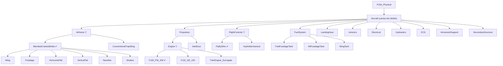

# P Layer — Physical

> Model: `physical/F16A_Physical.slx` · Profile: `F16A_PhysicalProps.xml` · Allocation:
> `F16A_LogicalToPhysical.mldatx` · Generator: `generate_f16a_physical.m`
> · **Trade study**: `F16APhysicalTradeStudy.m` · Guards: `F16APhysicalTradeGuards.m`
> · Vocabularies: `F16ASourceKind.m`, `F16ADataProvenance.m`
> · Roll-ups: `F16APhysical{Mass,Materials,Fuel}Rollup.m`
> · Tests: `F16APhysicalArchitectureTest.m`, `F16APhysicalTradeGuardsTest.m`, `verification/`

The Logical layer said **how** — in solution roles — and laid out competing **kinds** without picking
one. The Physical layer gives **concrete parts**, and teaches four ideas the earlier layers could not:

1. **Roll-up analysis.** Parts carry properties; analyses sum them up the tree to emergent totals —
   Operating Empty Weight, airframe composite fraction, available fuel. The mass roll-up is a
   **native System Composer parametric analysis** (`instantiate`/`iterate`), the canonical MBSE
   "the model computes an emergent property from its parts" move.
2. **Measures of Merit.** Empty weight and unit cost are **objectives to minimize**, not pass/fail
   thresholds — and they come from two different kinds of source.
3. **Verified by.** For requirements that are genuine constraints, a test checks the roll-up and a
   **Verify link** ties the requirement to that test.
4. **The decision is made here.** P is where technology enters, and therefore the only layer that
   can decide between the kinds L enumerated.

## The two-tier split: L presents, P decides

| | Logical option (**kind**) | Physical candidate |
|---|---|---|
| Answers | *What shape of solution?* | *Built out of what, exactly?* |
| Carries | a name, `SolutionOption { Selected, DecisionRef }` | `TradeCandidate { RealizesRole, RealizesKind, Mass_lb, Benefit, TRL, UnitCost_USD, DataProvenance, Selected }` + the `Rationale` every part carries |
| Owns the decision? | **No** — it holds the *active* kind, written back from P | **Yes** — the trade runs here |

A logical role has no mass; only a *part* has a mass, and a part exists only at P. Scoring the kinds
at L would mean inventing a mass, cost, TRL and benefit for configurations nobody built — so L ships
unresolved and P resolves it. See [`06_methodology.md`](06_methodology.md) for the ARCADIA / OOSEM /
set-based-design grounding and an honest account of what the scoring assumes (D-001, D-015).

## The physical decomposition

**Thirty components.** A single **`Aircraft`** is the system-of-interest (it carries the MoMs) and
holds **11 assemblies**. Three of them — `Airframe`, `Propulsion/Engine`, `FlightControls` — are
**variant roles**: a role with more than one credible candidate is not a part, it is an open
question, and it is modelled as one.

`▽` marks a variant role; `✔` the candidate the trade selected. The fuel tanks carry **zero**
empty-weight mass — dry tankage is integral to the wet structure and internal fuel is a
**consumable** — a deliberate "not every part adds to OEW" lesson. They carry a capacity instead.

### The candidate level, and why the detail is asymmetric

| Variant role | Candidates | Realizes kind |
|--------------|-----------|---------------|
| `Airframe` | **`BlendedCrankedDelta`** ✔ · `ConventionalTrapWing` | `BlendedCrankedDelta` · `ConventionalTrapWing` |
| `Propulsion/Engine` | **`F100_PW_200`** ✔ · `F110_GE_100` · `TwinEngine_Surrogate` | `SingleEngine` · `SingleEngine` · `TwinEngine` |
| `FlightControls` | **`FlyByWire`** ✔ · `HydroMechanical` | `FlyByWire` · `HydroMechanical` |

The propulsion column is **many-to-one**: two engines realize the same kind, which is why the
callback into L resolves the winning kind from `RealizesKind` and never from the candidate's name
(D-027).

Only the winner-shaped airframe candidate is **decomposed**; the losers are lumped blocks (D-003).
Detailing `ConventionalTrapWing` to match would mean inventing six part masses and six composite
fractions for an aircraft never built. **You only decompose what you selected.**

The `InletDuct` stays a plain part *beside* the `Engine` variant: every candidate needs one, and
pricing an inlet delta into the twin-engine surrogate would invent a number we cannot defend
(D-009). A real twin installation would change the inlet; that simplification is stated here rather
than hidden inside a mass.

**Two path spaces coexist, and you must use the right one.** Architecture paths gained a level
(`…/Airframe/BlendedCrankedDelta/Wing`) and are what generators, tests and `lookup` use. Instance
paths did not — the analysis instance *flattens* the variant, so the roll-ups still read
`…/Aircraft/Airframe` and needed no change.

## Mass roll-up → Operating Empty Weight

Every part carries `PhysicalItem.Mass_lb` and, since D-036, a `DataProvenance` describing **that
mass**. The leaf masses on the **active** path are the Brandt F-16A ground-truth component weights
(lbf, design point `W_TO = 31,377 lb`), and `F16APhysicalArchitectureTest` now checks them by
**executing** `sizing/VnV/BrandtF16A/BrandtWeight.m` rather than holding a second copy — so the
figures below are a reader's convenience, not the thing the test compares against:

| Assembly | Part | Mass (lb) | | Assembly (leaf) | Mass (lb) |
|----------|------|----------:|-|-----------------|----------:|
| Airframe / BlendedCrankedDelta | Wing | 1785.95 | | LandingGear | 1066.82 |
| Airframe / BlendedCrankedDelta | Fuselage | 3652.11 | | FuelSystem | 0.00 |
| Airframe / BlendedCrankedDelta | HorizontalTail | 648.00 | | FlightControls / FlyByWire | 472.44 |
| Airframe / BlendedCrankedDelta | VerticalTail | 360.00 | | Avionics | 2541.54 |
| Airframe / BlendedCrankedDelta | Nacelles | 186.82 | | Electrical | 533.41 |
| Airframe / BlendedCrankedDelta | Strakes | 90.00 | | Hydraulics | 367.11 |
| Propulsion / Engine | F100_PW_200 | 4730.23 | | ECS | 360.84 |
| Propulsion | InletDuct | 728.60 | | ArmamentSupport | 440.00 |
| | | | | SecondaryStructure | 2016.86 |

`F16APhysicalMassRollup.m` runs it the way MathWorks intends — a native architecture **instance**
iterated bottom-up (`instantiate` → `iterate`, `Direction="Postorder"`), the same pattern shipped in
[`ex2`](../../ex2). Subtotals: Airframe **6,722.88** · Propulsion **5,458.83** · **OEW 19,980.73 lb**.

**It is an active-configuration roll-up, and it did not have to become one.** The analysis instance
contains only the active choice, so the native postorder sum counts the selected candidate and
nothing else. Had it gone the other way, the four losing candidates would have added their masses and
OEW would describe no aeroplane at all — `testOEWCountsOnlyTheActiveConfiguration` computes both sums
from the model and asserts they differ. Architecture-side walks *do* need the `getActiveChoice`
filter and have it (D-012).

Turning three components into variant roles therefore did not change what the aircraft weighs. A
trade that selects the production configuration cannot change what the production aeroplane weighs —
that agreement is the point of a validated example, not a coincidence.

One convention, so it is not misread: **airframe-less-engine = OEW − Engine ≈ 15,250.5 lb** is the
standard "airframe unit weight", **not** the sum of the six structural parts (6,722.88).

## The trade study — where the decision is made

The generator runs it as **section 7b**, between the realization allocation and the roll-ups.

**It discovers its candidates; it does not know them.** There is no list of candidate names in the
trade study — it walks the model, collects every component carrying `TradeCandidate`, and groups by
`RealizesRole`. Add a fourth engine to the generator and it enters the propulsion trade on the next
run with no edit to the scoring file, which is the only way a trade study can be trusted not to have
quietly dropped an option. The one declared mapping is **role → decision requirement**: a new role
genuinely needs a new requirement, and inventing one silently would be worse than stopping.

### What it scores

Each criterion carries a **declared value function** mapping a raw number to a value *without
reference to the other candidates* (D-015):

| Criterion | Value function | Declared weight | Applied weight |
|-----------|----------------|----------------:|---------------:|
| `Benefit` | `v = B / 10` (scale 1–10; 0 means "not set") | 0.40 | **0.50** |
| `TRL` | `v = (TRL − 1) / 8` (scale 1–9) | 0.20 | **0.25** |
| `Mass_lb` | `v = M_baseline / M` | 0.20 | **0.25** |
| `UnitCost_USD` | `v = C_baseline / C` | 0.20 | **dropped** |

A ratio criterion's baseline is the value carried by the role's `DataProvenance = Reference`
candidate — derived from the data, never hard-coded — so **the Brandt candidate scores exactly 1.0 on
mass in every role, by construction**, and `v > 1` reads "lighter than the as-built F-16A".

**Cost falls out of a general rule, not a special case.** Nothing in the code says "exclude cost".
The rule is: *a criterion no candidate of the role carries a value for is dropped, and the remaining
weights are renormalized* (D-026). So the applied weights above are **derived at run time**, not
typed in.

State the re-entry trigger precisely, because the obvious phrasing is wrong. It is **not** "the day a
cost model lands" — it is **the day the candidates carry a cost**. `F16APhysicalCostModel` is destined
to compute a *whole-aircraft* figure for the `Aircraft`'s MoM, while the trade reads
`TradeCandidate.UnitCost_USD`, which stays `NaN` on all seven. A cost model will exist and cost will
still not re-enter (D-043).

### The results

| Role | Candidate | Kind | Benefit† | TRL† | Mass (lb) | Provenance (mass) | Score | |
|------|-----------|------|--------:|-----:|----------:|---|--------:|:--:|
| PropulsionSystem | **F100_PW_200** | SingleEngine | 8.2 | 8 | 4730.23 | Reference | **0.87875** | ✔ |
| | F110_GE_100 | SingleEngine | 8.6 | 4 | 5100 | Estimate | ≈0.756 | |
| | TwinEngine_Surrogate | TwinEngine | 7.8 | 6 | 6400 | Estimate | ≈0.731 | |
| Airframe | **BlendedCrankedDelta** | BlendedCrankedDelta | 9.5 | 7 | 6722.88 | Reference | **0.91250** | ✔ |
| | ConventionalTrapWing | ConventionalTrapWing | 6.5 | 8 | 7300 | Estimate | ≈0.774 | |
| FlightControlSystem | **FlyByWire** | FlyByWire | 9.0 | 6 | 472.44 | Reference | **0.85625** | ✔ |
| | HydroMechanical | HydroMechanical | 6.0 | 9 | 700 | Estimate | ≈0.719 | |

† **`Benefit` and `TRL` are engineering judgement on a declared scale, not measurements** — on the
`Reference` candidates too. They are inventoried as invented values in **D-030**, and between them
they supply **0.75 of every score**.

**The teaching point is the engine.** `F100_PW_200` wins **despite trailing `F110_GE_100` on
Benefit** (8.2 against 8.6). Its margin comes from maturity: measured against that runner-up, `TRL`
is the decisive criterion, worth +0.125 (D-034). The airframe and flight-control trades are both
decided by `Benefit` instead — three roles, two different stories.

"Decided by" is **rival-relative**, and both the printed output and the stored justification say so:
the same F100 that beats the F110 on TRL beats `TwinEngine_Surrogate` on `Mass_lb`. Same victory,
different deciding criterion depending on the rival. A rival-independent answer — which criterion, if
removed, would change the winner — is a genuine sensitivity calculation, deferred rather than faked.

### Where the decision is written

| # | Layer | What is written |
|---|-------|-----------------|
| 1 | **P**, configuration | `setActiveChoice` on the role variant; `TradeCandidate.Selected` on the winner |
| 2 | **P**, rationale | `SourceKind` → `TradeWinner` / `TradeAlternative`, and every `Justification` rewritten to state the result that candidate actually got |
| 3 | **L**, cross-layer callback | the role's active **kind**; `SolutionOption.Selected`; `DecisionRef` on **every** kind of the role, so a reader who clicks the *rejected* kind reaches the decision requirement instead of a `'TBD'` (D-027, D-049) |
| 4 | **R**, traceability | an **Implement link** from the winning kind to `REQ_F16A_L01`/`L02`/`L03` |

Rows 1, 2 and 4 are asserted by `F16APhysicalArchitectureTest`; row 3 by the **L** suite, in a test
written so that *both* an undecided and a decided L model pass, forbidding only the half-finished
state between. The L suite must not fail merely because P has not been run (D-010).

**What a `Justification` says.** Winner and loser get different sentences, and neither is a summary:
the result and rank, the **margin** over the runner-up (or the **deficit** against the winner, signed
this-candidate-minus-winner), a breakdown into every kept criterion, and the criterion that decided
it **against that stated rival**. Two properties are load-bearing: the decomposition **closes** — a
reader can add the terms up and get the margin without re-running anything — and the deciding
criterion is never stated as a property of the decision, because it is not one (D-034). The loser's
sentence matters most: it is the **only** place a rejected option's reasoning exists anywhere.

Each candidate's standing "why do I exist" rationale survives behind a `||` separator, so re-running
the trade is idempotent instead of stacking two verdicts on one part.

**Nothing is deleted.** A losing candidate stays in P and a losing kind stays in L, each carrying a
justification saying what it lost on and by how much (D-002). Links are **rebuilt, not
created-if-absent**, so a re-run picking a different winner cannot leave the previous winner still
claiming to implement the decision (D-028).

### The guard rails

An out-of-range parameter must **stop the trade**, not be scored. The run errors, naming the
candidate, on: a `TRL` outside 1–9 (0 is the deliberate "unset" sentinel); a non-positive `Mass_lb`
(it is a denominator); a `Benefit` outside 1–10, bounded at **both** ends because `B/10` carries the
heaviest weight and `78` typed for `7.8` is finite, so no `isfinite` check catches it (D-033); a role
with fewer than two candidates; a role without exactly one `Reference` baseline; a partial criterion
column; and a **tie** for first, which is a decision the data cannot make.

It **warns** rather than erroring when a value function exceeds 1.0. Only the unbounded ratio
criteria reach it, and there the honest response is neither to cap (discarding a real advantage) nor
to reject a legitimate candidate, but to say out loud that the declared weights have stopped
describing relative influence (D-035).

**Three of those guards live in their own class** — `F16APhysicalTradeGuards.m`, pure static methods
plus the constants defining the scales. The extraction was done for one reason: **so the guards could
be tested without running the study**. See [Verification](#verification).

**The roll-ups run after the trade.** Build order is build → parameters → realization → **trade** →
requirement links → roll-ups, and that ordering is the point of the whole structure. The roll-ups
follow the **active** choice; run them first and they report whichever placeholder the generator
started from. Run them after, and the figures the shipped model carries describe the configuration
the trade selected.

## Every part answers "why do I exist?"

`Rationale { SourceKind, Justification, TraceRef }` is applied to **27 of the 30** components — every
one that can carry a stereotype. The point is that the answer is a **queryable model property** and
not a code comment: you can ask the model for every `ConstraintDriven` part, or for everything the
electrical system exists to serve. `SourceKind` is a real MATLAB enumeration, so the vocabulary is
validated and appears as a dropdown rather than a typo-prone string (D-011):

| `SourceKind` | Means | `TraceRef` names |
|---|---|---|
| `RealizesFunction` | a logical role has to be realized by something concrete | the role |
| `SatisfiesRequirement` | a requirement demands the part directly | the requirement |
| `TradeWinner` | it won the trade study | the decision requirement |
| `TradeAlternative` | it lost, and is kept so the decision stays auditable | the decision requirement |
| `ConstraintDriven` | it comes from a constraint of building an airplane, not a function above it | the requirements setting its geometry |
| `SupportingInfrastructure` | it exists only to serve other parts | **the part it serves** |

`Electrical`, `Hydraulics`, `ECS` and `SecondaryStructure` realize no logical role — the symmetric
echo of L's constraint-driven, function-less roles. Two of their dependencies are **real modelled
port connections**: `Electrical → Avionics` on `ElecPower`, `Hydraulics → FlightControls` on
`HydPower`.

**The three variant role wrappers get no rationale, and must not.** `applyStereotype` errors on a
`VariantComponent` — but the tool restriction happens to be the right answer: a wrapper is not a
part, it is the **question** "which of these?", and a question has no reason to exist independent of
its answers (D-013). `assertRationaleComplete` aborts the build if any of the 27 still carries the
`'TBD'` placeholder, and `testTraceRefsResolve` then **follows** every reference, with a negative
control so the resolver cannot pass by saying yes to everything.

## Provenance — where each number came from

P is the only layer carrying numbers, so it is the layer that must say where each came from.

| Tag | Means |
|-----|-------|
| `Datasheet` | a manufacturer or programme datasheet figure |
| `Reference` | traceable to the Brandt F-16A ground truth in [`sizing/VnV/BrandtF16A/`](../../../../sizing/VnV/BrandtF16A) |
| `Simulation` | the output of an analysis or roll-up in this repo |
| `Estimate` | an **illustrative teaching value** — not F-16 data, must never be cited as such, and must appear in D-030 |

**Read the tag narrowly: it qualifies the `Mass_lb`, and nothing else (D-025).** `Benefit` and `TRL`
are engineering judgement on a declared scale for *every* candidate, including the `Reference` ones —
`DataProvenance = Reference` on `F100_PW_200` says its *mass* is sourced, not that its Benefit of 8.2
is. Overclaiming provenance is precisely what the tag exists to prevent.

Every value-bearing stereotype declares the property: `TradeCandidate`, `Material`, `FuelTank`,
`PhysicalItem`. Only `Rationale` and `MeasureOfMerit` are exempt with a stated reason — the first
holds prose, the second a **computed** OEW and a `NaN` cost, where a provenance tag would be its own
kind of overclaiming.

`PhysicalItem` was itself exempt until D-036, on the argument that it held Brandt ground truth and
the invented masses were tagged on `TradeCandidate` where they are *scored*. That was half true and
the wrong half mattered: 14 of the 16 masses summing to OEW carried no provenance at all, and the six
airframe structural leaves carried `Material.DataProvenance = Estimate` — which describes their
composite fraction — sitting beside a mass that is Brandt data. A reader inspecting `Fuselage` saw a
tag that **contradicted** its mass rather than one that was merely missing. Each property now names
its own source, so two tags on one part stop competing to describe it:

| Part | `PhysicalItem.DataProvenance` (its mass) | the other tag |
|---|---|---|
| `Fuselage` | `Reference` — Brandt | `Material` = `Estimate` (its composite fraction) |
| `WingTank` | `Reference` — a definitional zero | `FuelTank` = `Estimate` (its capacity) |
| `F110_GE_100` | `Estimate` — invented, in D-030 | `TradeCandidate` = `Estimate` (as scored) |
| `Airframe` | `Simulation` — the default | none; it carries no mass of its own |

The default is `Simulation`, not `Estimate`: `PhysicalItem` is applied to every component, so the
ones left at the default are the interior nodes, which store no mass — their subtotal is computed by
the roll-up on demand. Defaulting to `Estimate` would tag every subtotal an invented teaching value
and drag all of them into D-030.

`testProvenanceDeclaredOnEveryValueBearingStereotype` is written the *other* way round from the
obvious version: it takes every stereotype the profile declares, subtracts a named exemption list,
and requires the remainder to declare `DataProvenance` — so a stereotype added tomorrow is in the
required set the day it appears. Listing "these three need tags" would pass by omission forever,
which is exactly how the `Material` gap survived five stages (D-031).

> **Every invented number in this model is inventoried in [D-030](07_decision_log.md).** Do not cite
> any of those figures as F-16 data.

## Measures of Merit — minimize, don't threshold

A hard weight or cost ceiling is the wrong construct in conceptual design, where you **trade** them
and lower is always better. Both are recorded on a `MeasureOfMerit` stereotype on the `Aircraft`
(`Goal = "Minimize"`), and the layer shows the two ways a MoM is sourced:

| Measure of Merit | Value comes from |
|------------------|------------------|
| Operating Empty Weight (`OEW_lb`) | the **mass roll-up** — a bottom-up sum |
| Unit flyaway cost (`UnitCost_USD`) | a **cost-model function** (`F16APhysicalCostModel`) |

Cost is deliberately **not** a roll-up: unit flyaway cost is not the sum of part prices, it is the
output of a parametric model (hours, production quantity, material factors — e.g. DAPCA IV). It is a
**stub** today returning `NaN`, because we do not invent a cost number — and that contrast is itself
the teaching point: **different MoMs are computed by different analyses**, and the architecture names
where each one lives.

`UnitCost_USD` **defaults to `NaN`**, not `0`. A default that silently produces a *plausible* number
is worse than one that stops the run: under a ratio value function `$0` is not neutral, it is
unbeatable (D-021, D-032).

## Constraints verified by roll-up

For genuine constraints with a real limit, a **test** computes a roll-up and checks the requirement,
and a **Verify link** ties the requirement to that test. Verify links are added **manually** — the
generator makes Implement links only.

### Materials — composite fraction ≤ 20% (REQ_F16A_022)

`F16APhysicalMaterialsRollup.m` computes the **mass-weighted** composite fraction of the **active**
airframe candidate — a roll-up, but a weighted average rather than a plain sum. It asks the model
which candidate is active rather than assuming, and the leaf rule is structural (*every leaf under
the active candidate carrying a `Material` stereotype*), so the constraint stays answerable whichever
way the trade goes.

> **Read this as a demonstration, not as data.** Every fraction below is an **invented number**
> (`Estimate`, inventoried in D-030). They are an educated guess loosely grounded in real F-16
> composite usage — graphite/epoxy tail skins, a carbon-fibre wing leading edge, fibreglass strakes,
> aluminium fuselage and nacelles — **and then chosen so the mass-weighted total lands inside the 20%
> cap.** Numbers picked to make a requirement pass must not look sourced.

| Airframe part | Mass (lb) | Composite frac. (`Estimate`) |
|---------------|----------:|----------------:|
| Wing | 1785.95 | 0.15 |
| Fuselage | 3652.11 | 0.10 |
| HorizontalTail | 648.00 | 0.55 |
| VerticalTail | 360.00 | 0.70 |
| Nacelles | 186.82 | 0.05 |
| Strakes | 90.00 | 0.50 |
| **Airframe (mass-weighted)** | **6722.88** | **0.1928** |

`ConventionalTrapWing` carries a single whole-block fraction of 0.12, also an `Estimate` — without
it, switching the active choice would silently drop the fraction to zero and `REQ_F16A_022` would be
"met" by an aircraft with no material data at all.

The requirement is Implement-linked from the `Airframe` **variant role**, not from a candidate: the
cap binds the airframe whichever candidate wins. The test **passes at 0.1928**, which demonstrates
that the roll-up and the constraint check work. It is *not* evidence that the F-16A meets a composite
cap.

### Fuel — enough tankage for the mission (REQ_F16A_P01)

Three internal tanks at 2100 lb usable each, 6300 lb total; `F16APhysicalFuelRollup.m` sums them to
the **available** fuel, and the **required** side comes from `F16APhysicalMissionFuel.m`.

> **The 6300 lb is an `Estimate` (D-023).** Brandt's mission fuel is 6296.30 lb (`Wt!B6`); 3 × 2100
> is an even split of a rounded number, and the real F-16A tankage is not three equal tanks.

This verification is **intentionally failing, permanently** (D-042). The mission-fuel hook returns
`NaN` — we do not invent a mission-fuel number — so `available ≥ NaN` is false. **It does not go
green later: the pending state *is* the deliverable**, and wiring it to `/sizing/` would teach the
opposite lesson.

**Do not confuse it with the example's other red.** `REQ_F16A_P01` is **unevaluated**; `REQ_F16A_025`
is **evaluated and violated** (D-051). Same colour, different fact — see
[`README.md`](README.md#three-requirements-three-verification-states).

## Realization — the L→P relationship

L introduced **allocation** (function → role); P adds **realization** (role → part). All 9 roles are
realized, in **14 edges**: `Airframe` → 2 candidates · `PropulsionSystem` → 3 engine candidates +
`InletDuct` · `FlightControlSystem` → 2 candidates · and six roles one each (`FuelSystem`,
`LandingGear`, `AvionicsSuite`→`Avionics`, `CommunicationSystem`→`Avionics`,
`WeaponSystem`→`ArmamentSupport`, `MissionSystemsBay`→`ArmamentSupport`).

**A role is realized by its candidates, not by the variant wrapper.** Allocating to the wrapper would
say "something in here realizes the role" and hide the options L went to the trouble of enumerating.

**The 1→many teaching moment moved** from `Airframe` decomposing into six structural parts to
`PropulsionSystem` fanning out to four targets — and those four are two different kinds of "many" in
one edge set: three **mutually exclusive** engine candidates plus the `InletDuct` all three need.
Realization cannot tell them apart; an edge says only "this part helps realize that role". **The
variant structure is what carries the exclusivity.** Allocation and variation are different
relations, and this is where a student can see it.

`Electrical`, `Hydraulics`, `ECS` and `SecondaryStructure` are **not** realization targets — the
exact mirror of L's constraint-driven roles that received no function. Some parts are born of the
physics of building an airplane, not of a role above them.

## Requirements the Physical layer owns

| Requirement | Kind | How P handles it |
|-------------|------|------------------|
| `REQ_F16A_026` — unit flyaway cost | Measure of Merit | Reclassified from a "≤ $68.4M" threshold to *minimize*; Implement-linked from `Aircraft`; value `NaN` pending |
| `REQ_F16A_022` — composite ≤ 20% | Constraint | Implement-linked from the `Airframe` variant role; **verified by** the materials roll-up |
| `REQ_F16A_P01` — fuel sufficiency | Constraint | Implement-linked from `FuelSystem`; **verified by** the fuel roll-up — *pending, by design* |
| `REQ_F16A_L01`–`L03` — the three decisions | Decision posed at R, answered here | **Implement-linked from the winning logical _kinds_** — what implements "which kind shall realize this role?" is the selected option, not a part (D-010) |

## Verification

Three kinds of test, in separate files — and the split is itself the teaching material:

| Suite | Asks | Touches artifacts? |
|---|---|---|
| `F16APhysicalArchitectureTest` | *is the model built correctly?* | yes — 2 models, 3 requirement sets, an allocation set |
| `F16APhysicalTradeGuardsTest` | *does the scoring code still refuse what it must?* | **no** — pure class, runs on a checkout with no models |
| `verification/*VerificationTest` | *does the design meet this requirement?* | yes — via the roll-ups |

The machinery suite covers structure, stereotypes, the 16 active-leaf masses against Brandt, roll-up
self-consistency, the MoMs, realization, `Rationale` with every `TraceRef` resolved for real, the
candidates' parameter contract, the four places the decision is recorded, and provenance
completeness. Its own help block lists what it deliberately does **not** assert; the short version is
that it never runs the trade study (a test that mutated the artifacts it checks would pass even on a
model the decision was never written into), never asserts a weight or cost target, and never pins an
`Estimate` or a score.

**Why the guards were extracted is the lesson, not the file count.** To prove "Benefit = 78 is
rejected" you had to run the whole study — which writes two models, a requirement set and a link set.
That test would stop early and pass **only while the guard still worked**. On the day somebody
deleted the bound — the exact day the test exists to catch — the run would sail past it, pick the
wrong winner, and `save_system` a wrong active choice, a wrong active kind in L and a wrong Implement
link into the shipped artifacts. **A negative test whose failure mode is corrupting the thing it
protects is worse than no test.** Lifting the guards into a pure class made the same assertion two
lines long and incapable of writing anything.

**The division of labour is the thing to take away.** The architecture suite catches the **data**
defect — somebody types `78` into the model — by asserting the shipped parameters lie on their
declared scales. The guards suite catches the **code** defect — somebody deletes the bound. Neither
can catch the other's failure, which is exactly why both exist. Bounds are read from
`F16APhysicalTradeGuards.BenefitScale` / `.TRLScale` rather than restated, so widening a scale cannot
leave a test agreeing with a bound that no longer exists; the *rejected* values are deliberately
literal, so widening a scale to admit one turns the suite red instead of quietly redefining what it
checks.

## Next

The RFLP loop is closed **and resolved**: R → F → L → P, traceably connected, with the first
requirements *verified by* tests and the three open logical questions answered by a trade study whose
arithmetic, inputs and audit trail are all in the model.

Open work is in [`../TODO.md`](../TODO.md) — the cost model is the substantial item. **Wiring
`F16APhysicalMissionFuel` to `/sizing/` is not on that list and will not appear on a later one**: the
pending fuel verification is a **deliverable, not a gap** (D-042).

For *why* the trade lives here rather than at L, see [`06_methodology.md`](06_methodology.md).
