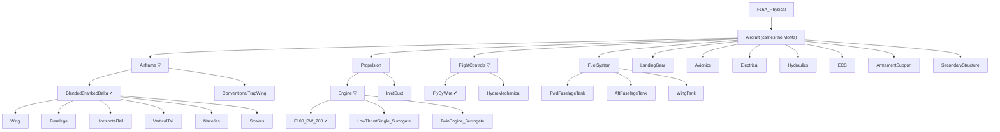

# P Layer — Physical

> Model: `physical/F16A_Physical.slx` · Profile: `F16A_PhysicalProps.xml` · Allocation:
> `F16A_LogicalToPhysical.mldatx` · Generator: `generate_f16a_physical.m`
> · **Trade studies**: `F16A{Engine,Airframe,FlightControls}TradeStudy.m`, run together by
> `F16APhysicalTradeStudy.m`
> · Vocabularies: `F16ASourceKind.m`, `F16ADataProvenance.m`
> · **Roll-ups**: `F16APhysical{Mass,Materials,Fuel}Rollup.m`, run together by
> `F16APhysicalRollups.m`
> · Tests: `tests_for_ai_coding/F16APhysicalArchitectureTest.m`, `verification/`

The Logical layer said **how** — in solution roles — and laid out competing **kinds** without picking
one. The Physical layer gives **concrete parts**, and teaches four ideas the earlier layers could not:

1. **Roll-up analysis.** Parts carry properties; analyses gather them up the tree into emergent
   totals — Operating Empty Weight, airframe composite fraction, available fuel. This is the
   canonical MBSE "the model computes an emergent property from its parts" move. The mass roll-up
   runs over a **System Composer analysis instance** (`instantiate`), which is what makes it measure
   the *selected* configuration rather than every candidate at once.
2. **Measures of Merit.** Empty weight and unit cost are **objectives to minimize**, not pass/fail
   thresholds — and they come from two different kinds of source.
3. **Verified by.** For requirements that are genuine constraints, a test checks the roll-up and a
   **Verify link** ties the requirement to that test.
4. **The decision is made here.** P is where technology enters, and therefore the only layer that
   can decide between the kinds L enumerated.

## The two-tier split: L presents, P decides

| | Logical option (**kind**) | Physical candidate |
|---|---|---|
| Answers | *What shape of solution?* | *Built out of what, exactly?* |
| Carries | a name, `SolutionOption { Selected, DecisionRef }` | one of three stereotypes — `EngineCandidate`, `AirframeCandidate`, `FlightControlCandidate` — each `{ RealizesKind, Mass_lb, TRL, DataProvenance, Selected }` plus **its own criterion** (D-056), + the `Rationale` every part carries |
| Owns the decision? | **No** — it holds the *active* kind, written back from P | **Yes** — the trade runs here |

A logical role has no mass; only a *part* has a mass, and a part exists only at P. Scoring the kinds
at L would mean inventing a mass, cost, TRL and benefit for configurations nobody built — so L ships
unresolved and P resolves it. See [`06_methodology.md`](06_methodology.md) for the ARCADIA / OOSEM /
set-based-design grounding and an honest account of what the scoring assumes (D-001, D-015).

## The physical decomposition

**Thirty components.** A single **`Aircraft`** is the system-of-interest (it carries the MoMs) and
holds **11 assemblies**. Three of them — `Airframe`, `Propulsion/Engine`, `FlightControls` — are
**variant roles**: a role with more than one credible candidate is not a part, it is an open
question, and it is modelled as one.



`▽` marks a variant role; `✔` the candidate the trade selected. The fuel tanks carry **zero**
empty-weight mass — dry tankage is integral to the wet structure and internal fuel is a
**consumable** — a deliberate "not every part adds to OEW" lesson. They carry a capacity instead.

### The candidate level, and why the detail is asymmetric

| Variant role | Candidates | Realizes kind |
|--------------|-----------|---------------|
| `Airframe` | **`BlendedCrankedDelta`** ✔ · `ConventionalTrapWing` | `BlendedCrankedDelta` · `ConventionalTrapWing` |
| `Propulsion/Engine` | **`F100_PW_200`** ✔ · `LowThrustSingle_Surrogate` · `TwinEngine_Surrogate` | `SingleEngine` · `SingleEngine` · `TwinEngine` |
| `FlightControls` | **`FlyByWire`** ✔ · `HydroMechanical` | `FlyByWire` · `HydroMechanical` |

The propulsion column is **many-to-one**: two engines realize the same kind, which is why the
callback into L resolves the winning kind from `RealizesKind` and never from the candidate's name
(D-027).

Only the winner-shaped airframe candidate is **decomposed**; the losers are lumped blocks (D-003).
Detailing `ConventionalTrapWing` to match would mean inventing six part masses and six composite
fractions for an aircraft never built. **You only decompose what you selected.**

The `InletDuct` stays a plain part *beside* the `Engine` variant: every candidate needs one, and
pricing an inlet delta into the twin-engine surrogate would invent a number we cannot defend
(D-009). A real twin installation would change the inlet; that simplification is stated here rather
than hidden inside a mass.

**Two path spaces coexist, and you must use the right one.** Architecture paths gained a level
(`…/Airframe/BlendedCrankedDelta/Wing`) and are what the generators, the tests and `lookup` use.
Instance paths did not — the analysis instance *flattens* the variant, and `…/Aircraft/Airframe`
still names the node carrying the active candidate's rolled-up mass. The mass roll-up sidesteps the
distinction entirely by reading its subtotals off the instance **by child name** rather than by path
(D-058), but anything using `lookup` still has to get it right.

## Mass roll-up → Operating Empty Weight

Every part carries `PhysicalItem.Mass_lb` and, since D-052, a `DataProvenance` describing **that
mass**. The leaf masses on the **active** path are the Brandt F-16A ground-truth component weights
(lbf, design point `W_TO = 31,377 lb`), and `F16APhysicalArchitectureTest` now checks them by
**executing** `sizing/VnV/BrandtF16A/BrandtWeight.m` rather than holding a second copy — so the
figures below are a reader's convenience, not the thing the test compares against:

| Assembly | Part | Mass (lb) | | Assembly (leaf) | Mass (lb) |
|----------|------|----------:|-|-----------------|----------:|
| Airframe / BlendedCrankedDelta | Wing | 1785.95 | | LandingGear | 1066.82 |
| Airframe / BlendedCrankedDelta | Fuselage | 3652.11 | | FuelSystem | 0.00 |
| Airframe / BlendedCrankedDelta | HorizontalTail | 648.00 | | FlightControls / FlyByWire | 472.44 |
| Airframe / BlendedCrankedDelta | VerticalTail | 360.00 | | Avionics | 2541.54 |
| Airframe / BlendedCrankedDelta | Nacelles | 186.82 | | Electrical | 533.41 |
| Airframe / BlendedCrankedDelta | Strakes | 90.00 | | Hydraulics | 367.11 |
| Propulsion / Engine | F100_PW_200 | 4730.23 | | ECS | 360.84 |
| Propulsion | InletDuct | 728.60 | | ArmamentSupport | 440.00 |
| | | | | SecondaryStructure | 2016.86 |

`F16APhysicalMassRollup.m` builds a System Composer analysis **instance** (`instantiate`) and walks it
with one recursion that prints the tree as it adds it up — children before parents, a subtotal at
every assembly, the grand total at the aircraft. Subtotals: Airframe **6,722.88** · Propulsion
**5,458.83** · **OEW 19,980.73 lb**. Run it and you get the whole arithmetic, twenty-odd lines of it,
in a form you can check by hand:

```
      Propulsion
        Engine ...................   4730.23 lb
        InletDuct ................    728.60 lb
      = Propulsion ...............   5458.83 lb   (sum of the 2 above)
```

It used to hand that recursion to `iterate` as a native analysis function, the pattern shipped in
[`ex2`](../../ex2), with a second architecture-side recursion behind it as a fallback. Both are gone
(D-058): three ways to add up the same numbers is not a lesson, and the `instantiate`/`iterate` pair
was summing the tree once per node, twice over. What is kept is the part that carries the teaching —
the instance itself.

**It is an active-configuration roll-up, and it did not have to become one.** The analysis instance
contains only the active choice, so the sum counts the selected candidate and nothing else. Had it
gone the other way, the four losing candidates would have added their masses and OEW would describe
no aeroplane at all — `testOEWCountsOnlyTheActiveConfiguration` computes both sums from the model and
asserts they differ. Architecture-side walks *do* need the `getActiveChoice` filter and have it
(D-012). Rather than leave that in a comment, step 2 of the roll-up prints it:

```
    Airframe ......... kept BlendedCrankedDelta    dropped ConventionalTrapWing
    FlightControls ... kept FlyByWire              dropped HydroMechanical
    Engine ........... kept F100_PW_200            dropped LowThrustSingle_Surrogate, TwinEngine_Surrogate
  -> 4 rejected candidates carry a mass and are NOT in the sum below.
```

Turning three components into variant roles therefore did not change what the aircraft weighs. A
trade that selects the production configuration cannot change what the production aeroplane weighs —
that agreement is the point of a validated example, not a coincidence.

One convention, so it is not misread: **airframe-less-engine = OEW − Engine ≈ 15,250.5 lb** is the
standard "airframe unit weight", **not** the sum of the six structural parts (6,722.88).

## The three trade studies — where the decision is made

The generator runs them as **section 7b**, between the realization allocation and the roll-ups.

**One trade, one file, one stereotype** (D-056). `F16AEngineTradeStudy.m`,
`F16AAirframeTradeStudy.m` and `F16AFlightControlsTradeStudy.m` each read top to bottom as six
printed steps — open the models, read the candidates, score them, pick the winner, tell the model,
save — and each prints every number it reads and every number it computes, so the ranked table can be
recomputed by hand from the output. `F16APhysicalTradeStudy.m` is a fifteen-line runner that calls all
three. Nothing is shared between them: a reader following the engine trade never has to open another
file to find out what a step does.

**A trade asks for the numbers its own decision turns on.** That is the reason there are three
stereotypes rather than one. An engine is asked for thrust; a wing is not asked for thrust and then
tagged `NaN`. Each stereotype declares exactly the six properties its trade uses, and
`testCandidateStereotypesDeclared` pins the set **both ways** — everything it must declare, and
nothing beyond it — so re-adding a shared "Benefit" column to `EngineCandidate` turns the suite red.

**No candidate can be silently dropped from its own trade.** Each script reads *every* choice of its
one variant through `getChoices` and **errors if any choice does not carry the stereotype**. Add a
fourth engine to the generator and it is scored on the next run; forget to parameterize it and the
run stops and names it. That guarantee is what the old model-wide discovery walk existed for, kept
without the walk.

### What each one scores

Every criterion carries a **declared value function** mapping a raw number to a value *without
reference to the other candidates* (D-015). The weights are declared directly and sum to 1; each
script checks that they do before it scores anything.

| Trade | Criterion | Value function | Weight |
|---|---|---|---:|
| **Engine** | `Thrust_SL_lb` | `v = T / T_baseline` | 0.30 |
| | `Mass_lb` | `v = M_baseline / M` | 0.35 |
| | `TRL` | `v = (TRL − 1) / 8` (scale 1–9) | 0.35 |
| **Airframe** | `AeroBenefit` | `v = B / 10` (scale 1–10; 0 means "not set") | 0.50 |
| | `Mass_lb` | `v = M_baseline / M` | 0.25 |
| | `TRL` | `v = (TRL − 1) / 8` | 0.25 |
| **Flight controls** | `HandlingBenefit` | `v = B / 10` (scale 1–10) | 0.50 |
| | `Mass_lb` | `v = M_baseline / M` | 0.25 |
| | `TRL` | `v = (TRL − 1) / 8` | 0.25 |

A ratio criterion's baseline is the value carried by the role's `DataProvenance = Reference`
candidate — derived from the data, never hard-coded — so **the Brandt candidate scores exactly 1.0 on
mass in every trade, by construction**, and `v > 1` reads "better than the as-built F-16A".

`AeroBenefit` and `HandlingBenefit` are the same 1–10 judgement scale asking **different questions**:
vortex lift and transonic area ruling in one, relaxed-stability handling and control authority in the
other. One shared `Benefit` column pretended a wing and a flight control system were good in the same
way. They are not, and the model no longer says they are.

**No candidate carries a cost.** It was `NaN` on all seven permanently (D-043), so a column that
could never be scored is not a criterion, and D-056 stopped declaring it. `F16APhysicalCostModel`
computes a *whole-aircraft* figure for the `Aircraft`'s Measure of Merit; that is where cost lives.

### The results

**Engine** — *which engine should the F-16A fly with?* → `REQ_F16A_L01`

| Candidate | Kind | `Thrust_SL_lb` | Mass (lb) | TRL† | v(T) | v(M) | v(TRL) | Score | |
|---|---|---:|---:|---:|---:|---:|---:|---:|:--:|
| **F100_PW_200** | SingleEngine | 23,770 | 4730.23 | 8 | 1.00000 | 1.00000 | 0.87500 | **0.95625** | ✔ |
| TwinEngine_Surrogate | TwinEngine | 32,000 | 6400 | 6 | 1.34623 | 0.73910 | 0.62500 | 0.88130 | |
| LowThrustSingle_Surrogate | SingleEngine | 18,500 | 5100 | 4 | 0.77829 | 0.92750 | 0.37500 | 0.68936 | |

**Airframe** — *what shape of airframe?* → `REQ_F16A_L03`

| Candidate | Kind | `AeroBenefit`† | Mass (lb) | TRL† | v(B) | v(M) | v(TRL) | Score | |
|---|---|---:|---:|---:|---:|---:|---:|---:|:--:|
| **BlendedCrankedDelta** | BlendedCrankedDelta | 9.5 | 6722.88 | 7 | 0.95000 | 1.00000 | 0.75000 | **0.91250** | ✔ |
| ConventionalTrapWing | ConventionalTrapWing | 6.5 | 7300 | 8 | 0.65000 | 0.92094 | 0.87500 | 0.77399 | |

**Flight controls** — *wires or rods?* → `REQ_F16A_L02`

| Candidate | Kind | `HandlingBenefit`† | Mass (lb) | TRL† | v(B) | v(M) | v(TRL) | Score | |
|---|---|---:|---:|---:|---:|---:|---:|---:|:--:|
| **FlyByWire** | FlyByWire | 9.0 | 472.44 | 6 | 0.90000 | 1.00000 | 0.62500 | **0.85625** | ✔ |
| HydroMechanical | HydroMechanical | 6.0 | 700 | 9 | 0.60000 | 0.67491 | 1.00000 | 0.71873 | |

† **The benefit columns and `TRL` are engineering judgement on a declared scale, not measurements** —
on the `Reference` candidates too. They are inventoried as invented values in **D-030**.

**Only one of these engines is real** (D-053). `F100_PW_200` is the engine the F-16A flew with, and
its mass and thrust come from the Brandt reference in `/sizing/`. `LowThrustSingle_Surrogate` and
`TwinEngine_Surrogate` are **declared hypotheticals**: their numbers are invented teaching values,
chosen so the real engine wins, and their names say so rather than borrowing a real designation to
front invented data.

**The teaching point is the engine.** `F100_PW_200` wins while `TwinEngine_Surrogate`
**out-thrusts it by 35%** — the twin actually scores *higher* on the criterion carrying the trade's
headline number, and still loses. Its margin of +0.07495 decomposes to `Thrust_SL_lb` −0.10387,
`Mass_lb` +0.09132, `TRL` +0.08750: maturity and installed mass together outweigh a large thrust
advantage. Measured against that runner-up, `Mass_lb` is the decisive criterion (D-034). The airframe
and flight-control trades are both decided by their benefit instead — three trades, two different
stories, and a weighted trade that is visibly not a contest of the biggest number.

"Decided by" is **rival-relative**, and both the printed output and the stored justification say so:
the same F100 that beats the low-thrust surrogate on TRL beats `TwinEngine_Surrogate` on `Mass_lb`. Same victory,
different deciding criterion depending on the rival. A rival-independent answer — which criterion, if
removed, would change the winner — is a genuine sensitivity calculation, deferred rather than faked.

### Where the decision is written

| # | Layer | What is written |
|---|-------|-----------------|
| 1 | **P**, configuration | `setActiveChoice` on the role variant; the candidate stereotype's `Selected` on the winner |
| 2 | **P**, rationale | `SourceKind` → `TradeWinner` / `TradeAlternative`, and every `Justification` rewritten to state the result that candidate actually got |
| 3 | **L**, cross-layer callback | the role's active **kind**; `SolutionOption.Selected`; `DecisionRef` on **every** kind of the role, so a reader who clicks the *rejected* kind reaches the decision requirement instead of a `'TBD'` (D-027, D-049) |
| 4 | **R**, traceability | an **Implement link** from the winning kind to `REQ_F16A_L01`/`L02`/`L03` |

Rows 1, 2 and 4 are asserted by `F16APhysicalArchitectureTest`; row 3 by the **L** suite, in a test
written so that *both* an undecided and a decided L model pass, forbidding only the half-finished
state between. The L suite must not fail merely because P has not been run (D-010).

**What a `Justification` says.** Winner and loser get different sentences, and neither is a summary:
the result and rank, the **margin** over the runner-up (or the **deficit** against the winner, signed
this-candidate-minus-winner), a breakdown into every kept criterion, and the criterion that decided
it **against that stated rival**. Two properties are load-bearing: the decomposition **closes** — a
reader can add the terms up and get the margin without re-running anything — and the deciding
criterion is never stated as a property of the decision, because it is not one (D-034). The loser's
sentence matters most: it is the **only** place a rejected option's reasoning exists anywhere.

Each candidate's standing "why do I exist" rationale survives behind a `||` separator, so re-running
the trade is idempotent instead of stacking two verdicts on one part.

**Nothing is deleted.** A losing candidate stays in P and a losing kind stays in L, each carrying a
justification saying what it lost on and by how much (D-002). Links are **rebuilt, not
created-if-absent**, so a re-run picking a different winner cannot leave the previous winner still
claiming to implement the decision (D-028).

### The guard rails

An out-of-range parameter must **stop the trade**, not be scored. Each script errors, naming the
candidate, on: a `TRL` outside the integer 1–9 (0 is the deliberate "unset" sentinel); a non-positive
`Mass_lb` (it is a denominator); a benefit outside 1–10, bounded at **both** ends because `B/10`
carries half the score and `65` typed for `6.5` is finite, so no `isfinite` check catches it (D-033);
a non-positive `Thrust_SL_lb` in the engine trade; a variant choice carrying no candidate stereotype;
a variant with fewer than two candidates; a variant without exactly one `Reference` baseline; weights
that do not sum to 1; and a **tie** for first, which is a decision the data cannot make.

It **warns** rather than erroring when a value function exceeds 1.0. Only the unbounded ratio
criteria reach it, and there the honest response is neither to cap (discarding a real advantage) nor
to reject a legitimate candidate, but to say out loud that the declared weights have stopped
describing relative influence (D-035). **Since D-056 that warning actually fires**:
`TwinEngine_Surrogate` scores `v(Thrust_SL_lb) = 1.346`, so every run prints it. D-035's limit went
from a dormant check to something the example demonstrates, and
`testRatioBaselineIsUniqueAndNothingBeatsIt` asserts it stays demonstrated.

**The guards are inline `if`/`error` in each script**, not a shared class. They were a separate class
until D-056, extracted so they could be made to fire without running the study; with three trades
scoring three different criteria there was no longer one contract for one class to hold, and a reader
following the engine trade should not have to open a second file to see what a check does. What the
retired suite proved about the *code* is now covered by the data assertions in
[Verification](#verification).

**The roll-ups run after the trade.** Build order is build → parameters → realization → **trade** →
requirement links → roll-ups, and that ordering is the point of the whole structure. The roll-ups
follow the **active** choice; run them first and they report whichever placeholder the generator
started from. Run them after, and the figures the shipped model carries describe the configuration
the trade selected.

## Every part answers "why do I exist?"

`Rationale { SourceKind, Justification, TraceRef }` is applied to **27 of the 30** components — every
one that can carry a stereotype. The point is that the answer is a **queryable model property** and
not a code comment: you can ask the model for every `ConstraintDriven` part, or for everything the
electrical system exists to serve. `SourceKind` is a real MATLAB enumeration, so the vocabulary is
validated and appears as a dropdown rather than a typo-prone string (D-011):

| `SourceKind` | Means | `TraceRef` names |
|---|---|---|
| `RealizesFunction` | a logical role has to be realized by something concrete | the role |
| `SatisfiesRequirement` | a requirement demands the part directly | the requirement |
| `TradeWinner` | it won the trade study | the decision requirement |
| `TradeAlternative` | it lost, and is kept so the decision stays auditable | the decision requirement |
| `ConstraintDriven` | it comes from a constraint of building an airplane, not a function above it | the requirements setting its geometry |
| `SupportingInfrastructure` | it exists only to serve other parts | **the part it serves** |

`Electrical`, `Hydraulics`, `ECS` and `SecondaryStructure` realize no logical role — the symmetric
echo of L's constraint-driven, function-less roles. Two of their dependencies are **real modelled
port connections**: `Electrical → Avionics` on `ElecPower`, `Hydraulics → FlightControls` on
`HydPower`.

**The three variant role wrappers get no rationale, and must not.** `applyStereotype` errors on a
`VariantComponent` — but the tool restriction happens to be the right answer: a wrapper is not a
part, it is the **question** "which of these?", and a question has no reason to exist independent of
its answers (D-013). `assertRationaleComplete` aborts the build if any of the 27 still carries the
`'TBD'` placeholder, and `testTraceRefsResolve` then **follows** every reference, with a negative
control so the resolver cannot pass by saying yes to everything.

## Provenance — where each number came from

P is the only layer carrying numbers, so it is the layer that must say where each came from.

| Tag | Means |
|-----|-------|
| `Datasheet` | a manufacturer or programme datasheet figure |
| `Reference` | traceable to the Brandt F-16A ground truth in [`sizing/VnV/BrandtF16A/`](../../../../sizing/VnV/BrandtF16A) |
| `Simulation` | the output of an analysis or roll-up in this repo |
| `Estimate` | an **illustrative teaching value** — not F-16 data, must never be cited as such, and must appear in D-030 |

**Read the tag narrowly: it qualifies the `Mass_lb`, and nothing else (D-025).** The benefit columns
and `TRL` are engineering judgement on a declared scale for *every* candidate, including the
`Reference` ones — `DataProvenance = Reference` on `F100_PW_200` says its *mass* is sourced (and, as
it happens, its thrust), not that a judgement about it is. Overclaiming provenance is precisely what
the tag exists to prevent.

Every value-bearing stereotype declares the property: the three candidate stereotypes, `Material`,
`FuelTank`, `PhysicalItem`. Only `Rationale` and `MeasureOfMerit` are exempt with a stated reason — the first
holds prose, the second nothing but computed figures — the rolled-up OEW and the DAPCA IV cost — so
a tag would only repeat what the stereotype already says.

`PhysicalItem` was itself exempt until D-052, on the argument that it held Brandt ground truth and
the invented masses were tagged on the candidate where they are *scored*. That was half true and
the wrong half mattered: 14 of the 16 masses summing to OEW carried no provenance at all, and the six
airframe structural leaves carried `Material.DataProvenance = Estimate` — which describes their
composite fraction — sitting beside a mass that is Brandt data. A reader inspecting `Fuselage` saw a
tag that **contradicted** its mass rather than one that was merely missing. Each property now names
its own source, so two tags on one part stop competing to describe it:

| Part | `PhysicalItem.DataProvenance` (its mass) | the other tag |
|---|---|---|
| `Fuselage` | `Reference` — Brandt | `Material` = `Estimate` (its composite fraction) |
| `WingTank` | `Reference` — a definitional zero | `FuelTank` = `Estimate` (its capacity) |
| `LowThrustSingle_Surrogate` | `Estimate` — invented, in D-030 | `EngineCandidate` = `Estimate` (as scored) |
| `Airframe` | `Simulation` — the default | none; it carries no mass of its own |

The default is `Simulation`, not `Estimate`: `PhysicalItem` is applied to every component, so the
ones left at the default are the interior nodes, which store no mass — their subtotal is computed by
the roll-up on demand. Defaulting to `Estimate` would tag every subtotal an invented teaching value
and drag all of them into D-030.

`testProvenanceDeclaredOnEveryValueBearingStereotype` is written the *other* way round from the
obvious version: it takes every stereotype the profile declares, subtracts a named exemption list,
and requires the remainder to declare `DataProvenance` — so a stereotype added tomorrow is in the
required set the day it appears. Listing "these three need tags" would pass by omission forever,
which is exactly how the `Material` gap survived five stages (D-031).

> **Every invented number in this model is inventoried in [D-030](07_decision_log.md).** Do not cite
> any of those figures as F-16 data.

## Measures of Merit — minimize, don't threshold

A hard weight or cost ceiling is the wrong construct in conceptual design, where you **trade** them
and lower is always better. Both are recorded on a `MeasureOfMerit` stereotype on the `Aircraft`
(`Goal = "Minimize"`), and the layer shows the two ways a MoM is sourced:

| Measure of Merit | Value comes from |
|------------------|------------------|
| Operating Empty Weight (`OEW_lb`) | the **mass roll-up** — a bottom-up sum |
| Unit flyaway cost (`UnitCost_USD`) | a **cost-model function** (`F16APhysicalCostModel`) |

Cost is deliberately **not** a roll-up: unit flyaway cost is not the sum of part prices, it is the
output of a parametric model — hours, production quantity, material factors. Since D-043 it is a
**real DAPCA IV estimate**, and `F16APhysicalCostModel` **calls** `sizing/VnV/BrandtF16A/BrandtCost.m`
rather than restating its arithmetic — the same one-home rule D-036 applied to the Brandt masses. That
contrast is the teaching point: **different MoMs are computed by different analyses**, and the
architecture names where each one lives.

What the MBSE side contributes is *which* empty weight to price. `BrandtCost.run` reads `W_empty_lb`
out of the struct it is handed, so it is passed **this model's rolled-up OEW** — which is what makes
the number a `Simulation` and the comparison below a genuine cross-check rather than Brandt against
itself.

It is tagged **`Simulation`, not `Reference`** — DAPCA IV over *this model's* OEW is an analysis
output of this repo. `BrandtCost`'s own ≈ $68.4M (quoted in `REQ_F16A_026`) is the **cross-check, not
the value**: ours computes **$68.47M**, and the residual difference is almost entirely the 3.12 lb
OEW gap of D-036 propagated through the regression — about **$7.3k**, or 0.01%.

**The candidates keep `NaN` forever.** DAPCA IV prices an *airframe*, not a part, so splitting it
across candidates would mean inventing a number that then gets *scored*. Cost therefore still drops
out of the trade — and the trigger for it re-entering remains *the candidates carrying a cost*, which
this change does not do (D-005, D-026, D-043).

Two consequences worth naming. The generator chain now needs `/sizing/` **at build time** — absent,
`F16APhysicalCostModel` errors and names the dependency rather than inventing a rate. And
`BrandtCost.run` reads the mission for its **O&M terms only**, which for a long time meant a
deliberately implausible placeholder went in and only the flyaway came out.

**Since D-059 the mission is real**, written to `MeasureOfMerit.MissionFuel_lb` and
`MissionTime_min` by section 9c and read back by the cost model — so `OMCostAnnual_USD`,
`OMCostLife_USD` and `LifeCycleCost_USD` joined the aircraft's Measures of Merit (D-061). **The
flyaway did not move**: $68.4705M before and after, exactly as this entry predicted, because
`BrandtCost.m:128-131` are the mission's only consumers. `testFlyawayCostIgnoresTheMission` still
runs the reference twice with wildly different mission inputs and requires the same flyaway — it is
what made replacing the placeholder safe.

`UnitCost_USD` **defaults to `NaN`**, not `0`. A default that silently produces a *plausible* number
is worse than one that stops the run: under a ratio value function `$0` is not neutral, it is
unbeatable (D-021, D-032).

## Constraints verified by roll-up

For genuine constraints with a real limit, a **test** computes a roll-up and checks the requirement,
and a **Verify link** ties the requirement to that test. Verify links are added **manually** — the
generator makes Implement links only.

### Materials — composite fraction ≤ 20% (REQ_F16A_022)

`F16APhysicalMaterialsRollup.m` computes the **mass-weighted** composite fraction of the **active**
airframe candidate — a roll-up, but a weighted average rather than a plain sum. It asks the model
which candidate is active rather than assuming, and the leaf rule is structural (*every leaf under
the active candidate carrying a `Material` stereotype*), so the constraint stays answerable whichever
way the trade goes.

> **Read this as a demonstration, not as data.** Every fraction below is an **invented number**
> (`Estimate`, inventoried in D-030). They are an educated guess loosely grounded in real F-16
> composite usage — graphite/epoxy tail skins, a carbon-fibre wing leading edge, fibreglass strakes,
> aluminium fuselage and nacelles — **and then chosen so the mass-weighted total lands inside the 20%
> cap.** Numbers picked to make a requirement pass must not look sourced.

| Airframe part | Mass (lb) | Composite frac. (`Estimate`) |
|---------------|----------:|----------------:|
| Wing | 1785.95 | 0.15 |
| Fuselage | 3652.11 | 0.10 |
| HorizontalTail | 648.00 | 0.55 |
| VerticalTail | 360.00 | 0.70 |
| Nacelles | 186.82 | 0.05 |
| Strakes | 90.00 | 0.50 |
| **Airframe (mass-weighted)** | **6722.88** | **0.1928** |

`ConventionalTrapWing` carries a single whole-block fraction of 0.12, also an `Estimate` — without
it, switching the active choice would silently drop the fraction to zero and `REQ_F16A_022` would be
"met" by an aircraft with no material data at all.

The requirement is Implement-linked from the `Airframe` **variant role**, not from a candidate: the
cap binds the airframe whichever candidate wins. The test **passes at 0.1928**, which demonstrates
that the roll-up and the constraint check work. It is *not* evidence that the F-16A meets a composite
cap.

### Fuel — enough tankage for the mission (REQ_F16A_P01)

Three internal tanks at 2100 lb usable each, 6300 lb total; `F16APhysicalFuelRollup.m` sums them to
the **available** fuel, and the **required** side comes from `F16APhysicalMissionFuel.m`.

> **The 6300 lb is an `Estimate` (D-023).** Brandt's mission fuel is 6296.30 lb (`Wt!B6`); 3 × 2100
> is an even split of a rounded number, and the real F-16A tankage is not three equal tanks.

**The test passes, with about 340 lb of margin**: 6300 lb of tankage against the 5959.80 lb the
`/sizing/` mission analysis burns (D-060). `F16APhysicalMissionFuel` reads
`MeasureOfMerit.MissionFuel_lb` off the model rather than re-running the analysis, which keeps it
symmetric with the available side — both ask the model.

**This verification used to be intentionally red**, and permanently: the mission-fuel hook returned
`NaN`, so `available ≥ NaN` was false and `REQ_F16A_P01` was *unevaluated* — verification set up,
traceable and not yet satisfied, the state a real programme lives in for most of its life. D-042
argued that state was worth shipping; D-059 gave the model a real mission and D-060 judged that a
function returning `NaN` beside an analysis reporting 5959.80 lb had become a contradiction rather
than a lesson. **The example is one teaching state poorer for it**, and the decision log says so.

The remaining red, `REQ_F16A_025`, is **evaluated and violated** (D-051) — see
[`README.md`](README.md#three-requirements-two-verification-states).

## Realization — the L→P relationship

L introduced **allocation** (function → role); P adds **realization** (role → part). All 9 roles are
realized, in **14 edges**: `Airframe` → 2 candidates · `PropulsionSystem` → 3 engine candidates +
`InletDuct` · `FlightControlSystem` → 2 candidates · and six roles one each (`FuelSystem`,
`LandingGear`, `AvionicsSuite`→`Avionics`, `CommunicationSystem`→`Avionics`,
`WeaponSystem`→`ArmamentSupport`, `MissionSystemsBay`→`ArmamentSupport`).

**A role is realized by its candidates, not by the variant wrapper.** Allocating to the wrapper would
say "something in here realizes the role" and hide the options L went to the trouble of enumerating.

**The 1→many teaching moment moved** from `Airframe` decomposing into six structural parts to
`PropulsionSystem` fanning out to four targets — and those four are two different kinds of "many" in
one edge set: three **mutually exclusive** engine candidates plus the `InletDuct` all three need.
Realization cannot tell them apart; an edge says only "this part helps realize that role". **The
variant structure is what carries the exclusivity.** Allocation and variation are different
relations, and this is where a student can see it.

`Electrical`, `Hydraulics`, `ECS` and `SecondaryStructure` are **not** realization targets — the
exact mirror of L's constraint-driven roles that received no function. Some parts are born of the
physics of building an airplane, not of a role above them.

## Requirements the Physical layer owns

| Requirement | Kind | How P handles it |
|-------------|------|------------------|
| `REQ_F16A_026` — unit flyaway cost | Measure of Merit | Reclassified from a "≤ $68.4M" threshold to *minimize*; Implement-linked from `Aircraft`; value **$68.47M** from the DAPCA IV cost model (D-043) |
| `REQ_F16A_022` — composite ≤ 20% | Constraint | Implement-linked from the `Airframe` variant role; **verified by** the materials roll-up |
| `REQ_F16A_P01` — fuel sufficiency | Constraint | Implement-linked from `FuelSystem`; **verified by** the fuel roll-up — *pending, by design* |
| `REQ_F16A_L01`–`L03` — the three decisions | Decision posed at R, answered here | **Implement-linked from the winning logical _kinds_** — what implements "which kind shall realize this role?" is the selected option, not a part (D-010) |

## Verification

Two kinds of test, in separate places — and the split is itself the teaching material:

| Suite | Asks | Touches artifacts? |
|---|---|---|
| `tests_for_ai_coding/F16APhysicalArchitectureTest` | *is the model built correctly?* | yes — 2 models, 3 requirement sets, an allocation set |
| `verification/*VerificationTest` | *does the design meet this requirement?* | yes — via the roll-ups |

The machinery suite covers structure, stereotypes, the 16 active-leaf masses against Brandt, roll-up
self-consistency, the MoMs, realization, `Rationale` with every `TraceRef` resolved for real, the
candidates' parameter contract, the four places the decision is recorded, and provenance
completeness. Its own help block lists what it deliberately does **not** assert; the short version is
that it never runs the trade studies (a test that mutated the artifacts it checks would pass even on
a model the decision was never written into), never asserts a weight or cost target, and never pins
an `Estimate` or a score.

**Three assertions carry what the retired guards suite used to.** They read the *criteria clause each
trade writes into every rationale*, so they check the studies that actually ran rather than a table
in the test file:

- `testEachTradeScoresOnlyItsOwnCriteria` — every trade scores its own criterion and none of the
  other two's. Thrust creeping into the airframe trade, or a benefit back into the engine trade,
  fails here.
- `testCandidateStereotypesDeclared` — each stereotype declares exactly its own property set, both
  directions, so the split cannot erode by addition.
- `testRatioBaselineIsUniqueAndNothingBeatsIt` — one `Reference` baseline per trade, no mass above
  the ceiling, and D-035's thrust breach still present.

**The division of labour is still the thing to take away**, it just moved. The suite catches the
**data** defect — somebody types `65` for `6.5` — by asserting the shipped parameters lie on their
declared scales, with the *rejected* values written out literally so widening a scale to admit one
turns the suite red instead of quietly redefining what it checks. The **code** defect — somebody
deletes a bound — is now caught by the trade scripts themselves refusing to run, which is the trade
D-056 made: a guard a reader can see beats a guard a reader has to go and find.

## Next

The RFLP loop is closed **and resolved**: R → F → L → P, traceably connected, with the first
requirements *verified by* tests and the three open logical questions each answered by its own trade
study, whose arithmetic, inputs and audit trail are all in the model.

Since D-059 the loop also **runs an analysis**: the mission activity's actions carry the `/sizing/`
mission analysis as their behaviour, its fuel burn lands on the aircraft as a Measure of Merit, and
the cost model prices the sortie from it. The model records how its numbers are computed, not just
what they came out as.

Open work is in [`../TODO.md`](../TODO.md).

For *why* the trade lives here rather than at L, see [`06_methodology.md`](06_methodology.md).
