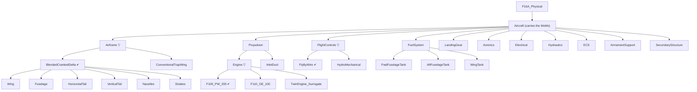

# P Layer — Physical

> Artifact: `physical/F16A_Physical.slx` · Dictionary: `physical/F16A_Physical.sldd`
> · Profile: `physical/F16A_PhysicalProps.xml` · Allocation: `physical/F16A_LogicalToPhysical.mldatx`
> · Generator: `physical/generate_f16a_physical.m`
> · **Trade study**: `physical/F16APhysicalTradeStudy.m` · Guards: `physical/F16APhysicalTradeGuards.m`
> · Vocabularies: `physical/F16ASourceKind.m`, `physical/F16ADataProvenance.m`
> · Roll-ups: `physical/F16APhysicalMassRollup.m`, `physical/F16APhysicalMaterialsRollup.m`, `physical/F16APhysicalFuelRollup.m`
> · Cost hook: `physical/F16APhysicalCostModel.m` · Mission-fuel hook: `physical/F16APhysicalMissionFuel.m`
> · Machinery test: `physical/F16APhysicalArchitectureTest.m` · Guards test: `physical/F16APhysicalTradeGuardsTest.m`
> · Verification tests: `verification/F16AMaterialsVerificationTest.m` (REQ_F16A_022), `verification/F16AFuelVerificationTest.m` (REQ_F16A_P01)

The Logical layer said **how** — in solution roles — and laid out competing **kinds** without picking
one. The Physical layer gives **concrete parts**: a real decomposition into a wing, a fuselage, an
engine. It teaches four ideas the earlier layers could not:

1. **Roll-up analysis.** Each part carries properties (mass, composite fraction, fuel capacity);
   analyses sum them up the tree to emergent totals — the **Operating Empty Weight**, the
   **airframe composite fraction**, the **available fuel**. The mass roll-up is a **native System
   Composer parametric analysis** (`instantiate`/`iterate`); the canonical MBSE "the model computes
   an emergent property from its parts" move.
2. **Measures of Merit.** Empty weight and unit cost are **objectives to _minimize_**, not
   pass/fail thresholds. They are recorded as **MoMs** on the aircraft, with two different value
   sources: OEW from the roll-up, unit cost from a **cost-model function**.
3. **Verified by.** For the requirements that *are* genuine constraints (composite fraction,
   fuel volume), a **test checks the roll-up satisfies the requirement**, and a **Verify link**
   ties the requirement to that test — the project's first "verified by" relationships.
4. **The decision is made here.** P is where **technology enters** and therefore the only layer that
   can decide between the kinds L enumerated. Seven parameterized **candidates** sit in the model,
   a trade study scores them, and the result is written back into L and into the requirements.

## The two-tier split: L presents, P decides

This is the load-bearing structural idea of the example, and it is worth stating before the parts.

| | Logical option (**kind**) | Physical candidate |
|---|---|---|
| Answers | *What shape of solution?* | *Built out of what, exactly?* |
| Carries | a name, `SolutionOption { Selected, DecisionRef }` | `TradeCandidate { RealizesRole, RealizesKind, Mass_lb, Benefit, TRL, UnitCost_USD, DataProvenance, Selected }` + the `Rationale` every part carries |
| Owns the decision? | **No** — it holds the *active* kind, written back from P | **Yes** — the trade runs here |

A logical role has no mass; only a *part* has a mass, and a part exists only at P. Scoring the kinds
at L would mean inventing a mass, a cost, a TRL and a benefit for configurations nobody built — so L
ships unresolved and P resolves it. See [`04_logical.md`](04_logical.md) for what L hands over, and
[`06_methodology.md`](06_methodology.md) for the ARCADIA / OOSEM / set-based-design grounding and for
an honest account of what the scoring assumes (D-001, D-015).

## The physical decomposition

**Thirty components.** A single **`Aircraft`** component is the system-of-interest (it carries the
OEW/cost MoMs); it holds **11 assemblies**. Three of those assemblies — `Airframe`,
`Propulsion/Engine` and `FlightControls` — are **variant roles**: a role with more than one credible
candidate is not a part, it is an open question, and it is modelled as one.

`▽` marks a **variant role**; `✔` marks the candidate the trade study selected. The count:
1 `Aircraft` + 11 assemblies + 7 candidates + 8 parts (the 6 structural parts under the decomposed
airframe candidate, the `InletDuct`, and the `Engine` variant wrapper) + 3 tanks = **30**. A variant
wrapper counts as a component in the model tree even though it can carry no stereotype.

The other eight assemblies are leaves. The fuel tanks carry **zero** empty-weight mass — their dry
tankage is integral to the wet wing/fuselage and internal fuel is a **consumable**, not empty weight
— a deliberate "not every part adds to OEW" lesson. They carry a fuel **capacity** instead.

### The candidate level, and why the detail is asymmetric

| Variant role | Candidates | Realizes kind |
|--------------|-----------|---------------|
| `Airframe` | **`BlendedCrankedDelta`** ✔ · `ConventionalTrapWing` | `BlendedCrankedDelta` · `ConventionalTrapWing` |
| `Propulsion/Engine` | **`F100_PW_200`** ✔ · `F110_GE_100` · `TwinEngine_Surrogate` | `SingleEngine` · `SingleEngine` · `TwinEngine` |
| `FlightControls` | **`FlyByWire`** ✔ · `HydroMechanical` | `FlyByWire` · `HydroMechanical` |

Note the propulsion column: the candidate → kind mapping is **many-to-one**. Two different engines
realize the same logical kind, which is why the callback into L resolves the winning kind from
`RealizesKind` and never from the candidate's name (D-027).

Only the winner-shaped airframe candidate is **decomposed**; the losers are single lumped blocks
(**D-003**). That is not laziness — detailing `ConventionalTrapWing` to match would mean inventing
six part masses and six composite fractions for an aircraft that was never built. **You only
decompose what you selected**, and the asymmetry says so out loud.

The `InletDuct` stays a plain part *beside* the `Engine` variant rather than inside each candidate:
every engine candidate needs one, and pricing an inlet delta into the twin-engine surrogate would
invent a number we cannot defend (**D-009**). A real twin installation would change the inlet; that
simplification is stated here rather than hidden inside a mass.

Two consequences of the variant level worth knowing before you read any path in this repo:

- **Architecture paths gained a level.** `…/Aircraft/Airframe/BlendedCrankedDelta/Wing`, not
  `…/Aircraft/Airframe/Wing`. Generators, tests and `lookup` all use this space.
- **Instance paths did not.** The analysis instance *flattens* the variant, so the roll-ups still
  read `…/Aircraft/Airframe` and needed no change (Stage-0 findings 3 and 8 in
  [`08_agent_team.md`](08_agent_team.md)). Two path spaces coexist; use the right one.

## Mass roll-up → Operating Empty Weight

Every part gets a `PhysicalItem` stereotype with a `Mass_lb` property. The leaf masses on the
**active** path are the Brandt F-16A ground-truth component weights (lbf, design point
`W_TO = 31,377 lb`) — the same parts, with the same masses, as before the candidates arrived; they
simply moved one level down, under the candidate that owns them:

| Assembly | Part | Mass (lb) | | Assembly (leaf) | Mass (lb) |
|----------|------|----------:|-|-----------------|----------:|
| Airframe / BlendedCrankedDelta | Wing | 1785.95 | | LandingGear | 1066.82 |
| Airframe / BlendedCrankedDelta | Fuselage | 3652.11 | | FuelSystem | 0.00* |
| Airframe / BlendedCrankedDelta | HorizontalTail | 648.00 | | FlightControls / FlyByWire | 472.44 |
| Airframe / BlendedCrankedDelta | VerticalTail | 360.00 | | Avionics | 2541.54 |
| Airframe / BlendedCrankedDelta | Nacelles | 186.82 | | Electrical | 533.41 |
| Airframe / BlendedCrankedDelta | Strakes | 90.00 | | Hydraulics | 367.11 |
| Propulsion / Engine | F100_PW_200 | 4730.23 | | ECS | 360.84 |
| Propulsion | InletDuct | 728.60 | | ArmamentSupport | 440.00 |
| | | | | SecondaryStructure | 2016.86 |

`F16APhysicalMassRollup.m` runs the roll-up the way MathWorks intends — a native architecture
**instance** iterated bottom-up (`instantiate` → `iterate` with `Direction="Postorder"`), the
same pattern shipped in [`../ex2`](../ex2). Each assembly's subtotal is written back so the
Analysis Viewer shows the roll-up at every level:

| Roll-up result | Value (lb) |
|----------------|-----------:|
| Airframe subtotal | 6,722.88 |
| Propulsion subtotal | 5,458.83 |
| **Operating Empty Weight (OEW)** | **19,980.73** |

**It is an active-configuration roll-up, and it did not have to become one.** The analysis instance
contains only the active choice, so the native postorder sum automatically counts the selected
candidate and nothing else. Had it gone the other way, the four losing candidates would have added
their masses and OEW would have read a number describing no aeroplane at all;
`testOEWCountsOnlyTheActiveConfiguration` computes both sums from the model and asserts they differ,
so that failure cannot pass unnoticed. Architecture-side walks (the roll-up's fallback path, the
materials roll-up) *do* need the `getActiveChoice` filter and have it (**D-012**).

Turning three components into variant roles therefore did **not** change what the aircraft weighs:
OEW is still 19,980.73 lb. A trade that selects the production configuration cannot change what the
production aeroplane weighs — that agreement is the point of a validated example, not a coincidence.

One convention worth stating so it is not misread: **airframe-less-engine = OEW − Engine ≈
15,250.5 lb**. That is the standard "airframe unit weight" (the whole aircraft minus the
bought-out engine), **not** the sum of the six structural parts (which is 6,722.88).

## The trade study — where the decision is made

`physical/F16APhysicalTradeStudy.m` is the file the layer split exists for. The generator runs it as
its **section 7b**, between building the realization allocation and running the roll-ups.

### It discovers its candidates; it does not know them

There is no list of candidate names in the trade study. It walks the P model, collects **every**
component carrying the `TradeCandidate` stereotype, and groups them by that stereotype's
`RealizesRole`. Add a fourth engine to the generator and it enters the propulsion trade on the next
run with no edit to the scoring file — which is the only way a trade study can be trusted not to
have quietly dropped an option. The one thing declared rather than discovered is
**role → decision requirement**: a new role genuinely needs a new requirement to record its decision
in, and inventing that silently would be worse than stopping.

### What it scores

Each criterion carries a **declared value function** that maps a raw number to a value *without
reference to the other candidates* (**D-015**):

| Criterion | Value function | Declared weight | Applied weight |
|-----------|----------------|----------------:|---------------:|
| `Benefit` | `v = B / 10` (scale 1–10; 0 means "not set") | 0.40 | **0.50** |
| `TRL` | `v = (TRL − 1) / 8` (scale 1–9) | 0.20 | **0.25** |
| `Mass_lb` | `v = M_baseline / M` | 0.20 | **0.25** |
| `UnitCost_USD` | `v = C_baseline / C` | 0.20 | **dropped** |

The baseline of a ratio criterion is the value carried by the role's `DataProvenance = Reference`
candidate — derived from the data, never hard-coded — so **the Brandt candidate scores exactly 1.0
on mass in every role, by construction**, and `v > 1` would read "lighter than the as-built F-16A".

**Cost falls out of a general rule, not a special case.** Nothing in the code says "exclude cost".
The rule is: *a criterion no candidate of the role carries a value for is dropped, and the remaining
weights are renormalized over the criteria that do* (**D-026**). `UnitCost_USD` is `NaN` everywhere
because `F16APhysicalCostModel` is a stub, so it drops out and the run prints `UnitCost_USD DROPPED`.
The applied weights above are therefore **derived at run time**, not typed in — and the day a cost
model lands, cost re-enters the score with no change to the scoring code.

Why min–max normalization was retired, and what the additive weighted sum does and does not
justify, is [`06_methodology.md`](06_methodology.md)'s subject; read it before quoting a score.

### The results

| Role | Candidate | Kind | Benefit† | TRL† | Mass (lb) | Provenance (mass) | Score | |
|------|-----------|------|--------:|-----:|----------:|---|--------:|:--:|
| PropulsionSystem | **F100_PW_200** | SingleEngine | 8.2 | 8 | 4730.23 | Reference | **0.87875** | ✔ |
| | F110_GE_100 | SingleEngine | 8.6 | 4 | 5100 | Estimate | ≈0.756 | |
| | TwinEngine_Surrogate | TwinEngine | 7.8 | 6 | 6400 | Estimate | ≈0.731 | |
| Airframe | **BlendedCrankedDelta** | BlendedCrankedDelta | 9.5 | 7 | 6722.88 | Reference | **0.91250** | ✔ |
| | ConventionalTrapWing | ConventionalTrapWing | 6.5 | 8 | 7300 | Estimate | ≈0.774 | |
| FlightControlSystem | **FlyByWire** | FlyByWire | 9.0 | 6 | 472.44 | Reference | **0.85625** | ✔ |
| | HydroMechanical | HydroMechanical | 6.0 | 9 | 700 | Estimate | ≈0.719 | |

† **`Benefit` and `TRL` are engineering judgement on a declared scale, not measurements** — on the
`Reference` candidates too. They are inventoried as invented values in **D-030**, and between them
they supply **0.75 of every score**. The winners' scores are quoted to five decimals because that is
what the trade study prints; the losing scores are D-015's figures.

**The teaching point is the engine.** `F100_PW_200` wins **despite trailing `F110_GE_100` on
Benefit** (8.2 against 8.6). Its margin comes from maturity: measured against that runner-up, `TRL`
is the decisive criterion, worth **+0.125** of the margin (**D-034**). The airframe and
flight-control trades are both decided by `Benefit` instead — three roles, two different stories.

"Decided by" is **rival-relative**, and the printed output and the stored justification both say so.
The same F100 that beats the F110 on TRL beats `TwinEngine_Surrogate` on `Mass_lb`: same victory,
different deciding criterion depending on the rival. A rival-independent answer — which criterion,
if removed, would change the winner — is a genuine sensitivity calculation and is deferred rather
than faked (**D-034**).

### Where the decision is written

The trade records its verdict in **four** places:

| # | Layer | What is written |
|---|-------|-----------------|
| 1 | **P**, configuration | `setActiveChoice` on the role variant; `TradeCandidate.Selected` true on the winner, false on the rest |
| 2 | **P**, rationale | `Rationale.SourceKind` → `TradeWinner` / `TradeAlternative`, and every `Justification` rewritten to state the score, rank, margin and the criterion that decided it against the runner-up |
| 3 | **L**, cross-layer callback | the role's active **kind**; `SolutionOption.Selected`; `SolutionOption.DecisionRef` — written on **every** kind of the role, so a reader who clicks the *rejected* kind lands on the record of why it lost (**D-027**) |
| 4 | **R**, traceability | an **Implement link** from the winning kind to `REQ_F16A_L01` (propulsion), `L02` (flight control), `L03` (airframe) |

Rows 1, 2 and 4 are asserted by `F16APhysicalArchitectureTest`; row 3 — the L-side write-back — is
asserted by `testSelectedKindIsConsistentWithItsDecisionRef` in the **L** suite, which is written so
that *both* an undecided L model and a decided one pass, and forbids only the half-finished state in
between. That split is deliberate: the L suite must not fail merely because P has not been run yet
(**D-010**).

**Nothing is deleted.** A losing candidate stays in the P model and a losing kind stays in the L
model, each carrying a justification that says what it lost on and by how much (**D-002**). Links are
**rebuilt, not created-if-absent**: any existing inbound link whose source is the L model is removed
first, so a re-run that picked a different winner cannot leave the previous winner still claiming to
implement the decision (**D-028**).

### The guard rails

An unset or out-of-range parameter must **stop the trade**, not be scored. The run errors, naming
the candidate, on: a `TRL` outside 1–9 (0 is the deliberate "unset" sentinel, so "we forgot" cannot
score as "mid-maturity"); a non-positive `Mass_lb` (it is a denominator); a `Benefit` outside 1–10,
bounded at **both** ends because `B/10` carries the heaviest weight and `78` typed for `7.8` is
finite, so no `isfinite` check would catch it (**D-033**); a role with fewer than two candidates; a
role without exactly one `Reference` candidate to baseline against; a criterion with values on
*some* candidates but not all; and a **tie** for first place, which is a decision the data cannot
make and must not be settled by sort order.

It **warns** rather than erroring when a value function exceeds 1.0. Only the unbounded ratio
criteria can get there, and there the honest response is neither to cap (which discards a real
advantage) nor to reject a legitimate candidate, but to say out loud that the declared weights have
stopped describing relative influence (**D-035**). No current candidate is lighter than its
baseline, so nothing is wrong today — the check exists because the headline feature of this study is
that candidates are *discovered*, and adding one is exactly what arms it.

**Three of those guards live in their own class.** `physical/F16APhysicalTradeGuards.m` is a
`classdef` of pure static methods — `checkParameters`, `rankRefusingTies`, `warnAboveCeiling` and
`critIdx` — plus the constants that define the scales (`BenefitScale = [1 10]`, `TRLScale = [1 9]`,
`CeilingTol`, `TieTol`). The trade study calls them; it no longer contains them. The extraction was
done for one reason — **so the guards could be tested without running the study** — and that reason
is the subject of [Verification](#verification) below. The remaining guards (too few candidates, a
non-unique `Reference` baseline, a partial criterion, a candidate that is not a variant choice) stay
in the study, because they are checks on *the set of candidates the walk discovered* and are
entangled with the values computed on the way past.

### The roll-ups run *after* the trade

Build order is: build → stereotypes and parameters → realization → **trade** → requirement links →
roll-ups. That ordering is the point of the whole restructure. The roll-ups follow the **active**
choice; run them before the trade and they would report whichever placeholder the generator happened
to start from. Run them after, and the OEW, composite fraction and fuel figures the shipped model
carries describe **the configuration the trade selected**.

## Every part answers "why do I exist?"

`Rationale { SourceKind, Justification, TraceRef }` is applied to **27 of the 30** components — every
one that can carry a stereotype. The point is that the answer is a **queryable model property** and
not a code comment: you can ask the model for every `ConstraintDriven` part, or for everything the
electrical system exists to serve.

`SourceKind` is a real MATLAB enumeration (`F16ASourceKind`), so the vocabulary is validated and
appears as a dropdown in the Property Inspector instead of a typo-prone string (**D-011**):

| `SourceKind` | Means | `TraceRef` names | Parts |
|---|---|---|---|
| `RealizesFunction` | a logical role has to be realized by something concrete | the role | Wing, Fuselage, HorizontalTail, VerticalTail, Nacelles, Strakes, Propulsion, InletDuct, FuelSystem, Avionics, ArmamentSupport |
| `SatisfiesRequirement` | a requirement demands the part directly | the requirement | Aircraft, the 3 fuel tanks |
| `TradeWinner` | it won the trade study | the decision requirement | the 3 selected candidates |
| `TradeAlternative` | it lost, and is kept so the decision stays auditable | the decision requirement | the 4 rejected candidates |
| `ConstraintDriven` | it comes from a constraint of building an airplane, not a function above it | the requirements that set its geometry | LandingGear |
| `SupportingInfrastructure` | it exists only to serve other parts | **the part it serves** | Electrical, Hydraulics, ECS, SecondaryStructure |

**The four infrastructure parts finally have a queryable answer.** `Electrical`, `Hydraulics`, `ECS`
and `SecondaryStructure` realize no logical role — the symmetric echo of L's constraint-driven,
function-less roles. Until `Rationale` existed, that fact lived only in a comment in the generator.
Now each says `SupportingInfrastructure` in the model and its `TraceRef` names what it serves, and
two of those dependencies are **real modelled port connections**: `Electrical → Avionics` on
`ElecPower`, `Hydraulics → FlightControls` on `HydPower`. (`ECS` and `SecondaryStructure` serve their
targets thermally and structurally, with no modelled port.)

**The three variant role wrappers get no rationale, and must not.** `applyStereotype` errors on a
`systemcomposer.arch.VariantComponent` in R2026a — but the tool restriction happens to be the right
answer anyway: a wrapper is not a part, it is the **question** "which of these?", and a question has
no reason to exist independent of its answers. Its justification lives in its candidates, one per
option. So "every part has a rationale" means **every part that can carry one**: 30 − 3 = 27
(**D-013**). The generator's own walk enforces it — `assertRationaleComplete` aborts the build if any
of the 27 still carries the `'TBD'` placeholder.

`testTraceRefsResolve` then **follows** every reference: requirement ids through `find()` in the set
that *owns* them, model paths through `lookup`. A negative control inside the same test proves the
resolver can still say no, so a rename breaks the suite instead of breaking traceability silently.

## Provenance — where each number came from

P is the only layer that carries numbers, so it is the layer that must say where each one came from.
`DataProvenance` is a second enumeration (`F16ADataProvenance`) with four members:

| Tag | Means |
|-----|-------|
| `Datasheet` | a manufacturer or programme datasheet figure |
| `Reference` | traceable to the Brandt F-16A ground truth in `sizing/VnV/BrandtF16A/` |
| `Simulation` | the output of an analysis or roll-up in this repo |
| `Estimate` | an **illustrative teaching value** — not F-16 data, must never be cited as such, and must appear in the decision log |

Three candidate masses are `Reference` (Propulsion 4730.23, Airframe 6722.88, FlightControls 472.44
lb — the Brandt figures this model already used, which is why the trade's baselines and the roll-up
agree by construction). Four are `Estimate`.

**Read the tag narrowly: it qualifies the `Mass_lb`, and nothing else (D-025).** There is one
`DataProvenance` per candidate and it covers the only measurable, disputable, dimensioned figure the
candidate carries. `Benefit` and `TRL` are **engineering judgement** on a declared scale for *every*
candidate, including the `Reference` ones — `DataProvenance = Reference` on `F100_PW_200` says its
*mass* is sourced, not that its Benefit of 8.2 or its TRL of 8 is. Overclaiming provenance is
precisely the failure mode the tag exists to prevent, so the tag has to state what it covers.

Every **value-bearing stereotype** declares the property: `TradeCandidate`, `Material` and
`FuelTank`. `PhysicalItem`, `Rationale` and `MeasureOfMerit` are exempt with a stated reason —
`PhysicalItem.Mass_lb` is Brandt ground truth throughout the as-built decomposition (the four
invented candidate masses are tagged on `TradeCandidate`, which is where they are *scored*);
`Rationale` holds prose and references, no numbers; `MeasureOfMerit` holds a **computed** OEW and a
`NaN` cost, and a provenance tag on a computed number would be its own kind of overclaiming.

`testProvenanceDeclaredOnEveryValueBearingStereotype` is written the *other* way round from the
obvious version: it takes every stereotype the profile declares, subtracts a named exemption list,
and requires the remainder to declare `DataProvenance`. A stereotype added tomorrow is in the
required set the day it appears. Listing "these three need tags" instead would pass by omission
forever — which is exactly how the `Material` gap survived to Stage 5 (**D-031**).

> **Every invented number in this model is inventoried in [D-030](07_decision_log.md).** That entry
> is the single list D-007's "every `Estimate` is listed in the decision log" points at. Do not cite
> any of those figures as F-16 data.

## Measures of Merit — minimize, don't threshold

Empty weight and unit cost are **not** requirements with a "shall not exceed" bar — a hard weight or
cost ceiling is the wrong construct in conceptual design, where you **trade** them and **lower is
always better**. They are **Measures of Merit**: objectives to minimize, recorded on a
`MeasureOfMerit` stereotype on the `Aircraft` (`Goal = "Minimize"`), and the layer shows the two ways
a MoM is sourced:

| Measure of Merit | Goal | Value comes from |
|------------------|------|------------------|
| Operating Empty Weight (`OEW_lb`) | Minimize | the **mass roll-up** (bottom-up sum) |
| Unit flyaway cost (`UnitCost_USD`) | Minimize | a **cost-model function** (`F16APhysicalCostModel`) |

Cost is deliberately **not** a roll-up: unit flyaway cost is not the sum of part prices, it is the
output of a parametric model (engineering/tooling/manufacturing hours, production quantity,
material factors — e.g. the DAPCA IV model behind the Brandt reference). So `F16APhysicalCostModel`
is the hook where that model plugs in. It is a **stub** today (returns `NaN`, "not yet computed")
— we do not invent a cost number — which is itself the teaching point: **different MoMs are
computed by different analyses**, and the architecture names where each one lives.

`UnitCost_USD` **defaults to `NaN`** on both `MeasureOfMerit` and `TradeCandidate`, not to `0`. A
default that silently produces a *plausible* number is worse than one that stops the run: under a
ratio value function `$0` is not a neutral placeholder, it is an unbeatably good one (**D-021**,
**D-032**).

## Constraints verified by roll-up — the "verified by" relationship

Not every quantity is a MoM. Some are genuine **constraints** with a real limit, and for those the
Physical layer introduces the project's first **"verified by"** relationship: a **test** computes a
roll-up and checks the requirement is met, and a **Verify link** ties the requirement to that test
(the requirement shows *Verified by* the test). The Verify links are added **manually** in the
Requirements Editor — the generator makes Implement links only (see the README, "Verification links
are added manually"). Each requirement has its **own** verification-test file:
`F16AMaterialsVerificationTest.m` (REQ_F16A_022) and `F16AFuelVerificationTest.m` (REQ_F16A_P01).

### Materials — composite fraction ≤ 20% (REQ_F16A_022)

Each airframe part carries a `Material.CompositeFraction` (the fraction of the part's mass that is
composite). `F16APhysicalMaterialsRollup.m` computes the **mass-weighted** composite fraction of the
**active** airframe candidate — a roll-up, but a weighted average rather than a plain sum. It asks
the model which candidate is active rather than assuming one, and it no longer hard-codes the six
part names: the rule is structural — *sum every leaf under the active candidate that carries a
`Material` stereotype*. So the constraint stays answerable whichever way the trade goes.

> **Read this table as a demonstration, not as data.** Every fraction below is an **invented number**
> (`Estimate`, tagged as such in the model — D-031, inventoried in D-030). Not one is F-16 data. They
> are an educated guess loosely grounded in real F-16 composite usage — graphite/epoxy tail skins, a
> carbon-fibre wing leading edge, fibreglass strakes, aluminium fuselage and nacelles — **and then
> chosen so that the mass-weighted total lands inside `REQ_F16A_022`'s 20% cap.** Numbers picked to
> make a requirement pass must not look sourced.

| Airframe part (under `BlendedCrankedDelta`) | Mass (lb) | Composite frac. (`Estimate`) |
|---------------|----------:|----------------:|
| Wing | 1785.95 | 0.15 |
| Fuselage | 3652.11 | 0.10 |
| HorizontalTail | 648.00 | 0.55 |
| VerticalTail | 360.00 | 0.70 |
| Nacelles | 186.82 | 0.05 |
| Strakes | 90.00 | 0.50 |
| **Airframe (mass-weighted)** | **6722.88** | **0.1928** |

`ConventionalTrapWing` carries a single whole-block fraction of 0.12, also an `Estimate` — without
it, switching the active choice would silently drop the airframe composite fraction to zero and
`REQ_F16A_022` would be "met" by an aircraft with no material data at all.

`REQ_F16A_022` is Implement-linked from the `Airframe` **variant role**, not from a candidate: the
cap binds the airframe whichever candidate wins, and linking it to `BlendedCrankedDelta` would leave
the requirement unimplemented the moment the trade picked the other one. The verification test
asserts the roll-up ≤ 20% and **passes at 0.1928** — which demonstrates that **the roll-up and the
constraint check work**. It is *not* evidence that the F-16A meets a composite cap, and must not be
quoted as if it were.

### Fuel volume — enough tankage for the mission (REQ_F16A_P01)

`FuelSystem` holds three internal tanks at **2100 lb usable each, 6300 lb total**.
`F16APhysicalFuelRollup.m` sums their `FuelTank.FuelCapacity_lb` to the **available** fuel. The
**required** fuel comes from `F16APhysicalMissionFuel.m` (a mission analysis). The verify test checks
*available ≥ required*.

> **The 6300 lb is an `Estimate`, not a sourced figure (D-023).** Brandt's mission fuel is
> **6296.30 lb** (`Wt!B6`); 3 × 2100 is an *even split of a rounded number*, and the real F-16A
> tankage is not three equal tanks. Neither the total nor the per-tank share is ground truth. It is
> close enough to be useful for the roll-up and dishonest to present as data — exactly the
> distinction the provenance vocabulary exists to make, and it is tagged `Estimate` in the model.

This verification is **intentionally failing for now**. The mission-fuel hook is a **stub** returning
`NaN` (we do not invent a mission-fuel number), so `available (6300) ≥ NaN` is false and the test
fails — an honest, traceable **"verification pending"** marker. It goes green once
`F16APhysicalMissionFuel` is wired to the mission analysis in [`/sizing/`](../../../sizing). This is
the correct way to show a requirement whose verification is set up but not yet satisfied: a red test
with a clear reason, not a silent gap.

## Realization — the L→P relationship

The Logical layer introduced **allocation** (function → role). The Physical layer adds
**realization** (role → part), stored in its own allocation set `F16A_LogicalToPhysical.mldatx`.
All **9 logical roles** are realized, in **14 edges**:

| Logical role (L) | Realized by physical part(s) (P) | # |
|------------------|----------------------------------|:-:|
| Airframe | BlendedCrankedDelta, ConventionalTrapWing | 2 |
| PropulsionSystem | Engine/F100_PW_200, Engine/F110_GE_100, Engine/TwinEngine_Surrogate, InletDuct | 4 |
| FlightControlSystem | FlyByWire, HydroMechanical | 2 |
| FuelSystem | FuelSystem | 1 |
| LandingGear | LandingGear | 1 |
| AvionicsSuite | Avionics | 1 |
| CommunicationSystem | Avionics *(comms realized within the avionics suite)* | 1 |
| WeaponSystem | ArmamentSupport | 1 |
| MissionSystemsBay | ArmamentSupport | 1 |

**A role is realized by its candidates, not by the variant wrapper.** The wrapper is the open
question; the candidates are the ways of answering it, and each of them genuinely does realize the
role — which is precisely why the trade is a real decision and not a formality. Allocating to the
wrapper would say "something in here realizes the role" and hide the options L went to the trouble of
enumerating.

**The 1→many teaching moment moved.** It used to be `Airframe` fanning out to its six structural
parts: one role *decomposed* into the parts that together do the job. Those six now sit one level
down, inside a candidate, and reach the role through it — so the airframe's realization is two edges,
and the count went from 15 to **14** (**D-024**). The fan-out is now `PropulsionSystem` → four
targets, and those four are two different kinds of "many" in one edge set: three **mutually
exclusive** engine candidates (exactly one will be built) plus the `InletDuct` all three need.
Realization cannot tell those apart — an allocation edge says only "this part is part of realizing
that role". **The variant structure is what carries the exclusivity.** Allocation and variation are
different relations, and this is where a student can see it.

### Not every part realizes a logical role

`Electrical`, `Hydraulics`, `ECS`, and `SecondaryStructure` are **not** realization targets — they
are supporting infrastructure that no single logical role calls for. This is the exact mirror of
the Logical layer's **constraint-driven** roles (`LandingGear`, `MissionSystemsBay`) that received
no function: some parts are born of the physics of building an airplane, not of a role above them.
As of `Rationale`, that is no longer only a comment — see the table above.

## Requirements the Physical layer owns

| Requirement | Kind | How the Physical layer handles it |
|-------------|------|-----------------------------------|
| `REQ_F16A_026` — unit flyaway cost | Measure of Merit | Reclassified from a "≤ $68.4M" threshold to *minimize cost*; Implement-linked from `Aircraft`; value from the cost-model function (`NaN` pending) |
| `REQ_F16A_022` — composite ≤ 20% | Constraint | Implement-linked from the `Airframe` variant role; **Verified by** the materials roll-up (0.1928 ≤ 0.20 ✔ — see the honesty note above) |
| `REQ_F16A_P01` — fuel volume sufficiency | Constraint | New (in `f16a_physical_derived.slreqx`); Implement-linked from `FuelSystem`; **Verified by** the fuel roll-up vs mission fuel (*pending* — mission-fuel stub) |
| `REQ_F16A_L01`–`L03` — the three decisions | Decision record | **Implement-linked from the winning logical _kinds_** by the trade study — not from anything in this model, because what implements "single engine was selected" is the selected option, not a part (**D-010**) |

`REQ_F16A_P01` lives in a new physical-derived set, keeping the sizing-derived `f16a.slreqx`
pristine (the same pattern as the functional- and logical-derived sets).

## Verification

**Three** kinds of test, kept in separate files — and the split is itself the teaching material:

| Suite | Asks | Touches artifacts? |
|---|---|---|
| `F16APhysicalArchitectureTest` | *is the model built correctly?* | yes — 2 models, 3 requirement sets, an allocation set |
| `F16APhysicalTradeGuardsTest` | *does the scoring code still refuse what it must?* | **no** — pure class, runs on a checkout with no models |
| `F16A*VerificationTest` (×2) | *does the design meet this requirement?* | yes — via the roll-ups |

**Machinery** — `F16APhysicalArchitectureTest.m`, **39 tests**. It asks "is the P model built
correctly?", never "is this the right design?".

| Group | What is checked |
|-------|-----------------|
| Structure | 30 components reached by a variant-safe walk that asserts its own size; Aircraft holds 11 assemblies; the 3 variant roles really *are* variant components and hold 2/3/2 candidates; every path resolves; the non-variant leaf assemblies are childless |
| Stereotypes | `PhysicalItem` on all 27 stereotypable components; `Material` on every airframe structural part *and* on the lumped candidate; `FuelTank` on every tank; `TradeCandidate` declared in the profile with its eight properties and applied to all 7 candidates |
| Masses | the 16 mass-bearing leaves of the **active** configuration against the Brandt ground truth; `FuelSystem` and the tanks carry zero OEW mass |
| Roll-ups | self-consistency only — each subtotal is the sum of its parts, airframe-less-engine is OEW − Engine; OEW counts the active configuration and is *demonstrably* not the all-candidates sum; the materials roll-up follows the active airframe candidate's own parts; a candidate's traded mass equals the mass the model actually carries |
| Measures of Merit | OEW and cost both exist with `Goal = Minimize`; cost is the uncomputed `NaN` placeholder, and cost *defaults* are `NaN` in the profile too |
| Realization | the allocation set exists; all 9 roles are sources; a variant role is realized by **every** candidate that could fill it; `PropulsionSystem` fans out to ≥ 4; the four infrastructure parts are not targets |
| Rationale | every walked part carries `Rationale` with a `SourceKind` from the closed `F16ASourceKind` vocabulary, a non-empty `TraceRef` and a `Justification` of real length; the four infrastructure parts say `SupportingInfrastructure`; **every `TraceRef` is resolved for real**, with a negative control so the resolver cannot pass by saying yes to everything |
| Candidates | role/kind pairs that **resolve in the L model**; `TRL` on the integer 1–9 scale and `Benefit` on the declared 1–10 scale (0 is the fail-safe "unset" default in both, outside the scale on purpose); positive mass; `NaN` cost; a `DataProvenance` from the four-member vocabulary; and the two *orderings* that carry the lesson — the production candidate is the lightest in every role, and the winning engine does **not** have the best Benefit |
| The decision | exactly one `Selected` candidate per role **and** it is the active variant choice (a half-written decision is the failure worth catching); `TradeWinner`/`TradeAlternative` rationale with a score cited in the winner's justification; an Implement link on each of `REQ_F16A_L01`–`L03`; OEW still measuring the selected configuration; the winners asserted by **identity** (`F100_PW_200`, `BlendedCrankedDelta`, `FlyByWire` — ground truth about the aeroplane) |
| Provenance | every value-bearing stereotype declares `DataProvenance` (computed, not listed); every component carrying one holds a tag from the vocabulary; the 10 values D-030 inventories as invented — 7 `CompositeFraction`, 3 `FuelCapacity_lb` — all say `Estimate`, with the **count pinned** so an eleventh cannot arrive unrecorded |
| Guard-rail preconditions | the declared `Benefit` 1–10 and `TRL` 1–9 scales **reject what they exist to reject** (0, the "unset" sentinel; 78, a slipped decimal; 4.5, not a point on an ordinal scale) *and* accept their own endpoints — so widening a bound to make an awkward value pass is no longer free; each role has **exactly one** `Reference` candidate to baseline against and none beats it on mass (a D-035 tripwire, not a verdict); and no two candidates of a role are identically parameterized, which would tie under any weighting |

Four things the machinery suite deliberately does *not* do:

- **It never runs the trade study.** The trade writes to two models, a requirement set and a link set;
  a test that invoked it would be mutating the artifacts it is meant to check, and would pass even if
  the shipped model had never had the decision written into it. Every decision assertion reads the
  **shipped** model state. For the same reason the roll-ups are called with `Persist=false`: a test
  run must not leave the working tree dirty (**D-029**).
- **It never asserts a weight or cost target.** Those are objectives to minimize; a pass/fail budget
  here would be a design verdict smuggled into a machinery test.
- **It never pins an `Estimate` or a score.** `0.87875`, `0.91250` and `0.85625` are what a declared
  value function returns from illustrative estimates; pinning them would turn a data revision into a
  test failure. What is asserted is the *ordering* that carries the lesson.
- **It never makes one of the trade study's guards actually fire.** It pins their **input contract**
  against the shipped data — the row above — and leaves the firing to a separate suite, for a reason
  worth reading: see *The guards suite* below.

### The guards suite — and why extracting the guards was the point

`physical/F16APhysicalTradeGuardsTest.m` — **32 test cases from 19 test methods** (three are
parameterized over the values they must refuse: 6 Benefits, 6 TRLs, 4 masses; the other 16 run once
each). Every assertion feeds `F16APhysicalTradeGuards` a value that must be refused and checks it
**is** refused, **by error identifier** — never by message text.

This suite exists because the honest negative test could not be written while the guards were local
functions of `F16APhysicalTradeStudy.m`. **The reasoning is the lesson, not the file count:**

> To prove "Benefit = 78 is rejected" you had to run the whole study — which writes
> `F16A_Physical.slx`, `F16A_Logical.slx`, a requirement set and a link set. That test would stop
> early and pass **only while the guard still worked**. On the day somebody deleted the bound — the
> exact day the test exists to catch — the run would sail past it, pick the wrong winner, and
> `save_system` a wrong active choice, a wrong active kind in L and a wrong Implement link on
> `REQ_F16A_L01` into the shipped artifacts. **A negative test whose failure mode is corrupting the
> thing it protects is worse than no test.** Lifting the guards into a pure class made the same
> assertion two lines long and incapable of writing anything.

Nothing in the suite opens, reads or writes an artifact — no `loadModel`, no `slreq.load`, no
`save_system`. The candidate "paths" it passes in are plain strings the guards use only to name an
offender in a message, which is what the signature change to `checkParameters([rc.Path], …)` bought.
It runs green on a checkout with no models in it.

| What it pins | Why |
|---|---|
| `Benefit` must lie on **1–10** — 0, 78, 10.5, −1, `NaN`, `Inf` all rejected | `v = B/10` carries the heaviest weight, so `78` typed for `7.8` contributes **3.90** against a legitimate per-criterion maximum of **0.50** — and it is *finite*, so every `isfinite` check is blind to it. It would hand propulsion to `TwinEngine_Surrogate` and Implement-link `REQ_F16A_L01` from the wrong kind (**D-033**) |
| `TRL` must be an **integer on 1–9** — 0, 10, 4.5, −1, `NaN`, `Inf` rejected | 0 is the `int32` property's fail-safe default (it cannot hold `NaN`), deliberately outside the scale so "we forgot" cannot score as plausible mid-maturity; 4.5 is not a reading on an ordinal scale (**D-021**) |
| `Mass_lb` must be **positive and finite** | it is the denominator of `M_baseline/M`: 0 is a divide-by-zero, a negative mass inverts the score while still looking like data |
| a **tie** for first place raises `:tie` — including a tie *within tolerance* — while a margin just outside tolerance is a decision, and a tie for *second* is **not** refused | sort order is not a decision; refusing a second-place tie would reject a trade whose winner is unambiguous |
| a value function above 1.0 **warns and changes nothing** — the value is not capped, and exactly 1.0 does not warn | **D-035** refused both alternatives on purpose: capping discards the real fact that a candidate beats its baseline, erroring rejects a legitimate candidate. Boundary-*inclusive* matters — three value functions sit exactly on 1.0 in the shipped model (Benefit 10, TRL 9, and the `Reference` candidate's own `M/M`), so an exclusive bound would fail the aeroplane |
| the ceiling check is **generic over criteria**, and parameters are located **by name, not column position** | `UnitCost_USD` inherits the identical `C_baseline/C` shape the day a cost model lands, and would otherwise arrive with the check missing |

**The division of labour is the thing to take away.** The architecture suite catches the **data**
defect — somebody types `78` into the model — by asserting the shipped parameters lie on their
declared scales. The guards suite catches the **code** defect — somebody deletes the bound. Neither
suite can catch the other's failure, which is exactly why both exist. The bounds themselves are read
from `F16APhysicalTradeGuards.BenefitScale` / `.TRLScale` rather than restated, so widening a scale
cannot leave a test agreeing with a bound that no longer exists; the *rejected* values are
deliberately literal, so widening a scale to admit one of them turns the suite red instead of
quietly redefining what it checks.

Error identifiers still carry the `F16APhysicalTradeStudy:` prefix even though the code moved — the
identifier names the **contract**, not the file, and the decision log quotes those strings.

**Requirement verification** — one file per requirement, so each requirement's "is it met?" is
self-contained. These are the tests the manual **"Verified by"** links point to:

- `F16AMaterialsVerificationTest.m` → `REQ_F16A_022`: airframe composite 0.1928 ≤ 0.20 ✔ (**passes**).
- `F16AFuelVerificationTest.m` → `REQ_F16A_P01`: available fuel ≥ mission fuel — **fails on purpose**
  until the mission-fuel analysis is connected (see above). Isolating it in its own file keeps the
  materials verifier all-green and the intentional failure unambiguous.

## Next

The RFLP loop is now closed **and resolved**: **R → F → L → P**, with requirements, functions, roles
and parts traceably connected, the first requirements *verified by* tests, and the three open logical
questions answered by a trade study whose arithmetic, inputs and audit trail are all in the model.
The immediate to-dos are to **wire `F16APhysicalMissionFuel` to the mission analysis in `/sizing/`**
(turning the fuel-volume verification green) and to **implement `F16APhysicalCostModel`** — the
second of which is more interesting than it looks, because by **D-026** cost re-enters the trade
score the day it returns a number, with no change to the scoring code. Beyond that: bounded value
functions per criterion (**D-035**), rival-independent decisiveness (**D-034**), and searching the
2×2×2 morphological box instead of three independent pairs (**D-016**).

For *why* the trade lives here rather than at L — and for a candid account of what the weighted sum
does not justify — see [`06_methodology.md`](06_methodology.md). For what was decided and by whom,
see [`07_decision_log.md`](07_decision_log.md).
