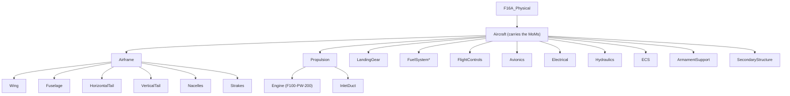

# P Layer — Physical

> Artifact: `physical/F16A_Physical.slx` · Dictionary: `physical/F16A_Physical.sldd`
> · Profile: `physical/F16A_PhysicalProps.xml` · Allocation: `physical/F16A_LogicalToPhysical.mldatx`
> · Generator: `generate_f16a_physical.m`
> · Roll-up: `F16APhysicalMassRollup.m` · Cost hook: `F16APhysicalCostModel.m`

The Logical layer said **how** — in solution roles. The Physical layer gives **concrete parts**:
a real decomposition of the aircraft into a wing, a fuselage, an engine, and so on. It teaches
two ideas the earlier layers could not:

1. **Roll-up analysis.** Each part carries a mass; a **native System Composer parametric
   analysis** sums those masses up the tree to a subtotal at every assembly and a grand total
   — the **Operating Empty Weight (OEW)** — at the aircraft root. This is the canonical MBSE
   "the model computes an emergent property from its parts" move.
2. **Measures of Merit.** Empty weight and unit cost are **objectives to _minimize_**, not
   pass/fail thresholds. They are recorded as **MoMs** on the aircraft, and the layer shows two
   different ways a MoM gets its value: OEW from the roll-up, unit cost from a **cost-model
   function**.

## The physical decomposition

Twenty components. A single **`Aircraft`** component is the system-of-interest (it carries the
roll-up total and the MoMs); it holds **11 assemblies**, and two of those are refined one level.

`Airframe` refines into the aeroshell/structure; `Propulsion` into the engine and its inlet. The
other nine assemblies are leaves. `*FuelSystem` carries **zero** empty-weight mass — its dry
tankage is integral to the wet wing/fuselage and internal fuel is a **consumable**, not empty
weight — a deliberate "not every part adds to OEW" lesson.

## Mass roll-up → Operating Empty Weight

Every part gets a `PhysicalItem` stereotype with a `Mass_lb` property. The leaf masses are the
Brandt F-16A ground-truth component weights (lbf, design point `W_TO = 31,377 lb`):

| Assembly | Part | Mass (lb) | | Assembly (leaf) | Mass (lb) |
|----------|------|----------:|-|-----------------|----------:|
| Airframe | Wing | 1785.95 | | LandingGear | 1066.82 |
| Airframe | Fuselage | 3652.11 | | FuelSystem | 0.00* |
| Airframe | HorizontalTail | 648.00 | | FlightControls | 472.44 |
| Airframe | VerticalTail | 360.00 | | Avionics | 2541.54 |
| Airframe | Nacelles | 186.82 | | Electrical | 533.41 |
| Airframe | Strakes | 90.00 | | Hydraulics | 367.11 |
| Propulsion | Engine | 4730.23 | | ECS | 360.84 |
| Propulsion | InletDuct | 728.60 | | ArmamentSupport | 440.00 |
| | | | | SecondaryStructure | 2016.86 |

`F16APhysicalMassRollup.m` runs the roll-up the way MathWorks intends — a native architecture
**instance** iterated bottom-up (`instantiate` → `iterate` with `Direction="Postorder"`), the
same pattern shipped in [`../ex2`](../ex2). Each assembly's subtotal is written back so the
Analysis Viewer shows the roll-up at every level:

| Roll-up result | Value (lb) |
|----------------|-----------:|
| Airframe subtotal | 6,722.88 |
| Propulsion subtotal | 5,458.83 |
| **Operating Empty Weight (OEW)** | **19,980.73** |

One convention worth stating so it is not misread: **airframe-less-engine = OEW − Engine ≈
15,250.5 lb**. That is the standard "airframe unit weight" (the whole aircraft minus the
bought-out engine), **not** the sum of the six structural parts (which is 6,722.88).

## Measures of Merit — minimize, don't threshold

Here is the headline correction the Physical layer makes. Empty weight and unit cost are **not**
requirements with a "shall not exceed" bar — a hard weight or cost ceiling is the wrong construct
in conceptual design, where you **trade** them and **lower is always better**. They are
**Measures of Merit**: objectives to minimize. We record them on a `MeasureOfMerit` stereotype on
the `Aircraft` (property `Goal = "Minimize"`), and the layer shows the two ways a MoM is sourced:

| Measure of Merit | Goal | Value comes from |
|------------------|------|------------------|
| Operating Empty Weight (`OEW_lb`) | Minimize | the **mass roll-up** (bottom-up sum) |
| Unit flyaway cost (`UnitCost_USD`) | Minimize | a **cost-model function** (`F16APhysicalCostModel`) |

Cost is deliberately **not** a roll-up: unit flyaway cost is not the sum of part prices, it is the
output of a parametric model (engineering/tooling/manufacturing hours, production quantity,
material factors — e.g. the DAPCA IV model behind the Brandt reference). So `F16APhysicalCostModel`
is the hook where that model plugs in. It is a **stub** today (returns `NaN`, "not yet computed")
— we do not invent a cost number — which is itself the teaching point: **different MoMs are
computed by different analyses**, and the architecture names where each one lives.

## Realization — the L→P relationship

The Logical layer introduced **allocation** (function → role). The Physical layer adds
**realization** (role → part), stored in its own allocation set `F16A_LogicalToPhysical.mldatx`.
All **9 logical roles** are realized; `Airframe` fans out to its six structural parts (1→many):

| Logical role (L) | Realized by physical part(s) (P) |
|------------------|----------------------------------|
| Airframe | Wing, Fuselage, HorizontalTail, VerticalTail, Nacelles, Strakes |
| PropulsionSystem | Engine, InletDuct |
| FuelSystem | FuelSystem |
| FlightControlSystem | FlightControls |
| LandingGear | LandingGear |
| AvionicsSuite | Avionics |
| CommunicationSystem | Avionics *(comms realized within the avionics suite)* |
| WeaponSystem | ArmamentSupport |
| MissionSystemsBay | ArmamentSupport |

### Not every part realizes a logical role

`Electrical`, `Hydraulics`, `ECS`, and `SecondaryStructure` are **not** realization targets — they
are supporting infrastructure that no single logical role calls for. This is the exact mirror of
the Logical layer's **constraint-driven** roles (`LandingGear`, `MissionSystemsBay`) that received
no function: some parts are born of the physics of building an airplane, not of a role above them.

## Requirements the Physical layer owns

`REQ_F16A_026` (unit flyaway cost) is **reclassified as a Measure of Merit** — its old
"unit flyaway cost ≤ ~$68.4M" threshold is dropped in favor of *minimize cost* (the $68.4M figure
survives only as the reference-aircraft value for context). It is homed here and Implement-linked
from the `Aircraft` component; the cost-model function is its verification method.

`REQ_F16A_022` (composite material fraction ≤ 20%) is a genuine design **constraint**, not an
objective, so it stays a **deferred requirement** — a natural next extension (add a
`CompositeFraction` property per part and a material roll-up alongside the mass roll-up).

## Verification

`F16APhysicalArchitectureTest.m` (11 tests) checks: the 20 components and the
Aircraft/Airframe/Propulsion hierarchy; the `PhysicalItem` stereotype on every part; the 16 leaf
masses against the Brandt ground truth (and FuelSystem = 0); the mass roll-up for
**self-consistency** (each assembly subtotal = sum of its parts, OEW = sum of all leaves — never
against a target); the OEW MoM (`Goal = Minimize`, value = roll-up); the cost MoM (`Goal =
Minimize`, value = the uncomputed placeholder, and the cost-model hook exists); the realization
allocation covers all 9 roles; the four infrastructure parts realize no role; and that
`REQ_F16A_026` is a MoM homed at P.

## Next

The RFLP loop is now closed: **R → F → L → P**, with requirements, functions, roles, and parts
all traceably connected. The obvious extensions from here are to **implement the cost-model
function** (`F16APhysicalCostModel`) so the cost MoM carries a value, and to add a **materials
roll-up** (composite fraction) that homes `REQ_F16A_022` — both reusing the same stereotype +
analysis machinery this layer introduces.
