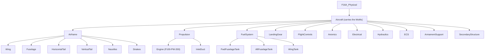

# P Layer — Physical

> Artifact: `physical/F16A_Physical.slx` · Dictionary: `physical/F16A_Physical.sldd`
> · Profile: `physical/F16A_PhysicalProps.xml` · Allocation: `physical/F16A_LogicalToPhysical.mldatx`
> · Generator: `physical/generate_f16a_physical.m`
> · Roll-ups: `physical/F16APhysicalMassRollup.m`, `physical/F16APhysicalMaterialsRollup.m`, `physical/F16APhysicalFuelRollup.m`
> · Cost hook: `physical/F16APhysicalCostModel.m` · Mission-fuel hook: `physical/F16APhysicalMissionFuel.m`
> · Verification tests: `verification/F16AMaterialsVerificationTest.m` (REQ_F16A_022), `verification/F16AFuelVerificationTest.m` (REQ_F16A_P01)

The Logical layer said **how** — in solution roles. The Physical layer gives **concrete parts**:
a real decomposition of the aircraft into a wing, a fuselage, an engine, and so on. It teaches
three ideas the earlier layers could not:

1. **Roll-up analysis.** Each part carries properties (mass, composite fraction, fuel capacity);
   analyses sum them up the tree to emergent totals — the **Operating Empty Weight**, the
   **airframe composite fraction**, the **available fuel**. The mass roll-up is a **native System
   Composer parametric analysis** (`instantiate`/`iterate`); the canonical MBSE "the model computes
   an emergent property from its parts" move.
2. **Measures of Merit.** Empty weight and unit cost are **objectives to _minimize_**, not
   pass/fail thresholds. They are recorded as **MoMs** on the aircraft, with two different value
   sources: OEW from the roll-up, unit cost from a **cost-model function**.
3. **Verified by.** For the requirements that *are* genuine constraints (composite fraction,
   fuel volume), a **test checks the roll-up satisfies the requirement**, and a **Verify link**
   ties the requirement to that test — the project's first "verified by" relationships.

## The physical decomposition

Twenty-three components. A single **`Aircraft`** component is the system-of-interest (it carries
the OEW/cost MoMs); it holds **11 assemblies**, and three of those are refined one level.

`Airframe` refines into the aeroshell/structure; `Propulsion` into the engine and its inlet;
`FuelSystem` into three internal tanks. The other eight assemblies are leaves. The fuel tanks
carry **zero** empty-weight mass — their dry tankage is integral to the wet wing/fuselage and
internal fuel is a **consumable**, not empty weight — a deliberate "not every part adds to OEW"
lesson. They carry a fuel **capacity** instead (see below).

## Mass roll-up → Operating Empty Weight

Every part gets a `PhysicalItem` stereotype with a `Mass_lb` property. The leaf masses are the
Brandt F-16A ground-truth component weights (lbf, design point `W_TO = 31,377 lb`):

| Assembly | Part | Mass (lb) | | Assembly (leaf) | Mass (lb) |
|----------|------|----------:|-|-----------------|----------:|
| Airframe | Wing | 1785.95 | | LandingGear | 1066.82 |
| Airframe | Fuselage | 3652.11 | | FuelSystem | 0.00* |
| Airframe | HorizontalTail | 648.00 | | FlightControls | 472.44 |
| Airframe | VerticalTail | 360.00 | | Avionics | 2541.54 |
| Airframe | Nacelles | 186.82 | | Electrical | 533.41 |
| Airframe | Strakes | 90.00 | | Hydraulics | 367.11 |
| Propulsion | Engine | 4730.23 | | ECS | 360.84 |
| Propulsion | InletDuct | 728.60 | | ArmamentSupport | 440.00 |
| | | | | SecondaryStructure | 2016.86 |

`F16APhysicalMassRollup.m` runs the roll-up the way MathWorks intends — a native architecture
**instance** iterated bottom-up (`instantiate` → `iterate` with `Direction="Postorder"`), the
same pattern shipped in [`../ex2`](../ex2). Each assembly's subtotal is written back so the
Analysis Viewer shows the roll-up at every level:

| Roll-up result | Value (lb) |
|----------------|-----------:|
| Airframe subtotal | 6,722.88 |
| Propulsion subtotal | 5,458.83 |
| **Operating Empty Weight (OEW)** | **19,980.73** |

One convention worth stating so it is not misread: **airframe-less-engine = OEW − Engine ≈
15,250.5 lb**. That is the standard "airframe unit weight" (the whole aircraft minus the
bought-out engine), **not** the sum of the six structural parts (which is 6,722.88).

## Measures of Merit — minimize, don't threshold

Here is the headline correction the Physical layer makes. Empty weight and unit cost are **not**
requirements with a "shall not exceed" bar — a hard weight or cost ceiling is the wrong construct
in conceptual design, where you **trade** them and **lower is always better**. They are
**Measures of Merit**: objectives to minimize. We record them on a `MeasureOfMerit` stereotype on
the `Aircraft` (property `Goal = "Minimize"`), and the layer shows the two ways a MoM is sourced:

| Measure of Merit | Goal | Value comes from |
|------------------|------|------------------|
| Operating Empty Weight (`OEW_lb`) | Minimize | the **mass roll-up** (bottom-up sum) |
| Unit flyaway cost (`UnitCost_USD`) | Minimize | a **cost-model function** (`F16APhysicalCostModel`) |

Cost is deliberately **not** a roll-up: unit flyaway cost is not the sum of part prices, it is the
output of a parametric model (engineering/tooling/manufacturing hours, production quantity,
material factors — e.g. the DAPCA IV model behind the Brandt reference). So `F16APhysicalCostModel`
is the hook where that model plugs in. It is a **stub** today (returns `NaN`, "not yet computed")
— we do not invent a cost number — which is itself the teaching point: **different MoMs are
computed by different analyses**, and the architecture names where each one lives.

## Constraints verified by roll-up — the "verified by" relationship

Not every quantity is a MoM. Some are genuine **constraints** with a real limit, and for those the
Physical layer introduces the project's first **"verified by"** relationship: a **test** computes a
roll-up and checks the requirement is met, and a **Verify link** ties the requirement to that test
(the requirement shows *Verified by* the test). The Verify links are added **manually** in the
Requirements Editor — the generator makes Implement links only (see the README, "Verification links
are added manually"). Each requirement has its **own** verification-test file:
`F16AMaterialsVerificationTest.m` (REQ_F16A_022) and `F16AFuelVerificationTest.m` (REQ_F16A_P01).

### Materials — composite fraction ≤ 20% (REQ_F16A_022)

Each airframe part carries a `Material.CompositeFraction` (the fraction of the part's mass that is
composite). `F16APhysicalMaterialsRollup.m` computes the **mass-weighted** composite fraction of
the airframe — a roll-up, but a weighted average rather than a plain sum:

| Airframe part | Mass (lb) | Composite frac. | Note |
|---------------|----------:|----------------:|------|
| Wing | 1785.95 | 0.15 | carbon-fiber leading edge on an aluminum wing |
| Fuselage | 3652.11 | 0.10 | largely aluminum |
| HorizontalTail | 648.00 | 0.55 | composite-skinned stabilator |
| VerticalTail | 360.00 | 0.70 | graphite/epoxy fin skins |
| Nacelles | 186.82 | 0.05 | aluminum |
| Strakes | 90.00 | 0.50 | fiberglass strake/ventral |
| **Airframe (weighted)** | **6722.88** | **≈ 0.19** | **≤ 0.20 ✔** |

The per-part split is an **educated guess** grounded in real F-16 composite usage (the tail skins
are graphite/epoxy, the wing leading edge is carbon fiber, the strakes/ventral fins are fiberglass;
the fuselage and nacelles are mostly aluminum), tuned so the weighted airframe fraction (~19%) sits
just inside the 20% cap of the Brandt reference material mix. `REQ_F16A_022` is Implement-linked
from the `Airframe` and **Verified by** the test, which asserts the roll-up ≤ 20% — it **passes**.

### Fuel volume — enough tankage for the mission (REQ_F16A_P01)

`FuelSystem` holds three internal tanks (~2100 lb usable each, ~6300 lb total, ≈ the Brandt internal
fuel). `F16APhysicalFuelRollup.m` sums their `FuelTank.FuelCapacity_lb` to the **available** fuel.
The **required** fuel comes from `F16APhysicalMissionFuel.m` (a mission analysis). The verify test
checks *available ≥ required*.

This one is **intentionally failing for now**. The mission-fuel hook is a **stub** returning `NaN`
(we do not invent a mission-fuel number), so `available (6300) ≥ NaN` is false and the test fails —
an honest, traceable **"verification pending"** marker. It goes green once `F16APhysicalMissionFuel`
is wired to the mission analysis in [`/sizing/`](../../../sizing). This is the correct way to show a
requirement whose verification is set up but not yet satisfied: a red test with a clear reason, not
a silent gap.

## Realization — the L→P relationship

The Logical layer introduced **allocation** (function → role). The Physical layer adds
**realization** (role → part), stored in its own allocation set `F16A_LogicalToPhysical.mldatx`.
All **9 logical roles** are realized; `Airframe` fans out to its six structural parts (1→many):

| Logical role (L) | Realized by physical part(s) (P) |
|------------------|----------------------------------|
| Airframe | Wing, Fuselage, HorizontalTail, VerticalTail, Nacelles, Strakes |
| PropulsionSystem | Engine, InletDuct |
| FuelSystem | FuelSystem |
| FlightControlSystem | FlightControls |
| LandingGear | LandingGear |
| AvionicsSuite | Avionics |
| CommunicationSystem | Avionics *(comms realized within the avionics suite)* |
| WeaponSystem | ArmamentSupport |
| MissionSystemsBay | ArmamentSupport |

### Not every part realizes a logical role

`Electrical`, `Hydraulics`, `ECS`, and `SecondaryStructure` are **not** realization targets — they
are supporting infrastructure that no single logical role calls for. This is the exact mirror of
the Logical layer's **constraint-driven** roles (`LandingGear`, `MissionSystemsBay`) that received
no function: some parts are born of the physics of building an airplane, not of a role above them.

## Requirements the Physical layer owns

| Requirement | Kind | How the Physical layer handles it |
|-------------|------|-----------------------------------|
| `REQ_F16A_026` — unit flyaway cost | Measure of Merit | Reclassified from a "≤ $68.4M" threshold to *minimize cost*; Implement-linked from `Aircraft`; value from the cost-model function |
| `REQ_F16A_022` — composite ≤ 20% | Constraint | Implement-linked from `Airframe`; **Verified by** the materials roll-up (≈19% ≤ 20% ✔) |
| `REQ_F16A_P01` — fuel volume sufficiency | Constraint | New (in `f16a_physical_derived.slreqx`); Implement-linked from `FuelSystem`; **Verified by** the fuel roll-up vs mission fuel (*pending* — mission-fuel stub) |

`REQ_F16A_P01` lives in a new physical-derived set, keeping the sizing-derived `f16a.slreqx`
pristine (the same pattern as the functional- and logical-derived sets).

## Verification

Two kinds of test, kept in separate files:

**Machinery** — `F16APhysicalArchitectureTest.m` checks the model is **built correctly**: the 23
components and the Aircraft/Airframe/Propulsion/FuelSystem hierarchy; the `PhysicalItem` stereotype
on every part; the 16 leaf masses against the Brandt ground truth; the composite fractions and fuel
capacities; the mass roll-up for **self-consistency** (each subtotal = sum of parts — never against
a target); the OEW and cost MoMs (`Goal = Minimize`); the realization covers all 9 roles; the four
infrastructure parts realize no role; and that REQ_022/026/P01 carry their **Implement** links.

**Requirement verification** — one file per requirement, so each requirement's "is it met?" is
self-contained. These are the tests the manual **"Verified by"** links point to (see the README —
verify links are added by hand; the generator makes Implement links only):
- `F16AMaterialsVerificationTest.m` → `REQ_F16A_022`: airframe composite ≈ 19% ≤ 20% ✔ (**passes**).
- `F16AFuelVerificationTest.m` → `REQ_F16A_P01`: available fuel ≥ mission fuel — **fails on purpose**
  until the mission-fuel analysis is connected (see above). Isolating it in its own file keeps the
  materials verifier all-green and the intentional failure unambiguous.

## Next

The RFLP loop is now closed: **R → F → L → P**, with requirements, functions, roles, and parts all
traceably connected, and the first requirements *verified by* tests. The immediate to-dos are to
**wire `F16APhysicalMissionFuel` to the mission analysis in `/sizing/`** (turning the fuel-volume
verification green) and to **implement `F16APhysicalCostModel`** so the cost MoM carries a value —
both reusing the roll-up + stereotype machinery this layer introduces.
