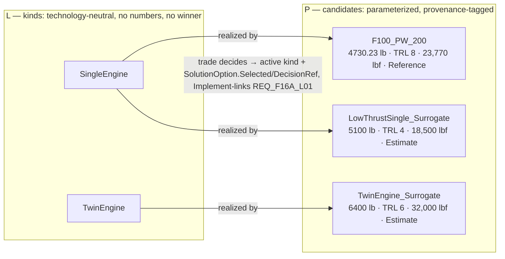

# Methodology — why the trade lives at P

> Method note, not an artifact. Governs [`04_logical.md`](04_logical.md) and
> [`05_physical.md`](05_physical.md); read those first.

An earlier version of this example treated L and P as **estimate → actual**: the Logical layer held
variant choices carrying baked-in mass, cost, TRL and benefit figures, a Logical-layer script
scored them and picked a winner, and P instantiated the winner. That is backwards. A logical role
has no mass — only a *part* has a mass. Numbers had to be invented at L to make the trade run, and
P then inherited a decision it had the data to second-guess. The example now uses a **two-tier
options/decision split**: L enumerates the *kinds*, P parameterizes the *candidates* and decides.

## The boundary rule

> **A Logical option is an architectural *kind* — a configuration commitment that is free of
> technology, vendor and numbers. A Physical candidate is a concrete *parameterized realization* of
> a kind — a technology commitment, with data and a provenance tag.**

| | Logical option (**kind**) | Physical candidate |
|---|---|---|
| Answers | *What shape of solution?* | *Built out of what, exactly?* |
| Examples | `SingleEngine` / `TwinEngine`; `FlyByWire` / `HydroMechanical`; `BlendedCrankedDelta` / `ConventionalTrapWing` | `F100_PW_200`, `LowThrustSingle_Surrogate`, `TwinEngine_Surrogate`, … |
| Carries | a name and a rationale (`SolutionOption { Selected, DecisionRef }`) | one candidate stereotype per trade (D-056) — `{ RealizesKind, Mass_lb, TRL, DataProvenance, Selected }` plus the criterion that trade owns: `Thrust_SL_lb`, `AeroBenefit` or `HandlingBenefit` — plus the `Rationale` every physical part carries |
| Owns the decision? | **No** — it holds the *active* kind, written back from P | **Yes** — the trade runs here |
| Survives a technology generation? | Yes | No |

The propulsion role is the one that shows the shape of the mapping, because it is the one where it
is **many-to-one**: two of the three engine candidates realize the same kind.

In the model the arrow is stored the other way round, as a `RealizesKind` string **on the
candidate** — and that is the direction that matters, because it is **many-to-one**: `F100_PW_200`
and `LowThrustSingle_Surrogate` both say `SingleEngine`. That is why the cross-layer write-back resolves the
winning kind from `RealizesKind` and never from the candidate's name (D-027) — the name is not a key
into the option set. `Airframe` and `FlightControlSystem` happen to be 1 : 1 today, which is a fact
about this example's candidate list, not a property of the pattern.

### The three-question test

Ask, of any box you are about to draw:

1. **Can you name a supplier, a part number, or a specific technology for it?** → **P**.
2. **Does it carry a number somebody could measure, quote or dispute?** → **P**.
3. **Swap the technology underneath it. Does the box's *name* still make sense?**
   If yes → **L**. `SingleEngine` outlives the F100; `F100_PW_200` does not.

Question 3 is the load-bearing one. `SingleEngine` vs `TwinEngine` is not "solution-free" — it is
already a real architectural commitment. What it is free of is **technology and supplier**. Keep
that distinction: strict *solution*-independence is the job of the **F** layer
([`02_functions.md`](02_functions.md)), which says only `ProduceThrust`.

## Where the rule comes from

**1 · The logical layer is technology-neutral; the physical layer is where technology enters.**
This is the defining split in **ARCADIA**, the method behind Capella. Its Logical Architecture
level is about *"building a 'technology neutral' logical architecture dealing with non-functional
constraints"*, while the Physical Architecture level *"introduces further details and design
decisions, rationalization, architectural patterns, new technical services and behavioral
components, and makes the logical architecture vision evolve according to implementation, technical
and technological constraints and choices"* ([Capella/ARCADIA][arcadia]; long form in
[[Voirin 2017]][voirin]). SEBoK draws the same line: a logical architecture avoids constraining the
system to a particular technology, and traces to a physical architecture that says how to implement
it with specific technologies ([SEBoK][sebok-la]). Our rule is that split, applied to *options*.

**2 · Building several candidate architectures and then trading them is a named MBSE activity.**
It is not an embellishment. **OOSEM** — INCOSE's Object-Oriented Systems Engineering Method — lists
exactly six activities, and two of them are ours: *"Synthesize Candidate Allocated Architectures"*
followed by *"Optimize and Evaluate Alternatives"*, both **downstream of** *"Define Logical
Architecture"* ([INCOSE OOSEM][oosem-wiki]; original method paper [[Lykins, Friedenthal & Meilich
2000]][lykins]). Note the ordering: you allocate to concrete elements *first*, then evaluate.
Scoring alternatives at L, as the old version did, inverts OOSEM's sequence.

**3 · Modelling the options as variation points is the morphological / product-line move.**
Laying out each design dimension with its possible values and treating the design space as their
combinations is **Zwicky's morphological box** ([[Zwicky 1969]][zwicky]), imported into engineering
design as the **morphological matrix** for combining working principles into concept variants
([[Pahl & Beitz]][pahl], §6). In software product lines the same idea is a **feature model** with
mandatory/optional/alternative features — the FODA report is the origin
([[Kang et al. 1990]][foda]). System Composer's **variant component** is the tool-level version of
a variation point: multiple design alternatives held in one model with exactly one active
([MathWorks][sc-variant]). Our three variant roles are a 3-dimensional morphological box; the L
layer draws the box, the P layer fills the cells with real hardware.

**4 · Running the trade at the parameterized layer is the extended-RFLP + MDAO pattern.**
Plain RFLP has no place to put design optimization. The extension that adds it — and the direct
precedent for trading at the parameterized end of the chain — is **Swaminathan, Sarojini & Hwang,
*Integrating MBSE and MDO through an Extended Requirements-Functional-Logical-Physical (RFLP)
Framework***, AIAA AVIATION 2023 ([DOI 10.2514/6.2023-3908][rflp-mdo]). Its argument is the one we
act on: MBSE gives traceability but cannot size hardware; MDO sizes hardware but has no
traceability; RFLP is the seam, and the joining happens where parameters live. *(The AIAA landing
page is paywalled — title, authors, forum and DOI confirmed from independent indexes, abstract not
read in full.)*

**5 · Keeping every option alive until the parameterized trade decides is set-based design.**
Point-based design picks a concept early and iterates it; **set-based** design carries a set of
alternatives forward and eliminates them only as evidence arrives — Toyota's practice as documented
by [[Sobek, Ward & Liker 1999]][sobek], defined for engineered systems by [[Singer, Doerry &
Buckley 2009]][singer] (*"establishing feasibility before making decisions"*), reviewed in
[[Toche, Pellerin & Fortin 2020]][toche] as *"a convergence process rather than an evolution,"* and
with aerospace precedent in [[Riaz, Guenov & Molina-Cristobal 2017]][riaz]. Concretely: the losing
kinds are **not deleted** from the L model, and L commits to nothing until P has numbers.

## What this example is *not*

Read this section before repeating any of the above in a report.

- **The "MDAO" is a scripted trade study, not MDAO.** It is a weighted sum over a handful of
  discrete, pre-enumerated candidates. There is no optimizer, no design-variable continuum, no
  coupled disciplinary analysis, no convergence. Citation [4] is the *pattern we are following*,
  not a description of what the code does. The optimizer is left as a **hook**, and the word
  "MDAO" is kept out of the file names, function names and comments on purpose (D-018).
- **The scoring is a declared value function per criterion — and it did not start that way.**
  An earlier version normalized each criterion **min–max across the candidates of a role**. At two
  candidates that is degenerate — every criterion collapses to {0, 1}, so a "score" was only the sum
  of the weights a candidate won — but the degeneracy was the symptom. The real defect is that
  min–max is **sample-dependent**: adding or removing a candidate rescales everyone, and two
  candidates neither of whose data changed can **swap places**. That is the rank-reversal problem.
  The scoring is now a value function **declared in advance**, independent of the candidate set:
  `B/10` on a stated 1–10 scale (0 is the property default and means *unset*, so the guard rejects
  it — D-033), `(TRL−1)/8` on 1–9, and `M_baseline/M` against the role's
  `DataProvenance = Reference` candidate, so `v > 1` reads "lighter than the as-built F-16A".
  Adding a fourth engine now changes that engine's score and nothing else. The price is that you
  must state the scale you mean. **This example changed because of the analysis in this file**
  (D-015) — the method note is not a write-up of what was built, it is what caught the defect.
- **Each variation point is decided independently.** Three binary kinds is a 2×2×2 = 8-point
  morphological box, but we evaluate 3 pairs — 7 candidates in 3 trades — not 8 combinations. That
  is an explicit assumption that the choices do not interact (D-016), and in this particular
  aircraft it is **demonstrably false**: relaxed static stability pays off only *with* fly-by-wire,
  which is the actual F-16 story. The morphological literature warns that variation points usually
  do interact ([[Pahl & Beitz]][pahl]); a real study would search combinations.
- **The candidate numbers are illustrative, and say so.** Every candidate carries a
  `DataProvenance` tag. Three are `Reference` — the Brandt F-16A component weights this model
  already used (Propulsion 4730.23, Airframe 6722.88, FlightControls 472.44 lb). Four are
  `Estimate` — 5100 / 6400 / 7300 / 700 lb are **teaching values chosen to make the trade
  instructive**, not figures for any aircraft that was built. Do not cite them as F-16 data. And
  read the tag narrowly: it qualifies the candidate's **`Mass_lb`** and nothing else (D-025). Every
  invented number in this example, with the reasoning behind each, is inventoried in **D-030**.
- **Cost is not a criterion of any of the three trades, and no candidate declares it.** It used to be
  declared and permanently `NaN`, dropped at run time by a general rule — *a criterion no candidate
  of the role carries a value for is dropped, and the remaining weights renormalized* (D-026). D-043
  had already settled that the day never comes: `F16APhysicalCostModel` computes a **whole-aircraft**
  figure for the `Aircraft`'s Measure of Merit, and the candidates' column would stay `NaN` however
  many cost models existed. D-056 drew the conclusion — a column that can never be scored is not a
  criterion — and stopped declaring it. Each trade now declares weights that sum to 1 and checks that
  they do. What that costs is the drop-and-renormalize demonstration; what it buys is that no
  stereotype carries a property its trade cannot use.
- **It is set-based in structure only.** True SBD converges by intersecting feasible regions across
  disciplines; we keep the options in the model and defer the decision, then resolve it with a
  single weighted score. The *discipline* is borrowed; the *mechanism* is classical concept
  selection. What we do keep is the non-deletion: a losing candidate stays in the P model tagged
  `SourceKind = TradeAlternative`, carrying a justification that says what it lost on and by how
  much, and a losing kind stays in the L model.
- **The active kind at L is derived, not authored.** It is written back by the P-layer trade, so it
  is an *output* of the decision and not the decision itself. The **decision requirement** is where
  the decision is posed and its trail anchored; the reasoning that settles it is the trade study's
  output, carried by the candidates' `Rationale.Justification` at P (D-040). That is also why
  `DecisionRef` is written on **every** kind of a role, not only the winner (D-027): it is the only
  outbound reference a rejected kind carries, so without it a reader who clicks the loser reaches a
  `'TBD'` and stops. With it the loser joins the same trail — requirement, then the rejected
  *candidate*, whose `TradeAlternative` justification says what it lost on (D-002, D-049).

### What the value functions assume

Declaring a value function fixes the rank-reversal problem. It does not make the scoring objective,
and the note would be dishonest if it stopped at the fix.

- **It is an additive model, and additivity is an assumption.** The score is `Σ wᵢ · vᵢ(xᵢ)` — a
  weighted sum of single-criterion values, the simplest member of the **multi-attribute
  value/utility** family whose standard reference is [[Keeney & Raiffa 1993]][keeney]. The additive
  form is not free: it is valid only under **independence conditions** on the decision-maker's
  preferences — informally, the mass-versus-TRL tradeoff must not depend on what the benefit rating
  happens to be. Nobody elicited or checked those conditions here. The additive form is used because
  it is simple and legible, not because it was justified.
- **A weight is a scaling constant, not a statement of importance.** In an additive value model a
  weight means something only *relative to the declared range* of its criterion — change the range
  and the correct weight changes with it — so `Benefit 0.50` is **not** a free-standing claim that
  benefit is "half of what matters". Parnell & Trainor state it for a systems-engineering audience:
  *"weights depend on both importance and variation of the range of the attribute. Many analysts,
  not familiar with the mathematical theory, assess weights using only importance"*
  ([[Parnell & Trainor 2009]][parnell]), and Keeney catalogues it among twelve recurring mistakes in
  value tradeoffs ([[Keeney 2002]][keeney2002]). Ours were chosen by the author of this example and
  never swing-weighted against the criterion ranges: an input, not a result, with no sensitivity
  study behind them. That bites hardest on the airframe and flight-control trades, each decided by
  its benefit, the criterion carrying half the score. Since D-056 the three trades declare
  *different* weights over *different* criteria, which makes the arbitrariness more visible rather
  than less: nothing outside the author's judgement says the engine trade should weight thrust 0.30.
- **Each value function is linear, and that is a third assumption.** `B/10` and `(TRL−1)/8` are
  straight lines, so the model asserts that TRL 3 → 4 is worth exactly as much as TRL 8 → 9. For
  technology readiness that is almost certainly wrong — the maturity risk that matters is
  concentrated at the low end of the scale. Nothing here establishes that these declared scales are
  linear *in value*; they were chosen because they are legible, and a declared-but-wrong shape is
  still a declared shape.
- **The ratio criteria are anchored on the as-built aircraft, and they are unbounded.** The baseline
  is the role's `Reference` candidate, so **the Brandt candidate scores exactly 1.0 on mass in every
  trade, by construction** — a property of how the scale was built, not a finding about the F-16.
  Note the asymmetry: `B/10` and `(TRL−1)/8` are bounded on [0, 1], but `M_baseline/M` and
  `T/T_baseline` have no upper bound. **This is no longer hypothetical.** Since D-056 the engine
  trade scores thrust as a ratio, and `TwinEngine_Surrogate` at 32,000 lbf against the F100's 23,770
  scores `v = 1.346` — so a criterion weighted 0.30 contributes as though it were weighted 0.40, and
  every run prints a warning saying so (D-035). The criteria are summed as if commensurable when
  their ranges are not: the weight-versus-range problem in its most concrete form, and now with a
  live case rather than a caveat. **A criterion whose range is open-ended cannot have a defensible
  scaling constant at all.**
- **The benefit criteria and `TRL` are judgement on a declared scale, not measurements.** Our 1–10
  and 1–9 rankings — 0 is the "unset" sentinel in both, deliberately off the scale (D-033, D-021) —
  and they are judgement on the `Reference` candidates too: `DataProvenance = Reference` on
  `F100_PW_200` says its *mass* is sourced, not that a rating of it is (D-025). The accounting is
  uncomfortable and differs by trade: **0.75 of the airframe and flight-control scores is declared
  opinion**, against 0.35 of the engine score, whose other two criteria are both `Reference` figures
  on the winner. That the engine trade is the best-sourced of the three is a consequence of D-056,
  not a coincidence: it was given the criteria the reference actually carries. The judgement
  criteria remain *unauditable in principle* — they trace to nothing, which is exactly why they have
  to be recorded. Transparency is not the same as evidence.
- **The answer was known before the trades were run.** The F-16A exists; the production
  configuration wins all three. The `Estimate` masses, the invented surrogate thrusts and the benefit
  and TRL judgements were chosen to make that outcome legible and to make the engine trade
  instructive — the F100 wins on maturity and installed mass *while the twin out-thrusts it by 35%*,
  which is the lesson the numbers were picked to teach. This is a **retrodictive** exercise. It
  demonstrates the machinery, the arithmetic and the audit trail; it is not evidence about aeroplanes.

## Further reading

| Source | What it grounds | Link |
|---|---|---|
| Capella/ARCADIA, *Arcadia method* | L is technology-neutral; P owns technology choices | [mbse-capella.org][arcadia] |
| Voirin, *Model-based System and Architecture Engineering with the Arcadia Method*, ISTE/Elsevier 2017 | Long-form ARCADIA reference | ISBN 978-1-78548-169-7 [link][voirin] |
| SEBoK, *Logical Architecture* | Logical architecture avoids technology constraints; traces to physical | [sebokwiki.org][sebok-la] |
| INCOSE OOSEM (activity list) | "Synthesize Candidate Allocated Architectures" → "Optimize and Evaluate Alternatives" | [omgwiki.org][oosem-wiki] |
| Lykins, Friedenthal & Meilich, INCOSE IS 2000 | Original OOSEM method paper | [10.1002/j.2334-5837.2000.tb00416.x][lykins] |
| Zwicky, *Discovery, Invention, Research through the Morphological Approach*, Macmillan 1969 | The morphological box | [archive.org][zwicky] |
| Pahl & Beitz et al., *Engineering Design: A Systematic Approach*, 3rd ed., Springer 2007 | Morphological matrix → concept variants; combinatorial explosion warning | [10.1007/978-1-84628-319-2][pahl] |
| Kang et al., *FODA Feasibility Study*, CMU/SEI-90-TR-021, 1990 | Feature/variability modelling origin | [SEI report][foda] |
| MathWorks, *Variant Components in Architecture Models* | Tool-level variation point | [mathworks.com][sc-variant] |
| Swaminathan, Sarojini & Hwang, AIAA AVIATION 2023 | Extended RFLP as the MBSE↔MDO seam | [10.2514/6.2023-3908][rflp-mdo] |
| Sobek, Ward & Liker, *Sloan Mgmt. Review* 40(2), 1999 | Set-based concurrent engineering at Toyota | [sloanreview.mit.edu][sobek] |
| Singer, Doerry & Buckley, *Naval Engineers J.* 121(4), 2009 | "What Is Set-Based Design?" — feasibility before decision | [10.1111/j.1559-3584.2009.00226.x][singer] |
| Toche, Pellerin & Fortin, *Design Science* 6, 2020 | SBD review; convergence vs evolution | [10.1017/dsj.2020.16][toche] |
| Riaz, Guenov & Molina-Cristobal, *J. Aircraft* 54(1), 2017 | Set-based design applied to aircraft | [10.2514/1.C033747][riaz] |
| Keeney & Raiffa, *Decisions with Multiple Objectives: Preferences and Value Trade-Offs*, Cambridge UP 1993 (orig. Wiley 1976) | The additive multi-attribute value/utility model and its independence conditions | ISBN 0-521-43883-7 · [10.1017/CBO9781139174084][keeney] |
| Parnell & Trainor, *Using the Swing Weight Matrix to Weight Multiple Objectives*, INCOSE IS 19(1), 2009, 283–298 | Weights depend on the attribute *range*, not importance alone — stated for systems engineers | [10.1002/j.2334-5837.2009.tb00949.x][parnell] |
| Keeney, *Common Mistakes in Making Value Trade-Offs*, *Operations Research* 50(6), 2002, 935–945 | Twelve recurring errors in value tradeoffs, including importance-only weighting | [10.1287/opre.50.6.935.357][keeney2002] |

[arcadia]: https://mbse-capella.org/arcadia.html
[voirin]: https://shop.elsevier.com/books/model-based-system-and-architecture-engineering-with-the-arcadia-method/voirin/978-1-78548-169-7
[sebok-la]: https://sebokwiki.org/wiki/Logical_Architecture
[oosem-wiki]: https://www.omgwiki.org/MBSE/doku.php?id=mbse:incoseoosem
[lykins]: https://doi.org/10.1002/j.2334-5837.2000.tb00416.x
[zwicky]: https://archive.org/details/discoveryinventi0000zwic
[pahl]: https://doi.org/10.1007/978-1-84628-319-2
[foda]: https://www.sei.cmu.edu/library/feature-oriented-domain-analysis-foda-feasibility-study/
[sc-variant]: https://www.mathworks.com/help/systemcomposer/variant-components-in-architecture-models.html
[rflp-mdo]: https://doi.org/10.2514/6.2023-3908
[sobek]: https://sloanreview.mit.edu/article/toyotas-principles-of-setbased-concurrent-engineering/
[singer]: https://doi.org/10.1111/j.1559-3584.2009.00226.x
[toche]: https://doi.org/10.1017/dsj.2020.16
[riaz]: https://doi.org/10.2514/1.C033747
[keeney]: https://doi.org/10.1017/CBO9781139174084
[parnell]: https://doi.org/10.1002/j.2334-5837.2009.tb00949.x
[keeney2002]: https://doi.org/10.1287/opre.50.6.935.357
