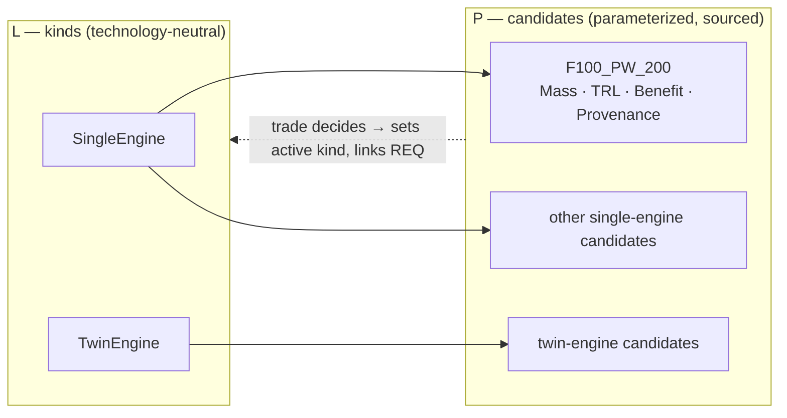

# Methodology — why the trade lives at P

> Method note, not an artifact. Governs [`04_logical.md`](04_logical.md) and
> [`05_physical.md`](05_physical.md); read those first.

An earlier version of this example treated L and P as **estimate → actual**: the Logical layer held
variant choices carrying baked-in `Mass_lb`/`UnitCost_USD`/`TRL`/`Benefit`, a Logical-layer script
scored them and picked a winner, and P instantiated the winner. That is backwards. A logical role
has no mass — only a *part* has a mass. Numbers had to be invented at L to make the trade run, and
P then inherited a decision it had the data to second-guess. The example now uses a **two-tier
options/decision split**: L enumerates the *kinds*, P parameterizes the *candidates* and decides.

## The boundary rule

> **A Logical option is an architectural *kind* — a configuration commitment that is free of
> technology, vendor and numbers. A Physical candidate is a concrete *parameterized realization* of
> a kind — a technology commitment, with data and a provenance tag.**

| | Logical option (**kind**) | Physical candidate |
|---|---|---|
| Answers | *What shape of solution?* | *Built out of what, exactly?* |
| Examples | `SingleEngine` / `TwinEngine`; `FlyByWire` / `HydroMechanical`; `BlendedCrankedDelta` / `ConventionalTrapWing` | `F100_PW_200` and its rivals |
| Carries | a name and a rationale | `Mass_lb`, `TRL`, `Benefit`, `Provenance`, `Rationale` |
| Owns the decision? | **No** — it holds the *active* kind, written back from P | **Yes** — the trade runs here |
| Survives a technology generation? | Yes | No |

### The three-question test

Ask, of any box you are about to draw:

1. **Can you name a supplier, a part number, or a specific technology for it?** → **P**.
2. **Does it carry a number somebody could measure, quote or dispute?** → **P**.
3. **Swap the technology underneath it. Does the box's *name* still make sense?**
   If yes → **L**. `SingleEngine` outlives the F100; `F100_PW_200` does not.

Question 3 is the load-bearing one. `SingleEngine` vs `TwinEngine` is not "solution-free" — it is
already a real architectural commitment. What it is free of is **technology and supplier**. Keep
that distinction: strict *solution*-independence is the job of the **F** layer
([`02_functions.md`](02_functions.md)), which says only `ProduceThrust`.

## Where the rule comes from

**1 · The logical layer is technology-neutral; the physical layer is where technology enters.**
This is the defining split in **ARCADIA**, the method behind Capella. Its Logical Architecture
level is about *"building a 'technology neutral' logical architecture dealing with non-functional
constraints"*, while the Physical Architecture level *"introduces further details and design
decisions, rationalization, architectural patterns, new technical services and behavioral
components, and makes the logical architecture vision evolve according to implementation, technical
and technological constraints and choices"* ([Capella/ARCADIA][arcadia]; long form in
[[Voirin 2017]][voirin]). SEBoK draws the same line: a logical architecture avoids constraining the
system to a particular technology, and traces to a physical architecture that says how to implement
it with specific technologies ([SEBoK][sebok-la]). Our rule is that split, applied to *options*.

**2 · Building several candidate architectures and then trading them is a named MBSE activity.**
It is not an embellishment. **OOSEM** — INCOSE's Object-Oriented Systems Engineering Method — lists
exactly six activities, and two of them are ours: *"Synthesize Candidate Allocated Architectures"*
followed by *"Optimize and Evaluate Alternatives"*, both **downstream of** *"Define Logical
Architecture"* ([INCOSE OOSEM][oosem-wiki]; original method paper [[Lykins, Friedenthal & Meilich
2000]][lykins]). Note the ordering: you allocate to concrete elements *first*, then evaluate.
Scoring alternatives at L, as the old version did, inverts OOSEM's sequence.

**3 · Modelling the options as variation points is the morphological / product-line move.**
Laying out each design dimension with its possible values and treating the design space as their
combinations is **Zwicky's morphological box** ([[Zwicky 1969]][zwicky]), imported into engineering
design as the **morphological matrix** for combining working principles into concept variants
([[Pahl & Beitz]][pahl], §6). In software product lines the same idea is a **feature model** with
mandatory/optional/alternative features — the FODA report is the origin
([[Kang et al. 1990]][foda]). System Composer's **variant component** is the tool-level version of
a variation point: multiple design alternatives held in one model with exactly one active
([MathWorks][sc-variant]). Our three variant roles are a 3-dimensional morphological box; the L
layer draws the box, the P layer fills the cells with real hardware.

**4 · Running the trade at the parameterized layer is the extended-RFLP + MDAO pattern.**
Plain RFLP has no place to put design optimization. The extension that adds it — and the direct
precedent for trading at the parameterized end of the chain — is **Swaminathan, Sarojini & Hwang,
*Integrating MBSE and MDO through an Extended Requirements-Functional-Logical-Physical (RFLP)
Framework***, AIAA AVIATION 2023 ([DOI 10.2514/6.2023-3908][rflp-mdo]). Its argument is the one we
act on: MBSE gives traceability but cannot size hardware; MDO sizes hardware but has no
traceability; RFLP is the seam, and the joining happens where parameters live. *(The AIAA landing
page is paywalled — title, authors, forum and DOI confirmed from independent indexes, abstract not
read in full.)*

**5 · Keeping every option alive until the parameterized trade decides is set-based design.**
Point-based design picks a concept early and iterates it; **set-based** design carries a set of
alternatives forward and eliminates them only as evidence arrives — Toyota's practice as documented
by [[Sobek, Ward & Liker 1999]][sobek], defined for engineered systems by [[Singer, Doerry &
Buckley 2009]][singer] (*"establishing feasibility before making decisions"*), reviewed in
[[Toche, Pellerin & Fortin 2020]][toche] as *"a convergence process rather than an evolution,"* and
with aerospace precedent in [[Riaz, Guenov & Molina-Cristobal 2017]][riaz]. Concretely: the losing
kinds are **not deleted** from the L model, and L commits to nothing until P has numbers.

## What this example is *not*

Read this section before repeating any of the above in a report.

- **The "MDAO" is a scripted trade study, not MDAO.** It is a weighted-sum score over a handful of
  discrete, pre-enumerated candidates. There is no optimizer, no design-variable continuum, no
  coupled disciplinary analysis, no convergence. Citation [4] is the *pattern we are following*,
  not a description of what the code does. The optimizer is left as a **hook**.
- **The scoring is deliberately coarse.** With min–max normalization over only two candidates,
  every criterion normalizes to {0, 1}, so a "score" is just the sum of the weights of the criteria
  a candidate wins — the *margin* carries no information. Do not read 0.60 vs 0.40 as "50% better."
- **Each variation point is decided independently.** Three binary kinds is a 2×2×2 = 8-point
  morphological box, but we evaluate 3 pairs, not 8 combinations — an explicit assumption that the
  choices do not interact. The morphological literature warns they usually do
  ([[Pahl & Beitz]][pahl]); a real study would search combinations.
- **The candidate numbers are illustrative, and say so.** Every physical candidate carries a
  `Provenance` tag. Where a value is a teaching estimate rather than a sourced figure, the tag says
  so. Do not cite them as F-16 data.
- **Cost is `NaN` and excluded from scoring.** Unit flyaway cost stays a **pending Measure of
  Merit** (see [`05_physical.md`](05_physical.md)); it is not modelled, and we do not invent a
  number to fill the column. Weights are renormalized over the criteria that *do* have values.
- **It is set-based in structure only.** True SBD converges by intersecting feasible regions across
  disciplines; we keep the options in the model and defer the decision, then resolve it with a
  single weighted score. The *discipline* is borrowed; the *mechanism* is classical concept
  selection.
- **The active kind at L is derived, not authored.** It is written back by the P-layer trade. The
  authoritative record of the decision is the **decision requirement** and its `Rationale`, not the
  variant flag.

## Further reading

| Source | What it grounds | Link |
|---|---|---|
| Capella/ARCADIA, *Arcadia method* | L is technology-neutral; P owns technology choices | [mbse-capella.org][arcadia] |
| Voirin, *Model-based System and Architecture Engineering with the Arcadia Method*, ISTE/Elsevier 2017 | Long-form ARCADIA reference | ISBN 978-1-78548-169-7 [link][voirin] |
| SEBoK, *Logical Architecture* | Logical architecture avoids technology constraints; traces to physical | [sebokwiki.org][sebok-la] |
| INCOSE OOSEM (activity list) | "Synthesize Candidate Allocated Architectures" → "Optimize and Evaluate Alternatives" | [omgwiki.org][oosem-wiki] |
| Lykins, Friedenthal & Meilich, INCOSE IS 2000 | Original OOSEM method paper | [10.1002/j.2334-5837.2000.tb00416.x][lykins] |
| Zwicky, *Discovery, Invention, Research through the Morphological Approach*, Macmillan 1969 | The morphological box | [archive.org][zwicky] |
| Pahl & Beitz et al., *Engineering Design: A Systematic Approach*, 3rd ed., Springer 2007 | Morphological matrix → concept variants; combinatorial explosion warning | [10.1007/978-1-84628-319-2][pahl] |
| Kang et al., *FODA Feasibility Study*, CMU/SEI-90-TR-021, 1990 | Feature/variability modelling origin | [SEI report][foda] |
| MathWorks, *Variant Components in Architecture Models* | Tool-level variation point | [mathworks.com][sc-variant] |
| Swaminathan, Sarojini & Hwang, AIAA AVIATION 2023 | Extended RFLP as the MBSE↔MDO seam | [10.2514/6.2023-3908][rflp-mdo] |
| Sobek, Ward & Liker, *Sloan Mgmt. Review* 40(2), 1999 | Set-based concurrent engineering at Toyota | [sloanreview.mit.edu][sobek] |
| Singer, Doerry & Buckley, *Naval Engineers J.* 121(4), 2009 | "What Is Set-Based Design?" — feasibility before decision | [10.1111/j.1559-3584.2009.00226.x][singer] |
| Toche, Pellerin & Fortin, *Design Science* 6, 2020 | SBD review; convergence vs evolution | [10.1017/dsj.2020.16][toche] |
| Riaz, Guenov & Molina-Cristobal, *J. Aircraft* 54(1), 2017 | Set-based design applied to aircraft | [10.2514/1.C033747][riaz] |

[arcadia]: https://mbse-capella.org/arcadia.html
[voirin]: https://shop.elsevier.com/books/model-based-system-and-architecture-engineering-with-the-arcadia-method/voirin/978-1-78548-169-7
[sebok-la]: https://sebokwiki.org/wiki/Logical_Architecture
[oosem-wiki]: https://www.omgwiki.org/MBSE/doku.php?id=mbse:incoseoosem
[lykins]: https://doi.org/10.1002/j.2334-5837.2000.tb00416.x
[zwicky]: https://archive.org/details/discoveryinventi0000zwic
[pahl]: https://doi.org/10.1007/978-1-84628-319-2
[foda]: https://www.sei.cmu.edu/library/feature-oriented-domain-analysis-foda-feasibility-study/
[sc-variant]: https://www.mathworks.com/help/systemcomposer/variant-components-in-architecture-models.html
[rflp-mdo]: https://doi.org/10.2514/6.2023-3908
[sobek]: https://sloanreview.mit.edu/article/toyotas-principles-of-setbased-concurrent-engineering/
[singer]: https://doi.org/10.1111/j.1559-3584.2009.00226.x
[toche]: https://doi.org/10.1017/dsj.2020.16
[riaz]: https://doi.org/10.2514/1.C033747
