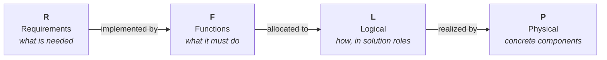

# F-16A RFLP MBSE Example

A teaching example that builds a **Model-Based Systems Engineering (MBSE)** model of the
**F-16A** using the **RFLP** framework in MathWorks tools (System Composer +
Requirements Toolbox, MATLAB R2026a).

RFLP structures a system model into four connected layers:



Each layer is a separate artifact; the layers are tied together by **traceability
links** (requirement → function) and **allocation sets** (function → logical → physical). That
traceability is the whole point of MBSE: you can always answer "why does this part exist?" and
"where is this requirement satisfied?".

## Status

| Layer | Artifact |
|-------|----------|
| **R** – Requirements | `requirements/f16a.slreqx` (26 requirements) |
| **F** – Functions | `functions/F16A_Functional.slx` (9 capabilities) **and** `functions/F16A_MissionActivity.slx` (the mission as 10 activity **actions**, each bound to the `/sizing/` analysis); 39 links |
| **L** – Logical | `logical/F16A_Logical.slx` (9 roles, 3 presenting technology-neutral **kinds** — the choice between them is decided at P; 14 allocation edges across two sets) |
| **P** – Physical | `physical/F16A_Physical.slx` (30 components incl. 7 candidates across 3 variant roles; a **trade study** that scores them, decides, and writes the decision back to L and to REQ_F16A_L01–L03; realization allocation; mass/materials/fuel roll-ups; OEW, mission, and cost/life-cycle-cost MoMs) |

All four layers are built. Three requirements carry a "verified by" test, and they are in
**two different states** — see [below](#three-requirements-two-verification-states).

## Documentation map

| Document | Contents |
|----------|----------|
| [`01_requirements.md`](01_requirements.md) | The R layer: how the requirements were derived from the Brandt F-16A sizing model, how they are organized, and the two student exercises. |
| [`02_functions.md`](02_functions.md) | The F layer: the functional architecture, the F2T2EA combat kill chain, the shared capability tree, the interfaces. |
| [`03_traceability.md`](03_traceability.md) | The requirement → function link matrix, the derived placeholder requirements, coverage gaps. |
| [`04_logical.md`](04_logical.md) | The L layer: solution roles, the function → logical allocation, the requirements L owns, and the variant roles presenting competing technology-neutral kinds. |
| [`05_physical.md`](05_physical.md) | The P layer: the decomposition and its 7 trade candidates, the trade study, the roll-ups, the Measures of Merit, the `Rationale` and `DataProvenance` every part carries, the L→P realization. |
| [`06_methodology.md`](06_methodology.md) | **Why the trade lives at P and not at L**: the kind-vs-candidate boundary rule, its grounding in ARCADIA, OOSEM, morphological analysis and set-based design — and a candid account of what weighted-sum scoring does *not* justify. |
| [`07_decision_log.md`](07_decision_log.md) | Every decision (D-001 …), including the decisions *not* to do something. **D-030 is the inventory of every invented number** — what every `Estimate` tag points at. |
| [`08_agent_team.md`](08_agent_team.md) | The agent team that maintains this example, the **house rules**, and the measured R2026a API findings that drove design choices. |

## Folder layout

```
mbse/examples/f16a/
├─ f16a.prj                              Simulink Project (open this first)
├─ f16aRoot.m                            path anchor: absolute path to the example root
├─ F16AOpenForReview.m                   load all models + requirement sets, open the editor
├─ docs/                                 <- you are here
├─ requirements/                         R layer
│   ├─ f16a.slreqx                       sizing-derived requirements (pristine)
│   ├─ f16a_functional_derived.slreqx    derived placeholders (D01–D09)
│   ├─ f16a_logical_derived.slreqx       decision requirements (L01–L03)
│   ├─ f16a_physical_derived.slreqx      physical requirements (P01 fuel, P02 life-cycle cost)
│   └─ generate_f16a_*requirements.m     one generator per set
├─ functions/                            F layer — TWO artifacts, two metaclasses (D-059)
│   ├─ F16A_Functional.slx + .sldd + ~mdl.slmx   the capability tree (no ports)
│   ├─ generate_f16a_functional.m        builds it, then calls the activity generator
│   ├─ F16A_MissionActivity.slx + ~mdl.slmx      the mission as an ACTIVITY diagram
│   ├─ generate_f16a_mission_activity.m  10 actions, F2T2EA child activity, 18 links
│   ├─ F16A_MissionUsesCapability.mldatx phase → capability (mechanism allocation, semantic use)
│   ├─ F16AMissionAnalysis.m             the printed walk over the ten phases (5 steps)
│   ├─ F16AMissionSegment.m              one phase's numbers — each action's BehaviorDefinition
│   └─ F16AMissionReference.m            calls /sizing/ BrandtMission once, and remembers
├─ logical/                              L layer
│   ├─ F16A_Logical.slx + .sldd + ~mdl.slmx
│   ├─ F16A_LogicalOptions.xml           stereotype profile (Selected, DecisionRef)
│   ├─ F16A_FunctionToLogical.mldatx     capability → logical allocation (7 edges)
│   ├─ F16A_KillChainToLogical.mldatx    kill-chain action → logical allocation (7 edges)
│   └─ generate_f16a_logical.m
├─ physical/                             P layer
│   ├─ F16A_Physical.slx + .sldd + ~mdl.slmx
│   ├─ F16A_PhysicalProps.xml            stereotype profile (PhysicalItem, MeasureOfMerit,
│   │                                    Material, FuelTank, Rationale, and one candidate
│   │                                    stereotype per trade — Engine, Airframe, FlightControl)
│   ├─ F16ASourceKind.m                  enum: why a part exists
│   ├─ F16ADataProvenance.m              enum: where a number came from
│   ├─ F16A_LogicalToPhysical.mldatx     logical → physical realization (14 edges)
│   ├─ generate_f16a_physical.m          builds P, RUNS THE TRADES, then the roll-ups
│   ├─ F16AEngineTradeStudy.m            thrust / mass / TRL      → REQ_F16A_L01
│   ├─ F16AAirframeTradeStudy.m          aero / mass / TRL        → REQ_F16A_L03
│   ├─ F16AFlightControlsTradeStudy.m    handling / mass / TRL    → REQ_F16A_L02
│   │                                    each standalone: open, read, score, decide, write back
│   ├─ F16APhysicalTradeStudy.m          15-line runner: calls all three
│   ├─ F16APhysicalMassRollup.m          part masses → OEW      (6 printed steps)
│   ├─ F16APhysicalMaterialsRollup.m     composite fraction     (5 printed steps)
│   ├─ F16APhysicalFuelRollup.m          available fuel         (4 printed steps)
│   │                                    each standalone: the walk is in the file that uses it
│   ├─ F16APhysicalRollups.m             runner: calls all three, read-only by default
│   ├─ F16APhysicalCostModel.m           calls BrandtCost: flyaway, O&M, LCC (needs /sizing/)
│   └─ F16APhysicalMissionFuel.m         reads MissionFuel_lb off the model (P01's required side)
├─ tests_for_ai_coding/                  MACHINERY tests — guard rails, not teaching (D-055)
│   ├─ README.md                         what these are, and why they are not verification/
│   ├─ F16ATestCase.m                    shared base: the walk, the readers, verifyNoOffenders
│   ├─ F16A{Requirements,FunctionalArchitecture,LogicalArchitecture}Test.m
│   ├─ F16AMission{Activity,Analysis}Test.m  the mission is wired / the mission is right
│   ├─ F16APhysicalArchitectureTest.m    the P model is built correctly
│   └─ run_ai_tests.m                    runs all six; every one must be green
└─ verification/                         requirement-verification tests — the teaching payload
    ├─ F16AMaterialsVerificationTest.m   REQ_F16A_022 — green
    ├─ F16AFuelVerificationTest.m        REQ_F16A_P01 — green since D-060
    ├─ F16AStaticMarginVerificationTest.m  REQ_F16A_025 — 2 pass, 1 red by design
    └─ *VerificationTest~m.slmx          manual verify link sets (requirement → test)
```

Every script derives sibling paths from `f16aRoot.m`, so it works regardless of which layer
folder it sits in. Each layer folder is on the **project path**, so `openProject` makes every
generator, roll-up and test resolvable by name. That path is load-bearing for more than
convenience: `F16ASourceKind.m` and `F16ADataProvenance.m` type two stereotype properties and
must be on the MATLAB path whenever `F16A_PhysicalProps` loads.

## How to open and run

```matlab
openProject("f16a.prj")
```

Regenerate the artifacts — **order matters**, because each generator links into artifacts the
earlier ones create:

```matlab
generate_f16a_requirements                  % -> requirements/f16a.slreqx
generate_f16a_derived_requirements          % -> f16a_functional_derived.slreqx
generate_f16a_functional                    % -> F16A_Functional.slx + links
generate_f16a_logical_derived_requirements  % -> f16a_logical_derived.slreqx (L01–L03)
generate_f16a_logical                       % -> F16A_Logical.slx (ships UNRESOLVED)
generate_f16a_physical_derived_requirements % -> f16a_physical_derived.slreqx (P01)
generate_f16a_physical                      % -> F16A_Physical.slx, RUNS THE THREE TRADE
                                            %    STUDIES (which resolve L and link L01–L03),
                                            %    then the roll-ups and the Implement links
```

Open the models and run the tests:

```matlab
systemcomposer.openModel("F16A_Physical")   % or F16A_Functional / F16A_Logical
systemcomposer.allocation.editor            % the F→L and L→P allocation matrices
F16APhysicalMassRollup                      % ONE roll-up: the mass tree, step by step, to OEW
F16APhysicalRollups                         % all three roll-ups; read-only, writes nothing
F16AEngineTradeStudy                        % re-run ONE trade; six printed steps, start here
F16APhysicalTradeStudy                      % re-run all three

run_ai_tests                                   % MACHINERY: all six suites, all green

runtests("F16AMaterialsVerificationTest")      % REQ_F16A_022 — green
runtests("F16AStaticMarginVerificationTest")   % REQ_F16A_025 — 2 pass, 1 RED BY DESIGN
runtests("F16AFuelVerificationTest")           % REQ_F16A_P01 — passes since D-060
```

The two kinds are run separately on purpose. `run_ai_tests` asks *is the model
built correctly?* and **every one of its cases must pass** — a red there is a
regression. The three verification suites ask *does the design meet this
requirement?*, and one of them is red by design. See
[`../tests_for_ai_coding/README.md`](../tests_for_ai_coding/README.md).

**One red is the expected state.** A second failure is a regression. A run that reports
"1 test fails" and stops has missed the point:

### Three requirements, two verification states

| Requirement | Test | State | What it teaches |
|---|---|---|---|
| `REQ_F16A_022` composite ≤ 20% | `F16AMaterialsVerificationTest` | 🟢 **met** | the requirement holds, and the evidence is a roll-up over the model itself |
| `REQ_F16A_P01` fuel volume | `F16AFuelVerificationTest` | 🟢 **met** | 6300 lb of tankage against 5960 lb of mission fuel — evidence that leaves the model entirely, and comes back from the `/sizing/` analysis (D-059) |
| `REQ_F16A_025` static margin | `F16AStaticMarginVerificationTest` | 🔴 **violated** | the requirement *was* evaluated, against a real number, and **the design does not meet it** (D-051) |

A requirement can be met, not met, or not yet judged. **The third state used to be shipped:**
`REQ_F16A_P01` was deliberately unevaluated — traceable, linked, and comparing against `NaN` — until
D-059 gave the model a real mission and D-060 turned it green. That was a real loss, argued in the
decision log; the `UNEVALUATED` branch survives inside the roll-up guards and
`F16AMaterialsVerificationTest`, so the state is still reachable, just no longer demonstrated by a
failing test. Two consequences worth holding on to:

- **A failing verification is not a broken tool.** `REQ_F16A_025` says something quite specific
  about the aircraft's balance, and the analysis behind it is working correctly.
- **`testAnalysisProducedUsableMargins` passing is what separates them.** It was built so that
  "the aircraft violates `REQ_F16A_025`" and "the analysis that evaluates it is broken" could
  never arrive looking identical. It is green while its two siblings split 1–1, so the landing
  margin is a number the model really produced.
- **The landing failure is a property of the reference model, not of the F-16A.** Brandt's
  neutral point is a simplified approximation, and the CG crosses it as fuel burns off. Read
  [`01_requirements.md`](01_requirements.md) before quoting it as a fact about the aeroplane.

The P layer's tests are split two ways on purpose: `F16APhysicalArchitectureTest` is
**machinery**, and the three `*VerificationTest` files are **requirement verification**, one per
requirement. One combined suite would report a failure count and hide what the failures mean —
which is also why the machinery suites live in their own folder (D-055). There used to be
a third, `F16APhysicalTradeGuardsTest`, feeding a shared guard class bad data and watching it
refuse; D-056 moved the guards inline into the three trade scripts and retired it.

## Reviewing requirement traceability

```matlab
F16AOpenForReview      % loads the 3 models, the 4 requirement sets and every verification
                       % link set, reports what is verified, then opens the Requirements Editor
```

This matters because of **where Requirements Toolbox stores a link: in the link set of the
artifact that MAKES it, not in the requirement set.** So an Implement link (component →
requirement) lives in the implementing *model's* link set — open `f16a.slreqx` alone and
requirements look un-implemented. `REQ_F16A_L01–L03` illustrate the rule twice over: they are
Implement-linked from the winning **kind** in `F16A_Logical.slx` by the *physical* trade study,
so their links live in the **L** model's link set.

### Verification links are added manually

The generators create Implement links only. **"Verified by" links must be added by hand** in the
Requirements Editor, because of one R2026a limitation: **a MATLAB test file cannot be a link
*source***, so the programmatic `slreq` API cannot mint a working "Verified by" for a unit test.

| Requirement | Verified by |
|-------------|-------------|
| `REQ_F16A_022` | `F16AMaterialsVerificationTest` |
| `REQ_F16A_P01` | `F16AFuelVerificationTest` |
| `REQ_F16A_025` | `F16AStaticMarginVerificationTest` |

All three are linked; the table stays because the next verified requirement needs the same
hand-made link. Three things worth knowing about them:

- **A hand-made link is not fragile.** Measured after regenerating all four requirement sets:
  the links still resolve. `slreq.new` builds a fresh set, but with requirement ids and their
  order unchanged the SIDs are preserved. Regeneration is not a reason to defer making one.
- **A link that seems missing is usually just unloaded** — it lives in
  `verification/<TestName>~m.slmx`, and until that set is loaded the requirement reads
  Implement-only. Loading them is what `F16AOpenForReview` is for. (Project artifact tracking is
  *not* what makes them work; that was measured.) The tool **globs** `verification/*~m.slmx` and
  reports what it finds, so no requirement id or test name is typed into it and the table above
  cannot drift from the tool.
- **A red test is still a linked test.** Two of these three fail by design, and both are
  traceable from requirement to evidence. Verification traceability records *that the requirement
  was checked* — not that it passed.

## Prerequisites

MATLAB R2026a · Simulink · System Composer · Requirements Toolbox

## Maintaining the model

The generators are **idempotent** — re-run any of them to rebuild that artifact from scratch;
never hand-edit a `.slx`, `.sldd`, `.xml` profile or `.mldatx`. One R2026a gotcha if you edit a
generator: connect ports with the **two-argument** `connect(srcPort, dstPort)`. The
three-argument form returns a connector object but silently leaves the ports unwired.

Open work is in [`../TODO.md`](../TODO.md); house rules in
[`08_agent_team.md`](08_agent_team.md).
