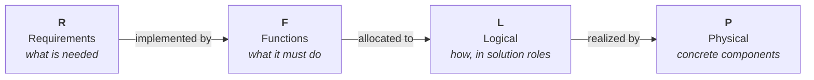

# F-16A RFLP MBSE Example

A teaching example that builds a **Model-Based Systems Engineering (MBSE)** model of the
**F-16A** using the **RFLP** framework in MathWorks tools (System Composer +
Requirements Toolbox, MATLAB R2026a).

RFLP structures a system model into four connected layers:



Each layer is a separate artifact; the layers are tied together by **traceability
links** (requirement → function) and, later, **allocation sets** (function → logical →
physical). That traceability is the whole point of MBSE: you can always answer "why does
this part exist?" and "where is this requirement satisfied?".

## Status

| Layer | Status | Artifact |
|-------|--------|----------|
| **R** – Requirements | ✅ Done | `requirements/f16a.slreqx` (26 requirements) |
| **F** – Functions | ✅ Done | `architecture/F16A_Functional.slx` (26 functions, 39 links) |
| **L** – Logical | ✅ Done | `logical/F16A_Logical.slx` (9 roles, 3 with traded options; allocation set with 14 edges) |
| **P** – Physical | ✅ Done | `physical/F16A_Physical.slx` (23 components; realization allocation; mass/materials/fuel roll-ups; OEW & cost MoMs; REQ_022 & REQ_P01 *verified by* tests) |

## Documentation map

| Document | Contents |
|----------|----------|
| [`01_requirements.md`](01_requirements.md) | The Requirements layer: how the requirements were derived from the Brandt F-16A sizing model, and how they are organized. |
| [`02_functions.md`](02_functions.md) | The Functions layer: the functional architecture, the F2T2EA combat kill chain, the shared capability tree, and the interfaces. |
| [`03_traceability.md`](03_traceability.md) | The requirement → function link matrix, the derived placeholder requirements, and known coverage gaps. |
| [`04_logical.md`](04_logical.md) | The Logical layer: the solution roles, the function → logical allocation set, the requirements L now owns, and the design-alternative variant roles with their trade study and selection. |
| [`05_physical.md`](05_physical.md) | The Physical layer: the physical decomposition, the mass roll-up to Operating Empty Weight, the OEW and unit-cost Measures of Merit, and the logical → physical realization allocation. |

## Folder layout

```
mbse/examples/f16a/
├─ f16a.prj                              Simulink Project (open this first)
├─ docs/                                 <- you are here
├─ requirements/
│   ├─ f16a.slreqx                       R layer: sizing-derived requirements (pristine)
│   ├─ generate_f16a_requirements.m      generator for the above
│   ├─ f16a_functional_derived.slreqx    derived placeholder requirements (D01–D09)
│   ├─ generate_f16a_derived_requirements.m
│   ├─ f16a_logical_derived.slreqx        logical decision requirements (L01–L03)
│   ├─ generate_f16a_logical_derived_requirements.m
│   ├─ f16a_physical_derived.slreqx       physical-layer requirements (P01: fuel volume)
│   ├─ generate_f16a_physical_derived_requirements.m
│   └─ *~slreqx.slmx                      verify link sets (requirement → test)
├─ architecture/
│   ├─ F16A_Functional.slx               F layer: System Composer model
│   ├─ F16A_Functional.sldd              interface dictionary (FlightState, EngagementData)
│   └─ F16A_Functional~mdl.slmx          requirement links (auto-generated)
├─ generate_f16a_functional.m            builds the F model + traceability links
├─ F16AFunctionalArchitectureTest.m      unit tests for the F layer
├─ logical/
│   ├─ F16A_Logical.slx                  L layer: System Composer model (9 solution roles)
│   ├─ F16A_Logical.sldd                 logical interface dictionary (FuelFlow, ThrustVector, …)
│   ├─ F16A_Logical~mdl.slmx             requirement links (auto-generated)
│   ├─ F16A_LogicalTrades.xml            stereotype profile for trade candidates
│   └─ F16A_FunctionToLogical.mldatx     function → logical allocation set
├─ generate_f16a_logical.m               builds the L model + profile + allocation + L links
├─ F16ALogicalTradeStudy.m               trades the variant-role options and selects one
├─ F16ALogicalArchitectureTest.m         unit tests for the L layer
├─ physical/
│   ├─ F16A_Physical.slx                 P layer: System Composer model (Aircraft + 11 assemblies)
│   ├─ F16A_Physical.sldd                physical interface dictionary (ThrustMech, ElecPower, …)
│   ├─ F16A_Physical~mdl.slmx            requirement links (auto-generated)
│   ├─ F16A_PhysicalProps.xml            stereotype profile (PhysicalItem, MeasureOfMerit, Material, FuelTank)
│   └─ F16A_LogicalToPhysical.mldatx     logical → physical realization allocation set
├─ generate_f16a_physical.m              builds the P model + profiles + realization + roll-ups + links
├─ F16APhysicalMassRollup.m              native roll-up of part masses to OEW
├─ F16APhysicalMaterialsRollup.m         roll-up of the airframe composite fraction (REQ_022)
├─ F16APhysicalFuelRollup.m              roll-up of available internal fuel capacity (REQ_P01)
├─ F16APhysicalCostModel.m               cost-model hook for the unit-cost MoM (stub)
├─ F16APhysicalMissionFuel.m             mission-fuel hook for the fuel-volume check (stub → NaN)
├─ F16APhysicalArchitectureTest.m        unit tests: the P model is built correctly
└─ F16APhysicalVerificationTest.m        "verified by" tests: the design meets REQ_022 / REQ_P01
```

## How to open and run

Open the project, then everything resolves by name:

```matlab
openProject("f16a.prj")
```

Regenerate the artifacts (order matters — the functional generator creates links into the
requirement sets, so the requirements must exist first):

```matlab
generate_f16a_requirements                  % -> requirements/f16a.slreqx
generate_f16a_derived_requirements          % -> requirements/f16a_functional_derived.slreqx
generate_f16a_functional                    % -> architecture/F16A_Functional.slx + links
generate_f16a_logical_derived_requirements  % -> requirements/f16a_logical_derived.slreqx (L01–L03)
generate_f16a_logical                       % -> logical/F16A_Logical.slx + profile + allocation + links
                                            %    (calls F16ALogicalTradeStudy to select the traded options)
generate_f16a_physical_derived_requirements % -> requirements/f16a_physical_derived.slreqx (P01 fuel)
generate_f16a_physical                      % -> physical/F16A_Physical.slx + profiles + realization
                                            %    (runs the mass/materials/fuel roll-ups; adds the
                                            %     cost/materials/fuel requirement + verify links)
```

Open the models and run the tests:

```matlab
systemcomposer.openModel("F16A_Functional")
systemcomposer.openModel("F16A_Logical")
systemcomposer.openModel("F16A_Physical")
systemcomposer.allocation.editor            % inspect the allocation matrices (F→L and L→P)
F16APhysicalMassRollup                       % print the mass roll-up and OEW
runtests("F16AFunctionalArchitectureTest")
runtests("F16ALogicalArchitectureTest")
runtests("F16APhysicalArchitectureTest")
runtests("F16APhysicalVerificationTest")     % NOTE: the fuel-volume test fails on purpose
                                             % (mission-fuel stub) until /sizing/ is connected
```

## Prerequisites

- MATLAB R2026a
- Simulink, System Composer, Requirements Toolbox

## Maintaining the model

The generators are **idempotent** — re-run any of them to rebuild that artifact from
scratch. One MATLAB-version gotcha worth knowing if you edit `generate_f16a_functional.m`:
in R2026a, connect ports with the **two-argument** form `connect(srcPort, dstPort)`. The
three-argument form `connect(arch, srcPort, dstPort)` returns a connector object but
silently leaves the ports unwired — a bug that only surfaces as unconnected ports later.
