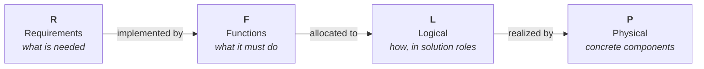

# F-16A RFLP MBSE Example

A teaching example that builds a **Model-Based Systems Engineering (MBSE)** model of the
**F-16A** using the **RFLP** framework in MathWorks tools (System Composer +
Requirements Toolbox, MATLAB R2026a).

RFLP structures a system model into four connected layers:



Each layer is a separate artifact; the layers are tied together by **traceability
links** (requirement → function) and, later, **allocation sets** (function → logical →
physical). That traceability is the whole point of MBSE: you can always answer "why does
this part exist?" and "where is this requirement satisfied?".

## Status

| Layer | Status | Artifact |
|-------|--------|----------|
| **R** – Requirements | ✅ Done | `requirements/f16a.slreqx` (26 requirements) |
| **F** – Functions | ✅ Done | `architecture/F16A_Functional.slx` (26 functions, 39 links) |
| **L** – Logical | ✅ Done | `logical/F16A_Logical.slx` (9 roles, 3 presenting technology-neutral **kinds** — the choice between them is decided at P; allocation set with 14 edges) |
| **P** – Physical | ✅ Done | `physical/F16A_Physical.slx` (**30 components**, incl. 7 parameterized candidates across 3 variant roles; **trade study** that scores them, decides, and writes the decision back to L and to REQ_F16A_L01–L03; realization allocation with 14 edges; mass/materials/fuel roll-ups; OEW & cost MoMs; REQ_022 & REQ_P01 *verified by* tests) |

Three requirements carry a "verified by" test, and they are in **three different states** — met,
evaluated-and-violated, and not evaluated at all. Two of the three are red, for reasons that are not
the same reason; [see below](#three-requirements-three-verification-states).

## Documentation map

| Document | Contents |
|----------|----------|
| [`01_requirements.md`](01_requirements.md) | The Requirements layer: how the requirements were derived from the Brandt F-16A sizing model, and how they are organized. |
| [`02_functions.md`](02_functions.md) | The Functions layer: the functional architecture, the F2T2EA combat kill chain, the shared capability tree, and the interfaces. |
| [`03_traceability.md`](03_traceability.md) | The requirement → function link matrix, the derived placeholder requirements, and known coverage gaps. |
| [`04_logical.md`](04_logical.md) | The Logical layer: the solution roles, the function → logical allocation set, the requirements L now owns, and the variant roles that present competing technology-neutral kinds — presented here, decided at P. |
| [`05_physical.md`](05_physical.md) | The Physical layer: the 30-component decomposition and its 7 trade candidates, the trade study that decides between them, the roll-ups to Operating Empty Weight / composite fraction / available fuel, the Measures of Merit, the `Rationale` and `DataProvenance` every part carries, and the logical → physical realization allocation. |
| [`06_methodology.md`](06_methodology.md) | **Why the trade lives at P and not at L**: the kind-vs-candidate boundary rule, its grounding in ARCADIA, OOSEM, morphological analysis and set-based design — and a candid account of what the weighted-sum scoring does *not* justify. |
| [`07_decision_log.md`](07_decision_log.md) | **Append-only record of every decision** (D-001 …), including the decisions *not* to do something. D-030 is the inventory of every invented number in the model — the list every `Estimate` tag points at. |
| [`08_agent_team.md`](08_agent_team.md) | The specialist agent team that maintains this example, the **house rules** every agent follows, and the measured R2026a System Composer API findings that drove real design choices. |

## Folder layout

```
mbse/examples/f16a/
├─ f16a.prj                              Simulink Project (open this first)
├─ f16aRoot.m                            path anchor: absolute path to the example root
├─ F16AOpenForReview.m                   load all models + requirement sets, open the editor
├─ docs/                                 <- you are here
├─ requirements/                         R layer
│   ├─ f16a.slreqx                       sizing-derived requirements (pristine)
│   ├─ generate_f16a_requirements.m      generator for the above
│   ├─ f16a_functional_derived.slreqx    derived placeholder requirements (D01–D09)
│   ├─ generate_f16a_derived_requirements.m
│   ├─ f16a_logical_derived.slreqx       logical decision requirements (L01–L03)
│   ├─ generate_f16a_logical_derived_requirements.m
│   ├─ f16a_physical_derived.slreqx      physical-layer requirements (P01: fuel volume)
│   ├─ generate_f16a_physical_derived_requirements.m
│   └─ F16ARequirementsTest.m            unit tests for the R layer
├─ architecture/                         F layer
│   ├─ F16A_Functional.slx               System Composer model
│   ├─ F16A_Functional.sldd              interface dictionary (FlightState, EngagementData)
│   ├─ F16A_Functional~mdl.slmx          requirement links (auto-generated)
│   ├─ generate_f16a_functional.m        builds the F model + traceability links
│   └─ F16AFunctionalArchitectureTest.m  unit tests for the F layer
├─ logical/                              L layer
│   ├─ F16A_Logical.slx                  System Composer model (9 solution roles)
│   ├─ F16A_Logical.sldd                 logical interface dictionary (FuelFlow, ThrustVector, …)
│   ├─ F16A_Logical~mdl.slmx             requirement links (auto-generated)
│   ├─ F16A_LogicalOptions.xml           stereotype profile for solution options (Selected, DecisionRef)
│   ├─ F16A_FunctionToLogical.mldatx     function → logical allocation set
│   ├─ generate_f16a_logical.m           builds the L model + profile + allocation + L links
│   └─ F16ALogicalArchitectureTest.m     unit tests for the L layer
├─ physical/                             P layer
│   ├─ F16A_Physical.slx                 System Composer model (Aircraft + 11 assemblies, 3 of them
│   │                                    variant roles holding 7 candidates)
│   ├─ F16A_Physical.sldd                physical interface dictionary (ThrustMech, ElecPower, …)
│   ├─ F16A_Physical~mdl.slmx            requirement links (auto-generated)
│   ├─ F16A_PhysicalProps.xml            stereotype profile (PhysicalItem, MeasureOfMerit, Material,
│   │                                    FuelTank, Rationale, TradeCandidate)
│   ├─ F16ASourceKind.m                  enumeration: why a part exists (Rationale.SourceKind)
│   ├─ F16ADataProvenance.m              enumeration: where a number came from (DataProvenance)
│   ├─ F16A_LogicalToPhysical.mldatx     logical → physical realization allocation set (14 edges)
│   ├─ generate_f16a_physical.m          builds the P model + profiles + realization, RUNS THE TRADE,
│   │                                    then the roll-ups and the requirement links
│   ├─ F16APhysicalTradeStudy.m          scores the candidates, picks a winner per role, writes the
│   │                                    decision into P, back into L, and into REQ_F16A_L01–L03
│   ├─ F16APhysicalTradeGuards.m         the trade's guard rails as a pure classdef of static
│   │                                    methods + the declared scales — extracted so they can be
│   │                                    tested WITHOUT running the study (which writes artifacts)
│   ├─ F16APhysicalMassRollup.m          native roll-up of part masses to OEW
│   ├─ F16APhysicalMaterialsRollup.m     roll-up of the airframe composite fraction (REQ_022)
│   ├─ F16APhysicalFuelRollup.m          roll-up of available internal fuel capacity (REQ_P01)
│   ├─ F16APhysicalCostModel.m           cost-model hook for the unit-cost MoM (stub)
│   ├─ F16APhysicalMissionFuel.m         mission-fuel hook for the fuel-volume check (stub → NaN)
│   ├─ F16APhysicalArchitectureTest.m    machinery tests: the P model is built correctly
│   └─ F16APhysicalTradeGuardsTest.m     negative tests: the guards still REFUSE bad parameters
│                                        (touches no model — runs on a bare checkout)
└─ verification/                         requirement-verification tests (own folder)
    ├─ F16AMaterialsVerificationTest.m   "verified by" test for REQ_F16A_022 (composite ≤ 20%)
    ├─ F16AFuelVerificationTest.m        "verified by" test for REQ_F16A_P01 (fuel volume) — red BY
    │                                    DESIGN and permanently, because nothing is computed yet
    │                                    (D-042): the requirement is UNEVALUATED
    ├─ F16AStaticMarginVerificationTest.m
    │                                    "verified by" test for REQ_F16A_025 (static margin negative,
    │                                    ≥ −6 %MAC); the only verification that leaves the MBSE model,
    │                                    reading /sizing/ read-only through a PathFixture. 2 pass,
    │                                    1 red BY DESIGN: the requirement IS evaluated and IS
    │                                    VIOLATED at landing (D-051) — a different red from the above
    └─ *VerificationTest~m.slmx          manual verify link sets (requirement → test)
```

Every script derives the sibling layer-folder paths from `f16aRoot.m` (the example root), so
it works regardless of which layer folder it sits in. Each layer folder — `requirements/`,
`architecture/`, `logical/`, `physical/`, `verification/` — is on the **project path**, so
`openProject` makes every generator, roll-up, and test resolvable by name. If you add a new
folder, add it to the project path (Project tab → Project Path) so its files resolve too.

That path is load-bearing for more than convenience: two stereotype properties are typed by the
**enumeration classdefs** `F16ASourceKind.m` and `F16ADataProvenance.m`, which must be on the MATLAB
path whenever `F16A_PhysicalProps` is loaded. They sit in `physical/`, which is on the project path.

## How to open and run

Open the project, then everything resolves by name:

```matlab
openProject("f16a.prj")
```

Regenerate the artifacts (order matters — the functional generator creates links into the
requirement sets, so the requirements must exist first):

```matlab
generate_f16a_requirements                  % -> requirements/f16a.slreqx
generate_f16a_derived_requirements          % -> requirements/f16a_functional_derived.slreqx
generate_f16a_functional                    % -> architecture/F16A_Functional.slx + links
generate_f16a_logical_derived_requirements  % -> requirements/f16a_logical_derived.slreqx (L01–L03)
generate_f16a_logical                       % -> logical/F16A_Logical.slx + profile + allocation + links
                                            %    (presents the solution kinds; ships them UNRESOLVED —
                                            %     the physical trade study decides and writes back)
generate_f16a_physical_derived_requirements % -> requirements/f16a_physical_derived.slreqx (P01 fuel)
generate_f16a_physical                      % -> physical/F16A_Physical.slx + profiles + realization
                                            %    RUNS THE TRADE STUDY (F16APhysicalTradeStudy): it
                                            %    scores the 7 candidates, sets the active choice from
                                            %    the score, writes the winning KIND back into
                                            %    F16A_Logical.slx and Implement-links REQ_F16A_L01–L03
                                            %    -- so the L model ships RESOLVED after this step.
                                            %    Then runs the mass/materials/fuel roll-ups (which
                                            %    therefore measure the configuration the trade chose)
                                            %    and adds the cost/materials/fuel Implement links;
                                            %    verify links are added manually.
```

The trade study can also be re-run on its own once the model exists:

```matlab
F16APhysicalTradeStudy                       % prints the full ranked table per role; idempotent
```

Open the models and run the tests:

```matlab
systemcomposer.openModel("F16A_Functional")
systemcomposer.openModel("F16A_Logical")
systemcomposer.openModel("F16A_Physical")
systemcomposer.allocation.editor            % inspect the allocation matrices (F→L and L→P)
F16APhysicalMassRollup                       % print the mass roll-up and OEW
runtests("F16ARequirementsTest")             % 9 tests — machinery: the R layer's four requirement
                                             % sets are built correctly. The bans (no vendor or
                                             % programme token, no decimal literal in the decision
                                             % requirements), the keyword rules (`todo` marks
                                             % exactly the 11 student exercises AS A SET; no
                                             % `verify` keyword anywhere), REQ_025's criterion and
                                             % its D-030 Estimate label, REQ_026's `minimize`, the
                                             % 35/10/4/2 item counts over 51 unique ids, and
                                             % Summary/Description/Rationale on every non-container
runtests("F16AFunctionalArchitectureTest")
runtests("F16ALogicalArchitectureTest")      % 15 tests — machinery: the L model is built correctly
runtests("F16APhysicalArchitectureTest")     % 39 tests — machinery: the P model is built correctly,
                                             % incl. the candidates, the recorded decision,
                                             % provenance completeness and the trade study's
                                             % input contract
runtests("F16APhysicalTradeGuardsTest")      % 32 cases (19 methods, 3 parameterized) — the trade's
                                             % guards still REFUSE what they exist to refuse.
                                             % Needs no project and no models: it tests a pure class
runtests("F16AMaterialsVerificationTest")    % REQ_F16A_022 met (composite ≤ 20%) — passes
runtests("F16AStaticMarginVerificationTest") % 3 tests — 2 PASS, 1 FAILS BY DESIGN. REQ_F16A_025
                                             % wants a negative static margin (≥ −6 %MAC) at both
                                             % ends of the CG range: takeoff meets it at −0.2602
                                             % %MAC, landing VIOLATES it at +0.2065 %MAC (D-051).
                                             % Reads /sizing/ read-only. The third test,
                                             % testAnalysisProducedUsableMargins, still PASSES —
                                             % which is how you know the red is a real violation
                                             % and not a broken analysis
runtests("F16AFuelVerificationTest")         % REQ_F16A_P01 — FAILS BY DESIGN, but NOT for the same
                                             % reason: the mission-fuel analysis is a permanent stub
                                             % (D-042), so nothing was computed and the requirement
                                             % is UNEVALUATED, not violated
```

**Two of those reds are by design, and they are different reds.** The whole sweep is **106 cases with
2 intentional failures**; a run that reports "2 tests fail" and nothing else has lost the point.

### Three requirements, three verification states

| Requirement | Test | State | What it teaches |
|---|---|---|---|
| `REQ_F16A_022` composite ≤ 20% | `F16AMaterialsVerificationTest` | 🟢 **met** | the requirement holds, and the evidence is a roll-up over the model itself |
| `REQ_F16A_P01` fuel volume | `F16AFuelVerificationTest` | 🔴 **unevaluated** | verification is set up, linked and traceable — but the required side is `NaN`, so *nothing has been checked yet* (D-042) |
| `REQ_F16A_025` static margin | `F16AStaticMarginVerificationTest` | 🔴 **violated** | the requirement *was* evaluated, against a real number, and **the design does not meet it** (D-051) |

A requirement can be met, not met, or not yet judged — and a red square tells you which only if you
read why. The example shipped the first and the third state for a long time and called them
"green" and "the failing test". `REQ_F16A_025` supplies the middle one: **evaluated, and unsatisfied**,
which is the state a real programme spends most of its life in and the one nothing else here shows.

Two consequences worth holding on to:

- **A pending verification is not a failing design; a failing verification is not a broken tool.**
  `REQ_F16A_P01` says nothing at all about the fuel system's adequacy. `REQ_F16A_025` says something
  quite specific about the aircraft's balance.
- **`testAnalysisProducedUsableMargins` passing is what separates them.** It was built (D-047) so that
  *"the aircraft violates `REQ_F16A_025`"* and *"the analysis that evaluates it is broken"* could never
  arrive looking identical — a check the example previously described and never had to use. It is
  green while its two siblings split 1–1, so the landing margin is a number the model really produced.
- **The landing failure is a property of the reference model, not of the F-16A.** Brandt's neutral
  point is a simplified approximation, and the CG crosses it as fuel burns off. See
  [`01_requirements.md`](01_requirements.md#025) before quoting it as a fact about the aeroplane.

The P layer's tests are split three ways on purpose, and each split has a reason:

- `F16APhysicalArchitectureTest` — **machinery**: components, stereotypes, roll-up self-consistency,
  the recorded decision, and that the links were wired.
- `F16APhysicalTradeGuardsTest` — **negative tests for the scoring code**. It is the only suite that
  touches no artifact, which is exactly why it can safely feed the guards bad data and watch them
  refuse. Proving that inside the trade study would mean running a script that writes two models and
  a requirement set — and it would pass right up until the guard was deleted, then write a wrong
  decision into the repo. See [`05_physical.md`](05_physical.md#verification).
- The three `*VerificationTest` files — **requirement verification**, referenced by the Verify links.
  Each requirement's Verify link points to its **own** file, which is what keeps the two by-design
  reds **isolated and legible**: `REQ_F16A_022`'s verifier stays all-green, and `REQ_F16A_P01`'s
  pending state and `REQ_F16A_025`'s violation are each reported by the suite that owns them. One
  combined suite would report "2 failures" and hide the fact that they mean different things.

## Reviewing requirement traceability

To see **Implemented by / Verified by** links in the Requirements Editor, load the whole model
first — then open the editor:

```matlab
F16AOpenForReview      % loads the 3 models, the 4 requirement sets and every verification link set,
                       % prints which requirements are verified and which test still needs a hand
                       % link, then opens the Requirements Editor
```

This matters because of how Requirements Toolbox stores links. An **Implement** link
(`component → requirement`) lives in the *implementing model's* link set, **not** the requirement
set. So if you open only `f16a.slreqx`, the Functional/Logical/Physical model link sets are not
loaded, and requirements look un-implemented — e.g. `REQ_F16A_020/023/024/025` (Logical) and
`REQ_F16A_022/026` + `REQ_F16A_P01` (Physical) show no implement link. Loading the models (what
`F16AOpenForReview` does) brings those link sets in and the links appear.

The three **decision** requirements `REQ_F16A_L01–L03` are a good illustration of the rule: they are
Implement-linked by the *physical* trade study, but from the winning **kind** in `F16A_Logical.slx`,
so their links live in the **L model's** link set — not the P model's, and not the requirement set's.

### Verification links are added manually (known issue)

The **generators create Implement links only.** The **"Verified by" links must be added by hand** in
the Requirements Editor, and the reason is a single R2026a tool limitation: **a MATLAB test file
cannot be a link *source***, so the programmatic `slreq` API cannot mint a working "Verified by" for
a unit test on its own. So each time you add a verified requirement, link it manually to its
verification test:

| Requirement | Link "Verified by" to | State |
|-------------|-----------------------|-------|
| `REQ_F16A_022` (composite ≤ 20%) | `F16AMaterialsVerificationTest` | linked |
| `REQ_F16A_P01` (fuel volume) | `F16AFuelVerificationTest` | linked |
| `REQ_F16A_025` (static margin negative, ≥ −6 %MAC) | `F16AStaticMarginVerificationTest` | linked (2026-08-03) |

All three are now linked, so this table has no outstanding row — but it stays, because the *reason*
it exists has not gone away: the next verified requirement will need the same hand-made link.

**A red test is still a linked test, and that is the point of linking them.** `REQ_F16A_P01` and
`REQ_F16A_025` both fail by design, and both are traceable from the requirement to the evidence that
judged it. Verification traceability records *that the requirement was checked* — not that it passed.

Each verification test is a single, self-contained suite that checks exactly that one requirement,
so it is safe to run as the requirement's verification.

**A hand-made link is not fragile.** The generator prints this reminder and never touches the
requirement-set link sets, and the links survive a rebuild: measured after regenerating all four
requirement sets, `REQ_F16A_022` and `REQ_F16A_P01` still report `Implement, Verify`. `slreq.new`
builds a fresh set, but with the requirement ids and their order unchanged the hand-made links still
resolve. Regeneration is therefore not a reason to defer making one.

**When a Verify link seems to be missing, it is usually not loaded.** A link lives in the link set of
the artifact that *makes* it — the same rule the Implement links above illustrate — so a Verify link
made from a MATLAB test lives in `verification/<TestName>~m.slmx`, and until that set is loaded the
requirement reads Implement-only. Loading those sets is what `F16AOpenForReview` is for. This one is
measured rather than reasoned: with the project's **Digital Thread artifact tracking** enabled, the
links still did not appear until each `~m.slmx` was explicitly `slreq.load`-ed — so the project
setting is not what makes them work.

`F16AOpenForReview` **globs** `verification/*~m.slmx` rather than naming link sets, and then reports
what it found by reading the artifacts: which requirements carry a Verify link, and which
`*VerificationTest.m` has none on disk. No requirement id and no test name is typed into it. So the
table above and the tool cannot drift apart — the `025` link was made on 2026-08-03, its
`F16AStaticMarginVerificationTest~m.slmx` appeared beside the other two, and the glob picks it up with
no edit to any file. The next verification test arrives the same way.

## Prerequisites

- MATLAB R2026a
- Simulink, System Composer, Requirements Toolbox

## Maintaining the model

The generators are **idempotent** — re-run any of them to rebuild that artifact from
scratch. One MATLAB-version gotcha worth knowing if you edit `generate_f16a_functional.m`:
in R2026a, connect ports with the **two-argument** form `connect(srcPort, dstPort)`. The
three-argument form `connect(arch, srcPort, dstPort)` returns a connector object but
silently leaves the ports unwired — a bug that only surfaces as unconnected ports later.
