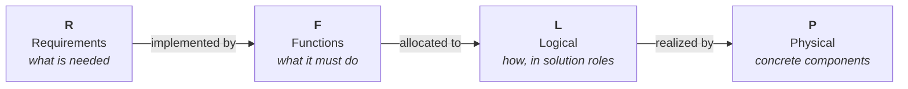

# F-16A RFLP MBSE Example

A teaching example that builds a **Model-Based Systems Engineering (MBSE)** model of the
**F-16A** using the **RFLP** framework in MathWorks tools (System Composer +
Requirements Toolbox, MATLAB R2026a).

RFLP structures a system model into four connected layers:



Each layer is a separate artifact; the layers are tied together by **traceability
links** (requirement → function) and, later, **allocation sets** (function → logical →
physical). That traceability is the whole point of MBSE: you can always answer "why does
this part exist?" and "where is this requirement satisfied?".

## Status

| Layer | Status | Artifact |
|-------|--------|----------|
| **R** – Requirements | ✅ Done | `requirements/f16a.slreqx` (26 requirements) |
| **F** – Functions | ✅ Done | `architecture/F16A_Functional.slx` (26 functions, 39 links) |
| **L** – Logical | ✅ Done | `logical/F16A_Logical.slx` (9 roles, 3 presenting technology-neutral **kinds** — the choice between them is decided at P; allocation set with 14 edges) |
| **P** – Physical | ✅ Done | `physical/F16A_Physical.slx` (**30 components**, incl. 7 parameterized candidates across 3 variant roles; **trade study** that scores them, decides, and writes the decision back to L and to REQ_F16A_L01–L03; realization allocation with 14 edges; mass/materials/fuel roll-ups; OEW & cost MoMs; REQ_022 & REQ_P01 *verified by* tests) |

## Documentation map

| Document | Contents |
|----------|----------|
| [`01_requirements.md`](01_requirements.md) | The Requirements layer: how the requirements were derived from the Brandt F-16A sizing model, and how they are organized. |
| [`02_functions.md`](02_functions.md) | The Functions layer: the functional architecture, the F2T2EA combat kill chain, the shared capability tree, and the interfaces. |
| [`03_traceability.md`](03_traceability.md) | The requirement → function link matrix, the derived placeholder requirements, and known coverage gaps. |
| [`04_logical.md`](04_logical.md) | The Logical layer: the solution roles, the function → logical allocation set, the requirements L now owns, and the variant roles that present competing technology-neutral kinds — presented here, decided at P. |
| [`05_physical.md`](05_physical.md) | The Physical layer: the 30-component decomposition and its 7 trade candidates, the trade study that decides between them, the roll-ups to Operating Empty Weight / composite fraction / available fuel, the Measures of Merit, the `Rationale` and `DataProvenance` every part carries, and the logical → physical realization allocation. |
| [`06_methodology.md`](06_methodology.md) | **Why the trade lives at P and not at L**: the kind-vs-candidate boundary rule, its grounding in ARCADIA, OOSEM, morphological analysis and set-based design — and a candid account of what the weighted-sum scoring does *not* justify. |
| [`07_decision_log.md`](07_decision_log.md) | **Append-only record of every decision** (D-001 …), including the decisions *not* to do something. D-030 is the inventory of every invented number in the model — the list every `Estimate` tag points at. |
| [`08_agent_team.md`](08_agent_team.md) | The specialist agent team that maintains this example, the **house rules** every agent follows, and the measured R2026a System Composer API findings that drove real design choices. |

## Folder layout

```
mbse/examples/f16a/
├─ f16a.prj                              Simulink Project (open this first)
├─ f16aRoot.m                            path anchor: absolute path to the example root
├─ F16AOpenForReview.m                   load all models + requirement sets, open the editor
├─ docs/                                 <- you are here
├─ requirements/                         R layer
│   ├─ f16a.slreqx                       sizing-derived requirements (pristine)
│   ├─ generate_f16a_requirements.m      generator for the above
│   ├─ f16a_functional_derived.slreqx    derived placeholder requirements (D01–D09)
│   ├─ generate_f16a_derived_requirements.m
│   ├─ f16a_logical_derived.slreqx       logical decision requirements (L01–L03)
│   ├─ generate_f16a_logical_derived_requirements.m
│   ├─ f16a_physical_derived.slreqx      physical-layer requirements (P01: fuel volume)
│   └─ generate_f16a_physical_derived_requirements.m
├─ architecture/                         F layer
│   ├─ F16A_Functional.slx               System Composer model
│   ├─ F16A_Functional.sldd              interface dictionary (FlightState, EngagementData)
│   ├─ F16A_Functional~mdl.slmx          requirement links (auto-generated)
│   ├─ generate_f16a_functional.m        builds the F model + traceability links
│   └─ F16AFunctionalArchitectureTest.m  unit tests for the F layer
├─ logical/                              L layer
│   ├─ F16A_Logical.slx                  System Composer model (9 solution roles)
│   ├─ F16A_Logical.sldd                 logical interface dictionary (FuelFlow, ThrustVector, …)
│   ├─ F16A_Logical~mdl.slmx             requirement links (auto-generated)
│   ├─ F16A_LogicalOptions.xml           stereotype profile for solution options (Selected, DecisionRef)
│   ├─ F16A_FunctionToLogical.mldatx     function → logical allocation set
│   ├─ generate_f16a_logical.m           builds the L model + profile + allocation + L links
│   └─ F16ALogicalArchitectureTest.m     unit tests for the L layer
├─ physical/                             P layer
│   ├─ F16A_Physical.slx                 System Composer model (Aircraft + 11 assemblies, 3 of them
│   │                                    variant roles holding 7 candidates)
│   ├─ F16A_Physical.sldd                physical interface dictionary (ThrustMech, ElecPower, …)
│   ├─ F16A_Physical~mdl.slmx            requirement links (auto-generated)
│   ├─ F16A_PhysicalProps.xml            stereotype profile (PhysicalItem, MeasureOfMerit, Material,
│   │                                    FuelTank, Rationale, TradeCandidate)
│   ├─ F16ASourceKind.m                  enumeration: why a part exists (Rationale.SourceKind)
│   ├─ F16ADataProvenance.m              enumeration: where a number came from (DataProvenance)
│   ├─ F16A_LogicalToPhysical.mldatx     logical → physical realization allocation set (14 edges)
│   ├─ generate_f16a_physical.m          builds the P model + profiles + realization, RUNS THE TRADE,
│   │                                    then the roll-ups and the requirement links
│   ├─ F16APhysicalTradeStudy.m          scores the candidates, picks a winner per role, writes the
│   │                                    decision into P, back into L, and into REQ_F16A_L01–L03
│   ├─ F16APhysicalTradeGuards.m         the trade's guard rails as a pure classdef of static
│   │                                    methods + the declared scales — extracted so they can be
│   │                                    tested WITHOUT running the study (which writes artifacts)
│   ├─ F16APhysicalMassRollup.m          native roll-up of part masses to OEW
│   ├─ F16APhysicalMaterialsRollup.m     roll-up of the airframe composite fraction (REQ_022)
│   ├─ F16APhysicalFuelRollup.m          roll-up of available internal fuel capacity (REQ_P01)
│   ├─ F16APhysicalCostModel.m           cost-model hook for the unit-cost MoM (stub)
│   ├─ F16APhysicalMissionFuel.m         mission-fuel hook for the fuel-volume check (stub → NaN)
│   ├─ F16APhysicalArchitectureTest.m    machinery tests: the P model is built correctly
│   └─ F16APhysicalTradeGuardsTest.m     negative tests: the guards still REFUSE bad parameters
│                                        (touches no model — runs on a bare checkout)
└─ verification/                         requirement-verification tests (own folder)
    ├─ F16AMaterialsVerificationTest.m   "verified by" test for REQ_F16A_022 (composite ≤ 20%)
    ├─ F16AFuelVerificationTest.m        "verified by" test for REQ_F16A_P01 (fuel volume) — fails until /sizing/
    └─ *VerificationTest~m.slmx          manual verify link sets (requirement → test)
```

Every script derives the sibling layer-folder paths from `f16aRoot.m` (the example root), so
it works regardless of which layer folder it sits in. Each layer folder — `requirements/`,
`architecture/`, `logical/`, `physical/`, `verification/` — is on the **project path**, so
`openProject` makes every generator, roll-up, and test resolvable by name. If you add a new
folder, add it to the project path (Project tab → Project Path) so its files resolve too.

That path is load-bearing for more than convenience: two stereotype properties are typed by the
**enumeration classdefs** `F16ASourceKind.m` and `F16ADataProvenance.m`, which must be on the MATLAB
path whenever `F16A_PhysicalProps` is loaded. They sit in `physical/`, which is on the project path.

## How to open and run

Open the project, then everything resolves by name:

```matlab
openProject("f16a.prj")
```

Regenerate the artifacts (order matters — the functional generator creates links into the
requirement sets, so the requirements must exist first):

```matlab
generate_f16a_requirements                  % -> requirements/f16a.slreqx
generate_f16a_derived_requirements          % -> requirements/f16a_functional_derived.slreqx
generate_f16a_functional                    % -> architecture/F16A_Functional.slx + links
generate_f16a_logical_derived_requirements  % -> requirements/f16a_logical_derived.slreqx (L01–L03)
generate_f16a_logical                       % -> logical/F16A_Logical.slx + profile + allocation + links
                                            %    (presents the solution kinds; ships them UNRESOLVED —
                                            %     the physical trade study decides and writes back)
generate_f16a_physical_derived_requirements % -> requirements/f16a_physical_derived.slreqx (P01 fuel)
generate_f16a_physical                      % -> physical/F16A_Physical.slx + profiles + realization
                                            %    RUNS THE TRADE STUDY (F16APhysicalTradeStudy): it
                                            %    scores the 7 candidates, sets the active choice from
                                            %    the score, writes the winning KIND back into
                                            %    F16A_Logical.slx and Implement-links REQ_F16A_L01–L03
                                            %    -- so the L model ships RESOLVED after this step.
                                            %    Then runs the mass/materials/fuel roll-ups (which
                                            %    therefore measure the configuration the trade chose)
                                            %    and adds the cost/materials/fuel Implement links;
                                            %    verify links are added manually.
```

The trade study can also be re-run on its own once the model exists:

```matlab
F16APhysicalTradeStudy                       % prints the full ranked table per role; idempotent
```

Open the models and run the tests:

```matlab
systemcomposer.openModel("F16A_Functional")
systemcomposer.openModel("F16A_Logical")
systemcomposer.openModel("F16A_Physical")
systemcomposer.allocation.editor            % inspect the allocation matrices (F→L and L→P)
F16APhysicalMassRollup                       % print the mass roll-up and OEW
runtests("F16AFunctionalArchitectureTest")
runtests("F16ALogicalArchitectureTest")      % 15 tests — machinery: the L model is built correctly
runtests("F16APhysicalArchitectureTest")     % 39 tests — machinery: the P model is built correctly,
                                             % incl. the candidates, the recorded decision,
                                             % provenance completeness and the trade study's
                                             % input contract
runtests("F16APhysicalTradeGuardsTest")      % 32 cases (19 methods, 3 parameterized) — the trade's
                                             % guards still REFUSE what they exist to refuse.
                                             % Needs no project and no models: it tests a pure class
runtests("F16AMaterialsVerificationTest")    % REQ_F16A_022 met (composite ≤ 20%) — passes
runtests("F16AFuelVerificationTest")         % REQ_F16A_P01 — FAILS on purpose (mission-fuel
                                             % stub) until /sizing/ is connected
```

The P layer's tests are split three ways on purpose, and each split has a reason:

- `F16APhysicalArchitectureTest` — **machinery**: components, stereotypes, roll-up self-consistency,
  the recorded decision, and that the links were wired.
- `F16APhysicalTradeGuardsTest` — **negative tests for the scoring code**. It is the only suite that
  touches no artifact, which is exactly why it can safely feed the guards bad data and watch them
  refuse. Proving that inside the trade study would mean running a script that writes two models and
  a requirement set — and it would pass right up until the guard was deleted, then write a wrong
  decision into the repo. See [`05_physical.md`](05_physical.md#verification).
- The two `*VerificationTest` files — **requirement verification**, referenced by the Verify links.
  Each requirement's Verify link points to its **own** file, so `REQ_F16A_022`'s verifier is
  all-green and `REQ_F16A_P01`'s intentional failure stays isolated.

## Reviewing requirement traceability

To see **Implemented by / Verified by** links in the Requirements Editor, load the whole model
first — then open the editor:

```matlab
F16AOpenForReview      % loads the 3 models + 4 requirement sets, opens the Requirements Editor
```

This matters because of how Requirements Toolbox stores links. An **Implement** link
(`component → requirement`) lives in the *implementing model's* link set, **not** the requirement
set. So if you open only `f16a.slreqx`, the Functional/Logical/Physical model link sets are not
loaded, and requirements look un-implemented — e.g. `REQ_F16A_020/023/024/025` (Logical) and
`REQ_F16A_022/026` + `REQ_F16A_P01` (Physical) show no implement link. Loading the models (what
`F16AOpenForReview` does) brings those link sets in and the links appear.

The three **decision** requirements `REQ_F16A_L01–L03` are a good illustration of the rule: they are
Implement-linked by the *physical* trade study, but from the winning **kind** in `F16A_Logical.slx`,
so their links live in the **L model's** link set — not the P model's, and not the requirement set's.

### Verification links are added manually (known issue)

The **generators create Implement links only.** The **"Verified by" links must be added by hand** in
the Requirements Editor. In R2026a the programmatic `slreq` API can't create a working "Verified by"
for a MATLAB unit test on its own — a MATLAB test file can't be a link *source*, and the working
"Verified by" relies on the project's **Digital Thread artifact tracking** (a manual project
setting, enabled from the project's *requirements/traceability* settings). So each time you add a
verified requirement, link it manually to its verification test:

| Requirement | Link "Verified by" to |
|-------------|-----------------------|
| `REQ_F16A_022` (composite ≤ 20%) | `F16AMaterialsVerificationTest` |
| `REQ_F16A_P01` (fuel volume) | `F16AFuelVerificationTest` |

Each verification test is a single, self-contained suite that checks exactly that one requirement,
so it is safe to run as the requirement's verification. The generator prints this reminder and never
touches the requirement-set link sets, so a manual verify link is **not** overwritten by
regeneration.

## Prerequisites

- MATLAB R2026a
- Simulink, System Composer, Requirements Toolbox

## Maintaining the model

The generators are **idempotent** — re-run any of them to rebuild that artifact from
scratch. One MATLAB-version gotcha worth knowing if you edit `generate_f16a_functional.m`:
in R2026a, connect ports with the **two-argument** form `connect(srcPort, dstPort)`. The
three-argument form `connect(arch, srcPort, dstPort)` returns a connector object but
silently leaves the ports unwired — a bug that only surfaces as unconnected ports later.
