# F16AeroL1: input-to-output data flow

This chart shows the data path for `F16AeroL1`, the Level 1 (L1)
aerodynamics class.

**The class does not compile as it stands.** Two enforcers above it were
changed and not committed. `AerodynamicsBase` now declares the abstract
properties `e_osw`, `CD0`, `CL`, `CL_max`, `K1`, `K2` and the abstract method
`get_CD0`. `AeroModelL1` adds the abstract properties `AR_equivalent` and
`LD_max` and the abstract methods `get_AR_eq`, `get_LD_max` and `get_CD0`.
`F16AeroL1` supplies none of these, so MATLAB cannot construct it. Both
enforcer edits carry a TODO that says the equations are still needed. The
chart shows what the class has today. It draws no node for a member that does
not exist.

**Read this first.**
- The chart runs TOP TO BOTTOM. Data enters at the top and leaves at the
  bottom. This class is small, so the vertical form reads better than the
  wide one the geometry charts need.
- Every node in the `F16AeroL1` block is one function: its name, its inputs,
  and its output.
- The constructor is cyan. Every other function is green.
- There is NO "Inputs" block. Every value a function reads is named on the
  arrow that carries it. The constructor sets the inputs, so its outgoing
  arrows carry the field names.
- Every edge takes the color of the node it POINTS AT.
- An edge into a toolbox is labeled with the name of the function it came
  FROM, then the arguments it passes.
- Red dashed marks a method with no upstream call at L1.
- L1 takes NO geometry object. `AR` and `Lambda_LE_deg` are two wing spec
  scalars read from the JSON. L2 and L3 inject a geometry object instead.
- The three private `roskam_*` helpers ARE shown. They are the layer that
  reads the Roskam tables, so hiding them would draw the public getters
  calling the toolbox directly, which is not what happens.
- `AeroL1.k1_from_geometry` calls four `AeroL2` statics. That cross-tier
  reuse is deliberate, and the source flags it with a TODO.
- The class inherits two concrete utilities it never calls itself,
  `compute_CD` and `compute_CL`. Consumers call them on the object. They are
  not in the flow.

```mermaid
flowchart TD
    subgraph SRC["Sources"]
        J["f16a_L1.json"]
        ST["AircraftState<br/>state"]
    end

    subgraph CLASS["F16AeroL1 (Tier 3)"]
        direction TB

        CTOR["Constructor<br/>F16AeroL1(json_path)<br/>in: json_path<br/>out: aircraft_category, design_type, curve,<br/>cd0_curve_mach, cd0_curve_value, AR, Lambda_LE_deg"]

        subgraph POLAR["Drag polar"]
            P1["drag_polar(obj, state)<br/>in: obj, state.mach<br/>out: struct(CD0, K1, K2)"]
        end

        subgraph CLM["CLmax"]
            P2["get_CLmax(obj, ~)<br/>in: aircraft_category<br/>out: CLmax = 1.50"]
            P3["get_CLmax_TO(obj)<br/>in: CLmax, Delta_CLmax_TO<br/>out: CLmax_TO = 1.70"]
            P4["get_CLmax_L(obj)<br/>in: CLmax, Delta_CLmax_L<br/>out: CLmax_L = 2.10"]
            P5["get_Delta_CLmax_TO(obj)<br/>in: CL_max_TO, CL_max_clean<br/>out: Delta_CLmax_TO"]
            P6["get_Delta_CLmax_L(obj)<br/>in: CL_max_L, CL_max_clean<br/>out: Delta_CLmax_L"]
        end

        subgraph HLD["High-lift and gear deltas"]
            P7["get_Delta_e_osw_TO(obj)<br/>in: e(TO flaps), e(clean)<br/>out: Delta_e_osw_TO"]
            P8["get_Delta_e_osw_L(obj)<br/>in: e(landing flaps), e(clean)<br/>out: Delta_e_osw_L"]
            P9["get_Delta_CD0_TO(obj)<br/>in: Delta_CD0(TO flaps), Delta_CD0(gear)<br/>out: Delta_CD0_TO"]
            P10["get_Delta_CD0_L(obj)<br/>in: Delta_CD0(landing flaps), Delta_CD0(gear)<br/>out: Delta_CD0_L"]
        end

        subgraph PRIV["Private table readers"]
            R1["roskam_CLmax(obj, column)<br/>in: aircraft_category, column<br/>out: mean of the Table 3.1 range"]
            R2["roskam_e_osw(~, flapconfig)<br/>in: flapconfig<br/>out: mean of the Table 3.6 e range"]
            R3["roskam_Delta_CD0(~, flapconfig)<br/>in: flapconfig<br/>out: mean of the Table 3.6 CD0 range"]
        end
    end

    subgraph TOOL["AeroL1 toolbox (static methods)"]
        T1["drag_polar(obj, state)<br/>Mattingly 2nd ed. Eq. 2.9"]
        T2["get_CLmax(obj)<br/>Roskam Vol. I Table 3.1, clean column"]
        T3["interp_curve(mach_pts, val_pts, M)<br/>clamps, then interp1"]
        T4["k1_from_geometry(AR, Lambda_LE_deg, M)<br/>NaN in 0.95 &lt;= M &lt; 1.05"]
        T5["mattingly_K2(design_type)<br/>uncambered -> K2 = 0, Mattingly Sec. 2.3.1"]
        T6["roskam_CLmax_value(aircraft_category, column)"]
        T7["to_CLmax_table_row(aircraft_category)<br/>jet_fighter -> fighter, the table's own name"]
        B1["build_CLmax_table()<br/>fills the Constant CLmax_table<br/>Roskam Vol. I Table 3.1"]
        B2["build_DeltaCD0_table()<br/>fills the Constant Delta_CD0<br/>Roskam Vol. I Table 3.6"]
        D1["lookup_CLmax(aircraft_type)<br/>NOT CALLED at L1"]
        D2["normalize_DeltaCD0_quantity(quantity)<br/>NOT CALLED anywhere"]
        D3["normalize_flapconfig(flapconfig)<br/>NOT CALLED anywhere"]
        D4["normalize_CL_condition(condition)<br/>NOT CALLED anywhere"]
    end

    subgraph TOOL2["AeroL2 toolbox (statics reused by L1)"]
        L2A["flight_regime(M)"]
        L2B["oswald_eff(AR, Lambda_LE_deg)<br/>Raymer Eq. 12.48 and 12.49"]
        L2C["K1_subsonic(e_osw, AR)<br/>Raymer Eq. 12.50"]
        L2D["K1_supersonic(M, AR, Lambda_LE_deg)<br/>Raymer Eq. 12.51"]
    end

    J -->|"aircraft_category: jet_fighter"| CTOR
    J -->|"aerodynamics: design_type = uncambered,<br/>curve = Current, AR = 3.0, Lambda_LE_deg = 40.0"| CTOR
    J -->|"aerodynamics.cd0_curve.Current:<br/>8 (mach, value) points, marked _placeholder"| CTOR

    ST -->|"state.mach"| P1
    CTOR -->|"cd0_curve_mach, cd0_curve_value,<br/>AR, Lambda_LE_deg, design_type"| P1
    CTOR -->|"aircraft_category"| P2
    P2 -->|"CLmax"| P3
    P5 -->|"Delta_CLmax_TO"| P3
    P2 -->|"CLmax"| P4
    P6 -->|"Delta_CLmax_L"| P4
    CTOR -->|"aircraft_category"| R1
    R1 -->|"CL_max_TO, CL_max_clean"| P5
    R1 -->|"CL_max_L, CL_max_clean"| P6
    R2 -->|"e(takeoff_flaps), e(clean)"| P7
    R2 -->|"e(landing_flaps), e(clean)"| P8
    R3 -->|"Delta_CD0(takeoff_flaps), Delta_CD0(landing_gear)"| P9
    R3 -->|"Delta_CD0(landing_flaps), Delta_CD0(landing_gear)"| P10

    P1 -->|"drag_polar: obj, state"| T1
    P2 -->|"get_CLmax: obj"| T2
    R1 -->|"roskam_CLmax: aircraft_category, column"| T6
    R2 -->|"roskam_e_osw: reads the Constant Delta_CD0"| B2
    R3 -->|"roskam_Delta_CD0: reads the Constant Delta_CD0"| B2

    T1 -->|"drag_polar: cd0_curve_mach, cd0_curve_value, state.mach"| T3
    T1 -->|"drag_polar: AR, Lambda_LE_deg, state.mach"| T4
    T1 -->|"drag_polar: design_type"| T5
    T2 -->|"get_CLmax: aircraft_category, CL_max_clean"| T6
    T6 -->|"roskam_CLmax_value: aircraft_category"| T7
    T6 -->|"reads the Constant CLmax_table"| B1
    T4 -->|"k1_from_geometry: M"| L2A
    T4 -->|"k1_from_geometry: AR, Lambda_LE_deg"| L2B
    T4 -->|"k1_from_geometry: e_osw, AR"| L2C
    T4 -->|"k1_from_geometry: M, AR, Lambda_LE_deg"| L2D

    T2 -.->|"no upstream call, Roskam Table 3.3 alternate"| D1
    CTOR -.->|"no upstream call"| D2
    CTOR -.->|"no upstream call"| D3
    CTOR -.->|"no upstream call"| D4

    linkStyle 0,1,2 stroke:#00e5ff,color:#00e5ff,stroke-width:2px
    linkStyle 3,4,5,6,7,8,9,10,11,12,13,14,15,16,17,18,19,20,21,22,23,24,25,26,27,28,29,30,31 stroke:#33cc33,color:#33cc33,stroke-width:2px
    linkStyle 32,33,34,35 stroke:#ff4040,color:#ff4040,stroke-width:2px,stroke-dasharray:5 5

    classDef dead fill:#000000,stroke:#ff4040,stroke-width:3px,color:#ff4040,stroke-dasharray: 6 4
    classDef ctor fill:#000000,stroke:#00e5ff,stroke-width:3px,color:#00e5ff
    classDef func fill:#000000,stroke:#33cc33,stroke-width:2px,color:#33cc33
    class D1,D2,D3,D4 dead
    class CTOR ctor
    class P1,P2,P3,P4,P5,P6,P7,P8,P9,P10,R1,R2,R3,T1,T2,T3,T4,T5,T6,T7,B1,B2,L2A,L2B,L2C,L2D func
```

## Field-by-field notes

| Class member | Source | Notes |
| --- | --- | --- |
| `aircraft_category` | `f16a_L1.json`, top-level field | One canonical value. `to_CLmax_table_row` translates it to the row name Roskam prints, `fighter`. |
| `design_type` | `.aerodynamics.design_type` | `uncambered`, so `K2 = 0`. Any other value errors. |
| `curve` | `.aerodynamics.curve` | Selects the `Current` or `Future` CD0 array. CD0 only. |
| `cd0_curve_mach`, `cd0_curve_value` | `.aerodynamics.cd0_curve.Current` | 8 breakpoints. The JSON marks the block `_placeholder`: Mattingly Fig. 2.10 is not in this repo, and the points come from 5 AAF worked-example values. A deliberately failing test guards this. |
| `AR`, `Lambda_LE_deg` | `.aerodynamics.AR`, `.Lambda_LE_deg` | Wing spec scalars, 3.0 and 40.0 deg. Same values as the L2 geometry block. NOT an injected geometry object. |
| `K1` | `AeroL1.k1_from_geometry` | Equation-based since 2026-07-29, not a curve. Gives 0.1168 at subsonic Mach against Brandt's calibrated 0.1160. |
| `CLmax`, `CLmax_TO`, `CLmax_L` | Roskam Vol. I Table 3.1 | 1.50, 1.70, 2.10. All three come from the same table, so the clean base and the increments agree. The step to 0.913 at L2 is intentional. |
| `compute_CD`, `compute_CL` | Inherited from `AerodynamicsBase` | Concrete utilities. `F16AeroL1` never calls them. Consumers do. |

## Methods with no upstream call at L1

| Method | Why |
| --- | --- |
| `AeroL1.lookup_CLmax` | The older Roskam Table 3.3 lookup, which returns 0.90 for a fighter. Superseded by `roskam_CLmax_value` on Table 3.1. Only the tests call it. |
| `AeroL1.normalize_DeltaCD0_quantity` | Private static. No caller anywhere in the repo, tests included. |
| `AeroL1.normalize_flapconfig` | Same. The public methods pass the exact table strings, so no normalizing happens. |
| `AeroL1.normalize_CL_condition` | Same. |

## Source files

| Item | File |
| --- | --- |
| Concrete class | `examples/F16A/models/disciplines/aero/F16AeroL1.m` |
| Tier 2, abstract | `src/disciplines/aerodynamics/AeroModelL1.m` |
| Tier 1, base | `src/base/AerodynamicsBase.m` |
| Toolbox | `src/disciplines/aerodynamics/AeroL1.m` |
| Toolbox, L2 reused | `src/disciplines/aerodynamics/AeroL2.m` |
| Input JSON | `examples/F16A/inputs/f16a_L1.json` |
