# F16AeroL2: input-to-output data flow

This chart shows the data path for `F16AeroL2`, the Level 2 (L2)
aerodynamics class. L2 is the geometry-dependent clean drag polar plus
finite-wing lift and the high-lift-device deltas.

**The class does not compile as it stands.** `AeroModelL2` has an
uncommitted edit with a misspelled attribute:

```matlab
properties (Abstrct)   % should be Abstract
    CL_alpha
    CDi
end
```

MATLAB rejects an unknown property attribute, so the enforcer itself will not
parse and nothing below it can load. Three more problems sit behind that one:
`AeroModelL2` declares `cl_alpha` and `Cfe` as `Abstract, Constant`, but
`F16AeroL2` has `Cfe` as `Dependent` and has no `cl_alpha` at all (it has
`cl_alpha_2D`); the abstract methods `get_CL_alpha()`, `get_CD0()` and
`get_CDi()` take no `obj`; and `F16AeroL2` has no `get_CDi`. The chart shows
what the class has today and draws no node for a member that does not exist.

**Read this first.**
- The chart runs LEFT TO RIGHT. Data enters at the left and leaves at the
  right. The groups are parallel branches, so they stack vertically.
- EVERY arrow carries a label naming the exact value it moves.
- Every node inside the `F16AeroL2` block is one function. There is no
  "Inputs" block: the constructor's outgoing arrows carry the field names.
- The constructor is cyan. Every other function is green.
- Every edge takes the color of the node it POINTS AT.
- Yellow dashed marks a getter that calls nothing: it reads one value off an
  injected object and returns it. L2 aero has 14 of these, so they are
  grouped by the object they read.
- Red dashed marks a method with no upstream call through this class.
- L2 takes THREE injected sources: a geometry object (`GeometryModelL2` or
  `GeometryModelL3`), a `ControlSurfaceSizer`, and an `AircraftState` per
  call. No geometry number is stored on this class.
- `drag_polar` is OVERRIDDEN here. Subsonic and transonic delegate to the
  toolbox. Supersonic uses the toolbox `get_CD0` plus this class's own
  `compute_CD0_wave`, which is Brandt's tuned formula, not a Raymer one.
- That override is why `AeroL2.get_CD0_supersonic` has no upstream call. It
  still exists in the toolbox, and `AeroL2.drag_polar` still has a supersonic
  branch that would call it, but `F16AeroL2` never lets that branch run.
- The two private `roskam_*` helpers read `AeroL1`'s Roskam Table 3.6
  constant table. L2 reuses L1's table for the landing-gear and flapped
  Oswald increments, which Raymer has no closed-form equation for.

```mermaid
flowchart LR
    subgraph SRC["Sources"]
        J["f16a_L2.json"]
        GEOM["Injected object<br/>geom (GeometryModelL2 or L3)"]
        CTRL["Injected object<br/>ctrl (ControlSurfaceSizer)"]
        ST["AircraftState<br/>state"]
    end

    subgraph CLASS["F16AeroL2 (Tier 3)"]
        direction LR

        CTOR["Constructor<br/>F16AeroL2(geom, json_path, ctrl)<br/>in: geom, json_path, ctrl<br/>out: aircraft_category, e_method, airfoil block,<br/>E_WD, flap/LEF deflections and coefficients,<br/>stored geom and ctrl handles"]

        subgraph DERG["Derived reads (no computation)"]
            DG2["get.S_ref, get.S_wet, get.AR, get.taper,<br/>get.Lambda_LE_deg, get.Lambda_c4_deg, get.L_char<br/>in: geom<br/>out: the same seven values, live"]
            DG3["get.Amax_ft2, get.L_aircraft_ft<br/>in: geom<br/>out: Amax (envelope ellipse at L2), L_aircraft"]
            DG4["get.c_flap_over_c, get.eta_flap_in, get.eta_flap_out<br/>in: ctrl<br/>out: flaperon chord fraction and span band"]
            DG5["get.c_lef_over_c, get.eta_lef_in, get.eta_lef_out<br/>in: ctrl<br/>out: LEF chord fraction and span band"]
        end

        DG1["get.Cfe<br/>in: aircraft_category<br/>out: Cfe = 0.0035, Raymer Table 12.3"]

        subgraph POLAR["Drag polar"]
            P1["drag_polar(obj, state)<br/>OVERRIDE<br/>in: state.mach, AR, Lambda_LE_deg<br/>out: struct(CD0, K1, K2)"]
            P2["compute_CD0_wave(obj, state)<br/>F-16 specific, Brandt Aero!B8/G8<br/>in: state.mach, Amax_ft2, L_aircraft_ft,<br/>S_ref, Lambda_LE_deg, E_WD<br/>out: CD0_wave"]
            P3["get_CD0(obj)<br/>in: Cfe, S_wet, S_ref<br/>out: CD0 = Cfe*(S_wet/S_ref), Raymer Eq. 12.23"]
            P4["get_K1(obj, M)<br/>in: M, AR, Lambda_LE_deg, e_osw<br/>out: K1"]
            P5["get_K2(obj, K1_sub, M)<br/>in: K1_sub, M, CL_alpha, alpha_L0<br/>out: K2"]
            P6["get_CL_alpha(obj, M)<br/>in: AR, Lambda_c4_deg, M, cl_alpha_2D<br/>out: CL_alpha, Raymer Eq. 12.7 and 12.8"]
            P7["get_e_osw(obj)<br/>in: e_method, AR, Lambda_LE_deg<br/>out: e, Raymer Eq. 12.48 and 12.49"]
            P8["get_e_osw_brandt(obj)<br/>in: AR, Lambda_LE_deg<br/>out: e, Brandt Aero!G12, comparison only"]
        end

        subgraph CLM["CLmax"]
            C1["get_CLmax(obj, ~)<br/>in: cl_max_2D, Lambda_c4_deg<br/>out: CLmax = 0.9*cl_max*cos(Lambda_c4) ~ 0.914"]
            C2["get_CLmax_TO(obj)<br/>in: CLmax, Delta_CLmax_TO<br/>out: CLmax_TO"]
            C3["get_CLmax_L(obj)<br/>in: CLmax, Delta_CLmax_L<br/>out: CLmax_L"]
        end

        subgraph FLAP["Trailing-edge flaperon"]
            F1["Delta_CLmax_flap(obj, config)<br/>in: eta_flap band, taper, S_ref,<br/>hld_TE, c_flap_over_c, Lambda_c4_deg<br/>out: Delta_CLmax, Raymer Table 12.2 and Eq. 12.21"]
            F2["Delta_CD0_flap(obj, delta_flap_deg)<br/>in: eta_flap band, taper,<br/>c_flap_over_c, delta_flap_deg<br/>out: Delta_CD0, Raymer Eq. 12.61"]
            F3["Delta_CDi_flap(obj, Delta_CL_flap)<br/>in: k_f_flap, Delta_CL_flap, Lambda_c4_deg<br/>out: Delta_CDi, Raymer Eq. 12.62"]
        end

        subgraph LEF["Leading-edge flap"]
            F4["Delta_CLmax_lef(obj, config)<br/>in: eta_lef band, taper, S_ref,<br/>hld_LE, Lambda_LE_deg<br/>out: Delta_CLmax, Raymer Table 12.2 leading-edge-flap row"]
            F5["Delta_CD0_lef(obj, delta_lef_deg)<br/>in: eta_lef band, taper, F_lef,<br/>c_lef_over_c, delta_lef_deg<br/>out: Delta_CD0, Eq. 12.61 form"]
            F6["Delta_CDi_lef(obj, Delta_CL_lef)<br/>in: k_lef, Delta_CL_lef, Lambda_c4_deg<br/>out: Delta_CDi, Eq. 12.62 form"]
        end

        subgraph SUMS["Configuration deltas"]
            F7["get_Delta_CLmax_TO(obj)<br/>in: flap and LEF TO increments<br/>out: Delta_CLmax_TO"]
            F8["get_Delta_CLmax_L(obj)<br/>in: flap and LEF L increments<br/>out: Delta_CLmax_L"]
            F9["get_Delta_CD0_TO(obj)<br/>in: flap, LEF, gear increments<br/>out: Delta_CD0_TO"]
            F10["get_Delta_CD0_L(obj)<br/>in: flap, LEF, gear increments<br/>out: Delta_CD0_L"]
            F11["get_Delta_CDi_TO(obj)<br/>in: flap and LEF induced increments<br/>out: Delta_CDi_TO"]
            F12["get_Delta_CDi_L(obj)<br/>in: flap and LEF induced increments<br/>out: Delta_CDi_L"]
            F13["get_Delta_e_osw_TO(obj)<br/>in: e(TO flaps), e(clean)<br/>out: Delta_e_osw_TO"]
            F14["get_Delta_e_osw_L(obj)<br/>in: e(landing flaps), e(clean)<br/>out: Delta_e_osw_L"]
        end

        subgraph PRIV["Private table readers"]
            R1["roskam_e_osw(~, flapconfig)<br/>in: flapconfig<br/>out: mean of the Table 3.6 e range"]
            R2["roskam_Delta_CD0(~, flapconfig)<br/>in: flapconfig<br/>out: mean of the Table 3.6 CD0 range"]
        end
    end

    subgraph TOOL["AeroL2 toolbox (static methods)"]
        T1["drag_polar(obj, state)"]
        T2["get_CLmax(obj)"]
        T3["get_e_osw(obj)"]
        T4["get_CD0(obj)"]
        T5["get_K1(obj, M)"]
        T6["get_K2(obj, K1_sub, M)"]
        T7["get_CL_alpha(obj, M)"]
        T8["flight_regime(M)<br/>subsonic below 0.95, supersonic at or above 1.05,<br/>the band between is not modeled"]
        T9["oswald_eff(AR, Lambda_LE_deg)<br/>Raymer Eq. 12.48 and 12.49"]
        T10["oswald_eff_brandt(AR, Lambda_LE_deg)<br/>Brandt Aero!G12"]
        T11["K1_subsonic(e_osw, AR)<br/>Raymer Eq. 12.50"]
        T12["K1_supersonic(M, AR, Lambda_LE_deg)<br/>Raymer Eq. 12.51"]
        T13["K2_value(K1_sub, CL_minD, M)<br/>Brandt Aero!G17"]
        T14["compute_CL_minD(CL_alpha, alpha_L0_deg)"]
        T15["CL_alpha(AR, Lambda_c4_deg, M, S_exposed,<br/>S_ref, F, Cl_alpha_2D)<br/>Raymer Eq. 12.7 and 12.8"]
        T16["CLmax_clean(cl_max_2D, Lambda_c4_deg)<br/>Raymer Eq. 12.15"]
        T17["lookup_Cfe(aircraft_category)<br/>Raymer Table 12.3"]
        T18["CD0_from_Cf(Cf, S_wet, S_ref)<br/>Raymer Eq. 12.23"]
        T19["compute_S_flapped_ratio(eta_out, eta_in, lambda_taper)<br/>Roskam Part II Eq. 7.10"]
        T20["lookup_Delta_cl_max_values(liftdevice, config, cp_c)<br/>Raymer Table 12.2"]
        T21["compute_Delta_CL_max_values(Delta_cl_max,<br/>S_flapped, S_ref, Lambda_HL_deg)<br/>Raymer Eq. 12.21"]
        D1["get_CD0_supersonic(obj, state)<br/>NO UPSTREAM CALL via F16AeroL2"]
        D2["compute_Re(state, l_ref)<br/>NO UPSTREAM CALL via F16AeroL2"]
        D3["Cf_turbulent(Re, M)<br/>NO UPSTREAM CALL via F16AeroL2"]
        D4["dyn_viscosity(T_atm_R)<br/>NO UPSTREAM CALL via F16AeroL2"]
    end

    subgraph TOOL1["AeroL1 toolbox (table reused by L2)"]
        A1["build_DeltaCD0_table()<br/>fills the Constant Delta_CD0<br/>Roskam Vol. I Table 3.6"]
    end

    J -->|"aerodynamics: e_method = official,<br/>wave_drag_factor_E_WD = 2.2"| CTOR
    J -->|"aerodynamics.airfoil: name = NACA 64A204,<br/>airfoiltype = cambered, design_CL = 0.2,<br/>alpha_L0_deg = -1.33, cl_max_2D = 1.2,<br/>cl_alpha_per_deg = 0.105 (times 180/pi)"| CTOR
    J -->|"aircraft_category: jet_fighter"| CTOR
    GEOM -->|"geom"| CTOR
    CTRL -->|"ctrl"| CTOR

    CTOR -->|"aircraft_category"| DG1
    CTOR -->|"geom"| DG2
    CTOR -->|"geom"| DG3
    CTOR -->|"ctrl"| DG4
    CTOR -->|"ctrl"| DG5

    ST -->|"state.mach"| P1
    DG2 -->|"AR, Lambda_LE_deg"| P1
    P3 -->|"CD0 subsonic"| P1
    P2 -->|"CD0_wave"| P1
    DG2 -->|"S_ref, Lambda_LE_deg"| P2
    DG3 -->|"Amax_ft2, L_aircraft_ft"| P2
    CTOR -->|"E_WD = 2.2"| P2
    ST -->|"state.mach"| P2
    DG1 -->|"Cfe"| P3
    DG2 -->|"S_wet, S_ref"| P3
    DG2 -->|"AR, Lambda_LE_deg"| P4
    P7 -->|"e_osw"| P4
    P6 -->|"CL_alpha"| P5
    CTOR -->|"alpha_L0"| P5
    CTOR -->|"cl_alpha_2D"| P6
    DG2 -->|"AR, Lambda_c4_deg"| P6
    CTOR -->|"e_method"| P7
    DG2 -->|"AR, Lambda_LE_deg"| P7
    DG2 -->|"AR, Lambda_LE_deg"| P8

    CTOR -->|"cl_max_2D"| C1
    DG2 -->|"Lambda_c4_deg"| C1
    C1 -->|"CLmax"| C2
    F7 -->|"Delta_CLmax_TO"| C2
    C1 -->|"CLmax"| C3
    F8 -->|"Delta_CLmax_L"| C3

    DG4 -->|"c_flap_over_c, eta_flap_in, eta_flap_out"| F1
    DG2 -->|"taper, S_ref, Lambda_c4_deg"| F1
    CTOR -->|"hld_TE = plain"| F1
    DG4 -->|"c_flap_over_c, eta_flap_in, eta_flap_out"| F2
    DG2 -->|"taper"| F2
    CTOR -->|"delta_flap_TO_deg = 15, delta_flap_L_deg = 20"| F2
    CTOR -->|"k_f_flap = 0.28"| F3
    DG2 -->|"Lambda_c4_deg"| F3
    F1 -->|"Delta_CL_flap"| F3

    DG5 -->|"c_lef_over_c, eta_lef_in, eta_lef_out"| F4
    DG2 -->|"taper, S_ref, Lambda_LE_deg"| F4
    CTOR -->|"hld_LE = leading-edge flap"| F4
    DG5 -->|"c_lef_over_c, eta_lef_in, eta_lef_out"| F5
    DG2 -->|"taper"| F5
    CTOR -->|"F_lef = 0.0144, delta_lef_TO_deg = 17,<br/>delta_lef_L_deg = 17"| F5
    CTOR -->|"k_lef = 0.14"| F6
    DG2 -->|"Lambda_c4_deg"| F6
    F4 -->|"Delta_CL_lef"| F6

    F1 -->|"Delta_CLmax_flap('TO')"| F7
    F4 -->|"Delta_CLmax_lef('TO')"| F7
    F1 -->|"Delta_CLmax_flap('L')"| F8
    F4 -->|"Delta_CLmax_lef('L')"| F8
    F2 -->|"Delta_CD0_flap(delta_flap_TO_deg)"| F9
    F5 -->|"Delta_CD0_lef(delta_lef_TO_deg)"| F9
    R2 -->|"Delta_CD0(landing_gear)"| F9
    F2 -->|"Delta_CD0_flap(delta_flap_L_deg)"| F10
    F5 -->|"Delta_CD0_lef(delta_lef_L_deg)"| F10
    R2 -->|"Delta_CD0(landing_gear)"| F10
    F3 -->|"Delta_CDi_flap(Delta_CLmax_flap('TO'))"| F11
    F6 -->|"Delta_CDi_lef(Delta_CLmax_lef('TO'))"| F11
    F3 -->|"Delta_CDi_flap(Delta_CLmax_flap('L'))"| F12
    F6 -->|"Delta_CDi_lef(Delta_CLmax_lef('L'))"| F12
    R1 -->|"e(takeoff_flaps), e(clean)"| F13
    R1 -->|"e(landing_flaps), e(clean)"| F14

    P1 -->|"drag_polar: obj, state (subsonic and transonic only)"| T1
    P1 -->|"drag_polar: state.mach"| T8
    P1 -->|"drag_polar: M, AR, Lambda_LE_deg (supersonic override)"| T12
    P1 -->|"drag_polar: obj (supersonic override)"| T4
    C1 -->|"get_CLmax: obj"| T2
    P3 -->|"get_CD0: obj"| T4
    P4 -->|"get_K1: obj, M"| T5
    P5 -->|"get_K2: obj, K1_sub, M"| T6
    P6 -->|"get_CL_alpha: obj, M"| T7
    P7 -->|"get_e_osw: obj"| T3
    P8 -->|"get_e_osw_brandt: AR, Lambda_LE_deg"| T10
    DG1 -->|"get.Cfe: aircraft_category"| T17
    F1 -->|"Delta_CLmax_flap: eta_flap_out, eta_flap_in, taper"| T19
    F1 -->|"Delta_CLmax_flap: hld_TE, config, c_flap_over_c"| T20
    F1 -->|"Delta_CLmax_flap: Delta_cl_max, S_flapped, S_ref, Lambda_c4_deg"| T21
    F2 -->|"Delta_CD0_flap: eta_flap_out, eta_flap_in, taper"| T19
    F4 -->|"Delta_CLmax_lef: eta_lef_out, eta_lef_in, taper"| T19
    F4 -->|"Delta_CLmax_lef: hld_LE, config, NaN"| T20
    F4 -->|"Delta_CLmax_lef: Delta_cl_max, S_lef_area, S_ref, Lambda_LE_deg"| T21
    F5 -->|"Delta_CD0_lef: eta_lef_out, eta_lef_in, taper"| T19
    R1 -->|"roskam_e_osw: reads the Constant AeroL1.Delta_CD0"| A1
    R2 -->|"roskam_Delta_CD0: reads the Constant AeroL1.Delta_CD0"| A1

    T1 -->|"drag_polar: M"| T8
    T1 -->|"drag_polar: obj"| T4
    T1 -->|"drag_polar: obj"| T3
    T1 -->|"drag_polar: e_osw, AR"| T11
    T1 -->|"drag_polar: obj, k1, M"| T6
    T2 -->|"get_CLmax: cl_max_2D, Lambda_c4_deg"| T16
    T3 -->|"get_e_osw: AR, Lambda_LE_deg"| T9
    T4 -->|"get_CD0: Cfe, S_wet, S_ref"| T18
    T5 -->|"get_K1: M"| T8
    T5 -->|"get_K1: e_osw, AR"| T11
    T5 -->|"get_K1: M, AR, Lambda_LE_deg"| T12
    T5 -->|"get_K1: obj"| T3
    T6 -->|"get_K2: obj, M"| T7
    T6 -->|"get_K2: CL_alpha, alpha_L0"| T14
    T6 -->|"get_K2: K1_sub, CL_minD, M"| T13
    T7 -->|"get_CL_alpha: AR, Lambda_c4_deg, M, cl_alpha_2D"| T15

    T1 -.->|"no upstream call, the F16AeroL2 override intercepts supersonic"| D1
    D1 -.->|"no upstream call"| D2
    D1 -.->|"no upstream call"| D3
    D2 -.->|"no upstream call"| D4

    linkStyle 0,1,2,3,4 stroke:#00e5ff,color:#00e5ff,stroke-width:2px
    linkStyle 6,7,8,9 stroke:#ffe100,color:#ffe100,stroke-width:2px,stroke-dasharray:4 3
    linkStyle 5,10,11,12,13,14,15,16,17,18,19,20,21,22,23,24,25,26,27,28,29,30,31,32,33,34,35,36,37,38,39,40,41,42,43,44,45,46,47,48,49,50,51,52,53,54,55,56,57,58,59,60,61,62,63,64,65,66,67,68,69,70,71,72,73,74,75,76,77,78,79,80,81,82,83,84,85,86,87,88,89,90,91,92,93,94,95,96,97,98,99,100,101,102,103,104,105,106 stroke:#33cc33,color:#33cc33,stroke-width:2px
    linkStyle 107,108,109,110 stroke:#ff4040,color:#ff4040,stroke-width:2px,stroke-dasharray:5 5

    classDef dead fill:#000000,stroke:#ff4040,stroke-width:3px,color:#ff4040,stroke-dasharray: 6 4
    classDef ctor fill:#000000,stroke:#00e5ff,stroke-width:3px,color:#00e5ff
    classDef func fill:#000000,stroke:#33cc33,stroke-width:2px,color:#33cc33
    classDef passthrough fill:#000000,stroke:#ffe100,stroke-width:2px,color:#ffe100,stroke-dasharray: 4 3
    class D1,D2,D3,D4 dead
    class CTOR ctor
    class DG1,P1,P2,P3,P4,P5,P6,P7,P8,C1,C2,C3,F1,F2,F3,F4,F5,F6,F7,F8,F9,F10,F11,F12,F13,F14,R1,R2,T1,T2,T3,T4,T5,T6,T7,T8,T9,T10,T11,T12,T13,T14,T15,T16,T17,T18,T19,T20,T21,A1 func
    class DG2,DG3,DG4,DG5 passthrough
```



## Field-by-field notes

| Class member | Source | Notes |
| --- | --- | --- |
| `aircraft_category` | `f16a_L2.json`, top-level field | Selects the Raymer Table 12.3 `Cfe` row. |
| `e_method` | `.aerodynamics.e_method` | `official`, so Raymer Eq. 12.48 and 12.49. Any other value errors. Brandt's own `e0` is reachable only through `get_e_osw_brandt`, never through `drag_polar`. |
| `airfoil_name, airfoiltype, design_CL, alpha_L0, cl_max_2D, cl_alpha_2D` | `.aerodynamics.airfoil` | NACA 64A204. Three of these are unpinned and carry `_TODO` keys with failing-test guards: `alpha_L0_deg = -1.33` is web-sourced, not a primary NACA report; `cl_max_2D = 1.2` conflicts with NTRS-19870017427's 1.0; `cl_alpha_per_deg = 0.105` is an internet-band midpoint. The constructor converts the slope to 1/rad. |
| `E_WD` | `.aerodynamics.wave_drag_factor_E_WD` | 2.2, a tuned calibration knob back-checked to Brandt, not a measured F-16 datum. Same value and status as L3. |
| `Cfe` (Dependent) | `AeroL2.lookup_Cfe(aircraft_category)` | 0.0035, Raymer Table 12.3. Was a stored JSON input until 2026-07-25, when a back-calculated 0.005908 was being used to force CD0 onto Brandt's polar. |
| `S_ref, S_wet, AR, Lambda_LE_deg, Lambda_c4_deg, taper, L_char` (Dependent) | Read live from `obj.geom` | No geometry number is stored here. This removed a set of hardcoded-geometry bugs, including `S_wet = 1371` and `Lambda_c4_deg = 37` where the injected quarter-chord sweep is about 32.2 deg. |
| `Amax_ft2, L_aircraft_ft` (Dependent) | Read live from `obj.geom` | Tier-specific on purpose. At L2, `geom.Amax` is the fuselage-envelope ellipse. Do not unify with L3's area-ruled buildup. |
| `c_flap_over_c, eta_flap_in, eta_flap_out` (Dependent) | Read live from `obj.ctrl` | Were hardcoded here AND on `F16AeroL3`, while `ControlSurfaceSizer` described the same surface with different numbers. One surface had three disagreeing descriptions. Now one. |
| `c_lef_over_c, eta_lef_in, eta_lef_out` (Dependent) | Read live from `obj.ctrl` | The LEF was absent from L2 entirely until 2026-08-10, which was a real fidelity gap: the landing and takeoff constraints read `CLmax_TO`/`CLmax_L` straight off this class. |
| `hld_LE` | Hardcoded, `"leading-edge flap"` | Reclassified from Raymer's `slat` row 2026-08-11. Brandt's own chart draws a hinged constant-chord panel, not a translating slat. The leading-edge-flap row is a flat 0.3 with no chord-extension term, so `Delta_CLmax_lef` passes `NaN` for the chord ratio. |
| `delta_flap_TO_deg` | Hardcoded, 15 | UNCITED, and it disagrees with `F16AeroL3`'s 20 for the same aircraft. L3 records web-sourced evidence that takeoff and landing use the same 20 deg setting. Left at 15 deliberately. Logged in `VnV/BrandtF16A/todo.md`. |
| `delta_flap_L_deg` | Hardcoded, 20 | Corroborated against a configuration summary: the flaperon deflects 20 deg down, 23 deg up. Only the down deflection has a consumer. |
| `delta_lef_TO_deg, delta_lef_L_deg` | Hardcoded, 17 each | A stand-in. The real LEF is scheduled by the flight control computer on angle of attack and Mach, and sits at -2 deg only during ground roll. Guarded by `TestAeroL2.testTODO_LEFScheduleNotPinned`. |
| `drag_polar` | Overridden in this class | Supersonic adds Brandt's whole-aircraft wave-drag term to the subsonic CD0. Without it the generic toolbox read CD0 LOWER at M=1.6 than subsonic, which is backwards, and made the L2 Max Mach constraint curve read 70 to 80 percent low against Brandt. |

## Methods with no upstream call at L2

| Method | Why |
| --- | --- |
| `AeroL2.get_CD0_supersonic` | `F16AeroL2.drag_polar` intercepts the supersonic regime and never delegates it, so the toolbox's own supersonic branch cannot run through this class. The toolbox method is skin friction only, with no wave-drag term, which is exactly why the override exists. |
| `AeroL2.compute_Re` | Only reachable through `get_CD0_supersonic`. The source asks "Where is this used?". The answer is the L3 component buildup, not L2. |
| `AeroL2.Cf_turbulent` | Same. Shared with the L3 component buildup. |
| `AeroL2.dyn_viscosity` | Only reachable through `compute_Re`. |

## Source files

| Item | File |
| --- | --- |
| Concrete class | `examples/F16A/models/disciplines/aero/F16AeroL2.m` |
| Tier 2, abstract | `src/disciplines/aerodynamics/AeroModelL2.m` |
| Tier 1, base | `src/base/AerodynamicsBase.m` |
| Toolbox | `src/disciplines/aerodynamics/AeroL2.m` |
| Toolbox, L1 table reused | `src/disciplines/aerodynamics/AeroL1.m` |
| Injected geometry | `examples/F16A/models/disciplines/geom/F16GeomL2.m` |
| Injected control surfaces | `src/sizing/ControlSurfaceSizer.m` |
| Input JSON | `examples/F16A/inputs/f16a_L2.json` |
