# F16AeroL3: input-to-output data flow

This chart shows the data path for `F16AeroL3`, the Level 3 (L3)
aerodynamics class. L3 replaces L2's single type-based `Cfe` with the Raymer
Eq. 12.24 per-component drag buildup, and adds the F-16's own supersonic
wave-drag term.

**The class does not compile as it stands.** `AeroModelL3` has an
uncommitted edit that adds abstract members the class does not supply:

- Abstract properties `CL_alpha`, `CD0_misc`, `CD0_L_and_P`, `CDi`.
  `F16AeroL3` has `CD0_misc` as a `Dependent`, but its leakage term is named
  `CD0_LandP`, not `CD0_L_and_P`, and it has neither `CL_alpha` nor `CDi`.
- Abstract CONSTANT properties `cl_alpha` and `k`. `F16AeroL3` has `k` as a
  plain mutable property, which does not satisfy a `Constant` contract, and
  has no `cl_alpha` at all. Its airfoil slope is `cl_alpha_2D`.
- Abstract methods `get_CDi()` and `get_CD0()`, both with no `obj`.
  `F16AeroL3` has neither.

`AerodynamicsBase` adds six more abstract properties on top. The chart shows
what the class has today and draws no node for a member that does not exist.

**Read this first.**
- The chart runs LEFT TO RIGHT. The groups are parallel branches, so they
  stack vertically.
- EVERY arrow carries a label naming the exact value it moves.
- There is no "Inputs" block. The constructor's outgoing arrows carry the
  field names.
- The constructor is cyan. Every other function is green. Yellow dashed marks
  a getter that calls nothing. Red dashed marks a method with no upstream
  call.
- Every edge takes the color of the node it POINTS AT.
- Component order everywhere is wing, HT, VT, fuselage, duct. The five
  per-component arrays are `Dependent`, rebuilt live from the injected
  geometry on every read. The old hardcoded arrays are gone, including
  `S_wet_comp = [397 130 111 644 139]` and `Lambda_m_comp = [35 35 42 0 0]`.
- L3 reaches into THREE toolboxes: its own `AeroL3`, the `AeroL2` statics it
  reuses (regime, Oswald, K1, K2, turbulent Cf, high-lift ratios), and
  `GeometryBase` for the MAC and sweep identities. It also reads `AeroL1`'s
  Roskam Table 3.6 constant through one private helper.
- `Amax_ft2` is tier-sensitive and this matters. With an `F16GeomL3` injected
  it is the area-ruled buildup, 24.7037, which is what Raymer Eq. 12.44
  wants. With an `F16GeomL2` injected it silently becomes the
  fuselage-envelope ellipse, 27.4889, and inflates the wave term by about 23
  percent. The constructor accepts either tier.

```mermaid
flowchart LR
    subgraph SRC["Sources"]
        J["f16a_L3.json"]
        GEOM["Injected object<br/>geom (GeometryModelL2 or L3)"]
        CTRL["Injected object<br/>ctrl (ControlSurfaceSizer)"]
        ST["AircraftState<br/>state"]
    end

    subgraph CLASS["F16AeroL3 (Tier 3)"]
        direction LR

        CTOR["Constructor<br/>F16AeroL3(geom, json_path, ctrl)<br/>in: geom, json_path, ctrl<br/>out: aircraft_category, airfoil data, the five<br/>per-component constant arrays, k, E_WD, CD0_LandP,<br/>misc drag areas, stored geom and ctrl handles"]

        subgraph DERG["Derived reads (no computation)"]
            DG1["get.S_ref, get.AR, get.Lambda_LE_deg,<br/>get.Lambda_c4_deg, get.taper<br/>in: geom<br/>out: the same five values, live"]
            DG2["get.Amax_ft2, get.L_aircraft_ft<br/>in: geom<br/>out: Amax (area-ruled at L3), L_aircraft"]
            DG3["get.c_flap_over_c, get.eta_flap_in, get.eta_flap_out<br/>in: ctrl<br/>out: flaperon chord fraction and span band"]
            DG4["get.c_lef_over_c, get.eta_lef_in, get.eta_lef_out<br/>in: ctrl<br/>out: LEF chord fraction and span band"]
            DG7["get.D_comp<br/>in: geom.D_fus, geom.D_inlet<br/>out: [0 0 0 D_fus D_inlet]"]
            DG8["get.tc_comp<br/>in: geom tc_wing, HT and VT root/tip pairs<br/>out: [tc_wing mean_ht mean_vt 0 0]"]
            DG10["get.CD0_misc<br/>in: Dq_gun_port, Dq_hook_USAF, S_ref<br/>out: CD0_misc, Raymer Table 12.7"]
        end

        subgraph DERC["Derived component arrays"]
            DG5["get.S_wet_comp<br/>in: geom S_wet_wing/ht/vt,<br/>get_S_wet_fuselage(), get_S_wet_duct()<br/>out: five wetted areas"]
            DG6["get.l_ref_comp<br/>in: geom cbar_wing, HT and VT root chord<br/>and taper, L_fus, L_duct<br/>out: five reference lengths"]
            DG9["get.Lambda_m_comp<br/>in: geom LE sweeps, AR, taper, x_c_max_comp<br/>out: max-thickness-line sweep per surface"]
        end

        subgraph POLAR["Drag polar"]
            P1["drag_polar(obj, state)<br/>in: state.mach, AR, Lambda_LE_deg<br/>out: struct(CD0, K1, K2)"]
            P2["get_CD0_buildup(obj, state)<br/>OVERRIDE, adds wave drag for M >= 1.2<br/>in: the five component arrays, Q, f_lam,<br/>is_body, k, CD0_misc, CD0_LandP, S_ref<br/>out: CD0, Raymer Eq. 12.24"]
            P3["compute_CD0_wave(obj, state)<br/>in: state.mach, Amax_ft2, L_aircraft_ft,<br/>S_ref, Lambda_LE_deg, E_WD<br/>out: CD0_wave, Raymer Eq. 12.44 and 12.45"]
            P4["get_CLmax(obj, ~)<br/>in: cl_max_2D, Lambda_c4_deg<br/>out: CLmax, Raymer Eq. 12.15"]
            P5["get_e_osw(obj)<br/>in: AR, Lambda_LE_deg<br/>out: e, Raymer Eq. 12.48 and 12.49"]
            P6["get_e_osw_brandt(obj)<br/>in: AR, Lambda_LE_deg<br/>out: e, Brandt Aero!G12, comparison only"]
            P7["get_K1(obj, M)<br/>in: M, AR, Lambda_LE_deg<br/>out: K1"]
            P8["get_K2(obj, K1_sub, M)<br/>in: K1_sub, M, CL_alpha, alpha_L0<br/>out: K2"]
            P9["get_CL_alpha(obj, M)<br/>in: AR, Lambda_c4_deg, M, cl_alpha_2D<br/>out: CL_alpha"]
            P10["compute_Re(~, state, l_ref)<br/>in: state, l_ref<br/>out: Re, Raymer Eq. 12.25"]
        end

        subgraph FLAP["Trailing-edge flaperon"]
            F1["Delta_CLmax_flap(obj, config)<br/>in: eta_flap band, taper, S_ref,<br/>hld_TE, c_flap_over_c, Lambda_c4_deg<br/>out: Delta_CLmax"]
            F2["Delta_CD0_flap(obj, delta_flap_deg)<br/>in: eta_flap band, taper,<br/>c_flap_over_c, delta_flap_deg<br/>out: Delta_CD0, Raymer Eq. 12.61"]
            F3["Delta_CDi_flap(obj, Delta_CL_flap)<br/>in: k_f_flap, Delta_CL_flap, Lambda_c4_deg<br/>out: Delta_CDi, Raymer Eq. 12.62"]
        end

        subgraph LEFG["Leading-edge flap"]
            F4["Delta_CLmax_lef(obj, config)<br/>in: eta_lef band, taper, S_ref,<br/>hld_LE, Lambda_LE_deg<br/>out: Delta_CLmax"]
            F5["Delta_CD0_lef(obj, delta_lef_deg)<br/>in: eta_lef band, taper, F_lef,<br/>c_lef_over_c, delta_lef_deg<br/>out: Delta_CD0"]
            F6["Delta_CDi_lef(obj, Delta_CL_lef)<br/>in: k_lef, Delta_CL_lef, Lambda_c4_deg<br/>out: Delta_CDi"]
        end

        F7["compute_Delta_CD0_geardown(obj, state)<br/>in: Re at strut_ref_length, Dq_wheels,<br/>Dq_strut_highRE or lowRE, wheel and leg counts, S_ref<br/>out: Delta_CD0_gear, Raymer Table 12.6"]

        subgraph SUMS["Configuration deltas"]
            F8["get_Delta_CLmax_TO(obj)<br/>in: flap and LEF TO increments<br/>out: Delta_CLmax_TO"]
            F9["get_Delta_CLmax_L(obj)<br/>in: flap and LEF L increments<br/>out: Delta_CLmax_L"]
            F10["get_Delta_CD0_TO(obj, state)<br/>in: flap, LEF, gear increments<br/>out: Delta_CD0_TO"]
            F11["get_Delta_CD0_L(obj, state)<br/>in: flap, LEF, gear increments<br/>out: Delta_CD0_L"]
            F12["get_Delta_CDi_TO(obj)<br/>in: flap and LEF induced increments<br/>out: Delta_CDi_TO"]
            F13["get_Delta_CDi_L(obj)<br/>in: flap and LEF induced increments<br/>out: Delta_CDi_L"]
            F14["get_Delta_e_osw_TO(obj)<br/>in: e(TO flaps), e(clean)<br/>out: Delta_e_osw_TO"]
            F15["get_Delta_e_osw_L(obj)<br/>in: e(landing flaps), e(clean)<br/>out: Delta_e_osw_L"]
            C1["get_CLmax_TO(obj)<br/>in: CLmax, Delta_CLmax_TO<br/>out: CLmax_TO"]
            C2["get_CLmax_L(obj)<br/>in: CLmax, Delta_CLmax_L<br/>out: CLmax_L"]
        end

        R1["roskam_e_osw(~, flapconfig)<br/>private<br/>in: flapconfig<br/>out: mean of the Table 3.6 e range"]
    end

    subgraph TOOL["AeroL3 toolbox (static methods)"]
        T1["drag_polar(obj, state)"]
        T2["get_CD0_buildup(obj, state)<br/>Raymer Eq. 12.24, loops the five components"]
        T3["get_e_osw(obj)"]
        T4["get_K1(obj, M)"]
        T5["get_K2(obj, K1_sub, M)"]
        T6["get_CL_alpha(obj, M)"]
        T7["compute_Re(state, l_ref)"]
        T8["Re_cutoff_sub(l, k)<br/>Raymer Eq. 12.28"]
        T9["Re_cutoff_sup(l, k, M)<br/>Raymer Eq. 12.29"]
        T10["Cf_laminar(Re)<br/>Raymer Eq. 12.26"]
        T11["FF_surface(tc, x_c_max, Lambda_m_deg, M)<br/>Raymer Eq. 12.30"]
        T12["FF_body(L_body, D_body)<br/>Raymer Eq. 12.31"]
        D1["compute_Cf_lam(Re)<br/>NOT CALLED anywhere"]
        D2["compute_Cf_turb(Re, M)<br/>NOT CALLED anywhere"]
        D3["compute_FF_surface(tc, x_c_max, Lambda_m_deg, M)<br/>NOT CALLED anywhere"]
        D4["compute_FF_fus(L_body, D_body)<br/>NOT CALLED anywhere"]
        D5["compute_Cf(R, M)<br/>NOT CALLED anywhere"]
        D6["get_R_cutoff(obj, ref_length, M)<br/>NOT CALLED anywhere"]
    end

    subgraph TOOL2["AeroL2 toolbox (statics reused by L3)"]
        U1["flight_regime(M)"]
        U2["oswald_eff(AR, Lambda_LE_deg)<br/>Raymer Eq. 12.48 and 12.49"]
        U3["oswald_eff_brandt(AR, Lambda_LE_deg)"]
        U4["K1_subsonic(e_osw, AR)<br/>Raymer Eq. 12.50"]
        U5["K1_supersonic(M, AR, Lambda_LE_deg)<br/>Raymer Eq. 12.51"]
        U6["K2_value(K1_sub, CL_minD, M)"]
        U7["compute_CL_minD(CL_alpha, alpha_L0_deg)"]
        U8["get_CL_alpha(obj, M)"]
        U9["CLmax_clean(cl_max_2D, Lambda_c4_deg)<br/>Raymer Eq. 12.15"]
        U10["compute_Re(state, l_ref)<br/>Raymer Eq. 12.25"]
        U11["Cf_turbulent(Re, M)<br/>Raymer Eq. 12.27"]
        U12["dyn_viscosity(T_atm_R)<br/>Sutherland's law"]
        U13["compute_S_flapped_ratio(eta_out, eta_in, lambda_taper)<br/>Roskam Part II Eq. 7.10"]
        U14["lookup_Delta_cl_max_values(liftdevice, config, cp_c)<br/>Raymer Table 12.2"]
        U15["compute_Delta_CL_max_values(Delta_cl_max,<br/>S_flapped, S_ref, Lambda_HL_deg)<br/>Raymer Eq. 12.21"]
    end

    subgraph TOOLB["GeometryBase toolbox"]
        B1["compute_mac(c_root, lambda)<br/>Raymer Eq. 7.8"]
        B2["convert_sweep(sweep_LE, AR, lambda, station)<br/>mirrored 4/AR form"]
        B3["convert_sweep_panel(sweep_LE, AR, lambda, station)<br/>single-panel 2/AR form"]
    end

    subgraph TOOL1["AeroL1 toolbox (table reused by L3)"]
        A1["build_DeltaCD0_table()<br/>fills the Constant Delta_CD0<br/>Roskam Vol. I Table 3.6"]
    end

    J -->|"aerodynamics.airfoil: alpha_L0_deg = -1.33,<br/>cl_max_2D = 1.2, cl_alpha_per_deg = 0.105"| CTOR
    J -->|"aerodynamics: x_c_max, interference_factor_Q,<br/>laminar_fraction_f_lam, is_body,<br/>surface_roughness_k_ft (five components each)"| CTOR
    J -->|"aerodynamics: wave_drag_factor_E_WD = 2.2,<br/>CD0_LandP = 0.001, misc_drag_areas<br/>Dq_gun_port = 0.2, Dq_hook_USAF = 0.1"| CTOR
    GEOM -->|"geom"| CTOR
    CTRL -->|"ctrl"| CTOR

    CTOR -->|"geom"| DG1
    CTOR -->|"geom"| DG2
    CTOR -->|"ctrl"| DG3
    CTOR -->|"ctrl"| DG4
    CTOR -->|"geom"| DG5
    CTOR -->|"geom"| DG6
    CTOR -->|"geom"| DG7
    CTOR -->|"geom"| DG8
    CTOR -->|"geom, x_c_max_comp"| DG9
    CTOR -->|"Dq_gun_port, Dq_hook_USAF"| DG10
    DG1 -->|"S_ref"| DG10

    ST -->|"state.mach"| P1
    P2 -->|"CD0"| P1
    DG1 -->|"AR, Lambda_LE_deg"| P1
    ST -->|"state.mach"| P2
    P3 -->|"CD0_wave, added only for M >= 1.2"| P2
    DG5 -->|"S_wet_comp"| P2
    DG6 -->|"l_ref_comp"| P2
    DG7 -->|"D_comp"| P2
    DG8 -->|"tc_comp"| P2
    DG9 -->|"Lambda_m_comp"| P2
    DG10 -->|"CD0_misc"| P2
    CTOR -->|"Q_comp, f_lam_comp, is_body_comp,<br/>x_c_max_comp, k, CD0_LandP"| P2
    DG1 -->|"S_ref"| P2
    ST -->|"state.mach"| P3
    DG2 -->|"Amax_ft2, L_aircraft_ft"| P3
    DG1 -->|"S_ref, Lambda_LE_deg"| P3
    CTOR -->|"E_WD = 2.2"| P3
    CTOR -->|"cl_max_2D"| P4
    DG1 -->|"Lambda_c4_deg"| P4
    DG1 -->|"AR, Lambda_LE_deg"| P5
    DG1 -->|"AR, Lambda_LE_deg"| P6
    DG1 -->|"AR, Lambda_LE_deg"| P7
    P9 -->|"CL_alpha"| P8
    CTOR -->|"alpha_L0"| P8
    CTOR -->|"cl_alpha_2D"| P9
    DG1 -->|"AR, Lambda_c4_deg"| P9
    ST -->|"state.rho, state.V, state.T_atm"| P10

    DG3 -->|"c_flap_over_c, eta_flap_in, eta_flap_out"| F1
    DG1 -->|"taper, S_ref, Lambda_c4_deg"| F1
    CTOR -->|"hld_TE = plain"| F1
    DG3 -->|"c_flap_over_c, eta_flap_in, eta_flap_out"| F2
    DG1 -->|"taper"| F2
    CTOR -->|"delta_flap_TO_deg = 20, delta_flap_L_deg = 20"| F2
    CTOR -->|"k_f_flap = 0.28"| F3
    DG1 -->|"Lambda_c4_deg"| F3
    F1 -->|"Delta_CL_flap"| F3
    DG4 -->|"c_lef_over_c, eta_lef_in, eta_lef_out"| F4
    DG1 -->|"taper, S_ref, Lambda_LE_deg"| F4
    CTOR -->|"hld_LE = leading-edge flap"| F4
    DG4 -->|"c_lef_over_c, eta_lef_in, eta_lef_out"| F5
    DG1 -->|"taper"| F5
    CTOR -->|"F_lef = 0.0144, delta_lef_TO_deg = 17,<br/>delta_lef_L_deg = 17"| F5
    CTOR -->|"k_lef = 0.14"| F6
    DG1 -->|"Lambda_c4_deg"| F6
    F4 -->|"Delta_CL_lef"| F6
    P10 -->|"Re at strut_ref_length"| F7
    CTOR -->|"Dq_wheels, Dq_strut_highRE, Dq_strut_lowRE,<br/>strut_ref_length, n_nosewheel,<br/>n_mainwheel, n_gear_legs"| F7
    DG1 -->|"S_ref"| F7
    ST -->|"state"| F7

    F1 -->|"Delta_CLmax_flap('TO')"| F8
    F4 -->|"Delta_CLmax_lef('TO')"| F8
    F1 -->|"Delta_CLmax_flap('L')"| F9
    F4 -->|"Delta_CLmax_lef('L')"| F9
    F2 -->|"Delta_CD0_flap(delta_flap_TO_deg)"| F10
    F5 -->|"Delta_CD0_lef(delta_lef_TO_deg)"| F10
    F7 -->|"Delta_CD0_geardown(state)"| F10
    F2 -->|"Delta_CD0_flap(delta_flap_L_deg)"| F11
    F5 -->|"Delta_CD0_lef(delta_lef_L_deg)"| F11
    F7 -->|"Delta_CD0_geardown(state)"| F11
    F3 -->|"Delta_CDi_flap(Delta_CLmax_flap('TO'))"| F12
    F6 -->|"Delta_CDi_lef(Delta_CLmax_lef('TO'))"| F12
    F3 -->|"Delta_CDi_flap(Delta_CLmax_flap('L'))"| F13
    F6 -->|"Delta_CDi_lef(Delta_CLmax_lef('L'))"| F13
    R1 -->|"e(takeoff_flaps), e(clean)"| F14
    R1 -->|"e(landing_flaps), e(clean)"| F15
    P4 -->|"CLmax"| C1
    F8 -->|"Delta_CLmax_TO"| C1
    P4 -->|"CLmax"| C2
    F9 -->|"Delta_CLmax_L"| C2

    P1 -->|"drag_polar: obj, state"| T1
    P2 -->|"get_CD0_buildup: obj, state"| T2
    P4 -->|"get_CLmax: cl_max_2D, Lambda_c4_deg"| U9
    P5 -->|"get_e_osw: obj"| T3
    P6 -->|"get_e_osw_brandt: AR, Lambda_LE_deg"| U3
    P7 -->|"get_K1: obj, M"| T4
    P8 -->|"get_K2: obj, K1_sub, M"| T5
    P9 -->|"get_CL_alpha: obj, M"| T6
    P10 -->|"compute_Re: state, l_ref"| T7
    DG6 -->|"get.l_ref_comp: c_root_ht, lambda_ht, c_root_vt, lambda_vt"| B1
    DG9 -->|"get.Lambda_m_comp: wing and HT LE sweep, AR, taper, x_c_max"| B2
    DG9 -->|"get.Lambda_m_comp: VT LE sweep, AR_vt, lambda_vt, x_c_max"| B3
    F1 -->|"Delta_CLmax_flap: eta_flap_out, eta_flap_in, taper"| U13
    F1 -->|"Delta_CLmax_flap: hld_TE, config, c_flap_over_c"| U14
    F1 -->|"Delta_CLmax_flap: Delta_cl_max, S_flapped, S_ref, Lambda_c4_deg"| U15
    F2 -->|"Delta_CD0_flap: eta_flap_out, eta_flap_in, taper"| U13
    F4 -->|"Delta_CLmax_lef: eta_lef_out, eta_lef_in, taper"| U13
    F4 -->|"Delta_CLmax_lef: hld_LE, config, NaN"| U14
    F4 -->|"Delta_CLmax_lef: Delta_cl_max, S_lef_area, S_ref, Lambda_LE_deg"| U15
    F5 -->|"Delta_CD0_lef: eta_lef_out, eta_lef_in, taper"| U13
    R1 -->|"roskam_e_osw: reads the Constant AeroL1.Delta_CD0"| A1

    T1 -->|"drag_polar: M"| U1
    T1 -->|"drag_polar: obj, state (dispatches to the class override)"| T2
    T1 -->|"drag_polar: AR, Lambda_LE_deg"| U2
    T1 -->|"drag_polar: e_osw, AR"| U4
    T1 -->|"drag_polar: M, AR, Lambda_LE_deg"| U5
    T1 -->|"drag_polar: obj, k1, M"| T5
    T2 -->|"get_CD0_buildup: l_ref_comp(i), k"| T8
    T2 -->|"get_CD0_buildup: l_ref_comp(i), k, M"| T9
    T2 -->|"get_CD0_buildup: state, l_ref_comp(i)"| U10
    T2 -->|"get_CD0_buildup: re_eff"| T10
    T2 -->|"get_CD0_buildup: re_eff, M"| U11
    T2 -->|"get_CD0_buildup: tc_comp(i), x_c_max_comp(i), Lambda_m_comp(i), M"| T11
    T2 -->|"get_CD0_buildup: l_ref_comp(i), D_comp(i)"| T12
    T3 -->|"get_e_osw: AR, Lambda_LE_deg"| U2
    T4 -->|"get_K1: M"| U1
    T4 -->|"get_K1: AR, Lambda_LE_deg"| U2
    T4 -->|"get_K1: e_osw, AR"| U4
    T4 -->|"get_K1: M, AR, Lambda_LE_deg"| U5
    T5 -->|"get_K2: obj, M"| T6
    T5 -->|"get_K2: CL_alpha, alpha_L0"| U7
    T5 -->|"get_K2: K1_sub, CL_minD, M"| U6
    T6 -->|"get_CL_alpha: obj, M"| U8
    T7 -->|"compute_Re: state, l_ref"| U10
    U10 -->|"compute_Re: state.T_atm"| U12

    T2 -.->|"no upstream call, wrapper over Cf_laminar"| D1
    T2 -.->|"no upstream call, wrapper over AeroL2.Cf_turbulent"| D2
    T2 -.->|"no upstream call, wrapper over FF_surface"| D3
    T2 -.->|"no upstream call, wrapper over FF_body"| D4
    T2 -.->|"no upstream call, returns both Cf values"| D5
    T2 -.->|"no upstream call, wrapper over the Re cutoffs"| D6

    linkStyle 0,1,2,3,4 stroke:#00e5ff,color:#00e5ff,stroke-width:2px
    linkStyle 5,6,7,8,11,12,14,15 stroke:#ffe100,color:#ffe100,stroke-width:2px,stroke-dasharray:4 3
    linkStyle 9,10,13,16,17,18,19,20,21,22,23,24,25,26,27,28,29,30,31,32,33,34,35,36,37,38,39,40,41,42,43,44,45,46,47,48,49,50,51,52,53,54,55,56,57,58,59,60,61,62,63,64,65,66,67,68,69,70,71,72,73,74,75,76,77,78,79,80,81,82,83,84,85,86,87,88,89,90,91,92,93,94,95,96,97,98,99,100,101,102,103,104,105,106,107,108,109,110,111,112,113,114,115,116,117,118,119,120,121,122,123,124,125,126,127,128,129 stroke:#33cc33,color:#33cc33,stroke-width:2px
    linkStyle 130,131,132,133,134,135 stroke:#ff4040,color:#ff4040,stroke-width:2px,stroke-dasharray:5 5

    classDef dead fill:#000000,stroke:#ff4040,stroke-width:3px,color:#ff4040,stroke-dasharray: 6 4
    classDef ctor fill:#000000,stroke:#00e5ff,stroke-width:3px,color:#00e5ff
    classDef func fill:#000000,stroke:#33cc33,stroke-width:2px,color:#33cc33
    classDef passthrough fill:#000000,stroke:#ffe100,stroke-width:2px,color:#ffe100,stroke-dasharray: 4 3
    class D1,D2,D3,D4,D5,D6 dead
    class CTOR ctor
    class DG5,DG6,DG9,P1,P2,P3,P4,P5,P6,P7,P8,P9,P10,F1,F2,F3,F4,F5,F6,F7,F8,F9,F10,F11,F12,F13,F14,F15,C1,C2,R1,T1,T2,T3,T4,T5,T6,T7,T8,T9,T10,T11,T12,U1,U2,U3,U4,U5,U6,U7,U8,U9,U10,U11,U12,U13,U14,U15,B1,B2,B3,A1 func
    class DG1,DG2,DG3,DG4,DG7,DG8,DG10 passthrough
```

## Field-by-field notes

| Class member | Source | Notes |
| --- | --- | --- |
| `aircraft_category` | `f16a_L3.json`, top-level field | Not used by any L3 aero equation. Exposed so mission analysis can read it by injection at every fidelity level. |
| `alpha_L0, cl_max_2D, cl_alpha_2D` | `.aerodynamics.airfoil` | NACA 64A204, the same three unpinned values as L2. `cl_alpha_2D` was added 2026-07-25; without it the CL_alpha path fell back to eta = 0.95, which left L3 LESS informed than L2 on the same airfoil. |
| `x_c_max_comp, Q_comp, f_lam_comp, is_body_comp` | `.aerodynamics.x_c_max`, `.interference_factor_Q`, `.laminar_fraction_f_lam`, `.is_body` | Five entries each, in the order wing, HT, VT, fuselage, duct. Raymer Table 12.6 for Q. |
| `k` | `.aerodynamics.surface_roughness_k_ft.wing` | 2.08e-5 ft, smooth paint. The JSON carries a per-component value but the constructor reads the wing entry only and applies it uniformly. |
| `E_WD` | `.aerodynamics.wave_drag_factor_E_WD` | 2.2, the same tuned knob as L2, and NOT retuned when `Amax` moved to injection. The exact-match value would be 2.2119, 0.54 percent away. |
| `CD0_LandP` | `.aerodynamics.CD0_LandP` | 0.001, leakage and protuberance allowance, Raymer Sec. 12.5. Note the enforcer calls this `CD0_L_and_P`. |
| `CD0_misc` (Dependent) | `(Dq_gun_port + Dq_hook_USAF)/S_ref` | Raymer Table 12.7. Live, because `S_ref` is. |
| `S_ref, AR, Lambda_LE_deg, Lambda_c4_deg, taper` (Dependent) | Read live from `obj.geom` | `Lambda_c4_deg` is about 32.2 deg, which fixed a hardcoded 37. |
| `S_wet_comp, l_ref_comp, D_comp, tc_comp, Lambda_m_comp` (Dependent) | Rebuilt live from `obj.geom` | The old hardcoded arrays are gone. `Lambda_m_comp` uses the mirrored sweep conversion for wing and HT but the single-panel form for the VT; using the mirrored form there fed a wrong max-thickness sweep into the Eq. 12.30 VT form factor and so into the whole buildup, 28.70 against the correct 34.73 deg. |
| `Amax_ft2, L_aircraft_ft` (Dependent) | Read live from `obj.geom` | Were plain inputs holding Brandt geometry OUTPUTS, frozen, while the geometry comparison report called `Amax` "NOT MODELED". The framework consumed as an input the very number it reported as unmodelled. |
| `delta_flap_TO_deg, delta_flap_L_deg` | Constant, 20 each | Web-sourced 2026-07-30, two secondary sources cross-checking. L2 still uses 15 for takeoff. |
| `delta_lef_TO_deg, delta_lef_L_deg` | Constant, 17 each | A stand-in for the LEF near the high-angle-of-attack condition. The real device is scheduled on angle of attack and Mach, and sits at -2 deg only during ground roll. |
| `strut_ref_length` | Constant, 0.3 ft | Carries its own "TODO verify". It is an estimated strut diameter, and it decides which side of the Re = 3e5 branch the strut drag falls on. |
| `get_CD0_buildup` | Overridden in this class | Calls the toolbox buildup, then adds `compute_CD0_wave` for M >= 1.2, Eq. 12.41's own domain. There is no transonic fairing between 1.0 and 1.2. |

## Methods with no upstream call at L3

| Method | Why |
| --- | --- |
| `AeroL3.compute_Cf_lam` | A one-line wrapper over `AeroL3.Cf_laminar`. `get_CD0_buildup` calls the low-level static directly. No caller anywhere, tests included. |
| `AeroL3.compute_Cf_turb` | Same, over `AeroL2.Cf_turbulent`. |
| `AeroL3.compute_FF_surface` | Same, over `AeroL3.FF_surface`. |
| `AeroL3.compute_FF_fus` | Same, over `AeroL3.FF_body`. |
| `AeroL3.compute_Cf` | Returns both Cf values at once. Nothing calls it. |
| `AeroL3.get_R_cutoff` | Wraps the two Re cutoffs and reads `obj.k`. `get_CD0_buildup` branches on Mach itself and calls the cutoffs directly. |

## Source files

| Item | File |
| --- | --- |
| Concrete class | `examples/F16A/models/disciplines/aero/F16AeroL3.m` |
| Tier 2, abstract | `src/disciplines/aerodynamics/AeroModelL3.m` |
| Tier 1, base | `src/base/AerodynamicsBase.m` |
| Toolbox | `src/disciplines/aerodynamics/AeroL3.m` |
| Toolbox, L2 reused | `src/disciplines/aerodynamics/AeroL2.m` |
| Toolbox, L1 table reused | `src/disciplines/aerodynamics/AeroL1.m` |
| Toolbox, geometry identities | `src/base/GeometryBase.m` |
| Injected geometry | `examples/F16A/models/disciplines/geom/F16GeomL3.m` |
| Injected control surfaces | `src/sizing/ControlSurfaceSizer.m` |
| Input JSON | `examples/F16A/inputs/f16a_L3.json` |
