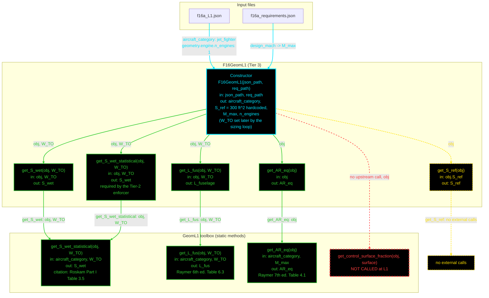

# F16GeomL1: input-to-output data flow

This chart shows the data path for `F16GeomL1`, the Level 1 (L1) geometry
class. It shows the input files, the class inputs, the derived properties, and
the toolbox methods that compute them.

Both `Dependent` properties are still broken: `get.S_wet(obj)` and
`get.L_fuselage(obj)` are commented out, so `S_wet` and `L_fuselage` are
still declared `properties (Dependent)` with no getter, and reading either
one errors at runtime with "no explicit getter." This chart does not draw
a node for that fact — properties are not functions, and this is a
function-level chart (see below) — but it is recorded in the field-by-field
notes table.

That property-level break does not make the underscore-named instance
methods broken. `get_S_wet(obj, W_TO)`, `get_S_wet_statistical(obj, W_TO)`,
and `get_L_fus(obj, W_TO)` are all live, ordinary, working methods: each
one calls its toolbox counterpart and returns a correct value whenever
called. `F16GeomL1` happens to have two methods that both compute `S_wet`
the same way (`get_S_wet` and `get_S_wet_statistical` — the source flags
this: `% TODO (8/13/20206): Duplicate method function, but needed to
satisfy the enforcer`, since `GeometryModelL1`, the Tier-2 enforcer,
requires a method with the `_statistical` name). That is worth knowing,
but it does not make either method dead, orphaned, or broken — both
correctly call the toolbox, so both are drawn as plain, normal function
nodes, the same as any other live method in this class.

**Read this first.**
- Every node inside the `F16GeomL1` block is one function: its name, its
  inputs, and its output. This is a function-level chart, not a
  property-group summary — a `Dependent` property with no getter is a fact
  about the class, not a function, so it is documented in prose and in the
  notes table below, not drawn as a node.
- The constructor gets its own black box, outlined and colored in cyan
  (whole node, name and details both), so it reads as distinct from an
  ordinary method.
- Every other function, class-level or toolbox, is outlined and colored in
  green (whole node). Per-word coloring inside a single node was tried
  (inline `style=`, then `class=` attributes on a ``) and did not
  survive this renderer's sanitization either way, so the whole node is
  colored instead. This renders correctly everywhere, including GitHub.
- A solid arrow is a value that a constructor or getter reads.
- Every edge is colored to match the node it POINTS AT, not the node it
  leaves. An edge into a green function node is green; an edge into the
  yellow `get_S_ref` or its "no external calls" marker is yellow; an edge
  into the red no-upstream-call node is red; an edge into the cyan
  constructor is cyan. This makes each line's destination readable at a
  glance, even where Mermaid's auto-layout bends the line away from a
  straight path.
- An edge from a class-level function into the toolbox is labeled with the
  name of the function it came FROM, followed by the arguments it passes
  (e.g. "get_S_wet: obj, W_TO"), not the target's name. Mermaid's
  auto-layout does not always draw the line straight down from its true
  source, so the label has to carry the connection on its own; naming the
  source is more useful at a glance than naming the target, since the
  target is already the box the arrow points at.
- `get_S_ref` makes no external calls at all — it does not call the
  toolbox or any other code; it just returns `obj.S_ref` unchanged. It is
  placed last in its row, and its "no external calls" marker is drawn as
  its own standalone node, outside both the `F16GeomL1` box and the
  toolbox box, not nested inside either one. This keeps it out of the way
  of other lines into the toolbox, so proximity cannot be misread as a
  connection, and keeps it from being mistaken for a toolbox method.
- A function that calls no toolbox method and no other code — just returns
  or passes through one of its own inputs, like `get_S_ref` — is outlined
  in yellow with a dashed border, to mark it as a different kind of
  function from the green ones that delegate to a toolbox equation. Its
  "no external calls" marker node is colored the same yellow, since the
  marker exists only to describe that one function.
- A dashed arrow into a black node with a red dashed border marks a
  function that has no upstream call at all: a toolbox method that exists
  but that nothing in `F16GeomL1` ever calls (`get_control_surface_fraction`).
  "No upstream call" is the precise fact — there was never a call to begin
  with, so nothing "died." Everything about this treatment is red: the
  arrow, the arrow's label, and all the text inside the node. Nothing else
  in this diagram earns this treatment — a method that works correctly
  when called is not in this category, even if no other method in the
  class happens to call it.
- `get.S_wet(obj)` and `get.L_fuselage(obj)` are gone from this diagram
  entirely, because they are gone from the source — both are commented
  out. `get_S_wet`, `get_S_wet_statistical`, and `get_L_fus` are gone from
  none of these; all three are live methods that each correctly call the
  toolbox, so all three are drawn as ordinary green function nodes.
- `F16GeomL1` takes no injected discipline object. This differs from L2 and
  L3, where geometry takes an injected propulsion object. At L1, propulsion
  data does not feed geometry at all.
- `S_ref` is a hardcoded literal (300 ft², from T.O. 1F-16A-1), not a value
  from the JSON file.

## Field-by-field notes

| Class member | Source | Notes |
| --- | --- | --- |
| `aircraft_category` | `f16a_L1.json`, top-level field | Not inside `.geometry` — one canonical value shared by all disciplines. |
| `n_engines` | `f16a_L1.json`, `.geometry.engine.n_engines` | Optional field, read with an `isfield` guard. Exposed for mission-analysis use, not used by any L1 geometry regression. |
| `S_ref` | Hardcoded literal, `300 ft²` | T.O. 1F-16A-1 value. Not read from JSON at L1. |
| `M_max` | `f16a_requirements.json`, `.design_mach` | Read from the separate requirements file, not the spec file. |
| `W_TO` | Set by the sizing loop after construction | `NaN` until then. `S_wet` and `L_fuselage` error if read before `W_TO` is set. |
| `S_wet` (Dependent) | Declared, but no `get.S_wet` method exists | Broken as of the 2026-08-13 revision. `get.S_wet(obj)` was commented out. Reading `geom.S_wet` now errors: MATLAB requires an explicit getter for every `Dependent` property. This is a property-level fact, separate from whether the instance methods below still work (they do). |
| `get_S_wet(obj, W_TO)` | Class-level; calls `GeomL1.get_S_wet_statistical(obj, W_TO)` | Live and correct. Returns the right value whenever called, e.g. `obj.get_S_wet(W_TO)`. No other method in the class happens to call it, but that does not make it dead — it is simply not wired to the (currently broken) `S_wet` property. |
| `get_S_wet_statistical(obj, W_TO)` | Class-level, NOT the toolbox method of the same name | Also live and correct, calling the same toolbox method as `get_S_wet`. Required by the Tier-2 abstract enforcer `GeometryModelL1`, by exact method name — the source notes this: `% TODO (8/13/20206): Duplicate method function, but needed to satisfy the enforcer.` Duplicating another method's job does not make either one dead; both work. |
| `L_fuselage` (Dependent) | Declared, but no `get.L_fuselage` method exists | Broken as of the follow-up revision, same shape as `S_wet`. `get.L_fuselage(obj)` was commented out. Reading `geom.L_fuselage` now errors the same way. |
| `get_L_fus(obj, W_TO)` | Class-level; calls `GeomL1.get_L_fus(obj, W_TO)` | Live and correct, same shape as `get_S_wet`. Not wired to the `L_fuselage` property, but works correctly when called directly. |

## Source files

| Item | File |
| --- | --- |
| Concrete class | `examples/F16A/models/disciplines/geom/F16GeomL1.m` |
| Tier 2, abstract | `src/disciplines/geometry/GeometryModelL1.m` |
| Tier 1, base | `src/base/GeometryBase.m` |
| Toolbox | `src/disciplines/geometry/GeomL1.m` |
| Input JSON | `examples/F16A/inputs/f16a_L1.json`, `examples/F16A/inputs/f16a_requirements.json` |
