# F16GeomL2: input-to-output data flow

This chart shows the data path for `F16GeomL2`, the Level 2 (L2) geometry
class. It shows the input JSON, the injected propulsion object, the class
inputs by component (wing, horizontal tail, vertical tail, fuselage, duct),
the `Dependent` cascade each component drives, and the toolbox methods that
compute them.

**Read this first.**
- The chart runs LEFT TO RIGHT (`flowchart LR`). Data enters at the left and
  leaves at the right: input file, then the constructor, then each component
  group's getter chain, then the toolbox. The component groups are parallel
  branches off the constructor, so they stack VERTICALLY, one band per group.
  A tall chart scrolls on a 1920x1080 display; a wide one does not.
- EVERY arrow carries a label that names the exact value it moves. This
  includes every arrow that leaves an "Inputs" block: each one says which
  field goes to which getter.
- Every node inside the `F16GeomL2` block is one function: its name, its
  inputs, and its output. Only the five "Inputs" nodes (`INW`, `INHT`,
  `INVT`, `INFUS`, `INENG`) are not functions; they are properties the
  constructor copies straight from the JSON.
- The constructor gets its own black box, outlined and colored in cyan
  (whole node, name and details both), so it reads as distinct from an
  ordinary method.
- Every other function, class-level or toolbox, is outlined and colored in
  green (whole node). Per-word coloring inside a single node was tried
  (inline `style=`, then `class=` attributes on a ``) and did not
  survive this renderer's sanitization either way, so the whole node is
  colored instead. This renders correctly everywhere, including GitHub.
- Every edge is colored to match the node it POINTS AT, not the node it
  leaves. An edge into a green function node is green; an edge into a
  yellow passthrough node (`get.tc_r_wing`, `get.tc_ht`, `get.b_vt`,
  `get.tc_vt`, `get.L_fuselage`, `get.T_AB_SLS_lb`) is yellow; an edge into
  a red no-upstream-call node is red; an edge into the cyan constructor is
  cyan. Edges into the five "Inputs" nodes stay the default color, since
  those nodes carry no class of their own.
- An edge from a class-level function into the toolbox is labeled with the
  name of the function it came FROM, followed by the arguments it passes
  (e.g. "get.b_wing: AR_wing, S_ref"), not the target's name. Mermaid's
  auto-layout does not always draw the line straight down from its true
  source, so the label has to carry the connection on its own.
- A function that calls no toolbox method and no other code is outlined in
  yellow with a dashed border. `get.b_vt` is one of these: it computes
  `sqrt(S_vt*AR_vt)` inline and calls nothing.
- `F16GeomL2` takes one dependency injection: the constructor requires a
  `PropulsionBase` object, `prop`. It reads only `prop.T_SL`. This differs
  from L1, which takes no injected object at all.
- A dashed arrow into a black node with a red dashed border marks a
  function that has no upstream call at all: a toolbox method that exists
  but that nothing in `F16GeomL2` ever calls at L2.
- `Amax` uses the fuselage-envelope ellipse form, `(pi/4)*W*H`. This is the
  L2-specific, low-fidelity form. L3 uses a different, area-ruled buildup.
  Do not read the two as the same equation.
- Corrected in the labeling pass (2026-08-14), because a label must be true:
  `get.b_vt` no longer shows a `compute_span` call it does not make;
  `compute_mac` takes `(c_root, lambda)`, not `(c_root, c_tip)`;
  `compute_S_exposed_vertical` takes `(S, AR, c_root, c_tip, fh)`, so the VT
  exposed-area getter now also reads `S_vt`, `AR_vt` and the fuselage
  half-height; the MAC-station getters read `LE_sweep`, not `QC_sweep`, and
  the `x_c4_ht` / `x_c4_vt` getters each make four toolbox calls, not one;
  and the wetted-area getters read the root/tip t/c PAIR plus `lambda`, not
  the `tc_ht` / `tc_vt` mean.

```mermaid
flowchart LR
    subgraph JSON["Input files"]
        J["f16a_L2.json"]
    end

    PROP["Injected object<br/>prop (PropulsionBase)"]

    subgraph CLASS["F16GeomL2 (Tier 3)"]
        direction LR

        CTOR["Constructor<br/>F16GeomL2(json_path, prop)<br/>in: json_path, prop<br/>out: wing/HT/VT/fuselage/engine inputs,<br/>stored prop handle"]

        subgraph WING["Wing"]
            INW["Inputs<br/>S_ref, AR_wing, lambda_wing,<br/>LE_sweep_wing, tc_wing, x_apex_wing"]
            W1["get.b_wing<br/>in: AR_wing, S_ref<br/>out: b_wing"]
            W2["get.c_root_wing<br/>in: S_ref, b_wing, lambda_wing<br/>out: c_root_wing"]
            W3["get.c_tip_wing<br/>in: c_root_wing, lambda_wing<br/>out: c_tip_wing"]
            W4["get.cbar_wing<br/>in: c_root_wing, lambda_wing<br/>out: cbar_wing"]
            W5["get.QC_sweep_wing<br/>in: LE_sweep_wing, AR_wing, lambda_wing<br/>out: QC_sweep_wing"]
            W6["get.TE_sweep_wing<br/>in: LE_sweep_wing, AR_wing, lambda_wing<br/>out: TE_sweep_wing"]
            W7["get.tc_r_wing, get.tc_t_wing<br/>in: tc_wing<br/>out: tc_r_wing = tc_t_wing = tc_wing"]
            W8["get.S_exposed_wing<br/>in: c_root_wing, c_tip_wing,<br/>b_wing/2, W_max_fuselage/2<br/>out: S_exposed_wing"]
            W9["get.S_wet_wing<br/>in: S_exposed_wing, tc_r_wing,<br/>tc_t_wing, lambda_wing<br/>out: S_wet_wing"]
        end

        subgraph HT["Horizontal tail"]
            INHT["Inputs<br/>S_ht, AR_ht, lambda_ht,<br/>LE_sweep_ht, tc_r_ht, tc_t_ht, x_le_ht"]
            H1["get.b_ht<br/>in: AR_ht, S_ht<br/>out: b_ht"]
            H2["get.c_root_ht<br/>in: S_ht, b_ht, lambda_ht<br/>out: c_root_ht"]
            H3["get.c_tip_ht<br/>in: c_root_ht, lambda_ht<br/>out: c_tip_ht"]
            H4["get.QC_sweep_ht<br/>in: LE_sweep_ht, AR_ht, lambda_ht<br/>out: QC_sweep_ht"]
            H5["get.TE_sweep_ht<br/>in: LE_sweep_ht, AR_ht, lambda_ht<br/>out: TE_sweep_ht"]
            H6["get.tc_ht<br/>in: tc_r_ht, tc_t_ht<br/>out: tc_ht = mean(tc_r_ht, tc_t_ht)"]
            H7["get.S_exposed_ht<br/>in: c_root_ht, c_tip_ht,<br/>b_ht/2, W_max_fuselage/2<br/>out: S_exposed_ht"]
            H8["get.S_wet_ht<br/>in: S_exposed_ht, tc_r_ht,<br/>tc_t_ht, lambda_ht<br/>out: S_wet_ht"]
        end

        subgraph VT["Vertical tail"]
            INVT["Inputs<br/>S_vt, AR_vt, lambda_vt,<br/>LE_sweep_vt, tc_r_vt, tc_t_vt, x_le_vt"]
            V1["get.b_vt<br/>in: S_vt, AR_vt<br/>out: b_vt = sqrt(S_vt*AR_vt), not halved"]
            V2["get.c_root_vt<br/>in: S_vt, b_vt, lambda_vt<br/>out: c_root_vt"]
            V3["get.c_tip_vt<br/>in: c_root_vt, lambda_vt<br/>out: c_tip_vt"]
            V4["get.QC_sweep_vt<br/>in: LE_sweep_vt, AR_vt, lambda_vt<br/>out: QC_sweep_vt (single panel 2/AR)"]
            V5["get.TE_sweep_vt<br/>in: LE_sweep_vt, AR_vt, lambda_vt<br/>out: TE_sweep_vt (single panel 2/AR)"]
            V6["get.tc_vt<br/>in: tc_r_vt, tc_t_vt<br/>out: tc_vt = mean(tc_r_vt, tc_t_vt)"]
            V7["get.S_exposed_vt<br/>in: S_vt, AR_vt, c_root_vt,<br/>c_tip_vt, H_max_fuselage/2<br/>out: S_exposed_vt"]
            V8["get.S_wet_vt<br/>in: S_exposed_vt, tc_r_vt,<br/>tc_t_vt, lambda_vt<br/>out: S_wet_vt"]
        end

        subgraph FUS["Fuselage"]
            INFUS["Inputs<br/>L_fus, W_max_fuselage,<br/>H_max_fuselage, L_aircraft"]
            FU1["get.L_fuselage, get.D_fus<br/>in: L_fus, W_max_fuselage, H_max_fuselage<br/>out: L_fuselage = L_fus, D_fus = mean(W_max, H_max)"]
            FU2["get.Amax<br/>in: W_max_fuselage, H_max_fuselage<br/>out: Amax = (pi/4)*W*H"]
            FU3["get.S_wet_fuselage<br/>in: D_fus, L_fus<br/>out: S_wet_fuselage"]
        end

        subgraph DUCT["Engine duct"]
            INENG["Inputs<br/>L_duct, n_engines"]
            E1["get.T_AB_SLS_lb<br/>in: prop.T_SL<br/>out: T_AB_SLS_lb"]
            E2["get.D_inlet, get.D_exit<br/>in: T_AB_SLS_lb<br/>out: D_inlet = D_exit"]
            E3["get.S_wet_duct<br/>in: D_inlet, D_exit, L_duct<br/>out: S_wet_duct"]
        end

        subgraph MAC["MAC and moment arms"]
            M1["get.x_mac_le_wing<br/>in: b_wing, lambda_wing,<br/>x_apex_wing, LE_sweep_wing<br/>out: x_mac_le_wing"]
            M2["get.x_c4_wing<br/>in: x_mac_le_wing, cbar_wing<br/>out: x_c4_wing"]
            M3["get.x_c4_ht<br/>in: c_root_ht, lambda_ht,<br/>b_ht, x_le_ht, LE_sweep_ht<br/>out: x_c4_ht"]
            M4["get.x_c4_vt<br/>in: c_root_vt, lambda_vt,<br/>b_vt, x_le_vt, LE_sweep_vt<br/>out: x_c4_vt"]
            M5["get.L_HT<br/>in: x_c4_ht, x_c4_wing<br/>out: L_HT"]
            M6["get.L_VT<br/>in: x_c4_vt, x_c4_wing<br/>out: L_VT"]
        end

        TOT["get.S_wet<br/>in: S_wet_wing, S_wet_ht, S_wet_vt,<br/>S_wet_fuselage, S_wet_duct<br/>out: S_wet"]
    end

    subgraph TOOL["GeometryBase and GeomL2 toolbox (static methods)"]
        TB1["GeometryBase.compute_span(AR, S)"]
        TB2["GeometryBase.compute_root_chord(S, b, lambda)"]
        TB3["GeometryBase.compute_tip_chord(c_root, lambda)"]
        TB4["GeometryBase.compute_mac(c_root, lambda)"]
        TB5["GeometryBase.convert_sweep(sweep_LE, AR, lambda, station)"]
        TB6["GeometryBase.convert_sweep_panel(sweep_LE, AR, lambda, station)"]
        TB7["GeometryBase.compute_y_mac(b, lambda)"]
        TB8["GeometryBase.compute_y_mac_panel(b, lambda)"]
        TB9["GeometryBase.compute_x_mac_le(x_apex, y_mac, sweep_LE)"]
        TB10["GeometryBase.compute_x_mac_quarter_chord(x_mac_le, cbar)"]
        TB11["GeometryBase.compute_Amax_elliptical(W, H)<br/>(pi/4)*W*H"]
        TB12["GeometryBase.compute_nacelle_diameter(T_AB_SLS_lb)"]
        TB13["TailL1.compute_tail_arm_quarter_chord(x_c4_a, x_c4_b)"]
        G1["GeomL2.compute_S_exposed_horizontal(c_root, c_tip, hs, fw)"]
        G2["GeomL2.compute_S_exposed_vertical(S, AR, c_root, c_tip, fh)"]
        G3["GeomL2.get_S_wet_wing / HT / VT<br/>-> compute_roskam_planform(S_exp, tc_r, tc_t, lambda)"]
        G4["GeomL2.get_S_wet_fuselage<br/>-> compute_s_wet_fus_cyl(D_fus, L_fus)"]
        G5["GeomL2.get_S_wet_duct<br/>-> compute_s_wet_duct(D_inlet, D_exit, L_duct)"]
        D1["GeomL2.get_S_wet_fuselage_brandt_lowfi<br/>NOT CALLED at L2"]
        D2["GeomL2.compute_wet_planform<br/>NOT CALLED at L2"]
        D3["GeomL2.compute_s_wet_fus_brandt_lowfi<br/>NOT CALLED at L2"]
        D4["GeomL2.compute_s_wet_fus_brandt_highfi<br/>NOT CALLED at L2"]
        D5["GeomL2.compute_frame_perimeter<br/>NOT CALLED at L2"]
    end

    J -->|"wing: S_ft2=300, AR=3.0, taper=0.2275,<br/>sweep_LE_deg=40.0, tc_ratio=0.04, x_apex_ft=17.786"| CTOR
    J -->|"horizontal_tail: S_ft2=108.0, AR=3.0, taper=0.2275,<br/>sweep_LE_deg=40.0, tc_root=0.060,<br/>tc_tip=0.035, x_le_ft=36.0"| CTOR
    J -->|"vertical_tail: S_ft2=60.0, AR=1.6, taper=0.5,<br/>sweep_LE_deg=40.0, tc_root=0.053,<br/>tc_tip=0.030, x_le_ft=36.0"| CTOR
    J -->|"fuselage: length_ft=46.5, max_width_ft=7.0,<br/>max_height_ft=5.0<br/>overall_length_ft: 47.65"| CTOR
    J -->|"engine: duct_length_ft=14.0, n_engines=1"| CTOR
    PROP -->|"prop"| CTOR

    CTOR -->|"S_ref, AR_wing, lambda_wing,<br/>LE_sweep_wing, tc_wing, x_apex_wing"| INW
    CTOR -->|"S_ht, AR_ht, lambda_ht, LE_sweep_ht,<br/>tc_r_ht, tc_t_ht, x_le_ht"| INHT
    CTOR -->|"S_vt, AR_vt, lambda_vt, LE_sweep_vt,<br/>tc_r_vt, tc_t_vt, x_le_vt"| INVT
    CTOR -->|"L_fus, W_max_fuselage,<br/>H_max_fuselage, L_aircraft"| INFUS
    CTOR -->|"L_duct, n_engines"| INENG
    CTOR -->|"prop.T_SL"| E1

    INW -->|"AR_wing, S_ref"| W1
    W1 -->|"b_wing"| W2
    INW -->|"S_ref, lambda_wing"| W2
    W2 -->|"c_root_wing"| W3
    INW -->|"lambda_wing"| W3
    W2 -->|"c_root_wing"| W4
    INW -->|"lambda_wing"| W4
    INW -->|"LE_sweep_wing, AR_wing, lambda_wing"| W5
    INW -->|"LE_sweep_wing, AR_wing, lambda_wing"| W6
    INW -->|"tc_wing"| W7
    W1 -->|"b_wing/2"| W8
    W2 -->|"c_root_wing"| W8
    W3 -->|"c_tip_wing"| W8
    INFUS -->|"W_max_fuselage/2"| W8
    W7 -->|"tc_r_wing, tc_t_wing"| W9
    W8 -->|"S_exposed_wing"| W9
    INW -->|"lambda_wing"| W9

    INHT -->|"AR_ht, S_ht"| H1
    H1 -->|"b_ht"| H2
    INHT -->|"S_ht, lambda_ht"| H2
    H2 -->|"c_root_ht"| H3
    INHT -->|"lambda_ht"| H3
    INHT -->|"LE_sweep_ht, AR_ht, lambda_ht"| H4
    INHT -->|"LE_sweep_ht, AR_ht, lambda_ht"| H5
    INHT -->|"tc_r_ht, tc_t_ht"| H6
    H1 -->|"b_ht/2"| H7
    H2 -->|"c_root_ht"| H7
    H3 -->|"c_tip_ht"| H7
    INFUS -->|"W_max_fuselage/2"| H7
    H7 -->|"S_exposed_ht"| H8
    INHT -->|"tc_r_ht, tc_t_ht, lambda_ht"| H8

    INVT -->|"S_vt, AR_vt"| V1
    V1 -->|"b_vt"| V2
    INVT -->|"S_vt, lambda_vt"| V2
    V2 -->|"c_root_vt"| V3
    INVT -->|"lambda_vt"| V3
    INVT -->|"LE_sweep_vt, AR_vt, lambda_vt"| V4
    INVT -->|"LE_sweep_vt, AR_vt, lambda_vt"| V5
    INVT -->|"tc_r_vt, tc_t_vt"| V6
    INVT -->|"S_vt, AR_vt"| V7
    V2 -->|"c_root_vt"| V7
    V3 -->|"c_tip_vt"| V7
    INFUS -->|"H_max_fuselage/2"| V7
    V7 -->|"S_exposed_vt"| V8
    INVT -->|"tc_r_vt, tc_t_vt, lambda_vt"| V8

    INFUS -->|"L_fus, W_max_fuselage, H_max_fuselage"| FU1
    INFUS -->|"W_max_fuselage, H_max_fuselage"| FU2
    FU1 -->|"D_fus"| FU3
    INFUS -->|"L_fus"| FU3

    E1 -->|"T_AB_SLS_lb"| E2
    E2 -->|"D_inlet, D_exit"| E3
    INENG -->|"L_duct"| E3

    W1 -->|"b_wing"| M1
    INW -->|"lambda_wing, x_apex_wing, LE_sweep_wing"| M1
    M1 -->|"x_mac_le_wing"| M2
    W4 -->|"cbar_wing"| M2
    H1 -->|"b_ht"| M3
    H2 -->|"c_root_ht"| M3
    INHT -->|"lambda_ht, x_le_ht, LE_sweep_ht"| M3
    V1 -->|"b_vt"| M4
    V2 -->|"c_root_vt"| M4
    INVT -->|"lambda_vt, x_le_vt, LE_sweep_vt"| M4
    M2 -->|"x_c4_wing"| M5
    M3 -->|"x_c4_ht"| M5
    M2 -->|"x_c4_wing"| M6
    M4 -->|"x_c4_vt"| M6

    W9 -->|"S_wet_wing"| TOT
    H8 -->|"S_wet_ht"| TOT
    V8 -->|"S_wet_vt"| TOT
    FU3 -->|"S_wet_fuselage"| TOT
    E3 -->|"S_wet_duct"| TOT

    W1 -->|"get.b_wing: AR_wing, S_ref"| TB1
    W2 -->|"get.c_root_wing: S_ref, b_wing, lambda_wing"| TB2
    W3 -->|"get.c_tip_wing: c_root_wing, lambda_wing"| TB3
    W4 -->|"get.cbar_wing: c_root_wing, lambda_wing"| TB4
    W5 -->|"get.QC_sweep_wing: LE_sweep_wing, AR_wing, lambda_wing, 0.25"| TB5
    W6 -->|"get.TE_sweep_wing: LE_sweep_wing, AR_wing, lambda_wing, 1.0"| TB5
    W8 -->|"get.S_exposed_wing: c_root_wing, c_tip_wing, b_wing/2, W_max_fuselage/2"| G1
    W9 -->|"get.S_wet_wing: S_exposed_wing, tc_r_wing, tc_t_wing, lambda_wing"| G3

    H1 -->|"get.b_ht: AR_ht, S_ht"| TB1
    H2 -->|"get.c_root_ht: S_ht, b_ht, lambda_ht"| TB2
    H3 -->|"get.c_tip_ht: c_root_ht, lambda_ht"| TB3
    H4 -->|"get.QC_sweep_ht: LE_sweep_ht, AR_ht, lambda_ht, 0.25"| TB5
    H5 -->|"get.TE_sweep_ht: LE_sweep_ht, AR_ht, lambda_ht, 1.0"| TB5
    H7 -->|"get.S_exposed_ht: c_root_ht, c_tip_ht, b_ht/2, W_max_fuselage/2"| G1
    H8 -->|"get.S_wet_ht: S_exposed_ht, tc_r_ht, tc_t_ht, lambda_ht"| G3

    V2 -->|"get.c_root_vt: S_vt, b_vt, lambda_vt"| TB2
    V3 -->|"get.c_tip_vt: c_root_vt, lambda_vt"| TB3
    V4 -->|"get.QC_sweep_vt: LE_sweep_vt, AR_vt, lambda_vt, 0.25"| TB6
    V5 -->|"get.TE_sweep_vt: LE_sweep_vt, AR_vt, lambda_vt, 1.0"| TB6
    V7 -->|"get.S_exposed_vt: S_vt, AR_vt, c_root_vt, c_tip_vt, H_max_fuselage/2"| G2
    V8 -->|"get.S_wet_vt: S_exposed_vt, tc_r_vt, tc_t_vt, lambda_vt"| G3

    FU2 -->|"get.Amax: W_max_fuselage, H_max_fuselage"| TB11
    FU3 -->|"get.S_wet_fuselage: D_fus, L_fus"| G4

    E2 -->|"get.D_inlet: T_AB_SLS_lb"| TB12
    E3 -->|"get.S_wet_duct: D_inlet, D_exit, L_duct"| G5

    M1 -->|"get.x_mac_le_wing: b_wing, lambda_wing"| TB7
    M1 -->|"get.x_mac_le_wing: x_apex_wing, y_mac, LE_sweep_wing"| TB9
    M2 -->|"get.x_c4_wing: x_mac_le_wing, cbar_wing"| TB10
    M3 -->|"get.x_c4_ht: c_root_ht, lambda_ht"| TB4
    M3 -->|"get.x_c4_ht: b_ht, lambda_ht"| TB7
    M3 -->|"get.x_c4_ht: x_le_ht, y_mac, LE_sweep_ht"| TB9
    M3 -->|"get.x_c4_ht: x_mac_le, cbar_ht"| TB10
    M4 -->|"get.x_c4_vt: c_root_vt, lambda_vt"| TB4
    M4 -->|"get.x_c4_vt: b_vt, lambda_vt"| TB8
    M4 -->|"get.x_c4_vt: x_le_vt, y_mac, LE_sweep_vt"| TB9
    M4 -->|"get.x_c4_vt: x_mac_le, cbar_vt"| TB10
    M5 -->|"get.L_HT: x_c4_ht, x_c4_wing"| TB13
    M6 -->|"get.L_VT: x_c4_vt, x_c4_wing"| TB13

    G4 -.->|"no upstream call"| D1
    D1 -.->|"no upstream call"| D3
    D1 -.->|"no upstream call"| D4
    D4 -.->|"no upstream call"| D5
    G3 -.->|"no upstream call, alternate to Roskam planform"| D2

    linkStyle 0,1,2,3,4,5 stroke:#00e5ff,color:#00e5ff,stroke-width:2px
    linkStyle 11,21,36,43,50,57 stroke:#ffe100,color:#ffe100,stroke-width:2px,stroke-dasharray:4 3
    linkStyle 12,13,14,15,16,17,18,19,20,22,23,24,25,26,27,28,29,30,31,32,33,34,35,37,38,39,40,41,42,44,45,46,47,48,49,51,52,53,54,55,56,58,59,60,61,62,63,64,65,66,67,68,69,70,71,72,73,74,75,76,77,78,79,80,81,82,83,84,85,86,87,88,89,90,91,92,93,94,95,96,97,98,99,100,101,102,103,104,105,106,107,108,109,110,111,112,113,114,115,116,117,118,119,120 stroke:#33cc33,color:#33cc33,stroke-width:2px
    linkStyle 121,122,123,124,125 stroke:#ff4040,color:#ff4040,stroke-width:2px,stroke-dasharray:5 5

    classDef dead fill:#000000,stroke:#ff4040,stroke-width:3px,color:#ff4040,stroke-dasharray: 6 4
    classDef ctor fill:#000000,stroke:#00e5ff,stroke-width:3px,color:#00e5ff
    classDef func fill:#000000,stroke:#33cc33,stroke-width:2px,color:#33cc33
    classDef passthrough fill:#000000,stroke:#ffe100,stroke-width:2px,color:#ffe100,stroke-dasharray: 4 3
    class D1,D2,D3,D4,D5 dead
    class CTOR ctor
    class W1,W2,W3,W4,W5,W6,W8,W9,H1,H2,H3,H4,H5,H7,H8,V2,V3,V4,V5,V7,V8,FU2,FU3,E2,E3,M1,M2,M3,M4,M5,M6,TOT,TB1,TB2,TB3,TB4,TB5,TB6,TB7,TB8,TB9,TB10,TB11,TB12,TB13,G1,G2,G3,G4,G5 func
    class W7,H6,V1,V6,FU1,E1 passthrough
```

## Field-by-field notes

| Class member | Source | Notes |
| --- | --- | --- |
| `S_ref, AR_wing, lambda_wing, LE_sweep_wing, tc_wing, x_apex_wing` | `f16a_L2.json`, `.geometry.wing` | Wing spec data. |
| `S_ht, AR_ht, lambda_ht, LE_sweep_ht, tc_r_ht, tc_t_ht, x_le_ht` | `f16a_L2.json`, `.geometry.horizontal_tail` | HT spec data. |
| `S_vt, AR_vt, lambda_vt, LE_sweep_vt, tc_r_vt, tc_t_vt, x_le_vt` | `f16a_L2.json`, `.geometry.vertical_tail` | VT spec data. |
| `L_fus, W_max_fuselage, H_max_fuselage` | `f16a_L2.json`, `.geometry.fuselage` | Fuselage envelope. |
| `L_aircraft` | `f16a_L2.json`, `.geometry.overall_length_ft` | Feeds `Amax` and the wave-drag length ratio only. Uncited in the JSON. |
| `L_duct, n_engines` | `f16a_L2.json`, `.geometry.engine` | `L_duct` is the duct length. `n_engines` is read with an `isfield` guard and is not used by L2 geometry. |
| `prop` | Constructor argument, injected | `PropulsionBase` object. Only `prop.T_SL` is read, to size `T_AB_SLS_lb`. |
| `b_vt` (Dependent) | `sqrt(S_vt*AR_vt)`, inline | Full single-panel span, not halved. Calls no toolbox method, so it is drawn yellow. |
| `T_AB_SLS_lb` (Dependent) | `prop.T_SL` | SLS afterburner thrust, sets the nacelle diameter. |
| `D_inlet, D_exit` (Dependent) | `GeometryBase.compute_nacelle_diameter(T_AB_SLS_lb)` | Engine data sizes the duct, not airframe data. |
| `Amax` (Dependent) | `GeometryBase.compute_Amax_elliptical(W_max_fuselage, H_max_fuselage)` | `(pi/4)*W*H`. L2's low-fidelity envelope form. Not the L3 area-ruled buildup. |
| `S_wet_wing, S_wet_ht, S_wet_vt` (Dependent) | `GeomL2.get_S_wet_wing/HT/VT` -> `compute_roskam_planform` | Roskam planform wetted-area method, one call per lifting surface. Each reads the root/tip t/c PAIR plus `lambda`, not the `tc_ht` / `tc_vt` mean. |
| `S_wet_fuselage` (Dependent) | `get.S_wet_fuselage`, which calls `GeomL2.get_S_wet_fuselage` -> `compute_s_wet_fus_cyl` | Cylindrical-fuselage wetted-area form. Takes `D_fus` and `L_fus`. |
| `S_wet_duct` (Dependent) | `GeomL2.get_S_wet_duct` -> `compute_s_wet_duct` | Duct wetted area, driven by `D_inlet`/`D_exit`. |
| `S_wet` (Dependent) | `GeomL2.get_S_wet` | Sum of wing, HT, VT, fuselage, and duct wetted areas. |
| `x_c4_ht, x_c4_vt` (Dependent) | Four `GeometryBase` calls each | `compute_mac`, then `compute_y_mac` (HT, mirrored) or `compute_y_mac_panel` (VT, single panel), then `compute_x_mac_le`, then `compute_x_mac_quarter_chord`. Each reads the surface's own `LE_sweep`, not its `QC_sweep`. |
| `L_HT, L_VT` (Dependent) | `TailL1.compute_tail_arm_quarter_chord` | Quarter-chord tail moment arms, off `x_c4_wing`/`x_c4_ht`/`x_c4_vt`. |

## Methods with no upstream call at L2

| Toolbox method | Why it has no upstream call at L2 |
| --- | --- |
| `GeomL2.get_S_wet_fuselage_brandt_lowfi` | Comparison-only alternate to `get_S_wet_fuselage`. Never called by `F16GeomL2`. |
| `GeomL2.compute_wet_planform` | Uniform-t/c alternate to `compute_roskam_planform`. Never called by `F16GeomL2`. |
| `GeomL2.compute_s_wet_fus_brandt_lowfi` | Only reachable through `get_S_wet_fuselage_brandt_lowfi`, which itself has no upstream call. |
| `GeomL2.compute_s_wet_fus_brandt_highfi` | Only reachable through `get_S_wet_fuselage_brandt_lowfi`, which itself has no upstream call. |
| `GeomL2.compute_frame_perimeter` | Only reachable through `compute_s_wet_fus_brandt_highfi`, which itself has no upstream call. |

## Source files

| Item | File |
| --- | --- |
| Concrete class | `examples/F16A/models/disciplines/geom/F16GeomL2.m` |
| Tier 2, abstract | `src/disciplines/geometry/GeometryModelL2.m` |
| Tier 1, base | `src/base/GeometryBase.m` |
| Toolbox | `src/disciplines/geometry/GeomL2.m` |
| Injected propulsion | `examples/F16A/models/disciplines/prop/F16PropL2.m` |
| Tail-arm helper | `src/disciplines/tail_sizing/TailL1.m` |
| Input JSON | `examples/F16A/inputs/f16a_L2.json` |
