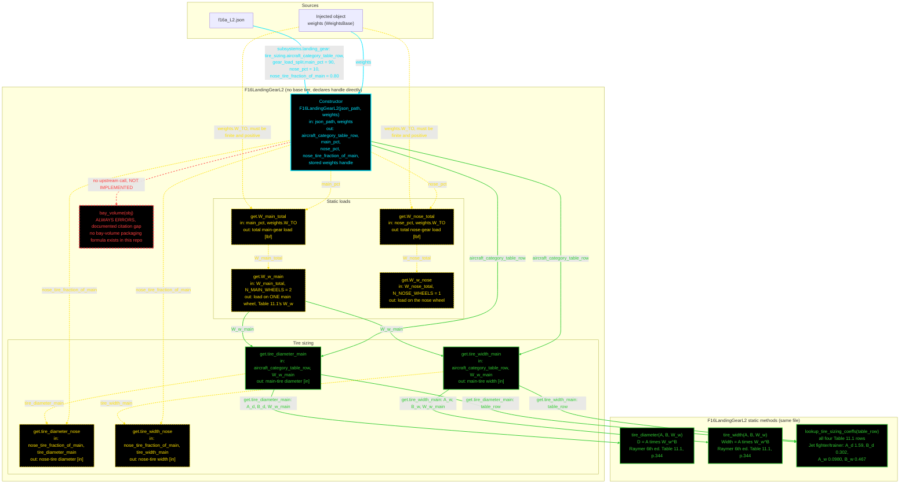

# F16LandingGearL2: input-to-output data flow

This chart shows the data path for `F16LandingGearL2`, the Level 2 (L2)
landing-gear class. The method is Raymer Table 11.1 statistical tire sizing on
the per-wheel static load, taken from a 90 / 10 main-to-nose load split of
`W_TO`.

**This class breaks the three-tier pattern, on purpose.** It has no
`LandingGearBase`, no `LandingGearModelL2` enforcer, and no separate toolbox
class. Not every airframe has conventional landing gear, so the discipline gets
no generic `src/disciplines/` home. The equations live in a `methods (Static)`
block inside the same file.

Two consequences:

- The class declares `< handle` directly. Every other stateful discipline class
  inherits handle semantics from its base tier. This one has no base tier, so
  without the declaration it would be a value class, and an optimizer mutating
  it inside a function would not see the change propagate.
- The chart has only two bands, the class and its own statics, instead of the
  usual three or four.

**Read this first.**
- The chart runs TOP TO BOTTOM. The class is small.
- EVERY arrow carries a label naming the exact value it moves.
- The constructor is cyan. Green is a function that calls another function.
  Yellow dashed is a getter that only does inline arithmetic. Red dashed is a
  method with no upstream call.
- Every edge takes the color of the node it POINTS AT.
- Six of the eight derived getters are yellow. The load split, the per-wheel
  division and the nose-tire fractions are all one line of arithmetic. Only the
  two main-tire getters call anything.
- `bay_volume` ALWAYS ERRORS. It is a documented citation gap, not a stub
  awaiting arithmetic. Raymer Ch. 11 sizes tires, struts and shock absorbers,
  and gives no bay-volume packaging estimate. The method refuses rather than
  inventing a geometric-envelope assumption. Tire and strut SIZE is unaffected.
- `bay_volume` stays a plain METHOD and is deliberately NOT `Dependent`.
  MATLAB evaluates every `Dependent` getter eagerly during object display, so
  an always-erroring `Dependent` property would break `disp(obj)`.
- No geometry object is injected. Nothing implemented here reads geometry, and
  `bay_volume` errors whatever fuselage envelope it might be given.

## Field-by-field notes

| Class member | Source | Notes |
| --- | --- | --- |
| `aircraft_category_table_row` | `f16a_L2.json`, `.subsystems.landing_gear.tire_sizing` | `Jet fighter/trainer`. This is the row name Raymer prints, so the lookup takes it verbatim. |
| `main_pct`, `nose_pct` | `.gear_load_split` | 90 and 10, from Raymer Ch. 11 p.344 prose, not a table. |
| `nose_tire_fraction_of_main` | `.nose_tire_fraction_of_main` | 0.80, a decided point value inside Raymer's stated 60 to 100 percent range. |
| `N_MAIN_WHEELS`, `N_NOSE_WHEELS` | Constant, 2 and 1 | A judgment call, stated as such: ordinary tricycle-gear configuration knowledge, not a pinned citation. It matters because Table 11.1's `W_w` is the PER-WHEEL load, so the main load is halved. |
| `weights` | Constructor argument, injected | `WeightsBase`. Only `W_TO` is read. |
| `W_TO` | `weights.W_TO`, via the private guard | The guard errors if `W_TO` is not finite and positive, so tire sizing cannot silently resolve to `NaN`. |
| `bay_volume` | Not implemented | Errors. The gap is recorded in the subplan and in the JSON's own `_TODO_gear_bay_volume_packaging` key, and pinned by a test that asserts the error identifier. |

## Methods with no upstream call at L2

| Method | Why |
| --- | --- |
| `bay_volume` | Nothing calls it in the model. `TestF16LandingGearL2` calls it to assert that it errors, and `F16SubsystemsL2` documents in prose that it must not be auto-summed until the gap closes. |

## Source files

| Item | File |
| --- | --- |
| Concrete class | `examples/F16A/models/disciplines/landing_gear/F16LandingGearL2.m` |
| Abstract tiers | None, by design |
| Toolbox | None. The statics are in the same file |
| Injected weights | `examples/F16A/models/disciplines/weights/F16WeightsL2.m` |
| Input JSON | `examples/F16A/inputs/f16a_L2.json` |
