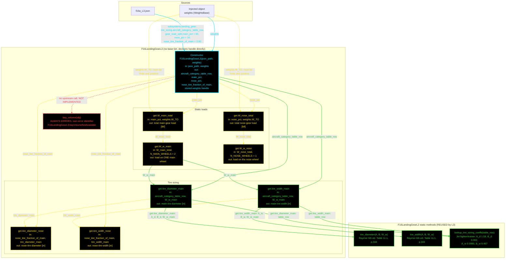

# F16LandingGearL3: input-to-output data flow

This chart shows the data path for `F16LandingGearL3`, the Level 3 (L3)
landing-gear class.

**The equations are identical to L2.** Tire sizing depends only on `W_TO` and
the gear-load split, and neither changes with geometry fidelity. L3 therefore
calls L2's own static methods rather than repeating the Table 11.1 switch. The
class header records that keeping the two classes separate is a judgment call,
made to match the subplan's file list and the parallel JSON block.

The only differences from [F16ALandingGear2_mermaid.md](F16ALandingGear2_mermaid.md):

1. The constructor reads `f16a_L3.json`, not `f16a_L2.json`.
2. The two tire getters reach into `F16LandingGearL2`'s statics, so the toolbox
   band belongs to the OTHER class.
3. `bay_volume` raises `F16LandingGearL3:bayVolumeNotAvailable`, its own
   identifier, so a caller can tell which class's gap fired.

Everything else holds: no base tier, `< handle` declared directly, no injected
geometry, and the same six yellow inline-arithmetic getters.

**Read this first.**
- The chart runs TOP TO BOTTOM.
- EVERY arrow carries a label naming the exact value it moves.
- The constructor is cyan. Green calls another function. Yellow dashed is
  inline arithmetic only. Red dashed has no upstream call.
- Every edge takes the color of the node it POINTS AT.
- The toolbox band is `F16LandingGearL2`, reached from this class. That is
  reuse, not duplication.

## Field-by-field notes

Identical to L2 in every value. See
[F16ALandingGear2_mermaid.md](F16ALandingGear2_mermaid.md). The only field-level
difference is the source file: `f16a_L3.json`, whose
`.subsystems.landing_gear` block carries the same four keys with the same
values.

| Class member | Source | Notes |
| --- | --- | --- |
| All four inputs | `f16a_L3.json`, `.subsystems.landing_gear` | Same keys and same values as the L2 block. |
| `weights` | Constructor argument, injected | `WeightsBase`. Only `W_TO` is read. No geometry is injected. |
| The three statics | `F16LandingGearL2` | Reused directly. L3 defines no equation of its own. |
| `bay_volume` | Not implemented | Errors with `F16LandingGearL3:bayVolumeNotAvailable`, a separate identifier from L2's. |

## Methods with no upstream call at L3

| Method | Why |
| --- | --- |
| `bay_volume` | Nothing calls it in the model. One test asserts both classes' error identifiers. |

## Source files

| Item | File |
| --- | --- |
| Concrete class | `examples/F16A/models/disciplines/landing_gear/F16LandingGearL3.m` |
| Abstract tiers | None, by design |
| Toolbox | `examples/F16A/models/disciplines/landing_gear/F16LandingGearL2.m`, reused |
| Injected weights | `examples/F16A/models/disciplines/weights/F16WeightsL3.m` |
| Input JSON | `examples/F16A/inputs/f16a_L3.json` |
