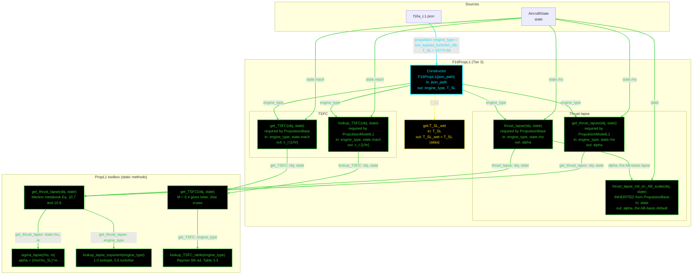

# F16PropL1: input-to-output data flow

This chart shows the data path for `F16PropL1`, the Level 1 (L1) propulsion
class. L1 is a density-ratio thrust lapse and a two-value TSFC table: no Mach
term in the lapse, no afterburner split, no supersonic value.

This is the smallest class in the set. It reads two JSON fields, has one
derived property, and every method is a single delegation line.

**Read this first.**
- The chart runs TOP TO BOTTOM. The class is small, so the vertical form
  reads better.
- EVERY arrow carries a label naming the exact value it moves.
- There is no "Inputs" block. The constructor's outgoing arrows carry the
  field names.
- The constructor is cyan. Every other function is green. Yellow dashed marks
  a getter that calls nothing.
- Every edge takes the color of the node it POINTS AT.
- There are NO red nodes. Every `PropL1` static is reached.
- Two method PAIRS do the same job, and both members of each pair are live
  and correct. `thrust_lapse` and `get_thrust_lapse` both call
  `PropL1.get_thrust_lapse`; `get_TSFC` and `lookup_TSFC` both call
  `PropL1.get_TSFC`. This is not an accident: `PropulsionBase` requires the
  names `thrust_lapse` and `get_TSFC`, while `PropulsionModelL1` requires
  `get_thrust_lapse` and `lookup_TSFC`. Two contracts name the same two
  quantities differently, so the class satisfies both.
- `thrust_lapse_mil_on_AB_scale` is INHERITED from `PropulsionBase`, not
  defined here. Its default is the afterburner-basis lapse, which is correct
  for a class with no separate mil-power model. `F16PropL2` overrides it.
- `T_SL_wet` is an alias of `T_SL`, not a second input. Both used to be stored
  and settable, so an optimizer changing one left the other stale.

## Field-by-field notes

| Class member | Source | Notes |
| --- | --- | --- |
| `engine_type` | `f16a_L1.json`, `.propulsion.engine_type` | `low_bypass_turbofan_AB`, an F100-PW-200 class engine. Selects both the lapse exponent (0.6) and the TSFC row. |
| `T_SL` | `.propulsion.T_SL` | 23,770 lbf, afterburner sea-level static thrust. Brandt Main!D29 and T.O. 1F-16A-1 Sec. I. |
| `T_SL_wet` (Dependent) | `T_SL` | An alias. Was a stored input duplicating `T_SL` in both the class and the JSON, so the two could diverge under an optimizer. |
| `TSFC` | Removed 2026-07-25 | Used to be a `TSFC = 0` placeholder satisfying an abstract property. TSFC depends on the flight state, so it is a method, not a property. |
| `alpha` at 36 kft, M 0.87 | Computed | About 0.484, from the density ratio alone. There is no Mach correction at L1. |
| `c_t` | `PropL1.lookup_TSFC_table` | 0.80 1/hr cruise, 0.70 1/hr loiter. The M = 0.4 split is an L1 approximation, because the segment type is not carried in `AircraftState`. |
| `rho_SL` | `PropL1`, private constant | 0.002377 slug/ft^3, hardcoded in the toolbox. Two TODOs, dated 2026-07-13 and 2026-08-14, both say sea-level standard conditions should be their own class. |

## Methods with no upstream call at L1

None. Every `PropL1` static is reached: the two high-level wrappers by the
class, and the three low-level statics by those wrappers.

## Source files

| Item | File |
| --- | --- |
| Concrete class | `examples/F16A/models/disciplines/prop/F16PropL1.m` |
| Tier 2, abstract | `src/disciplines/propulsion/PropulsionModelL1.m` |
| Tier 1, base | `src/base/PropulsionBase.m` |
| Toolbox | `src/disciplines/propulsion/PropL1.m` |
| Input JSON | `examples/F16A/inputs/f16a_L1.json` |
