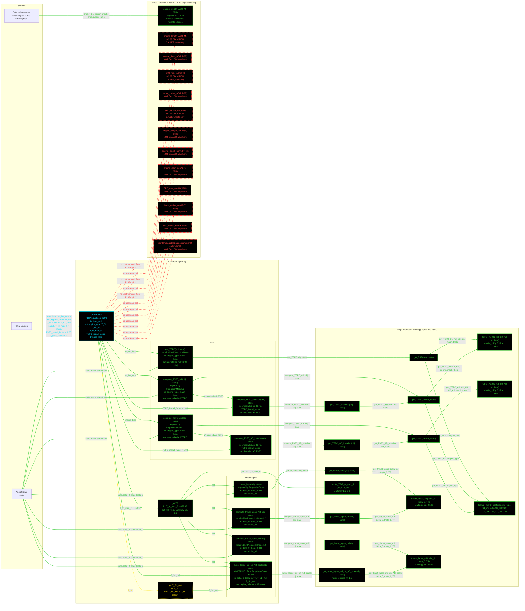

# F16PropL2: input-to-output data flow

This chart shows the data path for `F16PropL2`, the Level 2 (L2) propulsion
class. L2 is the Mattingly parametric model, with separate mil (dry) and
afterburner (wet) branches for both thrust lapse and TSFC.

**This class also serves the L3 rung.** There is no L3 propulsion tier, so
`F16AeroL3` and `F16WeightsL3` are injected with an `F16PropL2`. Anything
reporting an L3 propulsion number is reporting an L2 computation.

**Read this first.**
- The chart runs LEFT TO RIGHT. The engine-scaling band is 13 nodes wide, so
  the vertical form would not fit.
- EVERY arrow carries a label naming the exact value it moves.
- There is no "Inputs" block. The constructor's outgoing arrows carry the
  field names.
- The constructor is cyan. Every other function is green. Yellow dashed marks
  a getter that calls nothing. Red dashed marks a static with no upstream
  call.
- Every edge takes the color of the node it POINTS AT.
- `PropL2` holds TWO unrelated families. The Mattingly lapse and TSFC statics
  are the live path this class uses. The Raymer Ch. 10 engine-scaling statics
  are a separate group of 13, and `F16PropL2` calls NONE of them.
- Exactly one of those 13 is live: `engine_weight_AB`, reached by
  `F16WeightsL2` and `F16WeightsL3`, which read `prop.T_SL` and
  `prop.bypass_ratio` off this object by injection. That external consumer is
  drawn as a source node, because the call does not pass through this class.
- Three more (`engine_length_AB`, `SFC_max_AB`, `SFC_cruise_AB`) are called
  only by `TestPropL2`, so they have no production caller. The remaining nine
  have no caller anywhere.
- The 12 red arrows all leave the constructor. That is the standing marker for
  a static the class never invokes, and it is verbose here only because the
  unused family is large.
- `thrust_lapse_mil_on_AB_scale` is OVERRIDDEN here. `PropulsionBase` defaults
  it to the afterburner-basis lapse; this class returns the mil lapse
  renormalized onto the afterburner thrust scale, and warns outside a
  plausible band.
- `TR` is the only derived computed quantity, and it equals 1.0, because
  `T_t4_SLS` is unknown and `compute_TR` defaults it to `T_t4_max`.

## Field-by-field notes

| Class member | Source | Notes |
| --- | --- | --- |
| `engine_type` | `f16a_L2.json`, `.propulsion.engine_type` | Selects the four Mattingly TSFC coefficients inside the toolbox. `lookup_TSFC_coeffs` accepts only the two low-bypass rows and errors on anything else. |
| `T_SL` | `.propulsion.T_SL` | 23,770 lbf afterburner. Brandt Main!D29. |
| `T_SL_mil` | `.propulsion.T_SL_mil` | 15,000 lbf mil power. Brandt Main!C29. |
| `T_t4_max_F` | `.propulsion.T_t4_max_F` | 2566 deg F, Mattingly Table C.4. Feeds `get.TR` after conversion to deg R. |
| `TSFC_install_factor` | `.propulsion.TSFC_install_factor` | 1.08. Brandt's own stored SLS TSFCs, 0.70 mil and 2.20 AB, are ALREADY installed, so this factor must not be applied again when comparing against them. |
| `bypass_ratio` | `.propulsion.bypass_ratio` | 0.71. Cited to Nicolai and Carichner Table 14.3 for the F100-PW-100, the direct predecessor of the PW-200 modeled elsewhere. Written into the JSON in Phase 3 with no property to read it, so it sat unread until Phase 4 needed it for the engine-weight estimate. |
| `engine_model` | `.propulsion.engine_model` | `F100-PW-200`. Present in the JSON and NOT read by the constructor. A descriptor with no consumer. |
| `T_SL_wet` (Dependent) | `T_SL` | An alias. Both used to be stored, so an optimizer changing `T_SL` left `T_SL_wet` stale and made the mil-on-AB lapse silently wrong. |
| `TR` (Dependent) | `PropL2.compute_TR` | Equals 1.0. `T_t4_SLS` is unknown, and `compute_TR` defaults its second argument to the first, so the ratio is 1 by construction. Every lapse branch therefore compares `theta_0` against 1.0. |
| `alpha_AB` at 36 kft, M 0.87 | Computed | About 0.37, equal to `delta_0`, because `theta_0` is about 0.867 and so below `TR`. |
| `TSFC_mil` at SLS, M 0 | Computed | 0.90 1/hr uninstalled, 0.972 installed, against Brandt's installed 0.70. Mattingly over-predicts the static sea-level value but follows the correct trend with altitude and Mach. |

## Methods with no upstream call at L2

The Raymer Ch. 10 engine-scaling family. `F16PropL2` calls none of the 13.

| Static | Status |
| --- | --- |
| `engine_weight_AB` | LIVE, but not through this class. `F16WeightsL2` and `F16WeightsL3` call it directly, reading `prop.T_SL`, `design_mach` and `prop.bypass_ratio` off the injected propulsion object. Drawn green. |
| `engine_length_AB`, `SFC_max_AB`, `SFC_cruise_AB` | Called only by `TestPropL2`. No production caller. |
| `engine_diam_AB`, `thrust_cruise_AB` | No caller anywhere. |
| `engine_weight_nonAB`, `engine_length_nonAB`, `engine_diam_nonAB`, `SFC_max_nonAB`, `thrust_cruise_nonAB`, `SFC_cruise_nonAB` | No caller anywhere. The whole non-afterburning half of the family is unused, which follows from the F-16 being an afterburning aircraft. |
| `warnIfImplausibleEngineDiameter` | No caller anywhere. It exists to guard the two `engine_diam_*` statics, neither of which is called either. |

## Source files

| Item | File |
| --- | --- |
| Concrete class | `examples/F16A/models/disciplines/prop/F16PropL2.m` |
| Tier 2, abstract | `src/disciplines/propulsion/PropulsionModelL2.m` |
| Tier 1, base | `src/base/PropulsionBase.m` |
| Toolbox | `src/disciplines/propulsion/PropL2.m` |
| External consumer of the engine-weight static | `examples/F16A/models/disciplines/weights/F16WeightsL2.m`, `F16WeightsL3.m` |
| Input JSON | `examples/F16A/inputs/f16a_L2.json` |
