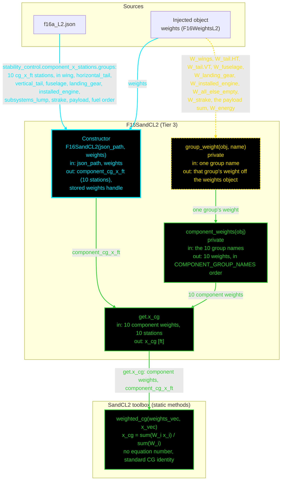

# F16SandCL2: input-to-output data flow

This chart shows the data path for `F16SandCL2`, the Level 2 (L2) stability and
control class.

**L2 computes ONE quantity: the centre of gravity.** That is not a scope
choice. `F16GeomL2` exposes no x-station properties at all, so every other
Raymer Ch. 16 quantity genuinely cannot run at this tier. The L2 enforcer adds
nothing beyond the inherited `x_cg`.

**Read this first.**
- The chart runs TOP TO BOTTOM. The class is small.
- EVERY arrow carries a label naming the exact value it moves.
- The constructor is cyan. Green calls another function. Yellow dashed only
  reads and returns.
- Every edge takes the color of the node it POINTS AT.
- There are NO red nodes. The toolbox holds one static, and it is reached.
- The two private helpers ARE drawn. They carry the mapping from ten weight
  groups to ten numbers, so hiding them would show `x_cg` reading the weights
  object directly, which is not what happens.
- The weight of each group is read LIVE from the injected weights object. Each
  station is read ONCE from the JSON at construction, because a station is spec
  data, not a recomputed quantity.
- `x_cg` returns `NaN` while the fuel group is unset, and that is deliberate.
  `W_energy` is mission-analysis state and reads `NaN` until the mission loop
  sets it. `weighted_cg` carries no `NaN`-rejecting validator, so IEEE
  arithmetic propagates the `NaN` into `x_cg` as a graceful signal instead of
  an error.

## Field-by-field notes

| Class member | Source | Notes |
| --- | --- | --- |
| `COMPONENT_GROUP_NAMES` | Constant, 10 names | The order matters. It fixes which station pairs with which weight. |
| `component_cg_x_ft` | `f16a_L2.json`, `.stability_control.component_x_stations.groups.*.cg_x_ft` | Ten stations, read once at construction. |
| `weights` | Constructor argument, injected | Typed to `F16WeightsL2` exactly, not `WeightsBase`. A tighter guard than the other disciplines use, because the ten group weights it reads are that class's own derived properties. |
| The ten group weights | `weights.*`, live | Eight come from L2 group getters. `payload` is the sum of the two payload properties, which are inert everywhere else. `fuel` is `W_energy`. |
| `x_cg` (Dependent) | `SandCL2.weighted_cg` | `NaN` until the mission loop sets `W_energy`. Deliberate, and documented in the toolbox. |
| `SandCL2.weighted_cg` | | Also called by `F16SandCL3` for its own `x_cg`. The equation is level-agnostic, so it lives here once. |

## Methods with no upstream call at L2

None. `SandCL2` holds one static, and `x_cg` calls it.

## Source files

| Item | File |
| --- | --- |
| Concrete class | `examples/F16A/models/disciplines/sandc/F16SandCL2.m` |
| Tier 2, abstract | `src/disciplines/stability_control/SandCModelL2.m` |
| Tier 1, base | `src/base/StabControlBase.m` |
| Toolbox | `src/disciplines/stability_control/SandCL2.m` |
| Injected weights | `examples/F16A/models/disciplines/weights/F16WeightsL2.m` |
| Input JSON | `examples/F16A/inputs/f16a_L2.json` |
