# F16SandCL3: input-to-output data flow

This chart shows the data path for `F16SandCL3`, the Level 3 (L3) stability and
control class. L3 is the Raymer Ch. 16 longitudinal set: aerodynamic centres,
lift-curve slopes, the fuselage moment term, the neutral point, the static
margin and the trim moment.

**L3 takes FIVE injected objects,** the most of any class in the repo:
geometry, weights, aerodynamics, propulsion and the control-surface sizer. L2
takes one. The step up is possible because `F16GeomL3` exposes the x-stations
that L2 has none of.

**Read this first.**
- The chart runs LEFT TO RIGHT.
- EVERY arrow carries a label naming the exact value it moves.
- The constructor is cyan. Green calls another function. Yellow dashed only
  reads and returns.
- Every edge takes the color of the node it POINTS AT.
- There are NO red nodes. All 17 `SandCL3` statics are reached, four of them
  from inside the toolbox rather than from the class.
- `prop` is injected and NEVER READ. The constructor stores it for future
  thrust-term use. It is drawn, with that stated on its arrow, because an
  injected object the reader can see in the signature should not vanish from
  the chart.
- `component_front_edge_x_ft` is READ from the JSON and never used. It is a
  redundant cross-check field kept for traceability.
- `x_cg` calls `SandCL2.weighted_cg`, the L2 toolbox. The CG identity is
  level-agnostic, so it is not duplicated here.
- `Cm_acw` returns `NaN` until `Cm0_airfoil_wing` is supplied. It has no JSON
  key and no default.
- The three private helpers are drawn. `neutral_point_bar` in particular is the
  shared route into the neutral-point equation for four public members.

```mermaid
flowchart LR
    subgraph SRC["Sources"]
        J["f16a_L3.json"]
        GEOM["Injected object<br/>geom (F16GeomL3)"]
        WTS["Injected object<br/>weights (F16WeightsL3)"]
        AERO["Injected object<br/>aero (F16AeroL3)"]
        PROP["Injected object<br/>prop (F16PropL2)"]
        CTRL["Injected object<br/>ctrl (ControlSurfaceSizer)"]
    end

    subgraph CLASS["F16SandCL3 (Tier 3)"]
        direction LR

        CTOR["Constructor<br/>F16SandCL3(json_path, geom, weights, aero, prop, ctrl)<br/>in: all six, none defaulted<br/>out: component_cg_x_ft, component_front_edge_x_ft,<br/>K_fus, eta_h, dalphah_dalpha, i_w_deg,<br/>Cm0_airfoil_wing, five stored handles"]

        subgraph CG["Centre of gravity"]
            P2["group_weight(obj, name)<br/>private<br/>in: one group name<br/>out: that group's weight"]
            P1["component_weights(obj)<br/>private<br/>in: the 10 group names<br/>out: 10 weights"]
            D1["get.x_cg<br/>in: 10 weights, 10 stations<br/>out: x_cg [ft]"]
        end

        subgraph AC["Aerodynamic centres"]
            D2["get.x_acw<br/>in: wing apex, sweep, span, taper,<br/>MAC, S_ref, cruise Mach<br/>out: wing AC [ft], Raymer Eq. 16.12"]
            D3["get.x_ach<br/>in: HT LE station, sweep, span, taper, root chord<br/>out: HT quarter-MAC [ft], no Mach shift"]
        end

        subgraph SLOPE["Lift-curve slopes and the fuselage term"]
            D4["get.CL_alpha_wing<br/>in: aero, cruise Mach<br/>out: CL_alpha [1/rad]"]
            D5["get.CL_alpha_tail<br/>in: AR_ht, QC_sweep_ht, cruise Mach<br/>out: CL_alpha_h [1/rad]"]
            D6["get.Cm_alpha_fus<br/>in: K_fus, fuselage width and length,<br/>MAC, S_ref<br/>out: Cm_alpha_fus [1/rad], Raymer Eq. 16.25"]
        end

        subgraph STAB["Static stability"]
            P3["neutral_point_bar(obj)<br/>private<br/>in: slopes, x_cg, x_acw, Cm_alpha_fus,<br/>eta_h, dalphah_dalpha, HT and wing areas<br/>out: Xnp_bar, Xcg_bar, Xacw_bar"]
            D7["get.x_np<br/>in: Xnp_bar, cbar_wing<br/>out: neutral point [ft], Raymer Eq. 16.9"]
            D8["get.SM<br/>in: Xnp_bar, Xcg_bar<br/>out: static margin, Raymer Eq. 16.11"]
            D9["get.Cm_alpha<br/>in: CL_alpha_wing, Xcg_bar, Xacw_bar,<br/>Cm_alpha_fus<br/>out: Cm_alpha [1/rad], Raymer Eq. 16.8"]
            M2["Cm_alpha_via_neutral_point(obj)<br/>in: Xnp_bar, Xcg_bar, CL_alpha_wing, eta_h<br/>out: Cm_alpha, the alternate route"]
        end

        subgraph TRIM["Lift and trim"]
            D10["get.Cm_acw<br/>in: Cm0_airfoil_wing, AR_wing, QC_sweep_wing<br/>out: Cm_acw, Raymer Eq. 16.19, NaN until supplied"]
            M1["Delta_alpha_L0(obj, delta_e_deg)<br/>in: ctrl.c_elev_frac, delta_e_deg<br/>out: zero-lift AOA shift"]
            M3["CL_w(obj, alpha_deg)<br/>in: CL_alpha_wing, alpha, i_w_deg, aero.alpha_L0<br/>out: wing CL"]
            M4["CL_h(obj, alpha_deg, i_h_deg)<br/>in: CL_alpha_tail, alpha, i_h_deg<br/>out: tail CL"]
            M5["Cm_cg_trim(obj, alpha_deg, i_h_deg)<br/>in: CL_w, CL_h, x_cg, x_acw, x_ach,<br/>Cm_acw, eta_h, S_ht, S_ref, cbar_wing<br/>out: Cm about the CG"]
        end
    end

    subgraph TOOL["SandCL3 toolbox (static methods)"]
        T4["x_ac_wing(x_apex, LE_sweep_deg, b, lambda,<br/>cbar, S_wing, M)<br/>Raymer Eq. 16.12"]
        T5["x_ac_surface(x_apex, LE_sweep_deg, b, lambda, cbar)"]
        T1["y_MAC_span(b, lambda)"]
        T2["x_LE_MAC(x_apex, y_mac, LE_sweep_deg)"]
        T3["delta_x_ac(M)"]
        T7["Cm_alpha_fus_per_rad(K_fus, W_f, L_f, c, S_w)"]
        T6["Cm_alpha_fus_per_deg(K_fus, W_f, L_f, c, S_w)<br/>Raymer Eq. 16.25"]
        T8["CL_alpha_h(AR_ht, Lambda_c4_ht_deg, M)"]
        T9["Cm_alpha(CL_alpha, Xcg_bar, Xacw_bar,<br/>Cm_alpha_fus_rad, ...)<br/>Raymer Eq. 16.8"]
        T10["neutral_point(CL_alpha, Xacw_bar,<br/>Cm_alpha_fus_rad, ...)<br/>Raymer Eq. 16.9"]
        T11["Cm_alpha_from_neutral_point(CL_alpha, eta_h,<br/>Sh_Sw, CL_alpha_h, ...)"]
        T12["static_margin(Xnp_bar, Xcg_bar)<br/>Raymer Eq. 16.11"]
        T13["CL_w(CL_alpha, alpha_deg, i_w_deg, alpha_0L_deg)"]
        T14["CL_h(CL_alpha_h, alpha_deg, i_h_deg,<br/>epsilon_deg, alpha_0Lh_deg)"]
        T15["delta_alpha_L0_elevator(c_e_over_c, delta_e_deg)"]
        T16["Cm_acw_wing(Cm0_airfoil, AR, sweep_deg)<br/>Raymer Eq. 16.19"]
        T17["Cm_cg_coefficient(CL, x_cg, x_acw, cbar,<br/>Cm_acw, Cm_w_delta_f, delta_f_deg, ...)"]
    end

    subgraph TOOL2["SandCL2 toolbox (reused by L3)"]
        U1["weighted_cg(weights_vec, x_vec)<br/>standard CG identity"]
    end

    J -->|"stability_control: 10 cg_x_ft stations,<br/>10 front_edge_x_ft, fuselage_moment.K_fus,<br/>eta_h, dalphah_dalpha, i_w_deg"| CTOR
    GEOM -->|"geom"| CTOR
    WTS -->|"weights"| CTOR
    AERO -->|"aero"| CTOR
    PROP -->|"prop, stored and never read"| CTOR
    CTRL -->|"ctrl"| CTOR

    WTS -->|"the ten group weights"| P2
    P2 -->|"one group's weight"| P1
    P1 -->|"ten component weights"| D1
    CTOR -->|"component_cg_x_ft"| D1

    GEOM -->|"x_apex_wing, LE_sweep_wing, b_wing,<br/>lambda_wing, cbar_wing, S_ref"| D2
    WTS -->|"weights.cruise_mach"| D2
    GEOM -->|"x_le_ht, LE_sweep_ht, b_ht,<br/>lambda_ht, c_root_ht"| D3
    AERO -->|"aero.get_CL_alpha(M)"| D4
    WTS -->|"weights.cruise_mach"| D4
    GEOM -->|"AR_ht, QC_sweep_ht"| D5
    WTS -->|"weights.cruise_mach"| D5
    CTOR -->|"K_fus"| D6
    GEOM -->|"W_max_fuselage, L_fus, cbar_wing, S_ref"| D6

    D1 -->|"x_cg"| P3
    D2 -->|"x_acw"| P3
    D4 -->|"CL_alpha_wing"| P3
    D5 -->|"CL_alpha_tail"| P3
    D6 -->|"Cm_alpha_fus"| P3
    CTOR -->|"eta_h, dalphah_dalpha"| P3
    GEOM -->|"S_ht, S_ref, cbar_wing"| P3

    P3 -->|"Xnp_bar"| D7
    GEOM -->|"cbar_wing"| D7
    P3 -->|"Xnp_bar, Xcg_bar"| D8
    P3 -->|"Xcg_bar, Xacw_bar"| D9
    D4 -->|"CL_alpha_wing"| D9
    D6 -->|"Cm_alpha_fus"| D9
    P3 -->|"Xnp_bar, Xcg_bar"| M2
    D4 -->|"CL_alpha_wing"| M2
    CTOR -->|"eta_h"| M2

    CTOR -->|"Cm0_airfoil_wing, NaN until supplied"| D10
    GEOM -->|"AR_wing, QC_sweep_wing"| D10
    CTRL -->|"ctrl.c_elev_frac"| M1
    D4 -->|"CL_alpha_wing"| M3
    CTOR -->|"i_w_deg"| M3
    AERO -->|"aero.alpha_L0"| M3
    D5 -->|"CL_alpha_tail"| M4
    M3 -->|"CL_w"| M5
    M4 -->|"CL_h"| M5
    D1 -->|"x_cg"| M5
    D2 -->|"x_acw"| M5
    D3 -->|"x_ach"| M5
    D10 -->|"Cm_acw"| M5
    CTOR -->|"eta_h"| M5
    GEOM -->|"S_ht, S_ref, cbar_wing"| M5

    D1 -->|"get.x_cg: component weights, component_cg_x_ft"| U1
    D2 -->|"get.x_acw: x_apex_wing, LE_sweep_wing, b_wing,<br/>lambda_wing, cbar_wing, S_ref, M"| T4
    D3 -->|"get.x_ach: x_le_ht, LE_sweep_ht, b_ht,<br/>lambda_ht, cbar_ht"| T5
    D5 -->|"get.CL_alpha_tail: AR_ht, QC_sweep_ht, M"| T8
    D6 -->|"get.Cm_alpha_fus: K_fus, W_f, L_f, cbar_wing, S_ref"| T7
    D8 -->|"get.SM: Xnp_bar, Xcg_bar"| T12
    D9 -->|"get.Cm_alpha: CL_alpha_wing, Xcg_bar,<br/>Xacw_bar, Cm_alpha_fus"| T9
    D10 -->|"get.Cm_acw: Cm0_airfoil_wing, AR_wing, QC_sweep_wing"| T16
    M1 -->|"Delta_alpha_L0: c_elev_frac, delta_e_deg"| T15
    M2 -->|"Cm_alpha_via_neutral_point: CL_alpha_wing, eta_h"| T11
    M3 -->|"CL_w: CL_alpha_wing, alpha_deg, i_w_deg, alpha_0L"| T13
    M4 -->|"CL_h: CL_alpha_tail, alpha_deg, i_h_deg"| T14
    M5 -->|"Cm_cg_trim: CL_w, CL_h, x_cg, x_acw, x_ach, Cm_acw"| T17
    P3 -->|"neutral_point_bar: CL_alpha_wing, Xacw_bar, Cm_alpha_fus"| T10

    T4 -->|"x_ac_wing: b, lambda"| T1
    T4 -->|"x_ac_wing: x_apex, y_mac, LE_sweep"| T2
    T4 -->|"x_ac_wing: M"| T3
    T5 -->|"x_ac_surface: b, lambda"| T1
    T5 -->|"x_ac_surface: x_apex, y_mac, LE_sweep"| T2
    T7 -->|"Cm_alpha_fus_per_rad: K_fus, W_f, L_f, c, S_w"| T6

    linkStyle 0,1,2,3,4,5 stroke:#00e5ff,color:#00e5ff,stroke-width:2px
    linkStyle 6 stroke:#ffe100,color:#ffe100,stroke-width:2px,stroke-dasharray:4 3
    linkStyle 7,8,9,10,11,12,13,14,15,16,17,18,19,20,21,22,23,24,25,26,27,28,29,30,31,32,33,34,35,36,37,38,39,40,41,42,43,44,45,46,47,48,49,50,51,52,53,54,55,56,57,58,59,60,61,62,63,64,65,66,67,68,69 stroke:#33cc33,color:#33cc33,stroke-width:2px

    classDef ctor fill:#000000,stroke:#00e5ff,stroke-width:3px,color:#00e5ff
    classDef func fill:#000000,stroke:#33cc33,stroke-width:2px,color:#33cc33
    classDef passthrough fill:#000000,stroke:#ffe100,stroke-width:2px,color:#ffe100,stroke-dasharray: 4 3
    class CTOR ctor
    class P1,P3,D1,D2,D3,D4,D5,D6,D7,D8,D9,D10,M1,M2,M3,M4,M5,T1,T2,T3,T4,T5,T6,T7,T8,T9,T10,T11,T12,T13,T14,T15,T16,T17,U1 func
    class P2 passthrough
```

## Field-by-field notes

| Class member | Source | Notes |
| --- | --- | --- |
| `component_cg_x_ft` | `f16a_L3.json`, `.stability_control.component_x_stations` | Ten stations, identical values to L2's. The JSON notes the re-aggregation is fidelity-independent. |
| `component_front_edge_x_ft` | Same block, `front_edge_x_ft` | READ and never used. A redundant cross-check field, stored for traceability. `NaN` where the JSON has null. |
| `K_fus` | `.stability_control.fuselage_moment.K_fus` | The Eq. 16.25 empirical fuselage factor. |
| `eta_h` | Default 0.90 | Tail dynamic-pressure ratio. Enters the neutral point, `Cm_alpha` and the trim moment. |
| `dalphah_dalpha` | Default 1.0 | Downwash term, set to unity. |
| `Cm0_airfoil_wing` | Default `NaN` | No JSON key. `Cm_acw` therefore returns `NaN` until a user supplies it. |
| `geom` | Injected, `F16GeomL3` exactly | Supplies the x-stations, chords, MAC and sweeps that L2 has none of. |
| `weights` | Injected, `F16WeightsL3` exactly | Supplies the ten group weights AND the analysis Mach, `weights.cruise_mach`. |
| `aero` | Injected, `F16AeroL3` exactly | Supplies `get_CL_alpha` and `alpha_L0`. |
| `prop` | Injected, `F16PropL2` exactly | NEVER READ. Stored for future thrust-term use. |
| `ctrl` | Injected, `ControlSurfaceSizer` | Supplies `c_elev_frac`, the single input to `Delta_alpha_L0`. |
| `x_cg` (Dependent) | `SandCL2.weighted_cg` | Reuses the L2 toolbox. Returns `NaN` while `W_energy` is unset, the same as at L2. |
| `x_np`, `SM`, `Cm_alpha`, `Cm_alpha_via_neutral_point` | All via `neutral_point_bar` | One private helper computes the three non-dimensional stations that all four members need. |
| `Cm_alpha` and `Cm_alpha_via_neutral_point` | Two routes to one quantity | Eq. 16.8 directly, or through the neutral point. Both are live. |

## Methods with no upstream call at L3

None. All 17 `SandCL3` statics are reached. Four of them, `y_MAC_span`,
`x_LE_MAC`, `delta_x_ac` and `Cm_alpha_fus_per_deg`, are called from inside the
toolbox rather than from the class.

## Source files

| Item | File |
| --- | --- |
| Concrete class | `examples/F16A/models/disciplines/sandc/F16SandCL3.m` |
| Tier 2, abstract | `src/disciplines/stability_control/SandCModelL3.m` |
| Tier 1, base | `src/base/StabControlBase.m` |
| Toolbox | `src/disciplines/stability_control/SandCL3.m` |
| Toolbox, L2 reused | `src/disciplines/stability_control/SandCL2.m` |
| Injected objects | `F16GeomL3.m`, `F16WeightsL3.m`, `F16AeroL3.m`, `F16PropL2.m`, `src/sizing/ControlSurfaceSizer.m` |
| Input JSON | `examples/F16A/inputs/f16a_L3.json` |
