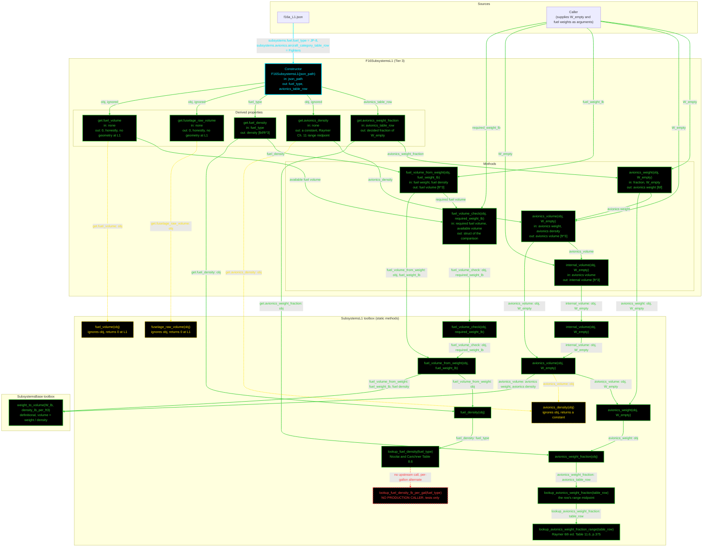

# F16SubsystemsL1: input-to-output data flow

This chart shows the data path for `F16SubsystemsL1`, the Level 1 (L1)
subsystems class. L1 covers avionics weight and volume from a fraction of empty
weight, and fuel volume from a fuel-type density.

**Read this first.**
- The chart runs TOP TO BOTTOM.
- EVERY arrow carries a label naming the exact value it moves.
- The constructor is cyan. Green calls another function. Yellow dashed returns a
  constant and calls nothing. Red dashed has no upstream call.
- Every edge takes the color of the node it POINTS AT.
- The class reads only TWO JSON fields, both of them strings: a fuel type and a
  table row. Every number comes from a toolbox table.
- `fuselage_raw_volume` and `fuel_volume` return 0, HONESTLY. L1 has no
  geometry, so there is no envelope to derive a volume from. They are zero
  rather than absent so the contract holds at every level.
- `avionics_density` also returns a constant and ignores its object argument.
- `W_empty` is a call argument, not stored state. It arrives once per call at
  each public entry point.

## Field-by-field notes

| Class member | Source | Notes |
| --- | --- | --- |
| `fuel_type` | `f16a_L1.json`, `.subsystems.fuel.fuel_type` | `JP-8`. Selects the density row. |
| `avionics_table_row` | `.subsystems.avionics.aircraft_category_table_row` | `Fighters`. The row name Raymer prints. |
| `avionics_weight_fraction` (Dependent) | `lookup_avionics_weight_fraction` | The row's range MIDPOINT, a decided value, chosen over the legacy code's low-end value. |
| `avionics_density` (Dependent) | Toolbox constant | The mean of the Raymer range, hardcoded in the toolbox. The JSON also carries an `avionics.density_lb_per_ft3` key with the same number, and the constructor does not read it. |
| `fuel_density` (Dependent) | `lookup_fuel_density` | Nicolai and Carichner Table 8.6, in lbf per cubic foot. |
| `fuselage_raw_volume`, `fuel_volume` (Dependent) | Toolbox constants, 0 | Honest zeros. L1 has no geometry object and no envelope, so there is nothing to derive a volume from. Zero rather than absent keeps the base contract satisfied at every level. |
| `fuel_volume_check` | Method | Compares the required fuel volume against the available volume, which is 0 at L1. The check therefore always reports a shortfall at this tier. |
| Unread JSON keys | `.subsystems.fuel.density_lb_per_gal`, `.subsystems.avionics.weight_fraction`, `.subsystems.avionics.density_lb_per_ft3` | All three are present and none is read. The numbers come from toolbox tables instead. See S-35 in the findings log. |

## Methods with no upstream call at L1

| Method | Why |
| --- | --- |
| `SubsystemsL1.lookup_fuel_density_lb_per_gal` | The per-gallon density alternate. `fuel_density` uses the per-cubic-foot form. Called only by `TestSubsystemsL1`. |

## Source files

| Item | File |
| --- | --- |
| Concrete class | `examples/F16A/models/disciplines/subsystems/F16SubsystemsL1.m` |
| Tier 2, abstract | `src/disciplines/subsystems/SubsystemsModelL1.m` |
| Tier 1, base | `src/base/SubsystemsBase.m` |
| Toolbox | `src/disciplines/subsystems/SubsystemsL1.m` |
| Input JSON | `examples/F16A/inputs/f16a_L1.json` |
