# F16SubsystemsL2: input-to-output data flow

This chart shows the data path for `F16SubsystemsL2`, the Level 2 (L2)
subsystems class. L2 replaces L1's honest zeros with real volumes: a Raymer
fuselage-envelope volume times a packaging factor, plus a wing fuel volume from
the wing planform.

**Read this first.**
- The chart runs LEFT TO RIGHT.
- EVERY arrow carries a label naming the exact value it moves.
- The constructor is cyan. Green calls another function. Yellow dashed returns a
  constant. Red dashed has no production caller.
- Every edge takes the color of the node it POINTS AT.
- L2 injects TWO objects: a geometry object for the volume terms, and a weights
  object for two different reasons. It supplies `OEW(W_TO)` as the `W_empty` the
  avionics fraction multiplies, and `W_energy` as the required fuel weight in
  the volume check.
- The class reads THREE JSON fields, all strings. Every number comes from a
  table or a cited coefficient.
- `avionics_density` is 45.0 at L2 and about 37.5 at L1. That is a deliberate
  fidelity split, not a drift: L1 averages the Raymer range, L2 and L3 use
  Nicolai and Carichner's own flat figure.
- `battery_volume` ALWAYS ERRORS, and it is a documented citation gap. Only
  GRAVIMETRIC specific energy is cited anywhere in the repo, so there is no
  volumetric density to convert a required energy into a volume. The method
  refuses rather than inventing a coefficient.
- Two lookups are REUSED from the L1 toolbox: the avionics weight fraction and
  the fuel density. Neither varies with fidelity.

```mermaid
flowchart LR
    subgraph SRC["Sources"]
        J["f16a_L2.json"]
        GEOM["Injected object<br/>geom (GeometryModelL2)"]
        WTS["Injected object<br/>fuel_weight_source (WeightsBase)"]
        CALLER["Caller<br/>(supplies fuel_weight_lb, E_required_kWh)"]
    end

    subgraph CLASS["F16SubsystemsL2 (Tier 3)"]
        direction LR

        CTOR["Constructor<br/>F16SubsystemsL2(json_path, geom, fuel_weight_source)<br/>in: all three, none defaulted<br/>out: fuel_type, packaging_factor_category,<br/>avionics_table_row, two stored handles"]

        subgraph AV["Avionics"]
            D1["get.avionics_weight_fraction<br/>in: avionics_table_row<br/>out: decided fraction of W_empty"]
            D2["get.avionics_density<br/>in: none<br/>out: flat figure, Nicolai and Carichner Sec. 8.1.11"]
            D3["get.avionics_weight<br/>in: fraction, OEW(W_TO)<br/>out: avionics weight [lbf]"]
            D4["get.avionics_volume<br/>in: avionics weight, avionics density<br/>out: avionics volume [ft^3]"]
        end

        subgraph FU["Fuel volume"]
            D5["get.fuel_density<br/>in: fuel_type<br/>out: density [lbf/ft^3]"]
            D6["get.fuselage_raw_volume<br/>in: fuselage envelope<br/>out: raw volume [ft^3]"]
            D7["get.fuselage_usable_fuel_volume<br/>in: raw volume, packaging factor<br/>out: usable fuselage volume [ft^3]"]
            D8["get.wing_fuel_volume<br/>in: S_ref, b_wing, root and tip t/c, taper<br/>out: wing fuel volume [ft^3]"]
            D9["get.fuel_volume<br/>in: fuselage usable, wing volume<br/>out: total fuel volume [ft^3]"]
        end

        subgraph MET["Methods"]
            M2["fuel_volume_from_weight(obj, fuel_weight_lb)<br/>in: fuel weight, fuel density<br/>out: required volume [ft^3]"]
            M3["internal_volume(obj)<br/>in: fuel volume, avionics volume<br/>out: internal volume [ft^3]"]
            M4["fuel_volume_check(obj)<br/>in: available volume, W_energy<br/>out: struct of the comparison"]
            M1["battery_volume(obj, E_required_kWh)<br/>ALWAYS ERRORS, documented gap"]
        end
    end

    subgraph TOOL["SubsystemsL2 toolbox (static methods)"]
        T1["avionics_weight_fraction(obj)"]
        T2["avionics_density(obj)<br/>ignores obj, returns a constant"]
        T3["avionics_weight(obj)"]
        T4["avionics_volume(obj)"]
        T5["fuel_density(obj)"]
        T6["fuselage_raw_volume(obj)"]
        T7["fuselage_usable_fuel_volume(obj)"]
        T8["wing_fuel_volume(obj)"]
        T9["fuel_volume_from_weight(obj, fuel_weight_lb)"]
        T10["fuel_volume(obj)"]
        T11["internal_volume(obj)"]
        T12["fuel_volume_check(obj)"]
        C2["compute_envelope_projected_areas(L_fus, W_max, H_max)"]
        C1["compute_raymer_fuselage_volume(A_top, A_side, L_fus)"]
        C3["compute_wing_fuel_volume(S, b, tc_r, tc_t, lambda_w)"]
        C4["lookup_packaging_factor(category)<br/>Nicolai and Carichner p.210"]
        BV["battery_volume(obj, E_required_kWh)<br/>ALWAYS ERRORS, no volumetric density is cited"]
    end

    subgraph TOOL1["SubsystemsL1 toolbox (lookups reused by L2)"]
        U1["lookup_avionics_weight_fraction(table_row)<br/>Raymer 6th ed. Table 11.6"]
        U2["lookup_fuel_density(fuel_type)<br/>Nicolai and Carichner Table 8.6"]
    end

    subgraph TOOLB["SubsystemsBase toolbox"]
        B1["weight_to_volume(W_lb, density_lb_per_ft3)<br/>definitional"]
    end

    J -->|"subsystems.fuel.fuel_type, .packaging_factor_category,<br/>subsystems.avionics.aircraft_category_table_row"| CTOR
    GEOM -->|"geom"| CTOR
    WTS -->|"fuel_weight_source"| CTOR

    CTOR -->|"avionics_table_row"| D1
    CTOR -->|"obj, ignored"| D2
    D1 -->|"avionics_weight_fraction"| D3
    WTS -->|"OEW(W_TO), used as W_empty"| D3
    D3 -->|"avionics_weight"| D4
    D2 -->|"avionics_density"| D4
    CTOR -->|"fuel_type"| D5
    GEOM -->|"L_fus, W_max_fuselage,<br/>H_max_fuselage, L_fuselage"| D6
    CTOR -->|"packaging_factor_category"| D7
    D6 -->|"fuselage_raw_volume"| D7
    GEOM -->|"S_ref, b_wing, tc_r_wing,<br/>tc_t_wing, lambda_wing"| D8
    D7 -->|"fuselage_usable_fuel_volume"| D9
    D8 -->|"wing_fuel_volume"| D9
    CALLER -->|"fuel_weight_lb"| M2
    D5 -->|"fuel_density"| M2
    D9 -->|"fuel_volume"| M3
    D4 -->|"avionics_volume"| M3
    D9 -->|"available fuel volume"| M4
    WTS -->|"W_energy"| M4
    M2 -->|"required fuel volume"| M4

    D1 -->|"get.avionics_weight_fraction: obj"| T1
    D2 -->|"get.avionics_density: obj"| T2
    D3 -->|"get.avionics_weight: obj"| T3
    D4 -->|"get.avionics_volume: obj"| T4
    D5 -->|"get.fuel_density: obj"| T5
    D6 -->|"get.fuselage_raw_volume: obj"| T6
    D7 -->|"get.fuselage_usable_fuel_volume: obj"| T7
    D8 -->|"get.wing_fuel_volume: obj"| T8
    D9 -->|"get.fuel_volume: obj"| T10
    M2 -->|"fuel_volume_from_weight: obj, fuel_weight_lb"| T9
    M3 -->|"internal_volume: obj"| T11
    M4 -->|"fuel_volume_check: obj"| T12

    T1 -->|"avionics_weight_fraction: avionics_table_row"| U1
    T3 -->|"avionics_weight: obj"| T1
    T4 -->|"avionics_volume: obj"| T3
    T4 -->|"avionics_volume: obj"| T2
    T4 -->|"avionics_volume: avionics weight, avionics density"| B1
    T5 -->|"fuel_density: fuel_type"| U2
    T6 -->|"fuselage_raw_volume: L_fus, W_max, H_max"| C2
    T6 -->|"fuselage_raw_volume: A_top, A_side, L_fuselage"| C1
    T7 -->|"fuselage_usable_fuel_volume: packaging_factor_category"| C4
    T7 -->|"fuselage_usable_fuel_volume: obj"| T6
    T8 -->|"wing_fuel_volume: S_ref, b_wing, tc_r_wing, tc_t_wing, lambda_wing"| C3
    T9 -->|"fuel_volume_from_weight: obj"| T5
    T9 -->|"fuel_volume_from_weight: fuel_weight_lb, fuel density"| B1
    T10 -->|"fuel_volume: obj"| T7
    T10 -->|"fuel_volume: obj"| T8
    T11 -->|"internal_volume: obj"| T10
    T11 -->|"internal_volume: obj"| T4
    T12 -->|"fuel_volume_check: obj"| T10
    T12 -->|"fuel_volume_check: obj, W_energy"| T9

    CTOR -.->|"no production caller"| M1
    M1 -.->|"battery_volume: obj, E_required_kWh"| BV

    linkStyle 0,1,2 stroke:#00e5ff,color:#00e5ff,stroke-width:2px
    linkStyle 24,38 stroke:#ffe100,color:#ffe100,stroke-width:2px,stroke-dasharray:4 3
    linkStyle 3,4,5,6,7,8,9,10,11,12,13,14,15,16,17,18,19,20,21,22,23,25,26,27,28,29,30,31,32,33,34,35,36,37,39,40,41,42,43,44,45,46,47,48,49,50,51,52,53 stroke:#33cc33,color:#33cc33,stroke-width:2px
    linkStyle 54,55 stroke:#ff4040,color:#ff4040,stroke-width:2px,stroke-dasharray:5 5

    classDef dead fill:#000000,stroke:#ff4040,stroke-width:3px,color:#ff4040,stroke-dasharray: 6 4
    classDef ctor fill:#000000,stroke:#00e5ff,stroke-width:3px,color:#00e5ff
    classDef func fill:#000000,stroke:#33cc33,stroke-width:2px,color:#33cc33
    classDef passthrough fill:#000000,stroke:#ffe100,stroke-width:2px,color:#ffe100,stroke-dasharray: 4 3
    class M1,BV dead
    class CTOR ctor
    class D1,D2,D3,D4,D5,D6,D7,D8,D9,M2,M3,M4,T1,T3,T4,T5,T6,T7,T8,T9,T10,T11,T12,C1,C2,C3,C4,U1,U2,B1 func
    class T2 passthrough
```

## Field-by-field notes

| Class member | Source | Notes |
| --- | --- | --- |
| `fuel_type` | `f16a_L2.json`, `.subsystems.fuel.fuel_type` | `JP-8`. |
| `packaging_factor_category` | `.subsystems.fuel.packaging_factor_category` | `Integral tank, shallow fuselage`. Selects the usable fraction of the raw fuselage volume. |
| `avionics_table_row` | `.subsystems.avionics.aircraft_category_table_row` | `Fighters`. |
| `geom` | Injected, `GeometryModelL2` | Supplies the fuselage envelope for the raw volume, and the wing planform for the wing fuel volume. |
| `fuel_weight_source` | Injected, `WeightsBase` | Read for TWO different purposes: `OEW(W_TO)` is the `W_empty` the avionics fraction multiplies, and `W_energy` is the required fuel weight in the volume check. |
| `avionics_density` (Dependent) | Toolbox constant | 45.0 at L2 and L3, against about 37.5 at L1. A deliberate fidelity split, decided 2026-07-31: L1 averages the Raymer range, L2 and L3 take Nicolai and Carichner's flat figure. |
| `fuselage_raw_volume` (Dependent) | Raymer envelope volume | Built from the projected top and side areas of the envelope, then the fuselage length. |
| `fuel_volume` (Dependent) | Fuselage usable plus wing | Both terms are real at L2, where both were 0 at L1. |
| `battery_volume` | Not implemented | Errors. Only gravimetric specific energy is cited in the repo, 0.27 kWh/lb from Nicolai and Carichner Table 14.2. No volumetric density exists to convert energy into volume. The gap is recorded in the subplan and in the JSON's `_TODO_battery_specific_volume` key. |
| Unread JSON keys | See S-35 | `fuel.density_lb_per_gal`, `fuel.packaging_factor`, `avionics.density_lb_per_ft3`, `avionics.weight_fraction`, and the four `landing_gear.tire_sizing` coefficients. None is read by any class. |

## Methods with no upstream call at L2

| Method | Why |
| --- | --- |
| `F16SubsystemsL2.battery_volume` | Nothing calls it in the model. It exists to satisfy the `SubsystemsModelL2` contract and to record the gap. |
| `SubsystemsL2.battery_volume` | Reached only through the class method above, which nothing calls. Both always error. |

## Source files

| Item | File |
| --- | --- |
| Concrete class | `examples/F16A/models/disciplines/subsystems/F16SubsystemsL2.m` |
| Tier 2, abstract | `src/disciplines/subsystems/SubsystemsModelL2.m` |
| Tier 1, base | `src/base/SubsystemsBase.m` |
| Toolbox | `src/disciplines/subsystems/SubsystemsL2.m` |
| Toolbox, L1 lookups reused | `src/disciplines/subsystems/SubsystemsL1.m` |
| Injected geometry | `examples/F16A/models/disciplines/geom/F16GeomL2.m` |
| Injected weights | `examples/F16A/models/disciplines/weights/F16WeightsL2.m` |
| Input JSON | `examples/F16A/inputs/f16a_L2.json` |
