# F16SubsystemsL3: input-to-output data flow

This chart shows the data path for `F16SubsystemsL3`, the Level 3 (L3)
subsystems class.

**L3 differs from L2 in exactly ONE equation.** The fuselage raw volume is fed
projected areas integrated from the geometry object's frame-station table,
instead of L2's envelope-ellipse approximation. Every other quantity is
level-agnostic and is reached by a cross-call into the L2 toolbox, not
duplicated.

The chart therefore has three toolbox bands, and most arrows out of the L3
toolbox point into the L2 one. That is the point of the diagram: it shows how
little of L3 is actually L3.

**Read this first.**
- The chart runs LEFT TO RIGHT.
- EVERY arrow carries a label naming the exact value it moves.
- The constructor is cyan. Green calls another function. Yellow dashed returns a
  constant. Red dashed has no production caller.
- Every edge takes the color of the node it POINTS AT.
- `compute_frame_integrated_projected_areas` is the ONLY equation that
  originates in the L3 toolbox. It integrates the normalized frame table with
  `trapz` to get the top and side projected areas.
- Both projected-area paths then feed the SAME Raymer volume equation, which
  lives in the L2 toolbox. The fidelity split is in the areas, not the volume
  formula.
- `battery_volume` still always errors, and now through three hops: the class
  method, the L3 static, and the L2 static that holds the gap.
- The injected geometry is typed `GeometryModelL3` exactly, because the frame
  table exists only at that tier.

```mermaid
flowchart LR
    subgraph SRC["Sources"]
        J["f16a_L3.json"]
        GEOM["Injected object<br/>geom (GeometryModelL3)"]
        WTS["Injected object<br/>fuel_weight_source (WeightsBase)"]
        CALLER["Caller<br/>(supplies fuel_weight_lb, E_required_kWh)"]
    end

    subgraph CLASS["F16SubsystemsL3 (Tier 3)"]
        direction LR

        CTOR["Constructor<br/>F16SubsystemsL3(json_path, geom, fuel_weight_source)<br/>in: all three, none defaulted<br/>out: fuel_type, packaging_factor_category,<br/>avionics_table_row, two stored handles"]

        subgraph AV["Avionics"]
            D1["get.avionics_weight_fraction<br/>in: avionics_table_row<br/>out: decided fraction of W_empty"]
            D2["get.avionics_density<br/>in: none<br/>out: flat figure, same as L2"]
            D3["get.avionics_weight<br/>in: fraction, OEW(W_TO)<br/>out: avionics weight [lbf]"]
            D4["get.avionics_volume<br/>in: avionics weight, avionics density<br/>out: avionics volume [ft^3]"]
        end

        subgraph FU["Fuel volume"]
            D5["get.fuel_density<br/>in: fuel_type<br/>out: density [lbf/ft^3]"]
            D6["get.fuselage_raw_volume<br/>in: frame table, fuselage envelope, length<br/>out: raw volume [ft^3], the ONE L3 difference"]
            D7["get.fuselage_usable_fuel_volume<br/>in: raw volume, packaging factor<br/>out: usable fuselage volume [ft^3]"]
            D8["get.wing_fuel_volume<br/>in: S_ref, b_wing, root and tip t/c, taper<br/>out: wing fuel volume [ft^3]"]
            D9["get.fuel_volume<br/>in: fuselage usable, wing volume<br/>out: total fuel volume [ft^3]"]
        end

        subgraph MET["Methods"]
            M2["fuel_volume_from_weight(obj, fuel_weight_lb)<br/>in: fuel weight, fuel density<br/>out: required volume [ft^3]"]
            M3["internal_volume(obj)<br/>in: fuel volume, avionics volume<br/>out: internal volume [ft^3]"]
            M4["fuel_volume_check(obj)<br/>in: available volume, W_energy<br/>out: struct of the comparison"]
            M1["battery_volume(obj, E_required_kWh)<br/>ALWAYS ERRORS, documented gap"]
        end
    end

    subgraph TOOL["SubsystemsL3 toolbox (static methods)"]
        T1["avionics_weight_fraction(obj)"]
        T2["avionics_density(obj)"]
        T3["avionics_weight(obj)"]
        T4["avionics_volume(obj)"]
        T5["fuel_density(obj)"]
        T6["fuselage_raw_volume(obj)"]
        T7["fuselage_usable_fuel_volume(obj)"]
        T8["wing_fuel_volume(obj)"]
        T9["fuel_volume_from_weight(obj, fuel_weight_lb)"]
        T10["fuel_volume(obj)"]
        T11["internal_volume(obj)"]
        T12["fuel_volume_check(obj)"]
        C5["compute_frame_integrated_projected_areas(<br/>frames_normalized, L_fus, W_max, H_max)<br/>the ONLY equation originating at L3, uses trapz"]
        T13["battery_volume(obj, E_required_kWh)<br/>ALWAYS ERRORS"]
    end

    subgraph TOOL2["SubsystemsL2 toolbox (reused by L3)"]
        V1["avionics_density(obj)<br/>ignores obj, returns a constant"]
        V2["avionics_weight(obj)"]
        V3["avionics_volume(obj)"]
        V4["wing_fuel_volume(obj)"]
        V5["fuel_volume_from_weight(obj, fuel_weight_lb)"]
        V6["compute_raymer_fuselage_volume(A_top, A_side, L_fus)<br/>Raymer Eq. 7.14, shared by both tiers"]
        V7["lookup_packaging_factor(category)<br/>Nicolai and Carichner p.210"]
        VB["battery_volume(obj, E_required_kWh)<br/>ALWAYS ERRORS, holds the gap record"]
    end

    subgraph TOOL1["SubsystemsL1 toolbox (lookups reused by L3)"]
        U1["lookup_avionics_weight_fraction(table_row)<br/>Raymer 6th ed. Table 11.6"]
        U2["lookup_fuel_density(fuel_type)<br/>Nicolai and Carichner Table 8.6"]
    end

    J -->|"subsystems.fuel.fuel_type, .packaging_factor_category,<br/>subsystems.avionics.aircraft_category_table_row"| CTOR
    GEOM -->|"geom"| CTOR
    WTS -->|"fuel_weight_source"| CTOR

    CTOR -->|"avionics_table_row"| D1
    CTOR -->|"obj, ignored"| D2
    D1 -->|"avionics_weight_fraction"| D3
    WTS -->|"OEW(W_TO), used as W_empty"| D3
    D3 -->|"avionics_weight"| D4
    D2 -->|"avionics_density"| D4
    CTOR -->|"fuel_type"| D5
    GEOM -->|"frames_normalized, L_fus, W_max_fuselage,<br/>H_max_fuselage, L_fuselage"| D6
    CTOR -->|"packaging_factor_category"| D7
    D6 -->|"fuselage_raw_volume"| D7
    GEOM -->|"S_ref, b_wing, tc_r_wing,<br/>tc_t_wing, lambda_wing"| D8
    D7 -->|"fuselage_usable_fuel_volume"| D9
    D8 -->|"wing_fuel_volume"| D9
    CALLER -->|"fuel_weight_lb"| M2
    D5 -->|"fuel_density"| M2
    D9 -->|"fuel_volume"| M3
    D4 -->|"avionics_volume"| M3
    D9 -->|"available fuel volume"| M4
    WTS -->|"W_energy"| M4
    M2 -->|"required fuel volume"| M4

    D1 -->|"get.avionics_weight_fraction: obj"| T1
    D2 -->|"get.avionics_density: obj"| T2
    D3 -->|"get.avionics_weight: obj"| T3
    D4 -->|"get.avionics_volume: obj"| T4
    D5 -->|"get.fuel_density: obj"| T5
    D6 -->|"get.fuselage_raw_volume: obj"| T6
    D7 -->|"get.fuselage_usable_fuel_volume: obj"| T7
    D8 -->|"get.wing_fuel_volume: obj"| T8
    D9 -->|"get.fuel_volume: obj"| T10
    M2 -->|"fuel_volume_from_weight: obj, fuel_weight_lb"| T9
    M3 -->|"internal_volume: obj"| T11
    M4 -->|"fuel_volume_check: obj"| T12

    T1 -->|"avionics_weight_fraction: avionics_table_row"| U1
    T2 -->|"avionics_density: obj"| V1
    T3 -->|"avionics_weight: obj"| V2
    T4 -->|"avionics_volume: obj"| V3
    T5 -->|"fuel_density: fuel_type"| U2
    T6 -->|"fuselage_raw_volume: frames_normalized,<br/>L_fus, W_max, H_max"| C5
    T6 -->|"fuselage_raw_volume: A_top, A_side, L_fuselage"| V6
    T7 -->|"fuselage_usable_fuel_volume: packaging_factor_category"| V7
    T7 -->|"fuselage_usable_fuel_volume: obj"| T6
    T8 -->|"wing_fuel_volume: obj"| V4
    T9 -->|"fuel_volume_from_weight: obj, fuel_weight_lb"| V5
    T10 -->|"fuel_volume: obj"| T7
    T10 -->|"fuel_volume: obj"| T8
    T11 -->|"internal_volume: obj"| T10
    T11 -->|"internal_volume: obj"| T4
    T12 -->|"fuel_volume_check: obj"| T10
    T12 -->|"fuel_volume_check: obj, W_energy"| T9

    CTOR -.->|"no production caller"| M1
    M1 -.->|"battery_volume: obj, E_required_kWh"| T13
    T13 -.->|"battery_volume: obj, E_required_kWh"| VB

    linkStyle 0,1,2 stroke:#00e5ff,color:#00e5ff,stroke-width:2px
    linkStyle 36 stroke:#ffe100,color:#ffe100,stroke-width:2px,stroke-dasharray:4 3
    linkStyle 3,4,5,6,7,8,9,10,11,12,13,14,15,16,17,18,19,20,21,22,23,24,25,26,27,28,29,30,31,32,33,34,35,37,38,39,40,41,42,43,44,45,46,47,48,49,50,51 stroke:#33cc33,color:#33cc33,stroke-width:2px
    linkStyle 52,53,54 stroke:#ff4040,color:#ff4040,stroke-width:2px,stroke-dasharray:5 5

    classDef dead fill:#000000,stroke:#ff4040,stroke-width:3px,color:#ff4040,stroke-dasharray: 6 4
    classDef ctor fill:#000000,stroke:#00e5ff,stroke-width:3px,color:#00e5ff
    classDef func fill:#000000,stroke:#33cc33,stroke-width:2px,color:#33cc33
    classDef passthrough fill:#000000,stroke:#ffe100,stroke-width:2px,color:#ffe100,stroke-dasharray: 4 3
    class M1,T13,VB dead
    class CTOR ctor
    class D1,D2,D3,D4,D5,D6,D7,D8,D9,M2,M3,M4,T1,T2,T3,T4,T5,T6,T7,T8,T9,T10,T11,T12,C5,V2,V3,V4,V5,V6,V7,U1,U2 func
    class V1 passthrough
```

## Field-by-field notes

| Class member | Source | Notes |
| --- | --- | --- |
| `fuel_type`, `packaging_factor_category`, `avionics_table_row` | `f16a_L3.json`, `.subsystems` | The same three strings as L2, with the same values. |
| `geom` | Injected, `GeometryModelL3` exactly | Tighter than L2's guard, and it has to be: `frames_normalized` exists only at the L3 geometry tier. |
| `fuel_weight_source` | Injected, `WeightsBase` | Same two uses as L2: `OEW(W_TO)` for the avionics `W_empty`, and `W_energy` for the volume check. |
| `fuselage_raw_volume` (Dependent) | Frame-integrated areas, then the L2 volume equation | THE fidelity difference. `compute_frame_integrated_projected_areas` runs `trapz` over the normalized frame table to get the top and side projected areas. L2 approximates the same two areas from the envelope. |
| Everything else | Cross-call into `SubsystemsL2` or `SubsystemsL1` | `avionics_density`, `avionics_weight`, `avionics_volume`, `wing_fuel_volume`, `fuel_volume_from_weight`, `compute_raymer_fuselage_volume` and `lookup_packaging_factor` all come from L2. The two lookups come from L1. Nothing is duplicated. |
| `battery_volume` | Not implemented | Errors, through three hops. The gap record lives on the L2 static. |

## Methods with no upstream call at L3

| Method | Why |
| --- | --- |
| `F16SubsystemsL3.battery_volume` | Nothing calls it in the model. It exists to satisfy the `SubsystemsModelL3` contract. |
| `SubsystemsL3.battery_volume` | Reached only through the class method above. |
| `SubsystemsL2.battery_volume` | Reached only through the L3 static above. It holds the gap record. |

## Source files

| Item | File |
| --- | --- |
| Concrete class | `examples/F16A/models/disciplines/subsystems/F16SubsystemsL3.m` |
| Tier 2, abstract | `src/disciplines/subsystems/SubsystemsModelL3.m` |
| Tier 1, base | `src/base/SubsystemsBase.m` |
| Toolbox | `src/disciplines/subsystems/SubsystemsL3.m` |
| Toolbox, L2 reused | `src/disciplines/subsystems/SubsystemsL2.m` |
| Toolbox, L1 lookups reused | `src/disciplines/subsystems/SubsystemsL1.m` |
| Injected geometry | `examples/F16A/models/disciplines/geom/F16GeomL3.m` |
| Injected weights | `examples/F16A/models/disciplines/weights/F16WeightsL3.m` |
| Input JSON | `examples/F16A/inputs/f16a_L3.json` |
