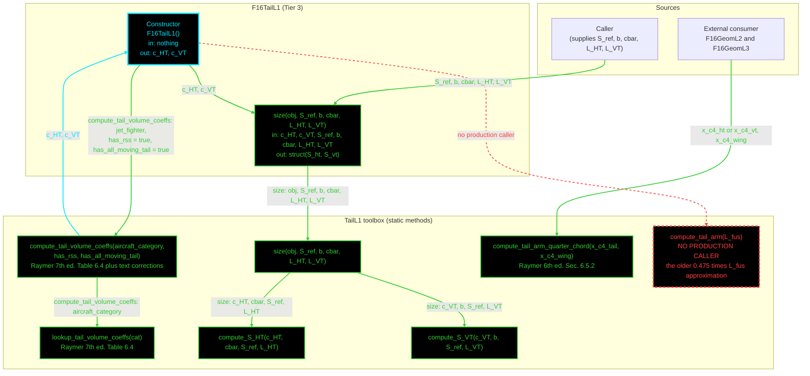

# F16TailL1: input-to-output data flow

This chart shows the data path for `F16TailL1`, the Level 1 (L1) tail-sizing
class. L1 sizes both tails from volume coefficients: `S_HT` from the HT
coefficient, the wing MAC, the reference area and the HT arm, and `S_VT` from
the VT coefficient, the span, the area and the VT arm.

**This is the only class in the set with NO input file and NO injected object.**
The constructor takes no arguments. Its two coefficients come from a toolbox
lookup keyed on the category and two configuration flags. Everything else
arrives as call arguments.

**Read this first.**
- The chart runs TOP TO BOTTOM. The class is very small.
- EVERY arrow carries a label naming the exact value it moves.
- The constructor is cyan. Green calls another function. Red dashed has no
  production caller.
- Every edge takes the color of the node it POINTS AT. The arrow carrying
  `c_HT` and `c_VT` back INTO the constructor is therefore cyan.
- `size` shadows MATLAB's built-in `size` for this class. The contract names it,
  so the class must too.
- `compute_tail_arm_quarter_chord` is LIVE, but no tail class calls it. Both
  geometry classes do, for their `L_HT` and `L_VT` getters. That external
  consumer is drawn as a source node, because the call does not pass through
  the tail class.
- `compute_tail_arm` has no production caller. It is the older
  0.475 times fuselage-length approximation. `F16TailL2` moved to a
  centre-of-gravity-based arm, and the geometry classes moved to the
  quarter-chord form.

## Field-by-field notes

| Class member | Source | Notes |
| --- | --- | --- |
| `c_HT`, `c_VT` | `TailL1.compute_tail_volume_coeffs` | NET coefficients, from the Table 6.4 row plus the text corrections that the two configuration flags select. The constructor hardcodes `jet_fighter`, relaxed static stability true, and all-moving tail true. |
| `S_ref`, `b`, `cbar`, `L_HT`, `L_VT` | Call arguments | Nothing is stored. The caller supplies the planform and both arms on every call. |
| `TailSizingBase` | Abstract | Declares one method, `size`, with six arguments. |
| `compute_tail_arm_quarter_chord` | Live, called from geometry | `F16GeomL2` and `F16GeomL3` use it for `L_HT` and `L_VT`. No tail class calls it. |

## Methods with no upstream call at L1

| Method | Why |
| --- | --- |
| `TailL1.compute_tail_arm` | The 0.475 times fuselage-length approximation. `F16TailL2` uses a centre-of-gravity-based arm instead, and the geometry classes use the quarter-chord form. Called now only by a generator script, the comparison report and tests. |

## Source files

| Item | File |
| --- | --- |
| Concrete class | `examples/F16A/models/disciplines/tail/F16TailL1.m` |
| Tier 2, abstract | `src/disciplines/tail_sizing/TailSizingModelL1.m`, empty |
| Tier 1, base | `src/base/TailSizingBase.m` |
| Toolbox | `src/disciplines/tail_sizing/TailL1.m` |
| External consumer | `examples/F16A/models/disciplines/geom/F16GeomL2.m`, `F16GeomL3.m` |
| Input JSON | None. This class reads no file |
