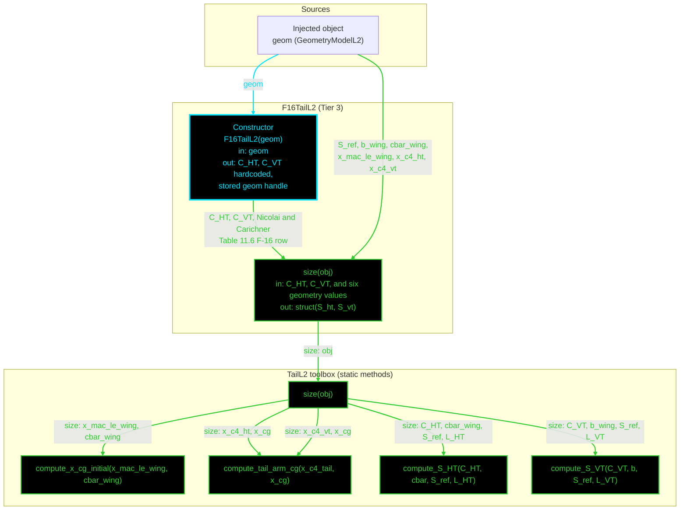

# F16TailL2: input-to-output data flow

This chart shows the data path for `F16TailL2`, the Level 2 (L2) tail-sizing
class. L2 uses the same volume-coefficient equations as L1, and differs in two
ways: the coefficients come from a different source, and both tail arms are
computed from a centre-of-gravity estimate rather than supplied by the caller.

**Read this first.**
- The chart runs TOP TO BOTTOM. The class is very small.
- EVERY arrow carries a label naming the exact value it moves.
- The constructor is cyan. Green calls another function.
- Every edge takes the color of the node it POINTS AT.
- There are NO red nodes. All five `TailL2` statics are reached.
- `size(obj)` takes NO arguments here, against six at L1. Everything comes from
  the injected geometry object. The base contract declares six, so the three
  concrete classes disagree on arity. See S-36 in the findings log.
- The two coefficients are HARDCODED in the constructor, not read from JSON.
  They come from the Nicolai and Carichner table's own F-16 row.
- L2 does NOT call `TailL1.compute_tail_arm` any more. It computes an initial
  centre of gravity from the wing MAC leading edge, then takes each arm as the
  distance from that station to the tail quarter-chord.

## Field-by-field notes

| Class member | Source | Notes |
| --- | --- | --- |
| `C_HT`, `C_VT` | Hardcoded in the constructor | Nicolai and Carichner Table 11.6, the General Dynamics F-16 row, p.289. A different source from L1's Raymer Table 6.4 coefficients, so the two tiers are not the same equation fed different numbers; they are different tables. |
| `geom` | Injected, `GeometryModelL2` | Supplies six values: the reference area, span and MAC for the sizing equations, and the MAC leading edge plus both tail quarter-chord stations for the arms. |
| `x_cg` | `compute_x_cg_initial` | An initial estimate from the wing MAC leading edge and the MAC itself. This is what replaced the fuselage-length approximation. |
| `L_HT`, `L_VT` | `compute_tail_arm_cg` | Each arm is the distance from the estimated centre of gravity to that tail's quarter-chord station. The same static serves both, called twice. |

## Methods with no upstream call at L2

None. All five `TailL2` statics are reached.

## Source files

| Item | File |
| --- | --- |
| Concrete class | `examples/F16A/models/disciplines/tail/F16TailL2.m` |
| Tier 2, abstract | `src/disciplines/tail_sizing/TailSizingModelL2.m`, empty |
| Tier 1, base | `src/base/TailSizingBase.m` |
| Toolbox | `src/disciplines/tail_sizing/TailL2.m` |
| Injected geometry | `examples/F16A/models/disciplines/geom/F16GeomL2.m` |
| Input JSON | None. This class reads no file |
