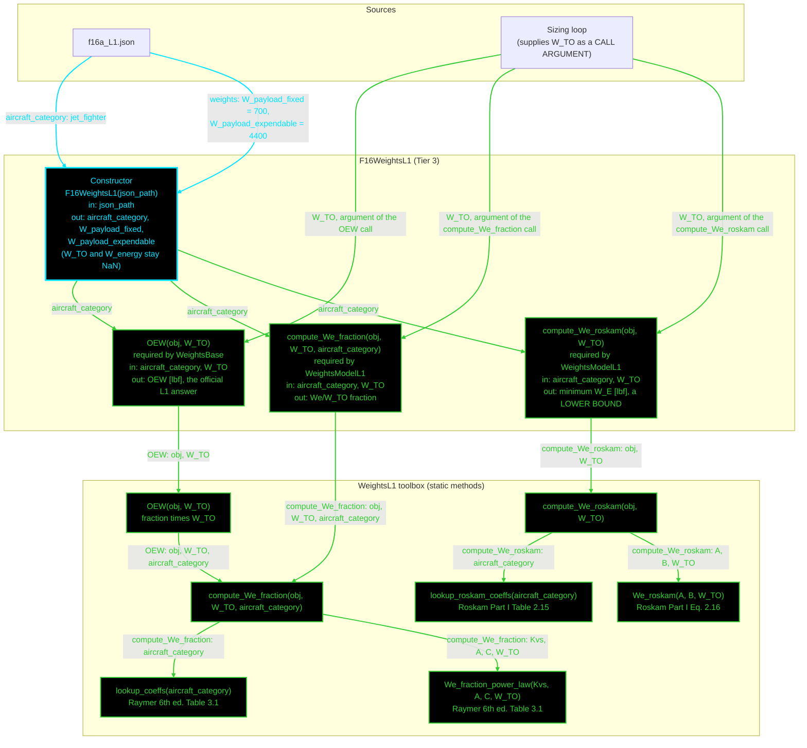

# F16WeightsL1: input-to-output data flow

This chart shows the data path for `F16WeightsL1`, the Level 1 (L1) weights
class. L1 is a statistical empty-weight fraction: a power law in `W_TO`, with
an independent regression as a lower bound.

L1 is the only weights level with NO dependency injection. Both regressions
take just `W_TO` and `aircraft_category`, so there is no design Mach, no cruise
condition, no geometry object and no propulsion object to inject.

**Read this first.**
- The chart runs TOP TO BOTTOM. The class is small, so the vertical form reads
  better.
- EVERY arrow carries a label naming the exact value it moves.
- There is no "Inputs" block. The constructor's outgoing arrows carry the
  field names.
- The constructor is cyan. Every other function is green.
- Every edge takes the color of the node it POINTS AT.
- There are NO red nodes and NO yellow nodes. Every `WeightsL1` static is
  reached, and no getter is a passthrough, because L1 has zero `Dependent`
  properties.
- Zero derived properties is the correct answer here, not an oversight. `OEW`,
  `compute_We_fraction` and `compute_We_roskam` all take `W_TO` as an
  ARGUMENT, so they recompute per call and cannot go stale. The
  inputs-versus-dependent rule governs stored derived state, and L1 stores
  none.
- `W_TO` arrives THREE times, once per public method, and that is not
  duplication. The three methods are independent entry points, and each takes
  `W_TO` as a call argument. The class never reads `obj.W_TO` in any of them,
  which is exactly what stops the value going stale. `OEW` does not call
  `compute_We_fraction` at class level either: it delegates to the toolbox, and
  that chaining is the `T1` to `T2` edge inside the toolbox band.
- The `W_TO` property still exists, to satisfy the `WeightsBase` contract, and
  it is `NaN` until the loop sets it. No method here reads it.
- The two regressions are NOT interchangeable. Raymer's power law is the
  central estimate and is what `OEW` returns. Roskam's Eq. 2.16 is a LOWER
  BOUND on empty weight: an actual OEW should exceed it, and it must never be
  summed into an OEW or reported as one.

## Field-by-field notes

| Class member | Source | Notes |
| --- | --- | --- |
| `aircraft_category` | `f16a_L1.json`, top-level field | One canonical flag. Selects both the Raymer Table 3.1 row and the Roskam Table 2.15 row, through two separate lookups. |
| `W_TO` | Sizing loop, mutated in place | `NaN` until the loop sets it. A `WeightsBase` abstract property. |
| `W_energy` | Mission analysis, mutated in place | `NaN` until set. Was previously 6296.3, which is Brandt Wt!B6, a live formula `= B3 - B4 - B5 - B12`, so `W_TO` minus payload minus OEW: a back-calculated Brandt OUTPUT. Deleted from the JSON in Phase 3, because CLAUDE.md forbids using an output as an input. |
| `W_payload_expendable` | `.weights.W_payload_expendable` | 4400 lbf, Brandt Wt!B5. |
| `W_payload_fixed` | `.weights.W_payload_fixed` | 700 lbf, Brandt Wt!B4. |
| Both payload values | | INERT. No `WeightsL1`, `WeightsL2` or `WeightsL3` static reads either one. They satisfy the `WeightsBase` closure contract and are waiting for the sizing loop. Setting them changes no computed L1 number. They make the closure identity work out: 31377 - 19980.70 - 6296.30 = 5100 = 700 + 4400. |
| `OEW` at `W_TO` = 31,377 lbf | Computed | Fraction 0.609055, so OEW = 19,110.31 lbf. |
| `compute_We_roskam` at the same `W_TO` | Computed | 15,673.73 lbf, correctly BELOW the Raymer estimate. |
| Ground truth, for context only | | Brandt Wt!B12 = 19,980.70 lbf, so -4.36 percent. Casey's `corrections.xls` = 19,148.08 lbf, so -0.20 percent. Two distinct provenances about 4.3 percent apart. The class header records that an earlier version cited the wrong cell in the wrong workbook. |

## Methods with no upstream call at L1

None. All seven `WeightsL1` statics are reached: the three high-level wrappers
by the class, and the four low-level statics by those wrappers.

## Source files

| Item | File |
| --- | --- |
| Concrete class | `examples/F16A/models/disciplines/weights/F16WeightsL1.m` |
| Tier 2, abstract | `src/disciplines/weights/WeightsModelL1.m` |
| Tier 1, base | `src/base/WeightsBase.m` |
| Toolbox | `src/disciplines/weights/WeightsL1.m` |
| Input JSON | `examples/F16A/inputs/f16a_L1.json` |
