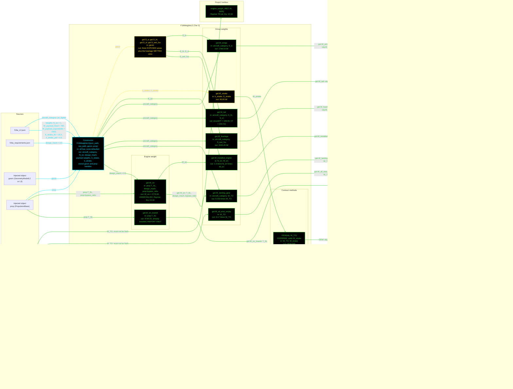

# F16WeightsL2: input-to-output data flow

This chart shows the data path for `F16WeightsL2`, the Level 2 (L2) weights
class. L2 is an area-based group buildup: Raymer Table 15.2 surface densities
on the exposed and wetted areas, plus metabook fractions for the landing gear,
the installed engine and the all-else-empty group.

L2 reads TWO JSON files and takes TWO injected objects. It stores no geometry
number and no engine number.

**Read this first.**
- The chart runs LEFT TO RIGHT.
- EVERY arrow carries a label naming the exact value it moves.
- There is no "Inputs" block. The constructor's outgoing arrows carry the field
  names.
- The constructor is cyan. Every other function is green. Yellow dashed marks a
  getter that calls nothing.
- Every edge takes the color of the node it POINTS AT.
- There are NO red nodes. All 13 `WeightsL2` statics are reached.
- `design_mach` comes from the REQUIREMENTS file, not the spec file. It says
  what the aircraft must do, not what it is.
- `W_TO` enters from the sizing loop, not the JSON. Two getters demand a
  non-`NaN` value and error otherwise.
- `OEW` is OVERRIDDEN. It calls the toolbox sum, then adds `W_strake`. The
  strake is not in Raymer Table 15.2, so its coefficient comes from Brandt.
- `W_en` and `W_en_brandt` are NOT alternatives to pick between. `W_en` is the
  official uninstalled engine weight and is the only one that enters `OEW`.
  `W_en_brandt` is already installed, and it is for the comparison report only.
- The private `requireWTO` guard is not drawn, to match the geometry charts.
  The two getters that use it take their `W_TO` arrow straight from the loop.

## Field-by-field notes

| Class member | Source | Notes |
| --- | --- | --- |
| `aircraft_category` | `f16a_L2.json`, top-level field | Selects five separate lookups: the four Table 15.2 surface densities and the metabook landing-gear fraction. |
| `N_en` | `.weights.N_en` | 1. Not derivable: no propulsion class exposes an engine count. `geom.n_engines` exists only as a geometry stopgap. |
| `design_mach` | `f16a_requirements.json`, `.design_mach` | 2.0, cited to Brandt. It is NOT the T.O. operating Mach limit, which is 2.05, a different number. Citing 2.0 to the T.O. would attribute a Brandt input to a document that says otherwise. The difference moves `W_en` by 0.62 percent. |
| `S_strake`, `k_strake` | `.weights.S_strake_ft2`, `.k_strake_psf` | 20 ft^2 and 4.5 lbf/ft^2, both Brandt. A deliberate cross-model borrow: Raymer Table 15.2 has no strake row, so no Raymer alternative exists. This is not the forbidden back-calculated pattern, because Brandt applies these as genuine inputs in his own worksheet. The strake was the largest single item in the earlier "NOT MODELED" gap, 13.68 percent of Brandt Wt!B12. |
| `W_TO`, `W_energy` | Sizing loop and mission analysis | `NaN` until set. `W_energy` was previously a back-calculated Brandt output and was deleted from the JSON. |
| Payload weights | `.weights` | INERT at every level. See S-29 in the findings log. |
| `S_w`, `S_ht`, `S_vt` (Dependent) | `geom.S_exposed_*` | EXPOSED areas, 196.23, 49.85 and 40.89. Not `geom.S_ht` = 108 or `geom.S_vt` = 60, which are FULL planform. |
| `S_wet_fus` (Dependent) | `geom.get_S_wet_fuselage()` | 730.30 ft^2. |
| `W_en` (Dependent) | `PropL2.engine_weight_AB` | 2775.02 lbf, uninstalled. Replaced a hardcoded 3030 estimate. |
| `W_en_brandt` (Dependent) | `WeightsL2.engine_weight_brandt` | 4730.23 lbf, already installed. Comparison report only, never summed into `OEW`. |
| `W_all_else_empty` (Dependent) | `0.17` times `W_TO` | Was frozen in the constructor at `W_TO` = 31,377, which is Brandt Wt!B3, a sizing OUTPUT. Two defects in one line: a forbidden input, and a value that went stale under mutation. At `W_TO` = 45,000 the frozen version understated the group by 2315.91 lbf. Every test called `OEW(31377)`, the one argument where the error is invisible. |
| `W_wings`, `W_landing_gear`, `W_tail`, `W_fuselage` | Now Dependent | All four were declared as computed totals, satisfied with `= NaN`, and never assigned, because the toolbox `OEW` computed them locally and discarded them. A consumer reading the documented contract got `NaN`. |

## Methods with no upstream call at L2

None. All 13 `WeightsL2` statics are reached.

## Source files

| Item | File |
| --- | --- |
| Concrete class | `examples/F16A/models/disciplines/weights/F16WeightsL2.m` |
| Tier 2, abstract | `src/disciplines/weights/WeightsModelL2.m` |
| Tier 1, base | `src/base/WeightsBase.m` |
| Toolbox | `src/disciplines/weights/WeightsL2.m` |
| Toolbox, engine weight | `src/disciplines/propulsion/PropL2.m` |
| Injected geometry | `examples/F16A/models/disciplines/geom/F16GeomL2.m` |
| Injected propulsion | `examples/F16A/models/disciplines/prop/F16PropL2.m` |
| Input JSON | `examples/F16A/inputs/f16a_L2.json`, `f16a_requirements.json` |
