# F16WeightsL3: input-to-output data flow

This chart shows the data path for `F16WeightsL3`, the Level 3 (L3) weights
class. L3 is the Raymer Sec. 15.3.1 component buildup: one cited equation per
item, in four groups (structure, landing gear, propulsion, systems).

This is the largest class in the set. It has 26 derived getters and 7 contract
methods, and the `WeightsL3` toolbox holds 32 statics.

**Read this first.**
- The chart runs LEFT TO RIGHT. The toolbox is split into five subgraphs so the
  25 low-level equations stack vertically instead of forming one wide rank.
- EVERY arrow carries a label naming the exact value it moves.
- There is no "Inputs" block. The constructor's outgoing arrows carry the field
  names.
- The constructor is cyan. Every other function is green. Yellow dashed marks a
  getter that calls nothing.
- Every edge takes the color of the node it POINTS AT.
- There are NO red nodes. All 32 `WeightsL3` statics are reached.
- 22 of the 26 derived getters only READ an injected object. They are grouped
  by component, six yellow nodes, because one node each would add 22 boxes and
  no information.
- `OEW` is OVERRIDDEN, the same as at L2: it calls the toolbox sum, then adds
  `W_strake`.
- The engine weight passed to the propulsion group must be UNINSTALLED. The
  nine engine-section items ARE the installation, so an L2-style lumped 1.3
  factor would count them twice.
- `get.SFC_mission` is the one getter that reaches outside weights and
  geometry. It builds an `AircraftState` at the cruise condition from the
  requirements file, then asks the injected propulsion object for TSFC. The
  fuel-system equation needs it.
- `weight_systems` contains NO landing-gear term. `OEW` adds the main and nose
  gear separately.
- The private `requireWTO` guard is not drawn. The getters that use it take
  their `W_TO` arrow straight from the loop.

```mermaid
flowchart LR
    subgraph SRC["Sources"]
        J["f16a_L3.json"]
        REQ["f16a_requirements.json"]
        GEOM["Injected object<br/>geom (GeometryModelL2 or L3)"]
        PROP["Injected object<br/>prop (PropulsionBase)"]
        SL["Sizing loop<br/>(mutates W_TO in place)"]
    end

    subgraph CLASS["F16WeightsL3 (Tier 3)"]
        direction LR

        CTOR["Constructor<br/>F16WeightsL3(json_path, req_path, geom, prop)<br/>in: all four, none defaulted<br/>out: N_z, the wing/HT/VT/landing-gear/engine-section/<br/>systems/strake coefficient sets, design_mach,<br/>cruise condition, stored geom and prop handles"]

        subgraph DERG["Derived reads (no computation)"]
            G1["get.S_w, get.AR_w, get.tc_root, get.lambda_w,<br/>get.Lambda_LE_w, get.S_csw<br/>in: geom<br/>out: wing planform and control-surface area"]
            G2["get.S_ht, get.F_w, get.B_h<br/>in: geom<br/>out: exposed HT area, fuselage width at HT, HT span"]
            G3["get.S_vt, get.AR_vt, get.lambda_vt, get.Lambda_LE_vt,<br/>get.H_t, get.H_v, get.L_t, get.S_r<br/>in: geom<br/>out: exposed VT planform, tail arm, rudder area"]
            G4["get.L_fus, get.D_fus, get.W_fus<br/>in: geom<br/>out: fuselage length, DEPTH and width"]
            G5["get.S_cs<br/>in: geom<br/>out: total control-surface area"]
            G6["get.T_max<br/>in: prop.T_SL<br/>out: T_max"]
        end

        subgraph DERC["Derived computed"]
            E1["get.W_en<br/>in: prop.T_SL, design_mach, prop.bypass_ratio<br/>out: UNINSTALLED engine weight, Raymer Eq. 10.10"]
            E2["get.W_en_brandt<br/>in: prop.T_SL<br/>out: already installed, REPORT ONLY"]
            E3["get.SFC_mission<br/>in: cruise_altitude_ft, cruise_mach, prop<br/>out: TSFC at the cruise condition"]
            W0["get.W_l<br/>in: W_TO<br/>out: landing weight"]
        end

        subgraph GRP["Group totals"]
            W1["get.W_wings<br/>in: wing geometry, N_z, K_dw, K_vs, W_TO<br/>out: wing weight, Raymer Eq. 15.1"]
            W2["get.W_tail<br/>in: HT and VT geometry, N_z, K_rht,<br/>design_mach, W_TO<br/>out: struct(HT, VT), Eq. 15.2 and 15.3"]
            W3["get.W_fuselage<br/>in: fuselage geometry, N_z, K_dwf, W_TO<br/>out: fuselage weight, Eq. 15.4"]
            W4["get.W_installed_engine<br/>in: W_en, T_max, the engine-section coefficients<br/>out: propulsion group total, Eq. 15.7 to 15.15"]
            W5["get.W_subsystems<br/>in: SFC_mission, S_cs, T_max,<br/>the systems coefficients, W_TO<br/>out: systems group total, Eq. 15.16 to 15.24"]
            W6["get.W_strake<br/>in: k_strake, S_strake<br/>out: strake weight"]
        end

        subgraph CON["Contract methods"]
            M1["OEW(obj, W_TO)<br/>OVERRIDE, adds W_strake<br/>in: W_TO, W_strake<br/>out: OEW [lbf]"]
            M2["weight_wing(obj, W_TO)"]
            M3["weight_tail(obj, W_TO)"]
            M4["weight_fuselage(obj, W_TO)"]
            M5["weight_landing_gear(obj, W_TO)<br/>in: W_TO, L_m, L_n, N_l, K_cb, K_tpg, N_nw<br/>out: struct(main, nose)"]
            M6["weight_engine_section(obj, W_TO)<br/>out: struct of nine members plus .total"]
            M7["weight_systems(obj, W_TO)<br/>out: struct of nine members plus .total"]
        end
    end

    subgraph TOOLH["WeightsL3 toolbox: group assembly"]
        T1["OEW(obj, W_TO)<br/>sums structure, gear, propulsion, systems"]
        T2["weight_wing(obj, W_TO)"]
        T3["weight_tail(obj, W_TO)"]
        T4["weight_fuselage(obj, W_TO)"]
        T5["weight_landing_gear(obj, W_TO)"]
        T6["weight_engine_section(obj, ~)"]
        T7["weight_systems(obj, W_TO)"]
    end

    subgraph TOOLS["WeightsL3: structure and landing gear"]
        LW["landing_weight(W_TO)<br/>NO textbook source"]
        S2["wing(W_dg, N_z, S_w, AR, tc_root, lambda,<br/>Lambda_LE_deg, S_csw, K_dw, K_vs)<br/>Raymer Eq. 15.1"]
        S3["horizontal_tail(W_dg, N_z, S_ht, F_w, B_h)<br/>Raymer Eq. 15.2"]
        S4["vertical_tail(W_dg, N_z, S_vt, K_rht, H_t, H_v,<br/>M, L_t, S_r, AR_vt, lambda_vt, Lambda_LE_vt_deg)<br/>Raymer Eq. 15.3"]
        S5["fuselage(W_dg, N_z, L_fus, D_fus, W_fus, K_dwf)<br/>Raymer Eq. 15.4"]
        LG1["main_gear(W_l, N_l, L_m, K_cb, K_tpg)<br/>Raymer Eq. 15.5"]
        LG2["nose_gear(W_l, N_l, L_n, N_nw)<br/>Raymer Eq. 15.6"]
    end

    subgraph TOOLE["WeightsL3: propulsion group"]
        EN1["engine_mounts(N_en, T, N_z)<br/>Eq. 15.7"]
        EN2["firewall(S_fw)<br/>Eq. 15.8, returns 0 for a jet"]
        EN3["engine_section(W_en, N_en, N_z)<br/>Eq. 15.9"]
        EN4["air_induction(K_vg, L_d, K_d, N_en, L_s, D_e)<br/>Eq. 15.10"]
        EN5["tailpipe(D_e, L_tp, N_en)<br/>Eq. 15.11"]
        EN6["engine_cooling(D_e, L_sh, N_en)<br/>Eq. 15.12"]
        EN7["oil_cooling(N_en)<br/>Eq. 15.13"]
        EN8["engine_controls(N_en, L_ec)<br/>Eq. 15.14"]
        EN9["starter(T, N_en)<br/>Eq. 15.15"]
    end

    subgraph TOOLY["WeightsL3: systems group"]
        SY1["fuel_system(V_t, V_i, V_p, N_t, N_en, T, SFC)<br/>Eq. 15.16"]
        SY2["flight_controls(M, S_cs, N_s, N_c)<br/>Eq. 15.17"]
        SY3["instruments(N_en, N_t, N_ci)<br/>Eq. 15.18"]
        SY4["hydraulics(K_vsh, N_u)<br/>Eq. 15.19"]
        SY5["electrical(K_mc, R_kva, N_c, L_a, N_gen)<br/>Eq. 15.20"]
        SY6["avionics(W_uav)<br/>Eq. 15.21"]
        SY7["furnishings(N_c)<br/>Eq. 15.22"]
        SY8["ac_antiice(W_uav, N_c)<br/>Eq. 15.23"]
        SY9["handling_gear(W_TO)<br/>Eq. 15.24"]
    end

    subgraph TOOLX["External toolboxes"]
        P1["PropL2.engine_weight_AB(T, M, BPR)<br/>Raymer 7th ed. Eq. 10.10"]
        P2["WeightsL2.engine_weight_brandt(T_AB_SLS)<br/>Brandt Wt!B11"]
        AS["AircraftState(altitude, mach)<br/>ISA atmosphere at the cruise condition"]
    end

    J -->|"weights: N_z, payload weights, and the wing,<br/>horizontal_tail, vertical_tail, landing_gear,<br/>engine_section, systems and strake blocks"| CTOR
    REQ -->|"design_mach = 2.0, cruise altitude and Mach"| CTOR
    GEOM -->|"geom"| CTOR
    PROP -->|"prop"| CTOR

    CTOR -->|"geom"| G1
    CTOR -->|"geom"| G2
    CTOR -->|"geom"| G3
    CTOR -->|"geom"| G4
    CTOR -->|"geom"| G5
    CTOR -->|"prop"| G6

    PROP -->|"prop.T_SL, prop.bypass_ratio"| E1
    CTOR -->|"design_mach"| E1
    PROP -->|"prop.T_SL"| E2
    CTOR -->|"cruise_altitude_ft, cruise_mach"| E3
    PROP -->|"prop.get_TSFC(state)"| E3
    SL -->|"W_TO"| W0

    G1 -->|"S_w, AR_w, tc_root, lambda_w,<br/>Lambda_LE_w, S_csw"| W1
    CTOR -->|"N_z, K_dw, K_vs"| W1
    SL -->|"W_TO"| W1
    G2 -->|"S_ht, F_w, B_h"| W2
    G3 -->|"S_vt, AR_vt, lambda_vt, Lambda_LE_vt,<br/>H_t, H_v, L_t, S_r"| W2
    CTOR -->|"N_z, K_rht, design_mach"| W2
    SL -->|"W_TO"| W2
    G4 -->|"L_fus, D_fus, W_fus"| W3
    CTOR -->|"N_z, K_dwf"| W3
    SL -->|"W_TO"| W3
    E1 -->|"W_en, UNINSTALLED"| W4
    G6 -->|"T_max"| W4
    CTOR -->|"N_en, N_z, S_fw, K_vg, L_d, K_d,<br/>L_s, D_e, L_tp, L_sh, L_ec"| W4
    E3 -->|"SFC_mission"| W5
    G5 -->|"S_cs"| W5
    G6 -->|"T_max"| W5
    CTOR -->|"V_t, V_i, V_p, N_t, N_en, N_s, N_c, N_ci,<br/>K_vsh, N_u, K_mc, R_kva, L_a, N_gen, W_uav"| W5
    SL -->|"W_TO"| W5
    CTOR -->|"k_strake, S_strake"| W6

    SL -->|"W_TO"| M1
    W6 -->|"W_strake"| M1
    SL -->|"W_TO"| M2
    SL -->|"W_TO"| M3
    SL -->|"W_TO"| M4
    SL -->|"W_TO"| M5
    CTOR -->|"L_m, L_n, N_l, K_cb, K_tpg, N_nw"| M5
    SL -->|"W_TO"| M6
    SL -->|"W_TO"| M7

    M1 -->|"OEW: obj, W_TO"| T1
    M2 -->|"weight_wing: obj, W_TO"| T2
    M3 -->|"weight_tail: obj, W_TO"| T3
    M4 -->|"weight_fuselage: obj, W_TO"| T4
    M5 -->|"weight_landing_gear: obj, W_TO"| T5
    M6 -->|"weight_engine_section: obj, W_TO"| T6
    M7 -->|"weight_systems: obj, W_TO"| T7
    W1 -->|"get.W_wings: obj, W_TO"| T2
    W2 -->|"get.W_tail: obj, W_TO"| T3
    W3 -->|"get.W_fuselage: obj, W_TO"| T4
    W4 -->|"get.W_installed_engine: obj, W_TO"| T6
    W5 -->|"get.W_subsystems: obj, W_TO"| T7
    W0 -->|"get.W_l: W_TO"| LW
    E1 -->|"get.W_en: T_SL, design_mach, bypass_ratio"| P1
    E2 -->|"get.W_en_brandt: T_SL"| P2
    E3 -->|"get.SFC_mission: cruise_altitude_ft, cruise_mach"| AS

    T1 -->|"OEW: obj, W_TO"| T2
    T1 -->|"OEW: obj, W_TO"| T3
    T1 -->|"OEW: obj, W_TO"| T4
    T1 -->|"OEW: obj, W_TO"| T5
    T1 -->|"OEW: obj, W_TO"| T6
    T1 -->|"OEW: obj, W_TO"| T7

    T2 -->|"weight_wing: W_TO, N_z, S_w, AR_w, tc_root,<br/>lambda_w, Lambda_LE_w, S_csw, K_dw, K_vs"| S2
    T3 -->|"weight_tail: W_TO, N_z, S_ht, F_w, B_h"| S3
    T3 -->|"weight_tail: W_TO, N_z, S_vt, K_rht, H_t, H_v,<br/>design_mach, L_t, S_r, AR_vt, lambda_vt, Lambda_LE_vt"| S4
    T4 -->|"weight_fuselage: W_TO, N_z, L_fus, D_fus, W_fus, K_dwf"| S5
    T5 -->|"weight_landing_gear: W_TO"| LW
    T5 -->|"weight_landing_gear: W_l, N_l, L_m in inches, K_cb, K_tpg"| LG1
    T5 -->|"weight_landing_gear: W_l, N_l, L_n in inches, N_nw"| LG2

    T6 -->|"weight_engine_section: N_en, T_max, N_z"| EN1
    T6 -->|"weight_engine_section: S_fw"| EN2
    T6 -->|"weight_engine_section: W_en, N_en, N_z"| EN3
    T6 -->|"weight_engine_section: K_vg, L_d, K_d, N_en, L_s, D_e"| EN4
    T6 -->|"weight_engine_section: D_e, L_tp, N_en"| EN5
    T6 -->|"weight_engine_section: D_e, L_sh, N_en"| EN6
    T6 -->|"weight_engine_section: N_en"| EN7
    T6 -->|"weight_engine_section: N_en, L_ec"| EN8
    T6 -->|"weight_engine_section: T_max, N_en"| EN9

    T7 -->|"weight_systems: V_t, V_i, V_p, N_t, N_en,<br/>T_max, SFC_mission"| SY1
    T7 -->|"weight_systems: design_mach, S_cs, N_s, N_c"| SY2
    T7 -->|"weight_systems: N_en, N_t, N_ci"| SY3
    T7 -->|"weight_systems: K_vsh, N_u"| SY4
    T7 -->|"weight_systems: K_mc, R_kva, N_c, L_a, N_gen"| SY5
    T7 -->|"weight_systems: W_uav"| SY6
    T7 -->|"weight_systems: N_c"| SY7
    T7 -->|"weight_systems: W_uav, N_c"| SY8
    T7 -->|"weight_systems: W_TO"| SY9

    linkStyle 0,1,2,3 stroke:#00e5ff,color:#00e5ff,stroke-width:2px
    linkStyle 4,5,6,7,8,9,34 stroke:#ffe100,color:#ffe100,stroke-width:2px,stroke-dasharray:4 3
    linkStyle 10,11,12,13,14,15,16,17,18,19,20,21,22,23,24,25,26,27,28,29,30,31,32,33,35,36,37,38,39,40,41,42,43,44,45,46,47,48,49,50,51,52,53,54,55,56,57,58,59,60,61,62,63,64,65,66,67,68,69,70,71,72,73,74,75,76,77,78,79,80,81,82,83,84,85,86,87,88,89,90 stroke:#33cc33,color:#33cc33,stroke-width:2px

    classDef ctor fill:#000000,stroke:#00e5ff,stroke-width:3px,color:#00e5ff
    classDef func fill:#000000,stroke:#33cc33,stroke-width:2px,color:#33cc33
    classDef passthrough fill:#000000,stroke:#ffe100,stroke-width:2px,color:#ffe100,stroke-dasharray: 4 3
    class CTOR ctor
    class E1,E2,E3,W0,W1,W2,W3,W4,W5,M1,M2,M3,M4,M5,M6,M7,T1,T2,T3,T4,T5,T6,T7,LW,S2,S3,S4,S5,LG1,LG2,EN1,EN2,EN3,EN4,EN5,EN6,EN7,EN8,EN9,SY1,SY2,SY3,SY4,SY5,SY6,SY7,SY8,SY9,P1,P2,AS func
    class G1,G2,G3,G4,G5,G6,W6 passthrough
```

## Field-by-field notes

| Class member | Source | Notes |
| --- | --- | --- |
| `N_z` | `f16a_L3.json`, `.weights.N_z` | Ultimate load factor. Enters the wing, tail, fuselage and engine-section equations. |
| `design_mach` | `f16a_requirements.json` | 2.0. Feeds the vertical-tail equation, the flight-controls equation, and Eq. 10.10's engine weight. |
| Cruise altitude and Mach | `f16a_requirements.json`, `.cruise` | Used only to build the `AircraftState` that `get.SFC_mission` passes to the propulsion object. |
| `S_w`, `S_ht`, `S_vt` (Dependent) | `geom.S_exposed_*` | EXPOSED areas, the same rule as L2. |
| `AR_vt`, `lambda_vt` (Dependent) | `geom.AR_exposed_vt`, `geom.lambda_exposed_vt` | The EXPOSED VT values, 1.294 and 0.437. Not the full-planform `AR_vt` = 1.6 or `lambda_vt` = 0.5. |
| `D_fus` (Dependent) | `geom.H_max_fuselage` | The structural DEPTH, 5.0 ft. NOT the geometry object's own `D_fus`, which is the Roskam equivalent diameter, 6.0 ft. Two different quantities under one name. |
| `L_t` (Dependent) | `geom.L_t` | The wing quarter-MAC to HT quarter-MAC arm. Was a frozen 22.0 ft estimate on the geometry side until it became derived. |
| `S_csw`, `S_r`, `S_cs` (Dependent) | `geom.S_csw`, `geom.S_r`, `geom.S_cs` | All three are control-surface buildups on the geometry object, driven by the sizing loop's own areas. |
| `T_max` (Dependent) | `prop.T_SL` | Feeds the engine-mount and starter equations. |
| `W_en` (Dependent) | `PropL2.engine_weight_AB` | UNINSTALLED, and it must stay so. The nine engine-section items are the installation. |
| `W_en_brandt` (Dependent) | `WeightsL2.engine_weight_brandt` | Already installed. Comparison report only. |
| `SFC_mission` (Dependent) | `prop.get_TSFC` at the cruise `AircraftState` | The only getter that builds a flight state. Feeds Eq. 15.16's fuel-system weight. |
| `W_l` (Dependent) | `WeightsL3.landing_weight(W_TO)` | The landing weight the gear equations take. The rule has NO textbook source. |
| `W_subsystems` (Dependent) | `WeightsL3.weight_systems` | Contains no landing-gear term. `OEW` adds the main and nose gear separately. |
| `firewall` | `WeightsL3.firewall(S_fw)` | Jets set `S_fw` = 0, so Eq. 15.8 returns 0. The term is present and always zero for this aircraft. |
| `L_m`, `L_n` | `.weights.landing_gear` | Stored in feet and converted to inches inside `weight_landing_gear`, because Raymer Eq. 15.5 and 15.6 take inches. |

## Methods with no upstream call at L3

None. All 32 `WeightsL3` statics are reached: the seven group-assembly statics
by the class, and the 25 low-level equations by those seven.

## Source files

| Item | File |
| --- | --- |
| Concrete class | `examples/F16A/models/disciplines/weights/F16WeightsL3.m` |
| Tier 2, abstract | `src/disciplines/weights/WeightsModelL3.m` |
| Tier 1, base | `src/base/WeightsBase.m` |
| Toolbox | `src/disciplines/weights/WeightsL3.m` |
| Toolbox, engine weight | `src/disciplines/propulsion/PropL2.m` |
| Toolbox, Brandt engine alternate | `src/disciplines/weights/WeightsL2.m` |
| Flight state | `src/core/AircraftState.m` |
| Injected geometry | `examples/F16A/models/disciplines/geom/F16GeomL3.m` |
| Injected propulsion | `examples/F16A/models/disciplines/prop/F16PropL2.m` |
| Input JSON | `examples/F16A/inputs/f16a_L3.json`, `f16a_requirements.json` |
