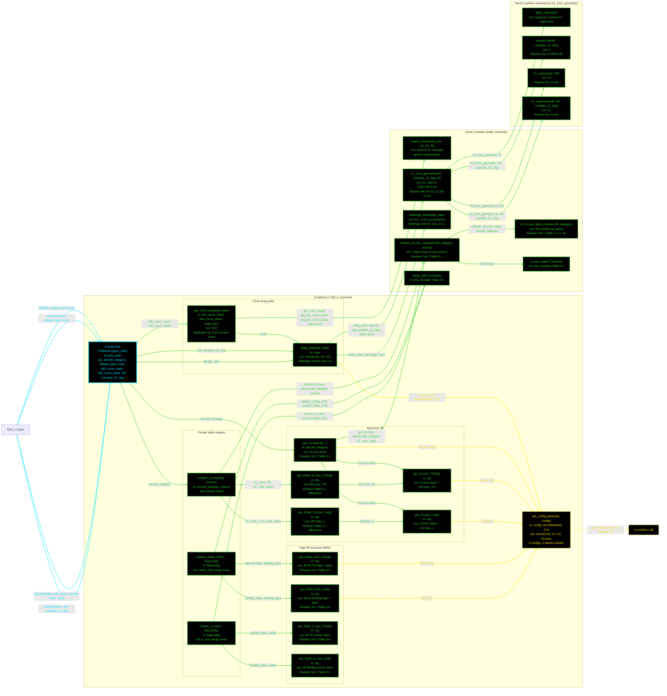

# F16AeroL1: input-to-output data flow (second pass)

This chart shows the data path for `F16AeroL1`, the Level 1 (L1) aerodynamics class, **as the code
stands on 2026-08-25**. The first-pass chart is kept unchanged at
`Claude-made/First_Pass/Aero/F16AAero1_mermaid.md`.

**Verified complete.** Every function in `F16AeroL1.m` (16, including the constructor and the 3
private helpers) has a node, and every static in `AeroL1.m` (5, plus the 2 `Constant` tables) is
accounted for. Values live:

    CD0(SL, M 0.2)  = 0.0160000000     CLmax        = 1.5000000000
    K1(M 0.2)       = 0.1167742146     CLmax_TO     = 1.7000000000
    K2              = 0                CLmax_L      = 2.1000000000
    dCD0_TO / _L    = 0.0350 / 0.0850  dCLmax_TO/_L = 0.2000 / 0.6000
    de_osw_TO / _L  = -0.0500 / -0.1000

## Viewing this chart with pan and zoom

Mermaid inside a `.md` renders at a fixed size, so a wide chart is hard to read in a plain preview.
Open `docs/Mermaid_Diagrams/viewer.html` and drag this file onto it. Wheel or pinch zooms, drag pans,
and `f` fits.

The viewer reads the first ```` ```mermaid ```` block straight out of this file, so there is no second
copy of the diagram to keep in step.

## What changed since the first pass

| First pass | Now |
| --- | --- |
| `AeroL1` held `drag_polar(obj, state)` and `get_CLmax(obj)`, both taking a design object | Both moved onto `F16AeroL1`. No `AeroL1` static takes a design object any more, so the class header's old "high-level statics take the concrete object" line is gone too |
| `AeroL1.lookup_CLmax` was drawn as a NO UPSTREAM CALL node | **Deleted.** Its 7 values matched no table in `docs/reference_extracts/`, and its `Roskam Table 3.3` citation named the landing-weight-ratio table. The 2 tests that covered it went with it |
| `K1` was described as a Mattingly Fig. 2.11 curve read | `K1` is EQUATION-BASED. `k1_from_geometry` dispatches on flight regime and evaluates Raymer Eq. 12.48-12.51, so `AR` and `Lambda_LE_deg` reach it as spec scalars |
| `to_CLmax_table_row` translated one category | All 12 Roskam Table 3.1 rows are reachable, and `CLmax_table` was verified row by row against the printed page |

**Read this first.** Same rule set as the geometry charts, plus two notes this chart needs:
- **This class takes NO geometry object.** `AR` and `Lambda_LE_deg` are scalar wing-spec inputs read
  straight from the `.aerodynamics` JSON block. Contrast `F16AeroL2` and `F16AeroL3`, which are
  constructed with a geometry object. That is why there is no injected-object source node here.
- **`get_CLmax` takes an ignored `state` slot.** L1 CLmax is a table read, not a function of Mach.
  The slot stays to match the `AerodynamicsBase` contract every caller uses. Removing it once broke
  59 tests, so the ignored argument is load-bearing.

Everything else is as before: one function per node; name, inputs, output and citation only, with
values in the notes tables; no grouped "Inputs" node; source nodes hold only a name; constructor
cyan; other functions green; a `get.<name>` injector magenta; no-toolbox-call functions yellow dashed
at the end of their row behind an explicit marker; a black node with a red dashed border for a static
this class never calls; and every edge takes the colour of the node it points at.

**Every static in the `AeroL1` box has a caller.** There is no NO UPSTREAM CALL node in this chart.

**The Tier-2 enforcer is NOT drawn.** `AeroModelL1` declares the contract; it holds no equation, so
the hop is recorded in the notes rather than as a box.



## The three things this chart is meant to make obvious

1. **No geometry object enters this class.** Four arrows leave `f16a_L1.json` into the constructor and
   that is the whole input surface. `AR` and `Lambda_LE_deg` arrive as scalars, which is why L1 can
   size an aircraft before any planform exists.
2. **`K1` leaves the L1 toolbox entirely.** `k1_from_geometry` reaches four `AeroL2` statics. That is
   an L1 tier calling up a tier, drawn as its own box so the direction is visible. It is the open item
   in `AeroL1.md` §5.
3. **One table feeds the clean base AND the increments.** `G4` has two callers, `get_CLmax` and the
   private `roskam_CLmax`, so the clean CLmax and both deltas are guaranteed to come from Roskam
   Table 3.1. Mixing in a second table would give totals belonging to neither.

## Field-by-field notes

| Class member | Source | Notes |
| --- | --- | --- |
| `aircraft_category` | `f16a_L1.json`, top level | `"jet_fighter"`. Translated to Table 3.1's printed row `"fighter"` by `to_CLmax_table_row`. Do NOT rename the row to match the key. |
| `design_type` | `.aerodynamics.design_type` | `"uncambered"`, so `K2` = 0. Any other value raises `AeroL1:unsupportedDesignType`: a cambered-type curve fit is not in this repo. |
| `curve` | `.aerodynamics.curve` | `"Current"`. Selects the Mattingly technology curve, CD0 only. |
| `cd0_curve_mach` / `_value` | `.aerodynamics.cd0_curve.Current` | 8 breakpoints, `[0 0.8 0.9 1.2 1.5 1.6 1.8 2]` against `[0.016 0.016 0.016 0.028 0.028 0.028 0.028 0.028]`. **Marked `_placeholder`**: Mattingly Fig. 2.10 is not in this repo. |
| `AR` / `Lambda_LE_deg` | `.aerodynamics` | 3.0 and 40.0 deg, the same values as `f16a_L2.json`'s `.geometry.wing`. Genuine spec data, not an injected object. |
| `CD0` | `get_CD0_rough` | 0.0160000000 from M 0 to 0.9, then 0.028 from M 1.2 up. The curve is flat in both bands, so CD0 at M 0.2 and M 0.6 are identical. |
| `K1` | `k1_from_geometry` | 0.1167742146 subsonic, Mach-independent below 0.95. `NaN` for `0.95 <= M < 1.05`, the Eq. 12.51 pole. |
| `CLmax` / `_TO` / `_L` | Roskam Table 3.1 fighter row | 1.5000000000 / 1.7000000000 / 2.1000000000, the range means of the clean, TO and landing columns. |
| `dCLmax_TO` / `_L` | Table 3.1 differences | 0.2000000000 / 0.6000000000. |
| `dCD0_TO` / `_L` | Table 3.6 sums | 0.0350000000 / 0.0850000000. Each is the flap increment PLUS the landing-gear increment. |
| `de_osw_TO` / `_L` | Table 3.6 differences | -0.0500000000 / -0.1000000000. Negative, because flaps cut span efficiency. |
| `get_config_polar` | 6 config strings | Three distinct results. The F-16 aero model has no gear-up against gear-down split, so both `takeoff_*` map to the TO deltas and both `landing_*` plus `approach` to the landing deltas. Landing gives CD0 0.1010000000 and CLmax 2.1000000000. |

## Toolbox notes

| Static | Status |
| --- | --- |
| `k1_from_geometry` | 11 call sites. Reaches 4 `AeroL2` statics, which is an L1-to-L2 dependency. The proposal is to promote all four into `AerodynamicsBase`. |
| `roskam_CLmax_value` | 7 call sites. `CLmax_table` was verified row by row against the printed Table 3.1: 12 rows, 36 ranges, zero mismatches. |
| `to_CLmax_table_row` | 6 call sites. All 12 printed rows are reachable. Roskam has no sailplane row, so `"sailplane"` passes through and gives `AeroL1:unknownAircraftType`. |
| `interp_curve` | 4 call sites. Clamps at both ends instead of extrapolating, and guards its input with three named errors. Generic interpolation in a discipline toolbox is itself an open item. |
| `mattingly_K2` | 3 call sites. |
| *(no categorical clean-CLmax static)* | **None exists, deliberately.** No book in `docs/reference_extracts/` prints one: Roskam Table 3.1's clean column is a class RANGE, Raymer gives Eq. 12.15, and Nicolai Table 9.1 is per-aircraft and flapped. Do not add one from unsourced numbers. |

## Enforcer hops not drawn

`AeroModelL1` declares the abstract contract that `drag_polar`, `get_CLmax` and the delta methods
satisfy. It holds no equation and adds no data, so it is recorded here rather than drawn as a box.

`get_CLmax(obj, ~)` keeps an ignored state slot to match `AerodynamicsBase`. Dropping it broke 59
tests once, so the ignored argument is part of the contract, not an oversight.

## Source files

| Item | File |
| --- | --- |
| Concrete class | `examples/F16A/models/disciplines/aero/F16AeroL1.m` |
| Tier 2, abstract | `src/disciplines/aerodynamics/AeroModelL1.m` |
| Tier 1, base | `src/base/AerodynamicsBase.m` |
| Toolboxes | `src/disciplines/aerodynamics/AeroL1.m`, `src/disciplines/aerodynamics/AeroL2.m` |
| Companion docs | `src/disciplines/aerodynamics/AeroL1.md`, `examples/F16A/models/disciplines/aero/F16AeroL1.md` |
| Input JSON | `examples/F16A/inputs/f16a_L1.json` |
