# F16AeroL2: input-to-output data flow

This chart shows the data path for `F16AeroL2`, the Level 2 (L2) aerodynamics
class. L2 is an equivalent-skin-friction drag polar: one `Cfe` on the total
wetted area, an Oswald-efficiency induced term, and Raymer Chapter 12 high-lift
deltas for the takeoff and landing configurations.

L2 stores no geometry number. Every area, sweep and length is read live off the
injected geometry object.

## Viewing this chart with pan and zoom

Mermaid inside a `.md` renders at a fixed size, so a wide chart is hard to read
in a plain preview. Open `docs/Mermaid_Diagrams/viewer.html` and drag this file
onto it. Wheel or pinch zooms, drag pans, and `f` fits.

The viewer reads the first mermaid fenced block straight out of this file, so
there is no second copy of the diagram to keep in step.

**Read this first.**
- The chart runs LEFT TO RIGHT.
- EVERY arrow carries a label naming the exact value it moves.
- There is no "Inputs" block. The constructor's outgoing arrows carry the field
  names.
- **Colour says what kind of member a node is; dash says whether the value was
  worked on.** A box whose body reads a stored field and returns it is a pure
  relay, so it is dashed, and so is every line leaving it. A box that evaluates
  an equation, reads a table, or combines its inputs is solid.
- **A line's colour comes from the node it POINTS AT; its dash comes from the
  node it LEAVES.** A file source node is not a method, so it takes the dash of
  the constructor it feeds.
- **Constructor cyan. Every other function green. An INJECTOR, meaning any
  `get.<name>` property getter, is MAGENTA**, so a derived read is identifiable
  at a glance. Magenta beats every other node colour, and an injector is EXEMPT
  from the `no toolbox call` marker, because for a getter that is the normal
  case.
- There are NO red nodes. Every `AeroL2` static this class names is live. The
  first pass had four, from object-taking wrappers since removed.
- NINE GETTERS ARE PURE RELAYS. `S_ref`, `S_wet`, `AR_wing`, `LE_sweep_wing`,
  `QC_sweep_wing`, `lambda_wing`, `L_char`, `Amax_ft2` and `L_aircraft_ft` each
  return one geometry field unchanged, so they call no toolbox and are yellow.
  `L_char` and `Amax_ft2` rename as they relay: `L_char` is `geom.L_fus` and
  `Amax_ft2` is `geom.Amax`.
- `e_osw` and `Cfe` are the two getters that DO compute, so they are green.
- `Amax` IS TIER-SPECIFIC BY DESIGN. L2 takes the fuselage-envelope ellipse,
  27.4889 ft^2. L3 takes the area-ruled buildup, 24.7037. Using the envelope
  form at L3 would be a fidelity inversion.
- The two PRIVATE table readers, `roskam_e_osw` and `roskam_Delta_CD0`, are
  drawn: they are the only source of the flap `Delta_e_osw` and `Delta_CD0`
  values, and they read a table rather than call a toolbox.
- `get_CD0_supersonic` is a CLASS method here, not the removed `AeroL2` static
  of the same name. Casey's note of 2026-08-21 asks whether it has any caller.

```mermaid
flowchart LR
    subgraph SRC["Sources"]
        J["f16a_L2.json"]
        GEOM["Injected object<br/>geom (GeometryModelL2)"]
        ST["AircraftState<br/>state"]
    end

    subgraph CLASS["F16AeroL2 (Tier 3)"]
        direction LR

        CTOR["Constructor<br/>F16AeroL2(geom, json_path)<br/>in: geom, json_path<br/>out: aircraft_category, airfoil block,<br/>high-lift inputs, stored geom handle"]

        subgraph DERG["Injected geometry (pure relays)"]
            RR1["get.S_ref<br/>in: geom.S_ref<br/>out: S_ref"]
            RR2["get.S_wet<br/>in: geom.S_wet<br/>out: S_wet"]
            RR3["get.AR_wing<br/>in: geom.AR_wing<br/>out: AR_wing"]
            RR4["get.LE_sweep_wing<br/>in: geom.LE_sweep_wing<br/>out: LE_sweep_wing"]
            RR5["get.QC_sweep_wing<br/>in: geom.QC_sweep_wing<br/>out: QC_sweep_wing"]
            RR6["get.lambda_wing<br/>in: geom.lambda_wing<br/>out: lambda_wing"]
            RR7["get.L_char<br/>in: geom.L_fus<br/>out: L_char, a renaming relay"]
            RR8["get.Amax_ft2<br/>in: geom.Amax<br/>out: Amax_ft2, a renaming relay"]
            RR9["get.L_aircraft_ft<br/>in: geom.L_aircraft<br/>out: L_aircraft_ft, a renaming relay"]
        end

        subgraph DERC["Derived computed"]
            D1["get.e_osw<br/>in: obj.get_e_osw()<br/>out: e_osw"]
            D2["get.Cfe<br/>in: aircraft_category<br/>out: Cfe"]
        end

        subgraph POLAR["Drag polar"]
            P1["drag_polar(obj, state)<br/>required by AerodynamicsBase<br/>in: state<br/>out: struct(CD0, K1, K2)"]
            P2["get_K1(obj, M)<br/>in: e_osw, AR_wing, LE_sweep_wing, M<br/>out: K1"]
            P3["get_K2(obj, K1_sub, M)<br/>in: K1_sub, alpha_L0, M<br/>out: K2"]
            P4["get_CL_alpha(obj, M)<br/>in: AR_wing, QC_sweep_wing, cl_alpha_2D, M<br/>out: CL_alpha"]
            P5["get_CD0_rough(obj)<br/>in: Cfe, S_wet, S_ref<br/>out: CD0"]
            P6["get_CD0_supersonic(obj, state)<br/>in: L_char, S_wet, S_ref, state<br/>out: CD0"]
            P7["compute_CD0_wave(obj, state)<br/>in: Amax_ft2, L_aircraft_ft, S_ref, state<br/>out: wave-drag CD0"]
            P8["get_e_osw(obj)<br/>in: AR_wing, LE_sweep_wing<br/>out: 0.908619"]
        end

        subgraph CLM["CLmax"]
            C1["get_CLmax(obj, ~)<br/>required by AerodynamicsBase<br/>in: cl_max_2D, QC_sweep_wing<br/>out: 0.9141 clean"]
        end

        subgraph FLAP["Trailing-edge flaperon"]
            F1["compute_S_flapped_ratio(~, eta_out, eta_in, lambda_taper)<br/>in: span stations, taper<br/>out: flapped-area ratio"]
            F2["Delta_CD0_flap(obj, delta_flap_deg)<br/>in: flap chord and span fractions<br/>out: Delta CD0"]
            F3["Delta_CDi_flap(obj, Delta_CL_flap)<br/>in: Delta_CL_flap<br/>out: Delta CDi"]
            F4["Delta_CLmax_flap(obj, config)<br/>in: hld_TE, config<br/>out: Delta CLmax"]
        end

        subgraph SUMS["Configuration deltas"]
            S1["get_Delta_e_osw_TO, get_Delta_e_osw_L<br/>in: flapconfig<br/>out: Delta e_osw"]
            S2["get_Delta_CD0_TO, get_Delta_CD0_L<br/>in: flapconfig<br/>out: 0.034400 and 0.048800"]
            S3["get_Delta_CLmax_TO, get_Delta_CLmax_L<br/>in: config<br/>out: Delta CLmax"]
            S4["get_Delta_CDi_TO, get_Delta_CDi_L<br/>in: Delta_CL<br/>out: Delta CDi"]
            S5["get_CLmax_TO, get_CLmax_L<br/>in: clean CLmax, Delta CLmax<br/>out: 1.2431 and 1.3528"]
            S6["get_config_polar(obj, config)<br/>required by AerodynamicsBase<br/>in: config, six allowed names<br/>out: struct(CD0, K1, K2, CLmax)"]
        end

        subgraph PRIV["Private table readers"]
            V1["roskam_e_osw(~, flapconfig)<br/>Roskam flap Delta e_osw table"]
            V2["roskam_Delta_CD0(~, flapconfig)<br/>Roskam flap Delta CD0 table"]
        end
    end

    subgraph TOOL["AeroL2 toolbox (static methods)"]
        T1["oswald_eff(AR, LE_sweep)<br/>Raymer 6th ed. Eq. 12.49 and 12.50"]
        T2["lookup_Cfe(aircraft_category)<br/>Raymer 6th ed. Table 12.3"]
        T3["CD0_from_Cf(Cf, S_wet, S_ref)<br/>CD0 = Cf * S_wet / S_ref"]
        T4["flight_regime(M)<br/>subsonic, transonic or supersonic"]
        T5["K1_subsonic(e_osw, AR)<br/>K1 = 1/(pi*AR*e)"]
        T6["K1_supersonic(M, AR, LE_sweep)<br/>Raymer 6th ed. Ch. 12"]
        T7["K2_value(CL_minD, K1)<br/>Raymer 6th ed. Ch. 12 polar convention"]
        T8["compute_CL_minD(alpha_L0, CL_alpha)<br/>Raymer 6th ed. Ch. 12"]
        T9["CL_alpha(AR, QC_sweep, M, cl_alpha_2D)<br/>Raymer 6th ed. Eq. 12.8"]
        T10["CLmax_clean(cl_max_2D, QC_sweep)<br/>Raymer 6th ed. Eq. 12.15"]
        T11["compute_Re(state, l_ref)<br/>Reynolds number"]
        T12["Cf_turbulent(Re, M)<br/>Raymer 6th ed. Eq. 12.27"]
        T13["compute_Delta_CL_max_values(...)<br/>Raymer 6th ed. Eq. 12.21"]
        T14["lookup_Delta_cl_max_values(hld_TE)<br/>Raymer 6th ed. Table 12.2"]
    end

    subgraph TOOL1["AeroL1 toolbox (statics reused by L2)"]
        U1["Delta_CD0(config)<br/>gear and flap CD0 increments"]
    end

    J -->|"aircraft_category, airfoil block,<br/>high-lift inputs"| CTOR
    GEOM -->|"geom"| CTOR

    GEOM -->|"geom.S_ref"| RR1
    GEOM -->|"geom.S_wet"| RR2
    GEOM -->|"geom.AR_wing"| RR3
    GEOM -->|"geom.LE_sweep_wing"| RR4
    GEOM -->|"geom.QC_sweep_wing"| RR5
    GEOM -->|"geom.lambda_wing"| RR6
    GEOM -->|"geom.L_fus"| RR7
    GEOM -->|"geom.Amax"| RR8
    GEOM -->|"geom.L_aircraft"| RR9

    CTOR -->|"aircraft_category"| D2
    D1 -->|"get.e_osw: obj"| P8
    D2 -->|"lookup_Cfe: aircraft_category"| T2

    ST -->|"state"| P1
    ST -->|"state"| P6
    ST -->|"state"| P7
    CTOR -->|"alpha_L0, cl_alpha_2D"| P3
    CTOR -->|"cl_alpha_2D"| P4
    D2 -->|"Cfe"| P5
    RR2 -->|"S_wet"| P5
    RR1 -->|"S_ref"| P5
    RR7 -->|"L_char"| P6
    RR2 -->|"S_wet"| P6
    RR1 -->|"S_ref"| P6
    RR8 -->|"Amax_ft2"| P7
    RR9 -->|"L_aircraft_ft"| P7
    RR4 -->|"LE_sweep_wing"| P7
    RR1 -->|"S_ref"| P7
    D1 -->|"e_osw"| P2
    RR3 -->|"AR_wing"| P2
    RR4 -->|"LE_sweep_wing"| P2
    RR3 -->|"AR_wing"| P4
    RR5 -->|"QC_sweep_wing"| P4
    RR3 -->|"AR_wing"| P8
    RR4 -->|"LE_sweep_wing"| P8
    P1 -->|"drag_polar: M"| P2
    P1 -->|"drag_polar: K1_sub, M"| P3
    P1 -->|"drag_polar: obj"| P5
    P3 -->|"get_K2: M"| P4

    P2 -->|"flight_regime: M"| T4
    P2 -->|"K1_subsonic: e_osw, AR_wing"| T5
    P2 -->|"K1_supersonic: M, AR_wing, LE_sweep_wing"| T6
    P3 -->|"K2_value: CL_minD, K1"| T7
    P3 -->|"compute_CL_minD: alpha_L0, CL_alpha"| T8
    P4 -->|"CL_alpha: AR_wing, QC_sweep_wing, M, cl_alpha_2D"| T9
    P5 -->|"CD0_from_Cf: Cfe, S_wet, S_ref"| T3
    P6 -->|"compute_Re: state, L_char"| T11
    P6 -->|"Cf_turbulent: Re, state.mach"| T12
    P6 -->|"CD0_from_Cf: Cf, S_wet, S_ref"| T3
    P7 -->|"flight_regime: state.mach"| T4
    P8 -->|"oswald_eff: AR_wing, LE_sweep_wing"| T1

    CTOR -->|"cl_max_2D"| C1
    RR5 -->|"QC_sweep_wing"| C1
    C1 -->|"CLmax_clean: cl_max_2D, QC_sweep_wing"| T10

    CTOR -->|"eta_out, eta_in, lambda_taper"| F1
    CTOR -->|"c_flap_over_c, span fractions"| F2
    RR6 -->|"lambda_wing"| F2
    RR5 -->|"QC_sweep_wing"| F3
    CTOR -->|"hld_TE"| F4
    RR6 -->|"lambda_wing"| F4
    RR5 -->|"QC_sweep_wing"| F4
    RR1 -->|"S_ref"| F4
    F2 -->|"Delta_CD0_flap: obj"| F1
    F4 -->|"compute_Delta_CL_max_values: hld_TE, config"| T13
    F4 -->|"lookup_Delta_cl_max_values: hld_TE"| T14

    S1 -->|"get_Delta_e_osw_TO/_L: flapconfig"| V1
    S2 -->|"get_Delta_CD0_TO/_L: flapconfig"| V2
    S3 -->|"get_Delta_CLmax_TO/_L: config"| F4
    S4 -->|"get_Delta_CDi_TO/_L: Delta_CL"| F3
    C1 -->|"clean CLmax"| S5
    S3 -->|"Delta CLmax"| S5
    P1 -->|"clean polar at sea level, M 0.2"| S6
    S2 -->|"Delta CD0"| S6
    S5 -->|"CLmax_TO, CLmax_L"| S6
    S2 -->|"get_Delta_CD0_TO/_L: config"| U1

    linkStyle 0,1 stroke:#00e5ff,color:#00e5ff,stroke-width:2px
    linkStyle 2,3,4,5,6,7,8,9,10,11 stroke:#ff44cc,color:#ff44cc,stroke-width:2px
    linkStyle 12,13,14,15,16,17,18,19,29,36,37,38,39,40,41,42,43,44,45,46,47,48,49,50,51,52,54,55,56,59,63,64,65,66,67,68,69,70,71,72,73,74,75 stroke:#33cc33,color:#33cc33,stroke-width:2px
    linkStyle 20,21,22,23,24,25,26,27,28,30,31,32,33,34,35,53,57,58,60,61,62 stroke:#33cc33,color:#33cc33,stroke-width:2px,stroke-dasharray:5 4

    classDef ctorWork fill:#000000,stroke:#00e5ff,stroke-width:3px,color:#00e5ff
    classDef funcWork fill:#000000,stroke:#33cc33,stroke-width:2px,color:#33cc33
    classDef injectorWork fill:#000000,stroke:#ff44cc,stroke-width:3px,color:#ff44cc
    classDef injectorRelay fill:#000000,stroke:#ff44cc,stroke-width:3px,color:#ff44cc,stroke-dasharray: 5 4
    class CTOR ctorWork
    class P1,P2,P3,P4,P5,P6,P7,P8,C1,F1,F2,F3,F4,S1,S2,S3,S4,S5,S6,V1,V2,T1,T2,T3,T4,T5,T6,T7,T8,T9,T10,T11,T12,T13,T14,U1 funcWork
    class D1,D2 injectorWork
    class RR1,RR2,RR3,RR4,RR5,RR6,RR7,RR8,RR9 injectorRelay
```

## Field-by-field notes

| Class member | Source | Notes |
| --- | --- | --- |
| `geom` | Injected | Every geometry value is read live. The class stores none. |
| `aircraft_category` | `f16a_L2.json`, top-level field | `jet_fighter`. Selects the Raymer Table 12.3 `Cfe` row only. |
| `Cfe` (Dependent) | `AeroL2.lookup_Cfe` | 0.003500, Raymer Table 12.3. NOT Brandt's back-calculated 0.005908, which is a calibration output and must not be an input. |
| `e_osw` (Dependent) | `AeroL2.oswald_eff` | 0.908619, Raymer Eq. 12.49 and 12.50. |
| `S_ref`, `S_wet` | `geom` | 300.0 and 1466.7731 ft^2. |
| `L_char` | `geom.L_fus` | 46.5 ft. A RENAMING relay: the aero name differs from the geometry name. |
| `Amax_ft2` | `geom.Amax` | 27.4889 ft^2, the fuselage-envelope ellipse. TIER-SPECIFIC: L3 uses the area-ruled 24.7037. |
| `L_aircraft_ft` | `geom.L_aircraft` | 47.65 ft. Distinct from `L_fus` = 46.5, and feeds only the Sears-Haack wave-drag term. |
| Clean polar at 36 kft, M 0.87 | Computed | `CD0` 0.017112, `K1` 0.116774, `K2` -0.006849. |
| Clean `CLmax` | Computed | 0.9141, Raymer Eq. 12.15. |
| `Delta_CD0_TO`, `Delta_CD0_L` | `roskam_Delta_CD0` | 0.034400 and 0.048800. |
| `CLmax_TO`, `CLmax_L` | Computed | 1.2431 and 1.3528. |
| Config polars | `get_config_polar` | Six allowed names. `takeoff_flaps_gear_down` gives `CD0` 0.051512 and `CLmax` 1.2431; `landing_flaps_gear_down` gives 0.065912 and 1.3528. |

## Methods with no upstream call at L2

`get_CD0_supersonic(obj, state)` has no caller inside this class: `drag_polar`
takes `get_CD0_rough` for every regime. Casey's note of 2026-08-21 asks whether
it is used at all and proposes removal. It is drawn green because it works when
called.

## Source files

| Item | File |
| --- | --- |
| Concrete class | `examples/F16A/models/disciplines/aero/F16AeroL2.m` |
| Tier 2, abstract | `src/disciplines/aerodynamics/AeroModelL2.m` |
| Tier 1, base | `src/base/AerodynamicsBase.m` |
| Toolbox | `src/disciplines/aerodynamics/AeroL2.m` |
| Toolbox reused | `src/disciplines/aerodynamics/AeroL1.m` |
| Input JSON | `examples/F16A/inputs/f16a_L2.json` |
