# F16AeroL3: input-to-output data flow

This chart shows the data path for `F16AeroL3`, the Level 3 (L3) aerodynamics
class. L3 is the Raymer Eq. 12.24 component buildup: per-component skin
friction times form factor times interference factor times wetted area, summed
and divided by the reference area, plus miscellaneous and
leakage-and-protuberance allowances, plus a Sears-Haack wave-drag term above
M 1.2.

L3 stores no geometry number. Six wetted areas, five reference lengths and the
whole planform are read live off the injected geometry object.

## Viewing this chart with pan and zoom

Mermaid inside a `.md` renders at a fixed size, so a wide chart is hard to read
in a plain preview. Open `docs/Mermaid_Diagrams/viewer.html` and drag this file
onto it. Wheel or pinch zooms, drag pans, and `f` fits.

The viewer reads the first mermaid fenced block straight out of this file, so
there is no second copy of the diagram to keep in step.

**Read this first.**
- The chart runs LEFT TO RIGHT.
- EVERY arrow carries a label naming the exact value it moves.
- There is no "Inputs" block. The constructor's outgoing arrows carry the field
  names.
- **Colour says what kind of member a node is; dash says whether the value was
  worked on.** A box whose body reads a stored field and returns it is a pure
  relay, so it is dashed, and so is every line leaving it. A box that evaluates
  an equation, reads a table, or combines its inputs is solid.
- **A line's colour comes from the node it POINTS AT; its dash comes from the
  node it LEAVES.** A file source node is not a method, so it takes the dash of
  the constructor it feeds.
- **Constructor cyan. Every other function green. An INJECTOR, meaning any
  `get.<name>` property getter, is MAGENTA**, so a derived read is identifiable
  at a glance. Magenta beats every other node colour, and an injector is EXEMPT
  from the `no toolbox call` marker, because for a getter that is the normal
  case. RED means calling it ERRORS.
- THERE ARE TWO RED NODES, and they are the headline. `get_CD0_LandP` and
  `get_CD0_misc` are EMPTY function bodies. They satisfy the `AeroModelL3`
  abstract contract and assign no output, so calling either raises "Output
  argument val not assigned". Casey's two TODOs of 2026-08-26 record what each
  is meant to compute.
- THE BUILDUP DOES NOT CALL THOSE TWO. `CD0_buildup` reads the PROPERTIES
  `obj.CD0_misc` and `obj.CD0_LandP` instead, and those are live: `CD0_misc`
  has a Dependent getter over the Raymer Table 12.7 drag areas, and `CD0_LandP`
  is a plain JSON input. So the drag polar is unaffected by the two red nodes.
- FIVE GETTERS ARE PURE RELAYS. `S_ref`, `AR_wing`, `LE_sweep_wing`,
  `QC_sweep_wing` and `lambda_wing` each return one geometry field unchanged.
- SIX COMPONENT ARRAYS drive the buildup: wing, HT, VT, strake, duct and
  fuselage. `S_wet_comp` assembles all six from the per-surface getters, and
  `l_ref_comp`, `D_comp`, `tc_comp` and `Lambda_m_comp` are the matching arrays
  of reference length, diameter, thickness ratio and max-thickness sweep.
- `Amax` IS TIER-SPECIFIC BY DESIGN. L3 takes the whole-aircraft area-ruled
  buildup, 24.7037 ft^2, which is what the Sears-Haack term wants. L2 takes the
  fuselage-envelope ellipse, 27.4889. Using the envelope form here would be a
  fidelity inversion.
- L3 REUSES `AeroL2` HEAVILY. The induced-drag, Oswald, lift-slope, CLmax and
  high-lift statics are all L2's; only the component-buildup primitives are
  L3's own. That is deliberate reuse, not a layering violation.
- `AeroL3.get_e_osw`, `get_K1`, `get_K2` and `get_CL_alpha` appear only in
  COMMENTS at lines 427 to 439. The statics were removed and nothing live calls
  them, so they are not drawn.

```mermaid
flowchart LR
    subgraph SRC["Sources"]
        J["f16a_L3.json"]
        GEOM["Injected object<br/>geom (GeometryModelL3)"]
        ST["AircraftState<br/>state"]
    end

    subgraph CLASS["F16AeroL3 (Tier 3)"]
        direction LR

        CTOR["Constructor<br/>F16AeroL3(geom, json_path)<br/>in: geom, json_path<br/>out: airfoil block, per-component constants,<br/>k, E_WD, CD0_LandP, Dq areas,<br/>stored geom handle"]

        subgraph DERG["Injected planform (pure relays)"]
            R1["get.S_ref<br/>in: geom.S_ref<br/>out: S_ref"]
            RA["get.AR_wing<br/>in: geom.AR_wing<br/>out: AR_wing"]
            RL["get.LE_sweep_wing<br/>in: geom.LE_sweep_wing<br/>out: LE_sweep_wing"]
            RQ["get.QC_sweep_wing<br/>in: geom.QC_sweep_wing<br/>out: QC_sweep_wing"]
            RT["get.lambda_wing<br/>in: geom.lambda_wing<br/>out: lambda_wing"]
        end

        subgraph DERS["Per-surface wetted areas (pure relays)"]
            A1["get.S_wet_wing<br/>in: geom.S_wet_wing<br/>out: S_wet_wing"]
            A2["get.S_wet_ht<br/>in: geom.S_wet_ht<br/>out: S_wet_ht"]
            A3["get.S_wet_vt<br/>in: geom.S_wet_vt<br/>out: S_wet_vt"]
            A4["get.S_wet_strake<br/>in: geom.S_wet_strake<br/>out: S_wet_strake"]
            A5["get.S_wet_duct<br/>in: geom.S_wet_duct<br/>out: S_wet_duct"]
            A6["get.S_wet_fuselage<br/>in: geom.S_wet_fuselage<br/>out: S_wet_fuselage"]
        end

        subgraph DERC["Derived component arrays"]
            B1["get.S_wet_comp<br/>in: the six surface getters<br/>out: 6-vector, sum 1472.0228 ft^2"]
            B2["get.l_ref_comp<br/>in: geom<br/>out: 6-vector of reference lengths"]
            B3["get.D_comp<br/>in: geom.D_fus, geom.D_inlet<br/>out: 6-vector of component diameters"]
            B6["get.tc_comp<br/>in: geom tc inputs<br/>out: 6-vector of component t/c"]
            B7["get.Lambda_m_comp<br/>in: geom sweeps<br/>out: 6-vector of max-thickness sweeps"]
            B4["get.CD0_misc<br/>in: Dq_gun_port, Dq_hook_USAF, S_ref<br/>out: miscellaneous CD0"]
            B5["get.Amax_ft2<br/>in: geom<br/>out: area-ruled Amax"]
            B8["get.L_aircraft_ft<br/>in: geom.L_aircraft<br/>out: L_aircraft_ft"]
        end

        subgraph POLAR["Drag polar"]
            P1["drag_polar(obj, state)<br/>required by AerodynamicsBase<br/>in: state<br/>out: struct(CD0, K1, K2)"]
            P2["get_CD0_component_buildup(obj, state)<br/>in: state<br/>out: CD0, dispatches to CD0_buildup"]
            P3["CD0_buildup(obj, state)<br/>in: component arrays, CD0_misc, CD0_LandP, state<br/>out: CD0<br/>Raymer 6th ed. Eq. 12.24"]
            P4["compute_CD0_wave(obj, state)<br/>in: Amax_ft2, L_aircraft_ft, S_ref, E_WD, state<br/>out: wave-drag CD0<br/>Raymer 6th ed. Eq. 12.44 and 12.45"]
            P5["compute_Re(~, state, l_ref)<br/>in: state, l_ref<br/>out: Reynolds number"]
            P6["get_K1(obj, M)<br/>in: e_osw, AR_wing, LE_sweep_wing, M<br/>out: K1"]
            P7["get_K2(obj, K1_sub, M)<br/>in: K1_sub, alpha_L0, M<br/>out: K2"]
            P8["get_CL_alpha(obj, M)<br/>in: AR_wing, QC_sweep_wing, cl_alpha_2D, M<br/>out: CL_alpha"]
            P9["get_CL_minD(obj, M)<br/>in: alpha_L0, CL_alpha<br/>out: CL_minD"]
            P10["get_e_osw(obj)<br/>in: AR_wing, LE_sweep_wing<br/>out: 0.908619"]
        end

        subgraph STUB["Unimplemented contract stubs"]
            X1["get_CD0_LandP(obj)<br/>required by AeroModelL3<br/>EMPTY BODY, assigns no output"]
            X2["get_CD0_misc(obj)<br/>required by AeroModelL3<br/>EMPTY BODY, assigns no output"]
        end

        subgraph CLM["CLmax"]
            C1["get_CLmax(obj, ~)<br/>required by AerodynamicsBase<br/>in: cl_max_2D, QC_sweep_wing<br/>out: 0.9141 clean"]
        end

        subgraph FLAP["Trailing-edge flaperon and leading-edge flap"]
            F1["compute_S_flapped_ratio(~, eta_out, eta_in, lambda_taper)<br/>in: span stations, taper<br/>out: flapped-area ratio"]
            F2["Delta_CD0_flap, Delta_CDi_flap<br/>in: flap deflection, Delta_CL<br/>out: TE-flap increments"]
            F3["Delta_CD0_lef, Delta_CDi_lef<br/>in: LEF deflection, Delta_CL<br/>out: LEF increments"]
            F4["Delta_CLmax_flap(obj, config)<br/>in: hld_TE, config<br/>out: Delta CLmax"]
            F5["Delta_CLmax_lef(obj, config)<br/>in: hld_LE, config<br/>out: Delta CLmax"]
            F6["compute_Delta_CD0_geardown(obj, state)<br/>in: state<br/>out: gear-down CD0 increment"]
        end

        subgraph SUMS["Configuration deltas"]
            S1["get_Delta_e_osw_TO, get_Delta_e_osw_L<br/>in: flapconfig<br/>out: Delta e_osw"]
            S2["get_Delta_CD0_TO(obj, state), get_Delta_CD0_L(obj, state)<br/>in: state<br/>out: 0.048604 both"]
            S3["get_Delta_CLmax_TO, get_Delta_CLmax_L<br/>in: config<br/>out: Delta CLmax"]
            S4["get_Delta_CDi_TO, get_Delta_CDi_L<br/>in: Delta_CL<br/>out: Delta CDi"]
            S5["get_CLmax_TO, get_CLmax_L<br/>in: clean CLmax, Delta CLmax<br/>out: 1.3663 and 1.5170"]
            S6["get_config_polar(obj, config)<br/>required by AerodynamicsBase<br/>in: config, six allowed names<br/>out: struct(CD0, K1, K2, CLmax)"]
        end

        subgraph PRIV["Private table reader"]
            V1["roskam_e_osw(~, flapconfig)<br/>Roskam flap Delta e_osw table"]
        end
    end

    subgraph TOOL["AeroL3 toolbox (static methods)"]
        T1["Cf_laminar(Re)<br/>Raymer 6th ed. Eq. 12.26"]
        T2["Re_cutoff_sub(l_ref, k), Re_cutoff_sup(l_ref, k, M)<br/>Raymer 6th ed. Eq. 12.28 and 12.29"]
        T3["FF_surface(x_c_max, tc, M, Lambda_m)<br/>Raymer 6th ed. Eq. 12.30"]
        T4["FF_body(f)<br/>Raymer 6th ed. Eq. 12.31"]
        T5["compute_Re(state, l_ref)<br/>Reynolds number"]
    end

    subgraph TOOL2["AeroL2 toolbox (statics reused by L3)"]
        W1["oswald_eff(AR, LE_sweep)<br/>Raymer 6th ed. Eq. 12.49 and 12.50"]
        W2["flight_regime(M)<br/>subsonic, transonic or supersonic"]
        W3["K1_subsonic(e_osw, AR), K1_supersonic(M, AR, LE_sweep)<br/>Raymer 6th ed. Ch. 12"]
        W4["K2_value(CL_minD, K1)<br/>Raymer 6th ed. Ch. 12 polar convention"]
        W5["compute_CL_minD(alpha_L0, CL_alpha)<br/>Raymer 6th ed. Ch. 12"]
        W6["CL_alpha(AR, QC_sweep, M, cl_alpha_2D)<br/>Raymer 6th ed. Eq. 12.8"]
        W7["CLmax_clean(cl_max_2D, QC_sweep)<br/>Raymer 6th ed. Eq. 12.15"]
        W8["Cf_turbulent(Re, M)<br/>Raymer 6th ed. Eq. 12.27"]
        W9["compute_Delta_CL_max_values(...), lookup_Delta_cl_max_values(hld)<br/>Raymer 6th ed. Eq. 12.21 and Table 12.2"]
        W10["compute_Re(state, l_ref)<br/>Reynolds number"]
    end

    subgraph TOOLB["GeometryBase toolbox"]
        Z1["compute_mac(c_root, lambda)<br/>Raymer 7th ed. Eq. 7.8"]
        Z2["convert_sweep(...), convert_sweep_panel(...)<br/>sweep-station conversion"]
    end

    subgraph TOOL1["AeroL1 toolbox (statics reused by L3)"]
        U1["Delta_CD0(config)<br/>gear and flap CD0 increments"]
    end

    J -->|"airfoil block, per-component constants,<br/>k, E_WD, CD0_LandP, Dq areas"| CTOR
    GEOM -->|"geom"| CTOR

    GEOM -->|"geom.S_ref"| R1
    GEOM -->|"geom.AR_wing"| RA
    GEOM -->|"geom.LE_sweep_wing"| RL
    GEOM -->|"geom.QC_sweep_wing"| RQ
    GEOM -->|"geom.lambda_wing"| RT
    GEOM -->|"geom.S_wet_wing"| A1
    GEOM -->|"geom.S_wet_ht"| A2
    GEOM -->|"geom.S_wet_vt"| A3
    GEOM -->|"geom.S_wet_strake"| A4
    GEOM -->|"geom.S_wet_duct"| A5
    GEOM -->|"geom.S_wet_fuselage"| A6

    A1 -->|"S_wet_wing"| B1
    A2 -->|"S_wet_ht"| B1
    A3 -->|"S_wet_vt"| B1
    A4 -->|"S_wet_strake"| B1
    A5 -->|"S_wet_duct"| B1
    A6 -->|"S_wet_fuselage"| B1
    GEOM -->|"component reference lengths"| B2
    GEOM -->|"geom.D_fus, geom.D_inlet"| B3
    GEOM -->|"component t/c inputs"| B6
    GEOM -->|"component max-thickness sweeps"| B7
    CTOR -->|"Dq_gun_port, Dq_hook_USAF"| B4
    R1 -->|"S_ref"| B4
    GEOM -->|"geom.Amax"| B5
    GEOM -->|"geom.L_aircraft"| B8
    RT -->|"lambda_wing"| B2
    B2 -->|"compute_mac: c_root, lambda"| Z1
    B7 -->|"convert_sweep, convert_sweep_panel"| Z2

    ST -->|"state"| P1
    P1 -->|"drag_polar: state, dynamic dispatch"| P2
    P2 -->|"get_CD0_component_buildup: state"| P3
    B1 -->|"S_wet_comp"| P3
    B2 -->|"l_ref_comp"| P3
    B3 -->|"D_comp"| P3
    B6 -->|"tc_comp"| P3
    B7 -->|"Lambda_m_comp"| P3
    B4 -->|"CD0_misc"| P3
    CTOR -->|"CD0_LandP, k, Q_comp, f_lam_comp, is_body_comp"| P3
    R1 -->|"S_ref"| P3
    P3 -->|"compute_Re: state, l_ref"| P5
    P5 -->|"compute_Re: state, l_ref"| T5
    P3 -->|"Cf_laminar: Re"| T1
    P3 -->|"Re_cutoff_sub, Re_cutoff_sup: l_ref, k, M"| T2
    P3 -->|"FF_surface: x_c_max, tc, M, Lambda_m"| T3
    P3 -->|"FF_body: f"| T4
    P3 -->|"Cf_turbulent: Re, state.mach"| W8
    P3 -->|"compute_Re: state, l_ref"| W10
    P3 -->|"compute_CD0_wave: state, above M 1.2"| P4
    ST -->|"state"| P4
    B5 -->|"Amax_ft2"| P4
    B8 -->|"L_aircraft_ft"| P4
    CTOR -->|"E_WD"| P4
    P4 -->|"flight_regime: state.mach"| W2

    RA -->|"AR_wing"| P10
    RL -->|"LE_sweep_wing"| P10
    P10 -->|"oswald_eff: AR_wing, LE_sweep_wing"| W1
    P1 -->|"drag_polar: M"| P6
    P1 -->|"drag_polar: K1_sub, M"| P7
    P10 -->|"e_osw"| P6
    RA -->|"AR_wing"| P6
    RL -->|"LE_sweep_wing"| P6
    P6 -->|"flight_regime: M"| W2
    P6 -->|"K1_subsonic, K1_supersonic"| W3
    P7 -->|"K2_value: CL_minD, K1"| W4
    P7 -->|"get_K2: M"| P9
    P9 -->|"compute_CL_minD: alpha_L0, CL_alpha"| W5
    P9 -->|"get_CL_minD: M"| P8
    CTOR -->|"alpha_L0, cl_alpha_2D"| P8
    RA -->|"AR_wing"| P8
    RQ -->|"QC_sweep_wing"| P8
    P8 -->|"CL_alpha: AR_wing, QC_sweep_wing, M, cl_alpha_2D"| W6

    CTOR -->|"cl_max_2D"| C1
    RQ -->|"QC_sweep_wing"| C1
    C1 -->|"CLmax_clean: cl_max_2D, QC_sweep_wing"| W7

    CTOR -->|"eta_out, eta_in, lambda_taper"| F1
    CTOR -->|"flap chord and span fractions"| F2
    CTOR -->|"LEF chord and span fractions"| F3
    CTOR -->|"hld_TE"| F4
    CTOR -->|"hld_LE"| F5
    ST -->|"state"| F6
    F2 -->|"Delta_CD0_flap: obj"| F1
    F3 -->|"Delta_CD0_lef: obj"| F1
    F4 -->|"compute_Delta_CL_max_values, lookup_Delta_cl_max_values: hld_TE"| W9
    F5 -->|"compute_Delta_CL_max_values, lookup_Delta_cl_max_values: hld_LE"| W9
    F6 -->|"Delta_CD0: gear-down config"| U1

    S1 -->|"get_Delta_e_osw_TO/_L: flapconfig"| V1
    ST -->|"state"| S2
    S2 -->|"get_Delta_CD0_TO/_L: obj, state"| F6
    S2 -->|"get_Delta_CD0_TO/_L: delta_flap, delta_lef"| F2
    S2 -->|"get_Delta_CD0_TO/_L: delta_lef"| F3
    S3 -->|"get_Delta_CLmax_TO/_L: config"| F4
    S3 -->|"get_Delta_CLmax_TO/_L: config"| F5
    S4 -->|"get_Delta_CDi_TO/_L: Delta_CL"| F2
    C1 -->|"clean CLmax"| S5
    S3 -->|"Delta CLmax"| S5
    P1 -->|"clean polar at sea level, M 0.2"| S6
    S2 -->|"Delta CD0"| S6
    S5 -->|"CLmax_TO, CLmax_L"| S6

    X1 -.->|"get_CD0_LandP: empty body"| X2

    linkStyle 0,1 stroke:#00e5ff,color:#00e5ff,stroke-width:2px
    linkStyle 2,3,4,5,6,7,8,9,10,11,12,19,20,21,22,23,25,26 stroke:#ff44cc,color:#ff44cc,stroke-width:2px
    linkStyle 13,14,15,16,17,18,24,27 stroke:#ff44cc,color:#ff44cc,stroke-width:2px,stroke-dasharray:5 4
    linkStyle 30,31,32,33,38,39,41,42,43,44,45,46,47,48,49,50,51,53,54,57,58,59,60,63,64,65,66,67,68,69,72,73,75,76,77,78,79,80,81,82,83,84,85,86,87,88,89,90,91,92,93,94,95,96,97,98,99 stroke:#33cc33,color:#33cc33,stroke-width:2px
    linkStyle 28,29,34,35,36,37,40,52,55,56,61,62,70,71,74 stroke:#33cc33,color:#33cc33,stroke-width:2px,stroke-dasharray:5 4
    linkStyle 100 stroke:#ff4040,color:#ff4040,stroke-width:2px

    classDef dead fill:#000000,stroke:#ff4040,stroke-width:3px,color:#ff4040,stroke-dasharray: 6 4
    classDef ctorWork fill:#000000,stroke:#00e5ff,stroke-width:3px,color:#00e5ff
    classDef funcWork fill:#000000,stroke:#33cc33,stroke-width:2px,color:#33cc33
    classDef injectorWork fill:#000000,stroke:#ff44cc,stroke-width:3px,color:#ff44cc
    classDef injectorRelay fill:#000000,stroke:#ff44cc,stroke-width:3px,color:#ff44cc,stroke-dasharray: 5 4
    classDef deadWork fill:#000000,stroke:#ff4040,stroke-width:3px,color:#ff4040
    class CTOR ctorWork
    class P1,P2,P3,P4,P5,P6,P7,P8,P9,P10,C1,F1,F2,F3,F4,F5,F6,S1,S2,S3,S4,S5,S6,V1,T1,T2,T3,T4,T5,W1,W2,W3,W4,W5,W6,W7,W8,W9,W10,Z1,Z2,U1 funcWork
    class B1,B4,B5 injectorWork
    class R1,RA,RL,RQ,RT,A1,A2,A3,A4,A5,A6,B2,B3,B6,B7,B8 injectorRelay
    class X1,X2 deadWork
```

## Field-by-field notes

| Class member | Source | Notes |
| --- | --- | --- |
| `geom` | Injected | `GeometryModelL3`. Every geometry value is read live. |
| `aircraft_category` | `f16a_L3.json`, top-level field | NOT used by any L3 aero equation. Exposed so mission analysis can read it by DI. |
| `S_wet_comp` | The six surface getters | 6-vector summing to 1472.0228 ft^2. Component order is wing, HT, VT, strake, duct, fuselage. |
| `CD0_misc` (Dependent) | `Dq_gun_port`, `Dq_hook_USAF`, `S_ref` | Raymer Table 12.7 drag areas over the reference area. LIVE, and the buildup reads this rather than the empty `get_CD0_misc`. |
| `CD0_LandP` | `f16a_L3.json` | A plain input allowance, Raymer Sec. 12.5. LIVE, read directly by `CD0_buildup`. |
| `Amax_ft2` | `geom.Amax` | 24.7037 ft^2, the area-ruled buildup. TIER-SPECIFIC: L2 uses the envelope ellipse 27.4889. |
| `L_aircraft_ft` | `geom.L_aircraft` | 47.65 ft. Feeds only the Sears-Haack term. |
| `E_WD` | `f16a_L3.json` | Wave-drag efficiency factor. A TUNED calibration input, guarded by a deliberately-red `testTODO_EWDCalibrationInput`. |
| `k` | `f16a_L3.json` | Equivalent surface roughness, Raymer Table 12.4 and 12.5. Its citation is guarded by a deliberately-red `testTODO_RoughnessTableCitation`. |
| Clean polar at 36 kft, M 0.87 | Computed | `CD0` 0.016119, `K1` 0.116774, `K2` -0.006849. `K1` and `K2` match L2 exactly, because both tiers use the same `AeroL2` induced-drag statics. |
| Clean `CLmax` | Computed | 0.9141, identical to L2 for the same reason. |
| `e_osw` | Computed | 0.908619, identical to L2. |
| `CLmax_TO`, `CLmax_L` | Computed | 1.3663 and 1.5170, both HIGHER than L2's 1.2431 and 1.3528, because L3 adds a leading-edge-flap term L2 does not model. |
| Config polars | `get_config_polar` | `takeoff_flaps_gear_down` and `landing_flaps_gear_down` both give `CD0` 0.064676. See the open item below. |

## Two open items on this class

**`get_CD0_LandP` and `get_CD0_misc` are empty.** Both satisfy an
`AeroModelL3` abstract declaration with a body that assigns nothing, so calling
either raises "Output argument val not assigned a value". Nothing live calls
them: `CD0_buildup` reads the `CD0_misc` and `CD0_LandP` PROPERTIES instead.
Casey's two TODOs of 2026-08-26 say each should compute the contribution of
every physical object in its category, which would replace the flat input
allowance and the two-term drag-area sum with a real buildup.

**`get_Delta_CD0_TO` and `get_Delta_CD0_L` return the same number.** Both give
0.048604 at 36 kft, M 0.87, so `get_config_polar` produces an identical `CD0`
of 0.064676 for the takeoff and landing configurations. L2 separates them,
0.034400 against 0.048800. Whether the L3 gear-down and flap-deflection
schedules are meant to coincide is not recorded anywhere in the class.

## Methods with no upstream call at L3

None. Every method and every static drawn is reached, except the two empty
stubs above, which are drawn red precisely because they are reachable by
contract and fail when reached.

`AeroL3.get_e_osw`, `AeroL3.get_K1`, `AeroL3.get_K2` and
`AeroL3.get_CL_alpha` appear only inside comments at lines 427 to 439. The
statics were removed in the aerodynamics trim and no live line calls them, so
they are absent from the chart rather than drawn dead.

## Source files

| Item | File |
| --- | --- |
| Concrete class | `examples/F16A/models/disciplines/aero/F16AeroL3.m` |
| Tier 2, abstract | `src/disciplines/aerodynamics/AeroModelL3.m` |
| Tier 1, base | `src/base/AerodynamicsBase.m` |
| Toolbox | `src/disciplines/aerodynamics/AeroL3.m` |
| Toolbox reused | `src/disciplines/aerodynamics/AeroL2.m`, `AeroL1.m` |
| Geometry toolbox | `src/base/GeometryBase.m` |
| Input JSON | `examples/F16A/inputs/f16a_L3.json` |
