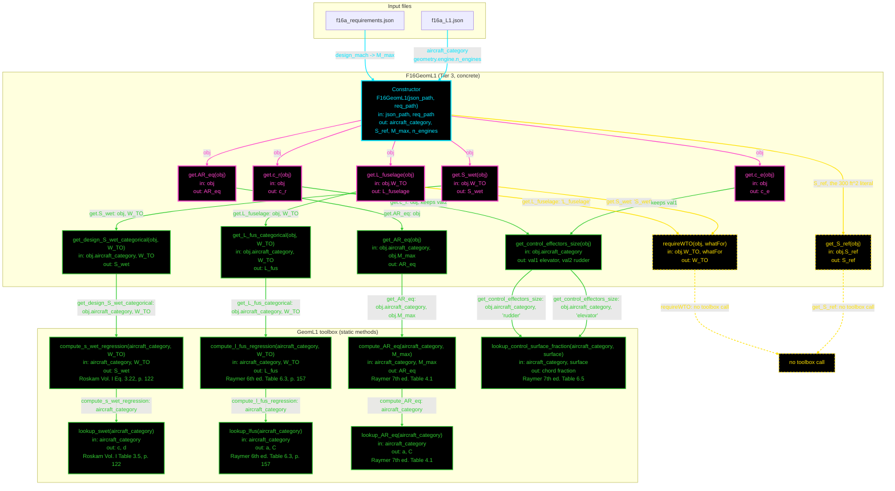

# F16GeomL1: input-to-output data flow

`F16GeomL1` is the Level-1 geometry class: a pure statistical tier, where geometry comes from takeoff
gross weight and design Mach. There is no planform.

`F16GeomL1` takes no injected discipline object. L2 and L3 both take an injected propulsion object;
at L1, propulsion data does not reach geometry.

## Viewing this chart with pan and zoom

Mermaid inside a `.md` renders at a fixed size, so a wide chart is hard to read in a plain preview.
Open `docs/Mermaid_Diagrams/viewer.html` and drag this file onto it. Wheel or pinch zooms, drag
pans, and `f` fits.

The viewer reads the first mermaid fenced block straight out of this file, so there is no second copy
of the diagram to keep in step.

## Reading the chart

- Every node is ONE function: name, inputs, output, and, for a toolbox equation, its citation.
  Returned values, table coefficients, and which tier declares a method abstract belong in the notes
  tables, not in a label.
- **A class node shows only what is in `F16GeomL1.m`.** Inherited contracts are not annotated on the
  node.
- Function-level only. A `Dependent` property is not a function, so it gets no node; its getter is a
  function, so the getter does.
- No grouped "Inputs" node. Every value rides the arrow that carries it, and a source node holds
  only a file name.
- The constructor is cyan. A working function is green.
- **Dash means the value comes out UNCHANGED; solid means the function does something to it.** A box
  whose body is `out = obj.something;` is a pure relay, so it is dashed, and so is every line
  leaving it. A box that evaluates an equation, reads a table, or combines its inputs is solid.
  This is orthogonal to colour: colour says what kind of member it is, dash says whether the value
  was worked on. `get_S_ref` is dashed because `S_ref` comes out exactly as it went in;
  `get_design_S_wet_categorical` is solid because it evaluates a regression.
- **A line's colour comes from the node it POINTS AT; its dash comes from the node it LEAVES.** A
  file source node is not a method, so it takes the dash of the constructor it feeds.
- **An INJECTOR is magenta with solid lines.** Any `get.<name>` property getter is magenta, so a
  derived read is identifiable at a glance. Magenta beats every other node colour, and an injector
  is EXEMPT from the `no toolbox call` marker, because for a getter that is the normal case. Every
  injector here is solid: each calls a method, so the value does not come out untouched.
- A NON-INJECTOR function that calls no toolbox method and no other code is yellow with a dashed
  border, placed at the end of its row and wired to an explicit `no toolbox call` marker.
- **A dashed arrow into a black node with a red dashed border marks NO UPSTREAM CALL**: a toolbox
  static nothing in `F16GeomL1` calls. **Nothing earns it here** — all seven `GeomL1` statics have a
  live caller. The L2 and L3 charts each still have some.
- A class method that works when called is plain green even if nothing else in the class calls it.
- **A break is recorded in prose and in the notes table, never as a node.**
- **The Tier-2 enforcer is not drawn.** `get.S_wet` calls `obj.get_S_wet(...)`, which resolves to the
  concrete `GeometryModelL1.get_S_wet` bridge and forwards to `get_design_S_wet_categorical`. The
  bridge holds no equation, so the edge is drawn straight through it.
- **`SizingLoopL1` is not drawn.** It writes `S_ref` and `W_TO` every iteration; those writes are in
  the notes table instead of as a source node.
- An edge from a class function into a toolbox is labeled with the calling function's name and the
  actual arguments at that call site.
- **Orientation is `flowchart TB`.** At 19 function nodes, left-to-right renders wide and mostly
  empty down the page. The L2 and L3 charts stay `flowchart LR`, because at 53 and 87 nodes they
  need the width.

## Two things the chart settles

**1. Every quantity has one injector in front of it.** `S_wet`, `L_fuselage`, `AR_eq`, `c_e` and
`c_r` each have a magenta `get.` getter, and each forwards to exactly one method. That is the shape
the optimization-ready contract wants: a consumer reads a property and the value is recomputed on
every read, with nothing cached.

The two TOGW regressions are the only ones passing through `requireWTO`, because they are the only
ones depending on `W_TO`. `AR_eq`, `c_e` and `c_r` depend on `aircraft_category` and `M_max`, which
the constructor sets, so they are readable immediately.

`get_control_effectors_size` is the one method with TWO injectors in front of it, because it returns
two values and a `Dependent` property holds one. `get.c_e` and `get.c_r` each call it and keep one
output.

**2. Where `S_ref` comes from at L1.** The constructor sets the 300 ft² literal, and
`SizingLoopL1:96` then overwrites `obj.geom.S_ref` every iteration with `W0 / WS`. So at L1 `S_ref`
is neither JSON data nor a derived planform quantity: it is loop state. The loop is not drawn, so
that write is recorded in the notes table.

`get_S_ref` and `requireWTO` are the two functions reaching the `no toolbox call` marker. Neither is
an injector: the rule matches `get.<name>` with a dot, and these are `get_S_ref` and `requireWTO`.
Both are also the only dashed class nodes, because each returns `obj.S_ref` or `obj.W_TO` untouched.

## As-built values

At `W_TO` = 31,377 lbf:

| Quantity | Value |
| --- | --- |
| `S_ref` | 300.0000000000 ft² |
| `S_wet` | 1763.0171222221 ft² |
| `L_fuselage` | 52.7425837861 ft |
| `AR_eq` | 3.5186639569 |
| `c_e` | 0.3000000000 |
| `c_r` | 0.3300000000 |

## Field-by-field notes

| Class member | Source | Notes |
| --- | --- | --- |
| `aircraft_category` | `f16a_L1.json`, TOP-LEVEL field | Not inside `.geometry`. One canonical value selects rows in six different textbook tables, and those tables name their categories differently, so each lookup translates it to its own row name. For `jet_fighter` it selects `c` = −0.1289, `d` = 0.7506; `a` = 0.93, `C` = 0.39; `a` = 5.416, `C` = −0.6222. |
| `S_ref` | 300 ft² literal in the constructor | T.O. 1F-16A-1 Fig. 1-2, deliberately excluded from the JSON `.geometry` block. Set twice: the property default on line 34, then again on line 88. |
| `S_ref`, again | Overwritten by `SizingLoopL1:96` every iteration | `obj.geom.S_ref = W0 / WS`. The loop is not drawn as a node, so the write is recorded here. |
| `M_max` | `f16a_requirements.json`, `.design_mach` | From the requirements file, not the spec file, because a requirement does not vary with fidelity. The property default 2.0 on line 35 is dead: the constructor always overwrites it. |
| `n_engines` | `f16a_L1.json`, `.geometry.engine.n_engines` | Read behind an `isfield` guard. No L1 geometry regression uses it; it is exposed so mission analysis can read `geom.n_engines` by injection at every fidelity. |
| `W_TO` | Written by `SizingLoopL1:100` behind an `isprop` guard | `NaN` until then. |
| `requireWTO(obj, whatFor)` | Private method | Returns `obj.W_TO`, raising `F16GeomL1:WTONotSet` when it is `NaN` or non-positive. A named error rather than a silent zero, which would propagate as zero parasite drag into an injected aero object. Only the two TOGW regressions go through it. |
| `S_wet` (Dependent) | `get.S_wet` -> enforcer bridge -> `get_design_S_wet_categorical` | Read-only: assigning raises `MATLAB:class:noSetMethod`, which is correct, it is an output. |
| `L_fuselage` (Dependent) | `get.L_fuselage` -> `get_L_fus_categorical` | |
| `AR_eq` (Dependent) | `get.AR_eq` -> `get_AR_eq` | At `M_max` = 2.0. |
| `c_e` (Dependent) | `get.c_e` -> `get_control_effectors_size`, keeps `val1` | The elevator chord ratio. The rudder ratio is computed on the same read and discarded. |
| `c_r` (Dependent) | `get.c_r` -> `get_control_effectors_size`, keeps `val2` | The elevator ratio is computed on the same read and discarded. |
| `get_control_effectors_size(obj)` | Declared abstract by `GeometryModelL1` | Returns both chord ratios. Carries `% Note (8/20/2026)(Casey): This isn't used in the sizing loop.` and `Grouped them because it's easier to track.` **The enforcer declares one output where the method returns two.** MATLAB does not check arity, so the class instantiates and both values come back, but a caller writing `val = geom.get_control_effectors_size()` silently gets the elevator ratio only. |

## Toolbox notes

| Static | Notes |
| --- | --- |
| `compute_s_wet_regression(aircraft_category, W_TO)` | `10^c * W_TO^d`, with `(c, d)` from its own `lookup_swet` call. |
| `compute_l_fus_regression(aircraft_category, W_TO)` | `a * W_TO^C`, with `(a, C)` from its own `lookup_lfus` call. Raymer Table 6.3's printed rows ARE the `(a, C)` pairs of this power law. |
| `compute_AR_eq(aircraft_category, M_max)` | `a * M_max^C`, with `(a, C)` from its own `lookup_AR_eq` call. The JET form only: a sailplane is `0.19*(L/D_max)^1.3` and a prop is a fixed number per category, so neither belongs in this static. |
| `lookup_control_surface_fraction(cat, surface)` | Has NO `compute_*` partner BY DESIGN: a chord fraction is read, not computed. Eight categories. Two call sites, both inside `get_control_effectors_size`, one per surface name. **No category carries an aileron fraction**, so `'aileron'` raises deliberately, guarded by `testTODO_AileronFractionNotAvailable`. Marked `% TODO (8/14/2026): This looks fine. Don't touch.` |
| `lookup_swet(cat)` | Five categories, all agreeing with the printed Table 3.5. `military_cargo` and `military_bomber` share coefficients: Roskam's row 10 is one row covering Mil. Patrol, Bomb *and* Transport. |
| `lookup_lfus(cat)` | All 13 printed rows of Table 6.3. The book also prints metric coefficients in braces; those are not carried. |
| `lookup_AR_eq(cat)` | Jet-fighter (dogfighter) row only. |
| Coverage | Eight of Table 3.5's twelve rows are absent from `lookup_swet`, and `lookup_AR_eq` holds one row. `lookup_lfus` and `lookup_control_surface_fraction` are complete. |

## The two-step lookup pattern

The `compute_*` statics take `aircraft_category` and call their own `lookup_*` internally, so the
chain is three levels deep: class to `compute_*` to `lookup_*`. A design class makes one call, not
two.

That puts `aircraft_category` across the toolbox boundary, which the naming-freedom rule warns
about: a static reading that argument makes the string a required vocabulary for every aircraft. It
is a design call, not a defect, so the chart records the shape. Worth a decision before the same
shape is copied into aero, propulsion and weights.

## Source files

| Item | File |
| --- | --- |
| Concrete class | `examples/F16A/models/disciplines/geom/F16GeomL1.m` |
| Tier 2, abstract | `src/disciplines/geometry/GeometryModelL1.m` |
| Toolbox | `src/disciplines/geometry/GeomL1.m` |
| Companion doc | `src/disciplines/geometry/GeomL1.md` |
| Writes `S_ref` and `W_TO` | `src/sizing/SizingLoopL1.m` |
| Input JSON | `examples/F16A/inputs/f16a_L1.json`, `examples/F16A/inputs/f16a_requirements.json` |
