# F16GeomL2: input-to-output data flow (second pass)

This chart shows the data path for `F16GeomL2`, the Level 2 (L2) geometry class,
**as the code stands after the toolbox trim of 2026-08-17 to 2026-08-19**. The
first-pass chart is kept unchanged at
`Claude-made/First_Pass/Geom/F16AGeom2_mermaid.md`.

**Verified complete.** Every function in `F16GeomL2.m` (36, including the
constructor and the two statics) and every static in `GeomL2.m` (8) has a node.
Values live:

    S_wet          = 1466.7730567344 ft^2
    Amax           =   27.4889357189 ft^2
    D_fus          =    6.0000000000 ft
    D_inlet        =    3.5370222385 ft
    S_wet_fuselage =  730.3023197382 ft^2

## Viewing this chart with pan and zoom

Mermaid inside a `.md` renders at a fixed size, so a wide chart is hard to read in
a plain preview. Open `docs/Mermaid_Diagrams/viewer.html` and drag this file onto
it. Wheel or pinch zooms, drag pans, and `f` fits.

The viewer reads the first ```` ```mermaid ```` block straight out of this file, so
there is no second copy of the diagram to keep in step.

## What changed since the first pass

| First pass | Now |
| --- | --- |
| `GeomL2` held `get_S_wet` and five `get_S_wet_*` object-taking wrappers, so the TOOLBOX decided that every aircraft has a wing, an HT, a VT, a fuselage and a duct | All gone. `F16GeomL2.get_design_S_wet_components` owns the component sum, so the DESIGN class decides which components its aircraft has. A tailless design can now say so |
| `S_wet_wing`, `S_wet_ht` and `S_wet_vt` were `Dependent` properties with getters | Deleted, at Casey's direction (Option B, 2026-08-18). Consumers call `GeomL2.compute_S_wet_planform_roskam` with explicit arguments |
| `compute_wet_planform` was cited to Brandt | Re-cited to **Raymer 6th ed. Eq. 7.12**, which it matches verbatim, and renamed `compute_S_wet_planform_raymer`. `compute_roskam_planform` became `compute_S_wet_planform_roskam`. Raymer **Eq. 7.11**'s `t/c < 0.05` branch was added |
| `get_S_wet_fuselage` passed `W_max_fuselage` where Roskam Eq. 12.3 takes `D_fus` | **Real bug, fixed.** 7.0 ft max WIDTH where the equation wants the 6.0 ft equivalent diameter. Fuselage `S_wet` read 12.776 % high and the total 6.361 % high, so drag, fuel and weight rose with it. The equation existed TWICE, inline and in the getter, so the fix had to be made twice |
| Three Brandt-only statics sat in the toolbox | Moved to `F16GeomBrandtAlt` in the F-16 example. Brandt stays a verification source, not a supplier of framework equations |
| `compute_nacelle_diameter` and `compute_Amax_elliptical` were `GeometryBase` statics | Both moved to `F16GeomL2`'s own `methods (Static)` block, at Casey's direction. `F16GeomL2` is the only caller of each |
| `GeometryBase` held MAC-station and tail-arm statics, and `F16GeomL2` held `x_mac_le_wing` / `x_c4_*` / `L_HT` / `L_VT` getters | Gone from both before this pass. Moment arms are the tail-sizing discipline's business now, so they are absent from this chart |

**Read this first.** Same rule set as the L1 chart, with the L2-specific notes at
the end of the list:
- One function per node. Name, inputs, output, citation. Returned values and
  coefficients live in the notes tables, not in the labels.
- No grouped "Inputs" node. Every value rides the arrow that carries it. A
  source node holds only a file or object name.
- Constructor cyan. Every other function green. A function with no toolbox call
  is yellow dashed, sits at the end of its row, and wires to a
  `no toolbox call` marker.
- **One marker is left.** Four were needed while every no-call getter wired to one;
  now that injectors are exempt, only `get_S_ref` reaches a marker. The exempt
  getters are `get.tc_r_wing`, `get.tc_t_wing`, `get.tc_ht`, `get.tc_vt`,
  `get.b_vt`, `get.D_fus`, `get.L_fuselage`, `get.T_AB_SLS_lb` and `get.D_exit`:
  nine short derived reads, each magenta, none of them a finding.
- A black node with a red dashed border marks NO UPSTREAM CALL: a static of a
  toolbox THIS CLASS CALLS that `F16GeomL2` itself never calls. It does not mean
  "unreachable from here" in general, or every unrelated file would qualify. A
  function that has moved to another file is out of scope, not dead, and belongs in
  the notes table. That is not the same as "no consumer anywhere" either, and the
  notes table separates all three.
- **A NO UPSTREAM CALL node has NO CONNECTOR.** A connector shows data flowing
  between method functions that are actively used, so drawing one into an unused
  static would assert a flow that does not happen. Those nodes stand alone inside
  the toolbox box, and the fact is written in the label.
- **The Tier-2 enforcer is NOT drawn.** These charts are the discipline's own
  functions. Where an enforcer sits in the middle of a real call path, the edge is
  drawn straight through it and the hop is recorded in the notes instead of as a
  box. The affected paths are named under "Enforcer hops not drawn" below.
- Every edge takes the colour and dash of the node it POINTS AT.
- An edge into a toolbox is labeled with the calling function's name and the
  actual arguments at that call site.
- `F16GeomL2` takes an INJECTED propulsion object. The nacelle diameter is sized
  from engine SLS thrust, which is engine data, not airframe data, so
  `T_AB_SLS_lb` is `Dependent` on `prop.T_SL` and is not a geometry input.
- **There is no `f16a_requirements.json` input, and that is correct.** L1 needs
  `M_max` to estimate `AR` from design Mach; L3 needs `design_mach` for Raymer
  Eq. 10.11's engine length. L2 needs neither: `AR_wing` is real spec data, and
  there is no engine-length term at this tier. `L_aircraft` looks like a candidate
  but is a spec value, what the aircraft IS, and `F16AeroL2.compute_CD0_wave` takes
  its Mach from the `AircraftState` at call time. The side effect is that the three
  tiers have three different constructor signatures, which is logged in the plan as
  an open question.

```mermaid
flowchart LR
    NCF["no toolbox call"]

    J["f16a_L2.json"]
    PROP["prop (PropulsionBase, injected)"]

    subgraph CLASS["F16GeomL2 (Tier 3, concrete)"]
        direction TB

        CTOR["Constructor<br/>F16GeomL2(json_path, prop)<br/>in: json_path, prop<br/>out: wing / HT / VT / fuselage / engine inputs,<br/>stored prop handle"]

        subgraph WING["Wing"]
            W1["get.b_wing<br/>in: AR_wing, S_ref<br/>out: b_wing"]
            W2["get.c_root_wing<br/>in: S_ref, b_wing, lambda_wing<br/>out: c_root_wing"]
            W3["get.c_tip_wing<br/>in: c_root_wing, lambda_wing<br/>out: c_tip_wing"]
            W4["get.cbar_wing<br/>in: c_root_wing, lambda_wing<br/>out: cbar_wing"]
            W5["get.QC_sweep_wing<br/>in: LE_sweep_wing, AR_wing, lambda_wing<br/>out: QC_sweep_wing"]
            W6["get.TE_sweep_wing<br/>in: LE_sweep_wing, AR_wing, lambda_wing<br/>out: TE_sweep_wing"]
            W7["get.S_exposed_wing<br/>in: c_root_wing, c_tip_wing, b_wing, W_max_fuselage<br/>out: S_exposed_wing"]
            W8["get.tc_r_wing<br/>in: tc_wing<br/>out: tc_r_wing"]
            W9["get.tc_t_wing<br/>in: tc_wing<br/>out: tc_t_wing"]
        end

        subgraph HT["Horizontal tail"]
            H1["get.b_ht<br/>in: AR_ht, S_ht<br/>out: b_ht"]
            H2["get.c_root_ht<br/>in: S_ht, b_ht, lambda_ht<br/>out: c_root_ht"]
            H3["get.c_tip_ht<br/>in: c_root_ht, lambda_ht<br/>out: c_tip_ht"]
            H4["get.QC_sweep_ht<br/>in: LE_sweep_ht, AR_ht, lambda_ht<br/>out: QC_sweep_ht"]
            H5["get.TE_sweep_ht<br/>in: LE_sweep_ht, AR_ht, lambda_ht<br/>out: TE_sweep_ht"]
            H6["get.S_exposed_ht<br/>in: c_root_ht, c_tip_ht, b_ht, W_max_fuselage<br/>out: S_exposed_ht"]
            H7["get.tc_ht<br/>in: tc_r_ht, tc_t_ht<br/>out: tc_ht"]
        end

        subgraph VT["Vertical tail"]
            V1["get.c_root_vt<br/>in: S_vt, b_vt, lambda_vt<br/>out: c_root_vt"]
            V2["get.c_tip_vt<br/>in: c_root_vt, lambda_vt<br/>out: c_tip_vt"]
            V3["get.QC_sweep_vt<br/>in: LE_sweep_vt, AR_vt, lambda_vt<br/>out: QC_sweep_vt"]
            V4["get.TE_sweep_vt<br/>in: LE_sweep_vt, AR_vt, lambda_vt<br/>out: TE_sweep_vt"]
            V5["get.S_exposed_vt<br/>in: S_vt, AR_vt, c_root_vt, c_tip_vt, H_max_fuselage<br/>out: S_exposed_vt"]
            V6["get.b_vt<br/>in: S_vt, AR_vt<br/>out: b_vt"]
            V7["get.tc_vt<br/>in: tc_r_vt, tc_t_vt<br/>out: tc_vt"]
        end

        subgraph FUS["Fuselage"]
            F1["get.S_wet_fuselage<br/>in: D_fus, L_fus<br/>out: S_wet_fuselage"]
            F2["get.Amax<br/>in: W_max_fuselage, H_max_fuselage<br/>out: Amax"]
            F3["get.D_fus<br/>in: W_max_fuselage, H_max_fuselage<br/>out: D_fus"]
            F4["get.L_fuselage<br/>in: L_fus<br/>out: L_fuselage"]
        end

        subgraph DUCT["Inlet and engine duct"]
            E1["get.D_inlet<br/>in: T_AB_SLS_lb<br/>out: D_inlet"]
            E2["get.T_AB_SLS_lb<br/>in: prop.T_SL<br/>out: T_AB_SLS_lb"]
            E3["get.D_exit<br/>in: D_inlet<br/>out: D_exit"]
        end

        subgraph STAT["F16GeomL2 statics"]
            S1["compute_nacelle_diameter(T_AB_SLS_lb)<br/>in: T_AB_SLS_lb<br/>out: D_nacelle<br/>Brandt Engn(s) D_engine"]
            S2["compute_Amax_elliptical(W_max, H_max)<br/>in: W_max, H_max<br/>out: Amax<br/>standard elliptical identity, no equation number"]
        end

        AGG["get_design_S_wet_components(obj)<br/>in: exposed areas, t/c, taper, D_fus, L_fus,<br/>D_inlet, D_exit, L_duct<br/>out: S_wet total"]
        PSW["get.S_wet<br/>in: obj<br/>out: S_wet"]
        GSR["get_S_ref(obj)<br/>in: obj.S_ref<br/>out: S_ref"]
    end


    subgraph TB["GeometryBase (static methods)"]
        TB1["compute_span(AR, S_ref)<br/>in: AR, S_ref<br/>out: b<br/>definitional, AR = b^2/S_ref"]
        TB2["compute_root_chord(S_ref, b, lambda)<br/>in: S_ref, b, lambda<br/>out: c_root<br/>Raymer 7th ed. Eq. 7.6"]
        TB3["compute_tip_chord(c_root, lambda)<br/>in: c_root, lambda<br/>out: c_tip<br/>definitional"]
        TB4["compute_mac(c_root, lambda)<br/>in: c_root, lambda<br/>out: cbar<br/>Raymer 7th ed. Eq. 7.8"]
        TB5["convert_sweep(Lambda_LE, AR, lambda, x)<br/>in: Lambda_LE, AR, lambda, x<br/>out: Lambda_x<br/>standard planform identity, MIRRORED 4/AR"]
        TB6["convert_sweep_panel(Lambda_LE, AR, lambda, x)<br/>in: Lambda_LE, AR, lambda, x<br/>out: Lambda_x<br/>standard planform identity, SINGLE PANEL 2/AR"]
    end

    subgraph TG["GeomL2 toolbox (static methods)"]
        G1["compute_S_exposed_horizontal(c_root, c_tip, hs, fw)<br/>in: c_root, c_tip, semispan, fuselage half-width<br/>out: S_exposed, both panels<br/>Brandt readme_geom.md Sec. 4.3"]
        G2["compute_S_exposed_vertical(S, AR, c_root, c_tip, fh)<br/>in: S, AR, c_root, c_tip, fuselage half-height<br/>out: S_exposed, one panel<br/>Brandt readme_geom.md Sec. 4.3"]
        G3["compute_S_wet_planform_roskam(S_exp, tc_r, tc_t, lambda)<br/>in: S_exposed, tc_root, tc_tip, taper<br/>out: S_wet<br/>Roskam Vol. II Eq. 12.1, UNVERIFIED"]
        G4["compute_s_wet_fus_cyl(D_fus, L_fus)<br/>in: D_fus, L_fus<br/>out: S_wet_fuselage<br/>Roskam Vol. II Eq. 12.3, UNVERIFIED"]
        G5["compute_s_wet_duct(D_inlet, D_exit, L_duct)<br/>in: D_inlet, D_exit, L_duct<br/>out: S_wet_duct<br/>Raymer 6th ed. Sec. 7.3"]
        D1["compute_S_wet_planform_raymer(S_exp, tc)<br/>no call from F16GeomL2"]
        D2["compute_S_wet_cylinder(r, L)<br/>no call from F16GeomL2"]
        D3["compute_S_wet_cone(r, L)<br/>no call from F16GeomL2"]
    end


    J -->|"wing: S_ft2, AR, taper, sweep_LE_deg, tc_ratio, x_apex_ft"| CTOR
    J -->|"horizontal_tail: S_ft2, AR, taper, sweep_LE_deg, tc_root, tc_tip, x_le_ft"| CTOR
    J -->|"vertical_tail: S_ft2, AR, taper, sweep_LE_deg, tc_root, tc_tip, x_le_ft"| CTOR
    J -->|"fuselage: length_ft, max_width_ft, max_height_ft, overall_length_ft"| CTOR
    J -->|"engine: duct_length_ft, n_engines"| CTOR
    PROP -->|"prop handle stored, not copied"| CTOR

    CTOR -->|"AR_wing, S_ref"| W1
    W1 -->|"b_wing"| W2
    CTOR -->|"S_ref, lambda_wing"| W2
    W2 -->|"c_root_wing"| W3
    CTOR -->|"lambda_wing"| W3
    W2 -->|"c_root_wing"| W4
    CTOR -->|"lambda_wing"| W4
    CTOR -->|"LE_sweep_wing, AR_wing, lambda_wing"| W5
    CTOR -->|"LE_sweep_wing, AR_wing, lambda_wing"| W6
    W1 -->|"b_wing/2"| W7
    W2 -->|"c_root_wing"| W7
    W3 -->|"c_tip_wing"| W7
    CTOR -->|"W_max_fuselage/2"| W7

    CTOR -->|"AR_ht, S_ht"| H1
    H1 -->|"b_ht"| H2
    CTOR -->|"S_ht, lambda_ht"| H2
    H2 -->|"c_root_ht"| H3
    CTOR -->|"lambda_ht"| H3
    CTOR -->|"LE_sweep_ht, AR_ht, lambda_ht"| H4
    CTOR -->|"LE_sweep_ht, AR_ht, lambda_ht"| H5
    H1 -->|"b_ht/2"| H6
    H2 -->|"c_root_ht"| H6
    H3 -->|"c_tip_ht"| H6
    CTOR -->|"W_max_fuselage/2"| H6

    V6 -->|"b_vt"| V1
    CTOR -->|"S_vt, lambda_vt"| V1
    V1 -->|"c_root_vt"| V2
    CTOR -->|"lambda_vt"| V2
    CTOR -->|"LE_sweep_vt, AR_vt, lambda_vt"| V3
    CTOR -->|"LE_sweep_vt, AR_vt, lambda_vt"| V4
    CTOR -->|"S_vt, AR_vt"| V5
    V1 -->|"c_root_vt"| V5
    V2 -->|"c_tip_vt"| V5
    CTOR -->|"H_max_fuselage/2"| V5

    F3 -->|"D_fus"| F1
    CTOR -->|"L_fus"| F1
    CTOR -->|"W_max_fuselage, H_max_fuselage"| F2

    E2 -.->|"T_AB_SLS_lb"| E1

    W7 -->|"S_exposed_wing"| AGG
    W8 -.->|"tc_r_wing"| AGG
    W9 -.->|"tc_t_wing"| AGG
    H6 -->|"S_exposed_ht"| AGG
    V5 -->|"S_exposed_vt"| AGG
    F3 -->|"D_fus"| AGG
    E1 -->|"D_inlet"| AGG
    E3 -.->|"D_exit"| AGG
    CTOR -->|"lambda_*, tc_r_ht, tc_t_ht, tc_r_vt, tc_t_vt, L_fus, L_duct"| AGG
    PSW -->|"get.S_wet: obj"| AGG

    W1 -->|"get.b_wing: obj.AR_wing, obj.S_ref"| TB1
    W2 -->|"get.c_root_wing: obj.S_ref, obj.b_wing, obj.lambda_wing"| TB2
    W3 -->|"get.c_tip_wing: obj.c_root_wing, obj.lambda_wing"| TB3
    W4 -->|"get.cbar_wing: obj.c_root_wing, obj.lambda_wing"| TB4
    W5 -->|"get.QC_sweep_wing: obj.LE_sweep_wing, obj.AR_wing, obj.lambda_wing, 0.25"| TB5
    W6 -->|"get.TE_sweep_wing: obj.LE_sweep_wing, obj.AR_wing, obj.lambda_wing, 1.0"| TB5
    W7 -->|"get.S_exposed_wing: obj.c_root_wing, obj.c_tip_wing, obj.b_wing/2, fw"| G1

    H1 -->|"get.b_ht: obj.AR_ht, obj.S_ht"| TB1
    H2 -->|"get.c_root_ht: obj.S_ht, obj.b_ht, obj.lambda_ht"| TB2
    H3 -->|"get.c_tip_ht: obj.c_root_ht, obj.lambda_ht"| TB3
    H4 -->|"get.QC_sweep_ht: obj.LE_sweep_ht, obj.AR_ht, obj.lambda_ht, 0.25"| TB5
    H5 -->|"get.TE_sweep_ht: obj.LE_sweep_ht, obj.AR_ht, obj.lambda_ht, 1.0"| TB5
    H6 -->|"get.S_exposed_ht: obj.c_root_ht, obj.c_tip_ht, obj.b_ht/2, fw"| G1

    V1 -->|"get.c_root_vt: obj.S_vt, obj.b_vt, obj.lambda_vt"| TB2
    V2 -->|"get.c_tip_vt: obj.c_root_vt, obj.lambda_vt"| TB3
    V3 -->|"get.QC_sweep_vt: obj.LE_sweep_vt, obj.AR_vt, obj.lambda_vt, 0.25"| TB6
    V4 -->|"get.TE_sweep_vt: obj.LE_sweep_vt, obj.AR_vt, obj.lambda_vt, 1.0"| TB6
    V5 -->|"get.S_exposed_vt: obj.S_vt, obj.AR_vt, obj.c_root_vt, obj.c_tip_vt, fh"| G2

    F1 -->|"get.S_wet_fuselage: obj.D_fus, obj.L_fus"| G4
    F2 -->|"get.Amax: obj.W_max_fuselage, obj.H_max_fuselage"| S2
    E1 -->|"get.D_inlet: obj.T_AB_SLS_lb"| S1

    AGG -->|"get_design_S_wet_components: S_exposed_wing, tc_r_wing, tc_t_wing, lambda_wing"| G3
    AGG -->|"get_design_S_wet_components: S_exposed_ht, tc_r_ht, tc_t_ht, lambda_ht"| G3
    AGG -->|"get_design_S_wet_components: S_exposed_vt, tc_r_vt, tc_t_vt, lambda_vt"| G3
    AGG -->|"get_design_S_wet_components: obj.D_fus, obj.L_fus"| G4
    AGG -->|"get_design_S_wet_components: obj.D_inlet, obj.D_exit, obj.L_duct"| G5

    CTOR -->|"tc_wing"| W8
    CTOR -->|"tc_wing"| W9
    CTOR -->|"tc_r_ht, tc_t_ht"| H7
    CTOR -->|"S_vt, AR_vt"| V6
    CTOR -->|"tc_r_vt, tc_t_vt"| V7
    CTOR -->|"W_max_fuselage, H_max_fuselage"| F3
    CTOR -->|"L_fus"| F4
    CTOR -->|"obj.S_ref"| GSR
    GSR -.->|"get_S_ref: no toolbox call"| NCF
    PROP -->|"prop.T_SL"| E2
    E1 -->|"D_inlet"| E3









    linkStyle 0,1,2,3,4,5 stroke:#00e5ff,color:#00e5ff,stroke-width:2px
    linkStyle 44,45,46,47,48,49,50,51,52,53,54,55,56,57,58,59,60,61,62,63,64,65,66,67,68,69,70,71,72,73,74,75,76,77,78,79 stroke:#33cc33,color:#33cc33,stroke-width:2px
    linkStyle 6,7,8,9,10,11,12,13,14,15,16,17,18,19,20,21,22,23,24,25,26,27,28,29,30,31,32,33,34,35,36,37,38,39,40,41,42,43,80,81,82,83,84,85,86,89,90 stroke:#ff44cc,color:#ff44cc,stroke-width:2px
    linkStyle 87,88 stroke:#ffe100,color:#ffe100,stroke-width:2px,stroke-dasharray:4 3


    linkStyle 0,1,2,3,4,5 stroke:#00e5ff,color:#00e5ff,stroke-width:2px
    linkStyle 52 stroke:#33cc33,color:#33cc33,stroke-width:2px
    linkStyle 44,45,46,47,48,49,50,51,53,54,55,56,57,58,59,60,61,62,63,64,65,66,67,68,69,70,71,72,73,74,75,76,77,78,79 stroke:#33cc33,color:#33cc33,stroke-width:2px,stroke-dasharray:5 4
    linkStyle 6,8,10,12,13,14,18,19,21,23,24,25,29,31,33,34,35,36,39,41,42,80,81,82,83,84,85,86 stroke:#ff44cc,color:#ff44cc,stroke-width:2px
    linkStyle 7,9,11,15,16,17,20,22,26,27,28,30,32,37,38,40,43,89,90 stroke:#ff44cc,color:#ff44cc,stroke-width:2px,stroke-dasharray:5 4
    linkStyle 87 stroke:#ffe100,color:#ffe100,stroke-width:2px
    linkStyle 88 stroke:#ffe100,color:#ffe100,stroke-width:2px,stroke-dasharray:5 4


    linkStyle 0,1,2,3,4,5 stroke:#00e5ff,color:#00e5ff,stroke-width:2px
    linkStyle 44,47,48,49,50,52,53,54,55,56,57,58,59,60,62,63,64,65,66,67,68,69,70,71,72,73,74,75,76,77,78,79 stroke:#33cc33,color:#33cc33,stroke-width:2px
    linkStyle 45,46,51,61 stroke:#33cc33,color:#33cc33,stroke-width:2px,stroke-dasharray:5 4
    linkStyle 6,7,8,9,10,11,12,13,14,15,16,17,18,19,21,22,23,24,25,27,28,29,30,31,32,33,34,35,36,37,38,39,40,41,42,80,81,82,83,84,85,86,89,90 stroke:#ff44cc,color:#ff44cc,stroke-width:2px
    linkStyle 20,26,43 stroke:#ff44cc,color:#ff44cc,stroke-width:2px,stroke-dasharray:5 4
    linkStyle 87 stroke:#ffe100,color:#ffe100,stroke-width:2px
    linkStyle 88 stroke:#ffe100,color:#ffe100,stroke-width:2px,stroke-dasharray:5 4

    class D1,D2,D3 deadWork

    linkStyle 0,1,2,3,4,5 stroke:#00e5ff,color:#00e5ff,stroke-width:2px
    linkStyle 44,47,48,49,50,52,53,54,55,56,57,58,59,60,61,62,63,64,65,66,67,68,69,70,71,72,73,74,75,76,77,78,79 stroke:#33cc33,color:#33cc33,stroke-width:2px
    linkStyle 45,46,51 stroke:#33cc33,color:#33cc33,stroke-width:2px,stroke-dasharray:5 4
    linkStyle 6,7,8,9,10,11,12,13,14,15,16,17,18,19,20,21,22,23,24,25,26,27,28,29,30,31,32,33,34,35,36,37,38,39,40,41,42,80,81,82,83,84,85,86,89,90 stroke:#ff44cc,color:#ff44cc,stroke-width:2px
    linkStyle 43 stroke:#ff44cc,color:#ff44cc,stroke-width:2px,stroke-dasharray:5 4
    linkStyle 87 stroke:#ffe100,color:#ffe100,stroke-width:2px
    linkStyle 88 stroke:#ffe100,color:#ffe100,stroke-width:2px,stroke-dasharray:5 4

    classDef ctorWork fill:#000000,stroke:#00e5ff,stroke-width:3px,color:#00e5ff
    classDef funcWork fill:#000000,stroke:#33cc33,stroke-width:2px,color:#33cc33
    classDef injectorWork fill:#000000,stroke:#ff44cc,stroke-width:3px,color:#ff44cc
    classDef injectorRelay fill:#000000,stroke:#ff44cc,stroke-width:3px,color:#ff44cc,stroke-dasharray: 5 4
    classDef passthroughRelay fill:#000000,stroke:#ffe100,stroke-width:2px,color:#ffe100,stroke-dasharray: 5 4
    classDef deadWork fill:#000000,stroke:#ff4040,stroke-width:3px,color:#ff4040
    class CTOR ctorWork
    class AGG,G1,G2,G3,G4,G5,S1,S2,TB1,TB2,TB3,TB4,TB5,TB6 funcWork
    class E1,F1,F2,F3,H1,H2,H3,H4,H5,H6,H7,PSW,V1,V2,V3,V4,V5,V6,V7,W1,W2,W3,W4,W5,W6,W7 injectorWork
    class E2,E3,F4,W8,W9 injectorRelay
    class GSR,NCF passthroughRelay
    class D1,D2,D3 deadWork
```



## The three things this chart is meant to make obvious

1. **`get_design_S_wet_components` is the only place that decides what this
   aircraft is made of.** Five arrows leave it, one per component. The toolbox
   no longer holds that decision.
2. **`D_fus` feeds the fuselage wetted area, and `W_max_fuselage` does not.**
   `get.D_fus` averages width and height; only its output reaches `G4`. This is
   the bug fixed at gate 2, drawn so the wrong path is not available.
3. **The propulsion object reaches the drag chain.** `prop.T_SL` to
   `T_AB_SLS_lb` to `D_inlet` to `S_wet_duct`, so a thrust change moves CD0
   instead of leaving a frozen copy behind.

## Field-by-field notes

| Class member | Source | Notes |
| --- | --- | --- |
| `S_ref`, `AR_wing`, `lambda_wing`, `LE_sweep_wing`, `tc_wing`, `x_apex_wing` | `f16a_L2.json` `.geometry.wing` | Genuine spec data. Brandt's back-calculated calibration values, for example `Cfe` and `e_osw`, are sizing OUTPUTS and never appear as inputs here. |
| `tc_r_wing`, `tc_t_wing` | Both mirror `tc_wing` | The T.O. gives one NACA 64A204 section and Brandt supplies no root/tip split, so Roskam Eq. 12.1 degenerates to its equal-t/c case. That is correct, not a gap. |
| `b_vt` | `sqrt(S_vt*AR_vt)`, NOT halved | A vertical tail is a single panel, so its span is the full root-to-tip height. |
| `D_fus` | `(W_max_fuselage + H_max_fuselage)/2` = 6.0 ft | The equivalent diameter Roskam Eq. 12.3 takes. Distinct from `W_max_fuselage` = 7.0 ft. On a WEIGHTS class `D_fus` means the 5.0 ft structural depth instead, which is finding S-30. |
| `L_aircraft` | `.geometry.fuselage.overall_length_ft` | Feeds only the wave-drag term as `(Amax/l)^2`. DISTINCT from `L_fus`. Its citation is not pinned: no overall-length figure appears anywhere in `sizing/`. |
| `Amax` | `get.Amax` -> `F16GeomL2.compute_Amax_elliptical` | 27.4889357189 ft². The fuselage-envelope ellipse. L3 uses a whole-aircraft area-ruled `Amax` of 24.7036516658 instead. The two tiers are DELIBERATELY different; using the envelope at L3 was a real bug. |
| `T_AB_SLS_lb` | `prop.T_SL`, injected | Not a geometry input at either level. |
| `mainwheel_S_front`, `nosewheel_S_front` | `properties (Constant)` | Wheel frontal areas, both marked `-- unused`. Constants, not functions, so no node. Nothing in geometry or aero reads either one. |
| `S_wet` | `get.S_wet` -> `get_design_S_wet_components` | 1466.7730567344 ft². Changes on every sizing iteration, from 1190.3053 down to 1079.4305 over 16 iterations, so nothing is frozen. |

## Toolbox notes

| Static | Status |
| --- | --- |
| `compute_S_wet_planform_roskam` | The live planform form. Its `Roskam Vol. II Eq. 12.1` citation is **UNVERIFIED**: the only Vol. II extract in the repo is a 49-line method summary with no equations. Flagged in the `GeomL2.m` header. |
| `compute_s_wet_fus_cyl` | Same UNVERIFIED status for `Roskam Vol. II Eq. 12.3`. |
| `compute_S_exposed_horizontal`, `compute_S_exposed_vertical` | Plain trapezoid clipping. Cite Brandt only, with no textbook pin. Both marked `% TODO (8/18/2026)(Casey): This is acceptable. Don't touch.` so the rename and signature change proposed at gate 2 are cancelled. |
| `compute_S_wet_planform_raymer` | Raymer 6th ed. Eq. 7.12, with the Eq. 7.11 branch for `t/c < 0.05`. **No call from `F16GeomL2`.** The comparison report calls it as Brandt's uniform-t/c alternate. |
| `compute_S_wet_cylinder`, `compute_S_wet_cone` | **No consumer anywhere.** Both also count the attachment face, which a wetted area should not. Flagged, not deleted: no cited equation loses its home in this pass. |
| `F16GeomBrandtAlt.compute_s_wet_fus_brandt_lowfi` | **Not in this chart, and not a finding.** It left `GeomL2` on 2026-08-18, so it is no longer a static of a toolbox this class calls. Its callers are `geometry_brandt_comparison.m:104` and `TestGeomL2:521`, both outside this chart's scope. The first-pass chart drew it because it still lived in `GeomL2` then. |
| `compute_nacelle_diameter` | Brandt's `sqrt(T/1900)`. Casey accepted the Brandt content on the record: he could find no substitute in Raymer, Nicolai or Roskam. **A reference scan for a substitute is OWED.** The 1900 divisor silently assumes an afterburning engine; Brandt uses 2000 otherwise. |
| `compute_Amax_elliptical` | `(pi/4)*W*H`. No textbook equation number could be pinned, so it carries the same standard-identity status as `convert_sweep`. Moved here on 2026-08-19 because `get.Amax` is its only caller. |

## Open defect, in the enforcer

`GeometryModelL2.get_control_surfaces(obj)` calls
`obj.get_design_control_mechanisms()`. **No concrete class defines that method**,
so calling `get_control_surfaces` errors. `GeometryModelL3` has the identical
pair. Nothing calls either one today, so no test catches it.

Not fixed here: the `*Model*` enforcers were ruled off-limits on 2026-08-18. It is
NOT drawn, because no enforcer node appears in this chart; it is recorded here so
the omission does not read as a clean bill of health.

## Enforcer hops not drawn

`GeometryModelL2.get_S_wet(obj)` is a concrete bridge that forwards to
`get_design_S_wet_components`. `F16GeomL2.get.S_wet` calls that method directly,
so the only caller the bridge serves is an outside consumer doing
`geom.get_S_wet()`, such as the comparison report. It holds no equation, so it is
not drawn.

## Source files

| Item | File |
| --- | --- |
| Concrete class | `examples/F16A/models/disciplines/geom/F16GeomL2.m` |
| Brandt alternates | `examples/F16A/models/disciplines/geom/F16GeomBrandtAlt.m` |
| Tier 2, abstract | `src/disciplines/geometry/GeometryModelL2.m` |
| Tier 1, base | `src/base/GeometryBase.m` |
| Toolbox | `src/disciplines/geometry/GeomL2.m` |
| Companion docs | `src/disciplines/geometry/GeomL2.md`, `src/base/GeometryBase.md` |
| Input JSON | `examples/F16A/inputs/f16a_L2.json` |
