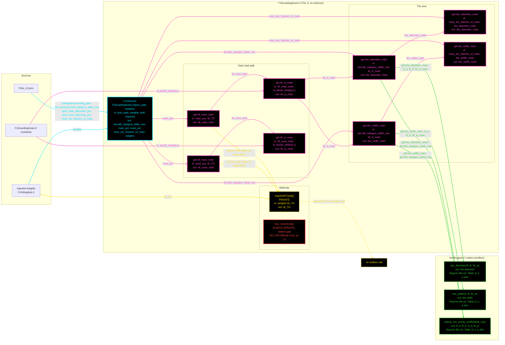

# F16LandingGearL3: input-to-output data flow

This chart shows the data path for `F16LandingGearL3`, the Level 3 landing-gear class. It
splits the gross weight between main and nose gear and sizes the tires from
Raymer's statistical table.

## Viewing this chart with pan and zoom

Mermaid inside a `.md` renders at a fixed size, so a wide chart is hard to read
in a plain preview. Open `docs/Mermaid_Diagrams/viewer.html` and drag this file
onto it. Wheel or pinch zooms, drag pans, and `f` fits.

The viewer reads the first mermaid fenced block straight out of this file, so
there is no second copy of the diagram to keep in step.

**Read this first.**
- The chart runs LEFT TO RIGHT.
- One function per node. Name, inputs, output, citation. Returned values and
  coefficients live in the notes table, not in the labels.
- No grouped "Inputs" node. Every value rides the arrow that carries it. A
  source node holds only a file, object or constant name.
- **Colour says what kind of member a node is; dash says whether the value was
  worked on.** A box whose body returns a stored field unchanged is a pure
  relay, so it is dashed, and so is every line leaving it. A box that evaluates
  an equation, reads a table, calls a method, or combines its inputs is solid.
- **A line's colour comes from the node it POINTS AT; its dash comes from the
  node it LEAVES.** A source node is not a method, so it takes the solid dash of
  the constructor.
- Constructor cyan. Every other function green. An INJECTOR, meaning any
  `get.<name>` property getter, is magenta, and magenta beats every other node
  colour. All eight injectors are solid: each combines its inputs or calls a
  method.
- A NON-INJECTOR function that calls nothing is YELLOW and points at the
  `no toolbox call` marker. `requireWTO` is the one: it returns
  `weights.W_TO` unchanged after checking that it is set.
- **THERE IS NO ENFORCER.** `F16LandingGearL3` subclasses `handle` directly. The
  `landinggearModelL2` enforcer is not wired to it, so it is not drawn.
- **L3 CALLS THE L2 TOOLBOX.** `F16LandingGearL3` has no statics of its own: both tire
  getters call `landinggearL2.lookup_tire_sizing_coeffs`, `tire_diameter` and
  `tire_width`. The class is otherwise a copy of the tire part of `F16LandingGearL2`.
- **THE JSON TIRE COEFFICIENTS ARE NOT READ.** `.tire_sizing` carries
  `diameter_coeff_A/B` and `width_coeff_A/B`, but the tire getters take the
  coefficients from `lookup_tire_sizing_coeffs` instead. The values agree.
- **THE NOSE TIRE IS SCALED OFF THE MAIN TIRE**, by
  `nose_tire_fraction_of_main`. So `get.W_w_nose` is computed but nothing in the
  class reads it.
- One red node: `bay_volume`, which errors by design. Only a test calls it,
  to check the error.

## Field-by-field notes

Values at `W_TO` = 31,377 lbf set on the injected weights object.

| Class member | Source | Value / note |
| --- | --- | --- |
| `aircraft_category_table_row` | `f16a_L3.json` `.subsystems.landing_gear.tire_sizing` | `Jet fighter/trainer`, Raymer's printed row name |
| `main_pct`, `nose_pct` | `.gear_load_split` | 90, 10. Raymer 6th ed. Ch. 11 p.344 prose |
| `nose_tire_fraction_of_main` | `.nose_tire_fraction_of_main` | 0.80, the midpoint of Raymer's 60-100 % range |
| `N_MAIN_WHEELS`, `N_NOSE_WHEELS` | Constants | 2, 1 |
| `weights` | Injected, required | Supplies `W_TO`. `requireWTO` raises `F16LandingGearL3:WTONotSet` while it is `NaN` or non-positive. |
| Tire coefficients | `lookup_tire_sizing_coeffs('Jet fighter/trainer')` | `A_d` 1.59, `B_d` 0.302, `A_w` 0.0980, `B_w` 0.467 |
| `W_main_total`, `W_nose_total` | Computed | 28,239.30 lbf, 3137.70 lbf |
| `W_w_main`, `W_w_nose` | Computed | 14,119.65 lbf, 3137.70 lbf |
| `tire_diameter_main`, `tire_width_main` | Computed | 28.4868 in, 8.4956 in |
| `tire_diameter_nose`, `tire_width_nose` | Computed | 22.7895 in, 6.7965 in |

## Methods with no upstream call at L3

| Member | Home | Note |
| --- | --- | --- |
| `bay_volume` | `F16LandingGearL3` | Errors with `F16LandingGearL3:bayVolumeNotAvailable`: no textbook bay-volume packaging formula exists in this repo. `TestF16LandingGearL2` calls it only to check the error. |

## Source files

| Item | File |
| --- | --- |
| Concrete class | `examples/F16A/models/disciplines/landing_gear/F16LandingGearL3.m` |
| Toolbox | `src/disciplines/landing_gear/landinggearL2.m` |
| Injected weights | `examples/F16A/models/disciplines/weights/F16WeightsL3.m` |
| Input JSON | `examples/F16A/inputs/f16a_L3.json` |
