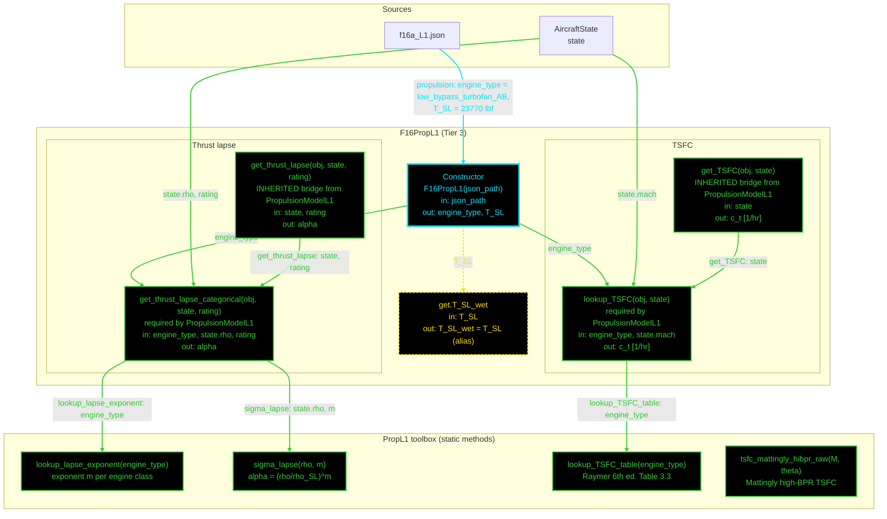

# F16PropL1: input-to-output data flow

This chart shows the data path for `F16PropL1`, the Level 1 (L1) propulsion
class. L1 is a density-ratio thrust lapse and a two-value TSFC table: no Mach
term in the lapse, no afterburner split, no supersonic value.

This is the smallest class in the set. It reads two JSON fields, has one
derived property, and each concrete method is a lookup plus one equation.

## Viewing this chart with pan and zoom

Mermaid inside a `.md` renders at a fixed size, so a wide chart is hard to read
in a plain preview. Open `docs/Mermaid_Diagrams/viewer.html` and drag this file
onto it. Wheel or pinch zooms, drag pans, and `f` fits.

The viewer reads the first mermaid fenced block straight out of this file, so
there is no second copy of the diagram to keep in step.

**Read this first.**
- The chart runs TOP TO BOTTOM. The class is small, so the vertical form
  reads better.
- EVERY arrow carries a label naming the exact value it moves.
- There is no "Inputs" block. The constructor's outgoing arrows carry the
  field names.
- The constructor is cyan. Every other function is green. Yellow dashed marks
  a getter that calls nothing.
- Every edge takes the color of the node it POINTS AT.
- There are NO red nodes. Every static `F16PropL1` reaches is live.
- The METHOD PAIRS ARE GONE. The first pass showed `thrust_lapse` beside
  `get_thrust_lapse` and `get_TSFC` beside `lookup_TSFC`, because two
  contracts named the same quantity twice. `PropulsionModelL1` now supplies a
  concrete bridge for each generic name, so the concrete class writes the
  categorical form ONLY: `get_thrust_lapse_categorical` and `lookup_TSFC`.
- `thrust_lapse_mil_on_AB_scale` is GONE from `PropulsionBase`. The rating is
  now an argument, so `get_thrust_lapse(state, rating)` carries it instead.
- `T_SL_wet` is an alias of `T_SL`, not a second input. Both used to be stored
  and settable, so an optimizer changing one left the other stale.

## Field-by-field notes

| Class member | Source | Notes |
| --- | --- | --- |
| `engine_type` | `f16a_L1.json`, `.propulsion.engine_type` | `low_bypass_turbofan_AB`, an F100-PW-200 class engine. Selects both the lapse exponent and the TSFC row. |
| `T_SL` | `.propulsion.T_SL` | 23,770 lbf, afterburner sea-level static thrust. Brandt Main!D29 and T.O. 1F-16A-1 Sec. I. |
| `T_SL_wet` (Dependent) | `T_SL` | An alias. Was a stored input duplicating `T_SL` in both the class and the JSON, so the two could diverge under an optimizer. |
| `rating` | Caller | `mustBeMember(rating, ["mil","AB"])`. ACCEPTED AND IGNORED: the body computes one density lapse either way, so L1 reports the same alpha for dry and wet power. Correct for a tier with no mil table, but the argument makes the class look more capable than it is. |
| `c_t` | `PropL1.lookup_TSFC_table` | The `state.mach < 0.4` split picks loiter, else cruise. |
| `rho_SL` | `PropL1`, private constant | Hardcoded in the toolbox. Two TODOs, dated 2026-07-13 and 2026-08-14, both say sea-level standard conditions should be their own class. |

## Methods with no upstream call at L1

`tsfc_mattingly_hibpr_raw(M, theta)` is not reached by `F16PropL1`. It is live
and correct, and `B777PropL1` calls it: a high-bypass transport takes the
Mattingly form rather than the two-value table. It is drawn green, not red,
because a function that works when called is green no matter who calls it.

## One open item on this class

`lookup_TSFC` gates on Mach, and the gate does not generalise. It returns the
loiter value below `state.mach` 0.4 and the cruise value at or above it.
Casey's note of 2026-08-27 records the objection: different aircraft loiter at
different Machs, so a hardcoded 0.4 is bad design. The fix named in the note is
to drive the choice from the mission requirements instead.

## Source files

| Item | File |
| --- | --- |
| Concrete class | `examples/F16A/models/disciplines/prop/F16PropL1.m` |
| Tier 2, abstract | `src/disciplines/propulsion/PropulsionModelL1.m` |
| Tier 1, base | `src/base/PropulsionBase.m` |
| Toolbox | `src/disciplines/propulsion/PropL1.m` |
| Input JSON | `examples/F16A/inputs/f16a_L1.json` |
