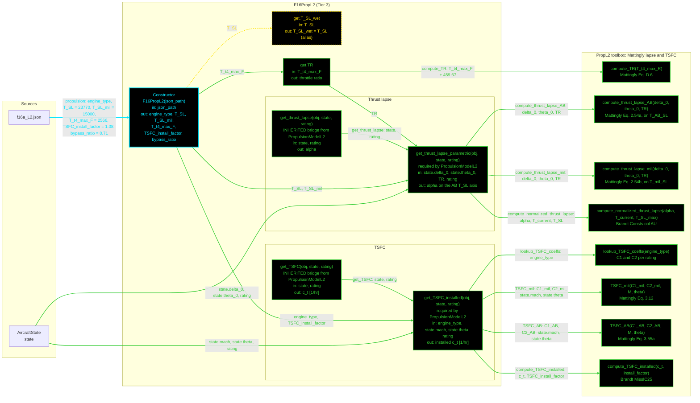

# F16PropL2: input-to-output data flow

This chart shows the data path for `F16PropL2`, the Level 2 (L2) propulsion
class. L2 is Mattingly's parametric thrust lapse, Eq. 2.54, and a
two-coefficient TSFC model, Eq. 3.12 with 3.55a. Both branch on the throttle
rating, so a dry and a wet condition take different equations.

There is no L3 propulsion tier and none is planned. The L3 rung pairs
`F16AeroL3` with this class, so anything reporting L3 propulsion numbers is
computed here.

## Viewing this chart with pan and zoom

Mermaid inside a `.md` renders at a fixed size, so a wide chart is hard to read
in a plain preview. Open `docs/Mermaid_Diagrams/viewer.html` and drag this file
onto it. Wheel or pinch zooms, drag pans, and `f` fits.

The viewer reads the first mermaid fenced block straight out of this file, so
there is no second copy of the diagram to keep in step.

**Read this first.**
- The chart runs LEFT TO RIGHT so the toolbox column stacks vertically
  instead of spreading sideways.
- EVERY arrow carries a label naming the exact value it moves.
- There is no "Inputs" block. The constructor's outgoing arrows carry the
  field names.
- The constructor is cyan. Every other function is green. Yellow dashed marks
  a getter that calls nothing.
- Every edge takes the color of the node it POINTS AT.
- There are NO red nodes. The first pass had twelve, from nine object-taking
  wrappers plus three statics whose callers had been renamed away. The
  wrappers are gone and every remaining static is reached or documented below.
- The METHOD PAIRS ARE GONE. `PropulsionModelL2` now supplies a concrete
  bridge for each generic name, so the concrete class writes the parametric
  and installed forms ONLY.
- The RATING BRANCH IS IN THE CLASS, not the toolbox. Both concrete methods
  fan out to two mutually exclusive statics. Both arrows are drawn because
  both are reachable; one fires per call.
- `T_SL_wet` is an alias of `T_SL`. `TR` is not an alias: its getter computes.

## Field-by-field notes

| Class member | Source | Notes |
| --- | --- | --- |
| `engine_type` | `f16a_L2.json`, `.propulsion.engine_type` | `low_bypass_turbofan_AB`, F100-PW-200. Selects the four TSFC coefficients. |
| `T_SL` | `.propulsion.T_SL` | 23,770 lbf, afterburner SLS thrust. Brandt Main!D29. |
| `T_SL_mil` | `.propulsion.T_SL_mil` | 15,000 lbf, military SLS thrust. Brandt Main!C29. |
| `T_SL_wet` (Dependent) | `T_SL` | An alias, so it cannot diverge from `T_SL` under mutation. |
| `T_t4_max_F` | `.propulsion.T_t4_max_F` | 2566 °F burner-exit total temperature. Mattingly Table C.4. Converted to °R by +459.67 inside the getter. |
| `TR` (Dependent) | `compute_TR` | 1.0. See the open item below. |
| `TSFC_install_factor` | `.propulsion.TSFC_install_factor` | 1.08. Brandt Miss!C25. Applied by `compute_TSFC_installed`, so `get_TSFC` returns an INSTALLED value. |
| `bypass_ratio` | `.propulsion.bypass_ratio` | 0.71. Nicolai & Carichner Table 14.3, F100-PW-100. NO CONSUMER inside this class: it exists for the injection boundary, where `F16WeightsL2.get.W_en` reads it for Eq. 10.10's `exp(-0.81*BPR)` term. |
| mil-on-AB scale | `T_SL_mil / T_SL` | 0.6310475. Eq. 2.54a normalises to `T_AB_SL` and 2.54b to `T_mil_SL`, so the two are on different axes. Consumers compute `T = prop.T_SL * alpha` with `T_SL` the AB thrust, so the mil branch must be rescaled before it can share the AB axis. The AB branch passes through the same static with a ratio of exactly 1. |

## Methods with no upstream call at L2

Four `PropL2` statics are not reached from inside this class, so none of them
appears in the chart: they carry no arrow out of `F16PropL2`. All four are live
and correct.

| Static | Reached by |
| --- | --- |
| `engine_weight_AB(T, M, BPR)` | `F16WeightsL2.get.W_en`, across the injection boundary |
| `engine_length_AB(T, M)` | `F16GeomL3.get.L_engine`, across the injection boundary |
| `SFC_max_AB(BPR)` | Nothing. Test-only. |
| `SFC_cruise_AB(BPR)` | Nothing. Test-only. |

## Two open items on this class

**`TR` is always 1.0, and a default argument hides it.** `compute_TR` takes an
optional second argument `T_t4_SLS_R` and defaults it to `T_t4_max_R`, and
`get.TR` omits it because the SLS burner-exit temperature is not in the repo.
The ratio therefore collapses to 1.0 and the throttle-ratio term drops out of
Eq. 2.54 entirely. Not wrong for the data available, but nothing on the object
records that the term is inert.

**`get_TSFC_installed`'s docstring says mil, the method serves both.** Its
first line reads "Installed mil-power TSFC", left over from before the rating
branch was consolidated. The method takes a `rating` and computes either.

## Source files

| Item | File |
| --- | --- |
| Concrete class | `examples/F16A/models/disciplines/prop/F16PropL2.m` |
| Tier 2, abstract | `src/disciplines/propulsion/PropulsionModelL2.m` |
| Tier 1, base | `src/base/PropulsionBase.m` |
| Toolbox | `src/disciplines/propulsion/PropL2.m` |
| Input JSON | `examples/F16A/inputs/f16a_L2.json` |
