# F16SubsystemsL1: input-to-output data flow

This chart shows the data path for `F16SubsystemsL1`, the Level 1 (L1)
subsystems class. L1 is tabulation only: two table lookups and two one-line
equations. There is no geometry, so no available volume exists at this tier.

## Viewing this chart with pan and zoom

Mermaid inside a `.md` renders at a fixed size, so a wide chart is hard to read
in a plain preview. Open `docs/Mermaid_Diagrams/viewer.html` and drag this file
onto it. Wheel or pinch zooms, drag pans, and `f` fits.

The viewer reads the first mermaid fenced block straight out of this file, so
there is no second copy of the diagram to keep in step.

**Read this first.**
- The chart runs TOP TO BOTTOM. The class is small, so the vertical form reads
  better.
- One function per node. Name, inputs, output, citation. Returned values and
  coefficients live in the notes table, not in the labels.
- No grouped "Inputs" node. Every value rides the arrow that carries it. A
  source node holds only a file or object name.
- **Colour says what kind of member a node is; dash says whether the value was
  worked on.** A box whose body reads a stored field and returns it is a pure
  relay, so it is dashed, and so is every line leaving it. A box that evaluates
  an equation, reads a table, or combines its inputs is solid.
- **A line's colour comes from the node it POINTS AT; its dash comes from the
  node it LEAVES.** A file or object source node is not a method, so it takes
  the dash of the member it feeds.
- Constructor cyan. Every other function green. An INJECTOR, meaning any
  `get.<name>` property getter, is magenta, and magenta beats every other node
  colour.
- **EVERY MEMBER OF THIS CLASS WORKS.** There are no red nodes, and the L1
  report runs to completion.
- **THE STATICS SIT IN TWO DIFFERENT HOMES, and the split is deliberate.** The
  fuel-density tables are level-agnostic, so they live in `SubsystemsBase` and
  every tier reads the same JP-8 number. The avionics equations and the Raymer
  Table 11.6 row lookup are L1's, so they live in `SubsystemsL1`. Two toolbox
  subgraphs, not one.
- **L1 TAKES AN INJECTED WEIGHTS OBJECT, and it is OPTIONAL.** That is the one
  place this class departs from the L2/L3 "every argument required" convention.
  The reason is `subsystems_brandt_comparison`, which builds an L1 object and
  then feeds it BRANDT's weights as call arguments; a required collaborator
  would force it to inject numbers it does not want. Without the collaborator
  the two volume getters read `NaN`, never a wrong number.
- **FIVE INJECTORS**, one per `Dependent` property.
  `get.total_fuel_volume_occupied` and `get.total_avionics_volume_occupied` are
  the two that read the injected object; both forward to an argument-taking
  method, so both are dashed relays.
- `get_avionics_weight_categorical` DUPLICATES the lookup-and-mean that
  `get_avionics_weight_fraction` already does, rather than calling it. The two
  agree numerically. The duplication is drawn as it is, not merged.
- **TWO INHERITED BRIDGES carry the report's weight entry points.**
  `get_avionics_weight` and `get_total_avionics_volume_occupied` are concrete on
  `SubsystemsModelL1` and forward to this class's `_categorical` pair. Both take
  `W_empty`.
- `get_total_fuel_volume_occupied` reads the `fuel_density` PROPERTY rather than
  calling the base lookup itself, so the density has one path through the class.
- There are NO yellow nodes.

```mermaid
flowchart TD
    subgraph SRC["Sources"]
        J["f16a_L1.json"]
        WTS["Injected weights, OPTIONAL<br/>F16WeightsL1"]
        CALLER["Caller<br/>run_sizing_report_L1"]
    end

    subgraph ENF["SubsystemsModelL1 (Tier 2, inherited bridges)"]
        B1["get_avionics_weight(obj, W_empty)<br/>in: W_empty<br/>out: W_avionics"]
        B2["get_total_avionics_volume_occupied(obj, W_empty)<br/>in: W_empty<br/>out: avionics volume"]
    end

    subgraph CLASS["F16SubsystemsL1 (Tier 3)"]
        direction TD

        CTOR["Constructor<br/>F16SubsystemsL1(json_path, fuel_weight_source)<br/>in: json_path, fuel_weight_source<br/>out: fuel_type, avionics_table_row, fuel_weight_source"]

        subgraph ARG["Argument-taking methods"]
            M1["get_avionics_weight_fraction(obj)<br/>in: avionics_table_row<br/>out: fraction of W_empty"]
            M2["get_avionics_weight_categorical(obj, W_empty)<br/>in: avionics_table_row, W_empty<br/>out: W_avionics"]
            M3["get_avionics_volume_categorical(obj, W_empty)<br/>in: W_avionics, AVIONICS_DENSITY<br/>out: avionics volume"]
            M4["get_total_fuel_volume_occupied(obj, fuel_weight_lb)<br/>in: fuel_weight_lb, fuel_density<br/>out: fuel volume occupied"]
            M5["fuel_volume_check(obj, required_weight_lb)<br/>in: required fuel volume<br/>out: struct: available, required, sufficient"]
        end

        subgraph INJ["Injectors (Dependent getters)"]
            G1["get.avionics_weight_fraction<br/>in: avionics_table_row<br/>out: fraction"]
            G2["get.avionics_density<br/>out: 37.5 lb/ft^3"]
            G3["get.fuel_density<br/>in: fuel_type<br/>out: density"]
            G4["get.total_fuel_volume_occupied<br/>in: W_energy<br/>out: fuel volume, NaN if not injected"]
            G5["get.total_avionics_volume_occupied<br/>in: OEW(W_TO)<br/>out: avionics volume, NaN if not injected"]
        end
    end

    subgraph TB1["SubsystemsBase (level-agnostic statics)"]
        T4["lookup_fuel_density_lb_per_ft_3(fuel_type)<br/>in: fuel_type<br/>out: density<br/>Nicolai and Carichner Table 8.6 p.210"]
    end

    subgraph TL1["SubsystemsL1 toolbox (static methods)"]
        T1["lookup_avionics_weight_fraction_range(aircraft_category)<br/>in: avionics_table_row<br/>out: [low, high]<br/>Raymer 6th ed. Table 11.6 p.375"]
        T2["compute_avionics_weight(avi_WF, W_empty)<br/>in: avi_WF, W_empty<br/>out: W_avionics<br/>Raymer 6th ed. Table 11.6 p.375"]
        T3["compute_avionics_volume(W_avionics, density)<br/>in: W_avionics, density<br/>out: volume<br/>Raymer 6th ed. Ch.11 p.375"]
    end

    J -->|"subsystems.fuel.fuel_type"| CTOR
    J -->|"subsystems.avionics.aircraft_category_table_row"| CTOR
    WTS -->|"injected object"| CTOR

    CALLER -->|"OEW_final, argument of the call"| B1
    CALLER -->|"OEW_final, argument of the call"| B2
    CALLER -->|"Fuel_final, argument of the call"| M5

    B1 -->|"get_avionics_weight_categorical: W_empty"| M2
    B2 -->|"get_avionics_volume_categorical: W_empty"| M3

    CTOR -->|"avionics_table_row"| M1
    CTOR -->|"avionics_table_row"| M2
    CTOR -->|"avionics_table_row"| G1
    CTOR -->|"fuel_type"| G3
    CTOR -.->|"fuel_weight_source"| G4
    CTOR -.->|"fuel_weight_source"| G5

    M1 -->|"lookup_avionics_weight_fraction_range: avionics_table_row"| T1
    M2 -->|"lookup_avionics_weight_fraction_range: avionics_table_row"| T1
    M2 -->|"compute_avionics_weight: avi_WF, W_empty"| T2
    M3 -->|"get_avionics_weight_categorical: W_empty"| M2
    M3 -->|"compute_avionics_volume: W_avionics, AVIONICS_DENSITY"| T3
    M4 -->|"fuel_density property"| G3
    M5 -->|"get_total_fuel_volume_occupied: required_weight_lb"| M4

    G1 -->|"lookup_avionics_weight_fraction_range: avionics_table_row"| T1
    G3 -->|"lookup_fuel_density_lb_per_ft_3: fuel_type"| T4
    G4 -.->|"get_total_fuel_volume_occupied: W_energy"| M4
    G5 -.->|"get_avionics_volume_categorical: OEW(W_TO)"| M3

    linkStyle 0,1,2 stroke:#00e5ff,color:#00e5ff,stroke-width:2px
    linkStyle 3,4,5,6,7,8,9,14,15,16,17,18,20,21,22 stroke:#33cc33,color:#33cc33,stroke-width:2px
    linkStyle 10,11,19 stroke:#ff00ff,color:#ff00ff,stroke-width:2px
    linkStyle 12,13 stroke:#ff00ff,color:#ff00ff,stroke-width:2px,stroke-dasharray:5 5
    linkStyle 23,24 stroke:#33cc33,color:#33cc33,stroke-width:2px,stroke-dasharray:5 5

    classDef ctorWork fill:#000000,stroke:#00e5ff,stroke-width:3px,color:#00e5ff
    classDef funcWork fill:#000000,stroke:#33cc33,stroke-width:2px,color:#33cc33
    classDef injWork fill:#000000,stroke:#ff00ff,stroke-width:2px,color:#ff00ff
    classDef injRelay fill:#000000,stroke:#ff00ff,stroke-width:2px,color:#ff00ff,stroke-dasharray:5 5
    class CTOR ctorWork
    class B1,B2,M1,M2,M3,M4,M5,T1,T2,T3,T4 funcWork
    class G1,G2,G3 injWork
    class G4,G5 injRelay
```

## Field-by-field notes

| Class member | Source | Value / note |
| --- | --- | --- |
| `fuel_type` | `f16a_L1.json` `.subsystems.fuel.fuel_type` | `JP-8`, density 50.0 lb/ft^3 |
| `avionics_table_row` | `.subsystems.avionics.aircraft_category_table_row` | `Fighters`, Raymer's printed plural row name |
| `fuel_weight_source` | injected, OPTIONAL | `F16WeightsL1` in the report; `[]` elsewhere |
| `AVIONICS_DENSITY` | `SubsystemsL1` constant | `mean([30, 45])` = 37.5 lb/ft^3, Raymer Ch.11 p.375, the paragraph before Table 11.6 |
| Avionics fraction range | `lookup_avionics_weight_fraction_range('Fighters')` | `[0.03, 0.08]`, mean 0.0550 |
| `avionics_weight_fraction` | Computed | 0.0550 |
| `avionics_density` | Computed | 37.5 |
| `fuel_density` | Computed | 50.0 |
| `get_avionics_weight(16640.2)` | Computed | 915.2110 lbf |
| `get_total_avionics_volume_occupied(16640.2)` | Computed | 24.4056 ft^3 |
| `get_total_fuel_volume_occupied(5021.9)` | Computed | 100.4380 ft^3 |
| `total_fuel_volume_occupied` | Injected `W_energy` = 5021.92 | **100.4384 ft^3**, `NaN` without the collaborator |
| `total_avionics_volume_occupied` | Injected `OEW(W_TO)` = 16640.2 | **24.4056 ft^3**, `NaN` without the collaborator |
| `fuel_volume_check(5021.9)` | Computed | required 100.4380, available 0, sufficient false |

Getter and method agree: `total_avionics_volume_occupied` matches
`get_total_avionics_volume_occupied(16640.2)` exactly, because the getter
forwards to the method with the collaborator's weight instead of a caller's.

`fuel_volume_check` reports available as 0 honestly. That is a GEOMETRY
limitation, not a weights one, so injecting the weights object does not change
it: L1 has no fuel-bay geometry, so `sufficient` is false whenever any fuel is
required.

## One issue carried forward

`SubsystemsL1.AVIONICS_DENSITY` is 37.5 and `SubsystemsL2.AVIONICS_DENSITY` is
45, two different textbooks and two constants of the same name in one
inheritance chain. `F16SubsystemsL2.get.avionics_density` asks for the L2
constant and MATLAB returns **37.5**, so L2 avionics volume reads about 20
percent high. That is an L2 defect, not an L1 one, and it is recorded here only
because the collision is what makes L1's own 37.5 correct and L2's wrong.

## Statics with no upstream call at L1

None of the three `SubsystemsL1` statics is unreached.

`SubsystemsBase.lookup_fuel_density_lb_per_gal` is not drawn: no L1 member calls
it. It is live and correct, so it is not a dead path either.

## Source files

| Item | File |
| --- | --- |
| Concrete class | `examples/F16A/models/disciplines/subsystems/F16SubsystemsL1.m` |
| Tier 2, abstract | `src/disciplines/subsystems/SubsystemsModelL1.m` |
| Tier 1, base | `src/base/SubsystemsBase.m` |
| Toolbox | `src/disciplines/subsystems/SubsystemsL1.m` |
| Input JSON | `examples/F16A/inputs/f16a_L1.json` |
