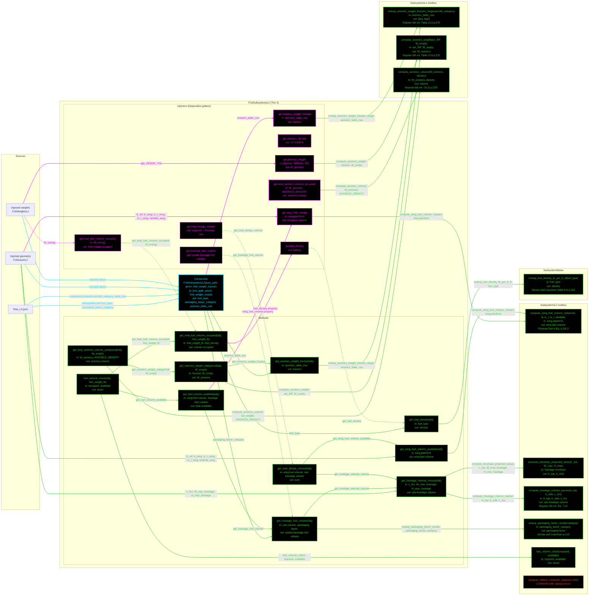

# F16SubsystemsL2: input-to-output data flow

This chart shows the data path for `F16SubsystemsL2`, the Level 2 (L2)
subsystems class. L2 is the first tier with real geometry: fuselage volume comes
from the injected geometry's envelope ellipse, wing fuel volume from the wing
planform. Two collaborators are injected and both are required.

## Viewing this chart with pan and zoom

Mermaid inside a `.md` renders at a fixed size, so a wide chart is hard to read
in a plain preview. Open `docs/Mermaid_Diagrams/viewer.html` and drag this file
onto it. Wheel or pinch zooms, drag pans, and `f` fits.

The viewer reads the first mermaid fenced block straight out of this file, so
there is no second copy of the diagram to keep in step.

**Read this first.**
- The chart runs LEFT TO RIGHT. The class is wide, so the horizontal form reads
  on a 1920x1080 screen.
- One function per node. Name, inputs, output, citation. Returned values and
  coefficients live in the notes table, not in the labels.
- No grouped "Inputs" node. Every value rides the arrow that carries it. A
  source node holds only a file or object name.
- **Colour says what kind of member a node is; dash says whether the value was
  worked on.** A box whose body reads a stored field and returns it is a pure
  relay, so it is dashed, and so is every line leaving it. A box that evaluates
  an equation, reads a table, or combines its inputs is solid.
- **A line's colour comes from the node it POINTS AT; its dash comes from the
  node it LEAVES.** A file or object source node is not a method, so it takes
  the dash of the member it feeds.
- Constructor cyan. Every other function green. An INJECTOR, meaning any
  `get.<name>` property getter, is magenta, and magenta beats every other node
  colour.
- **EVERY MEMBER OF THIS CLASS WORKS.** The only red node is
  `compute_battery_volume`, a toolbox static that errors by design.
- **THE STATICS SIT IN THREE HOMES.** `SubsystemsBase` holds the fuel-density
  tables. `SubsystemsL1` holds the avionics equations and the Raymer Table 11.6
  row lookup. `SubsystemsL2` holds the geometry and packaging statics. Three
  toolbox subgraphs.
- **NINE INJECTORS**, one per `Dependent` property. Four forward to a same-named
  method and are dashed relays: `get.fuel_density`, `get.fuselage_fuel_volume`,
  `get.total_design_volume` and `get.total_fuel_volume_occupied`.
- **TWO INJECTORS DUPLICATE A METHOD BODY rather than calling it.**
  `get.avionics_weight_fraction` repeats `get_avionics_weight_fraction`, and
  `get.wing_fuel_volume` repeats `get_wing_fuel_volume_available`. Both pairs
  agree.
- **`get.avionics_weight` AND `get.total_avionics_volume_occupied` ALSO DUPLICATE
  their `_categorical` methods.** The getters read the injected weights object;
  the methods take `W_empty` as an argument. Both routes give the same answer.
- **NOTHING CALLS THE `SubsystemsModelL2` BRIDGES**, so they are not drawn. Both
  are broken, and all three callers of those names are L1 objects. See the note
  below.
- There are NO yellow nodes.

## Values

| Member | Value |
| --- | --- |
| `avionics_weight_fraction` | 0.0550 |
| `avionics_density` | 37.5 lb/ft^3 |
| `avionics_weight` | 781.0460 lbf |
| `total_avionics_volume_occupied` | 20.8279 ft^3 |
| `fuel_density` | 50.0 lb/ft^3 |
| `wing_fuel_volume` | 55.0161 ft^3 |
| `fuselage_fuel_volume` | 682.6682 ft^3 |
| `total_design_volume` | 908.3513 ft^3 |
| `get_fuselage_internal_volume` | 853.3352 ft^3, RAW, no packaging factor |
| `get_fuel_volume_available` | 737.6843 ft^3 |
| `get_total_fuel_volume_occupied(14200.84)` | 284.0168 ft^3 |
| `total_fuel_volume_occupied` | 116.1840 ft^3 |
| `fuel_volume_check(5809.2)` | required 116.18, available 737.68, sufficient |

At `W_TO` 23279.4 lbf, `OEW(W_TO)` 14200.84 lbf, `W_energy` 5809.2 lbf.

## A getter cannot take an argument

`get.total_fuel_volume_occupied` needs a fuel weight, and a getter's one and
only argument IS the object: MATLAB fills that slot with the instance whatever
the parameter is named. So the weight has to come from something the object
already holds, which is why the getter reads
`obj.fuel_weight_source.W_energy`. `get.avionics_weight` does the same, reading
`ws.get_OEW(ws.W_TO)`.

Verified live rather than cached: mutating `W_energy` from 5809.2 to 7000 moves
the property to exactly 140.0000 ft^3, which is 7000 / 50.

## The SubsystemsModelL2 bridges are unreached

`SubsystemsModelL2` supplies two concrete bridges, `get_avionics_weight` and
`get_total_avionics_volume_occupied`. Both are broken: the first calls
`get_total_avionics_weight_categorical`, a name that exists nowhere, and the
second calls a one-argument method with no argument.

Neither has a caller. The three call sites that use those names
(`run_sizing_report_L1.m:113`, `:179` and `subsystems_brandt_comparison.m:97`)
all hold an `F16SubsystemsL1` object, which inherits the working L1 versions
instead. So they are unreached dead code in the enforcer, not a live defect in
the L2 path, and they are not drawn.

## Field-by-field notes

| Class member | Source | Value / note |
| --- | --- | --- |
| `fuel_type` | `f16a_L2.json` `.subsystems.fuel.fuel_type` | `JP-8` |
| `packaging_factor_category` | `.subsystems.fuel.packaging_factor_category` | `Integral tank — shallow fuselage`, factor 0.8000 |
| `avionics_table_row` | `.subsystems.avionics.aircraft_category_table_row` | `Fighters`, range `[0.03, 0.08]`, mean 0.0550 |
| `fuselage_packaging_factor_category` | class default | INERT. No member reads it. |
| `wing_packaging_factor_category` | class default | INERT. No member reads it. |
| `AVIONICS_DENSITY` | `SubsystemsL2` constant | `mean([30, 45])` = 37.5, the same Raymer range average `SubsystemsL1` holds. Nothing reaches Nicolai's flat 45. |

## `total_design_volume` sums two different quantities

`get_total_design_volume` adds `get_wing_fuel_volume_available`, a FUEL volume,
to `get_fuselage_internal_volume`, a RAW structural volume: 55.02 + 853.34 =
908.35 ft^3. The property comment still reads
`= fuselage_usable_fuel_volume + wing_fuel_volume`, which is a third thing
again.

## Source files

| Item | File |
| --- | --- |
| Concrete class | `examples/F16A/models/disciplines/subsystems/F16SubsystemsL2.m` |
| Tier 2, abstract | `src/disciplines/subsystems/SubsystemsModelL2.m` |
| Tier 1, base | `src/base/SubsystemsBase.m` |
| Toolboxes | `src/disciplines/subsystems/SubsystemsL1.m`, `SubsystemsL2.m` |
| Input JSON | `examples/F16A/inputs/f16a_L2.json` |
