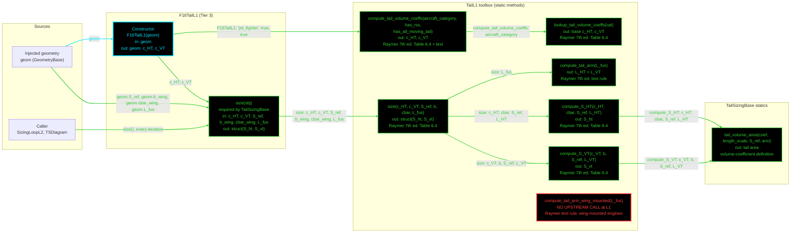

# F16TailL1: input-to-output data flow

This chart shows the data path for `F16TailL1`, the Level 1 (L1) tail-sizing
class. It sizes the horizontal and vertical tails from Raymer's tail volume
coefficients, and the sizing loop calls it every iteration.

## Viewing this chart with pan and zoom

Mermaid inside a `.md` renders at a fixed size, so a wide chart is hard to read
in a plain preview. Open `docs/Mermaid_Diagrams/viewer.html` and drag this file
onto it. Wheel or pinch zooms, drag pans, and `f` fits.

The viewer reads the first mermaid fenced block straight out of this file, so
there is no second copy of the diagram to keep in step.

**Read this first.**
- The chart runs LEFT TO RIGHT.
- One function per node. Name, inputs, output, citation. Returned values and
  coefficients live in the notes table, not in the labels.
- No grouped "Inputs" node. Every value rides the arrow that carries it. A
  source node holds only a file or object name.
- **Colour says what kind of member a node is; dash says whether the value was
  worked on.** Every box here evaluates an equation, reads a table or calls a
  method, so every box is solid.
- **A line's colour comes from the node it POINTS AT; its dash comes from the
  node it LEAVES.** A source node is not a method, so it takes the solid dash of
  the constructor.
- Constructor cyan. Every other function green.
- **THIS CLASS HAS NO `Dependent` PROPERTIES, so there are no magenta nodes.**
  `c_HT` and `c_VT` are set once by the constructor and are private.
- **THE CONSTRUCTOR HARDCODES THE COEFFICIENT INPUTS.** It passes
  `'jet_fighter'`, `has_rss = true` and `has_all_moving_tail = true` to
  `compute_tail_volume_coeffs`. None of them comes from a JSON file.
- **THE SIZING LOOP WRITES THE RESULT BACK.** `SizingLoopL2` calls `size()`
  every iteration and writes `S_ht` and `S_vt` onto the geometry object.
  `TSDiagram` does the same per cell.
- **L1 TAIL SIZING RUNS ON AN L2 OR L3 GEOMETRY.** `size()` reads `b_wing`,
  `cbar_wing` and `L_fus`, which only the planform geometry classes supply.
- One red node: `compute_tail_arm_wing_mounted`. Only `B777TailL1` calls it.

## Field-by-field notes

Values on the as-built `F16GeomL2`.

| Class member | Source | Value / note |
| --- | --- | --- |
| `geom` | Injected, `GeometryBase` | `F16GeomL2` or `F16GeomL3` in the sizing drivers |
| Base coefficients | `lookup_tail_volume_coeffs('jet_fighter')` | `c_HT` 0.40, `c_VT` 0.07 |
| `c_HT`, `c_VT` | Constructor | 0.3150, 0.0630: minus 10 % each for relaxed static stability, then minus 12.5 % on `c_HT` for the all-moving tail |
| Tail arm | `compute_tail_arm(L_fus)` | 0.475 x 46.5 = 22.0875 ft. 0.475 is the midpoint of Raymer's 0.45-0.50 range. `L_VT = L_HT`. |
| `size().S_ht`, `size().S_vt` | Computed | 48.4327, 25.6706 ft^2 on `F16GeomL2`; 47.4130, 25.1302 ft^2 on `F16GeomL3` (longer T.O. fuselage) |

## Methods with no upstream call at L1

| Static | Home | Note |
| --- | --- | --- |
| `compute_tail_arm_wing_mounted` | `TailL1` | 0.525 x `L_fus`. Called by `B777TailL1` only. |

## Source files

| Item | File |
| --- | --- |
| Concrete class | `examples/F16A/models/disciplines/tail/F16TailL1.m` |
| Tier 2, abstract | `src/disciplines/tail_sizing/TailSizingModelL1.m` |
| Tier 1, base | `src/base/TailSizingBase.m` |
| Toolbox | `src/disciplines/tail_sizing/TailL1.m` |
| Callers | `src/sizing/SizingLoopL2.m`, `src/sizing/TSDiagram.m` |
