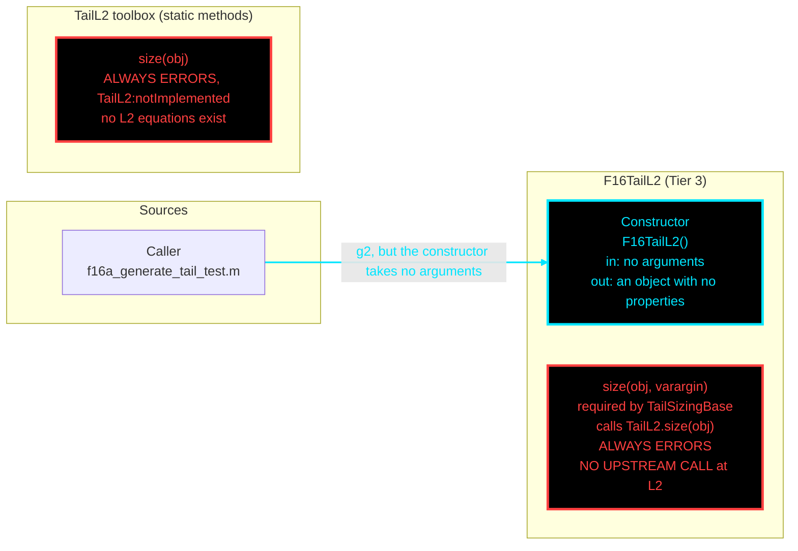

# F16TailL2: input-to-output data flow

This chart shows the data path for `F16TailL2`, the Level 2 (L2) tail-sizing
class. There is no L2 tail equation in the repo, so the class is a shell whose
one method errors.

## Viewing this chart with pan and zoom

Mermaid inside a `.md` renders at a fixed size, so a wide chart is hard to read
in a plain preview. Open `docs/Mermaid_Diagrams/viewer.html` and drag this file
onto it. Wheel or pinch zooms, drag pans, and `f` fits.

The viewer reads the first mermaid fenced block straight out of this file, so
there is no second copy of the diagram to keep in step.

**Read this first.**
- The chart runs LEFT TO RIGHT.
- One function per node. Name, inputs, output, citation.
- **Colour says what kind of member a node is; dash says whether the value was
  worked on.** A line's colour comes from the node it POINTS AT; its dash comes
  from the node it LEAVES.
- Constructor cyan. A red node marks a member that has no working caller.
- **THIS CLASS HAS NO PROPERTIES**, so there are no magenta nodes.
- **TWO RED NODES.** `size` satisfies the `TailSizingBase` contract by calling
  `TailL2.size`, and `TailL2.size` always raises `TailL2:notImplemented`.
  Nothing calls either: the sizing drivers build `F16TailL1`. The call from
  `size` to `TailL2.size` is written in the node label, because no arrow enters
  a red node.
- **THE ONE CALLER PASSES AN ARGUMENT THE CONSTRUCTOR DOES NOT TAKE.**
  `f16a_generate_tail_test.m` calls `F16TailL2(g2)`, which raises
  `MATLAB:TooManyInputs`.

## Field-by-field notes

| Class member | Source | Value / note |
| --- | --- | --- |
| Constructor | No inputs | `F16TailL2()` builds an object with no properties and no injected geometry. |
| `size(obj, varargin)` | Contract method | Forwards to `TailL2.size(obj)`. Raises `TailL2:notImplemented`. |
| `f16a_generate_tail_test.m` | Caller | Calls `F16TailL2(g2)` and fails on `MATLAB:TooManyInputs` before `size` is reached. |

## Methods with no upstream call at L2

| Member | Home | Note |
| --- | --- | --- |
| `size` | `F16TailL2` | No working caller. Always errors. |
| `size` | `TailL2` | Reached only through `F16TailL2.size`. Always errors. |

## Source files

| Item | File |
| --- | --- |
| Concrete class | `examples/F16A/models/disciplines/tail/F16TailL2.m` |
| Tier 2, abstract | `src/disciplines/tail_sizing/TailSizingModelL2.m` |
| Tier 1, base | `src/base/TailSizingBase.m` |
| Toolbox | `src/disciplines/tail_sizing/TailL2.m` |
